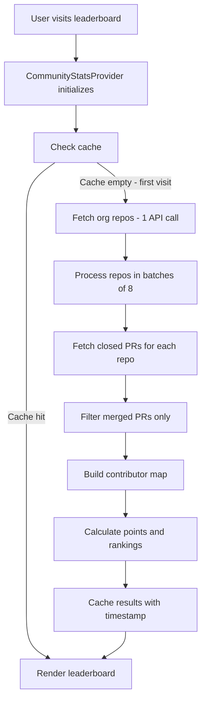
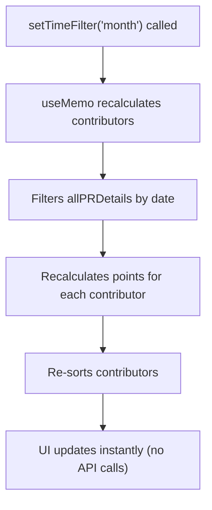
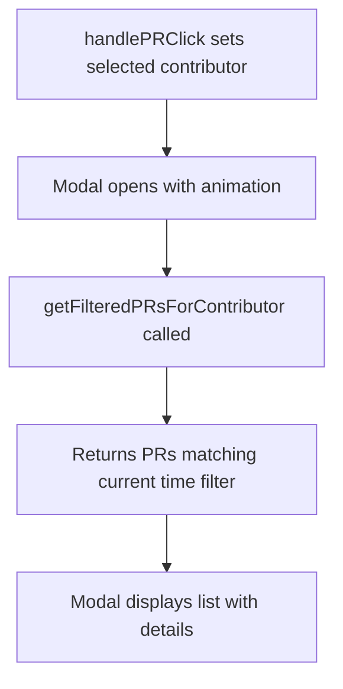
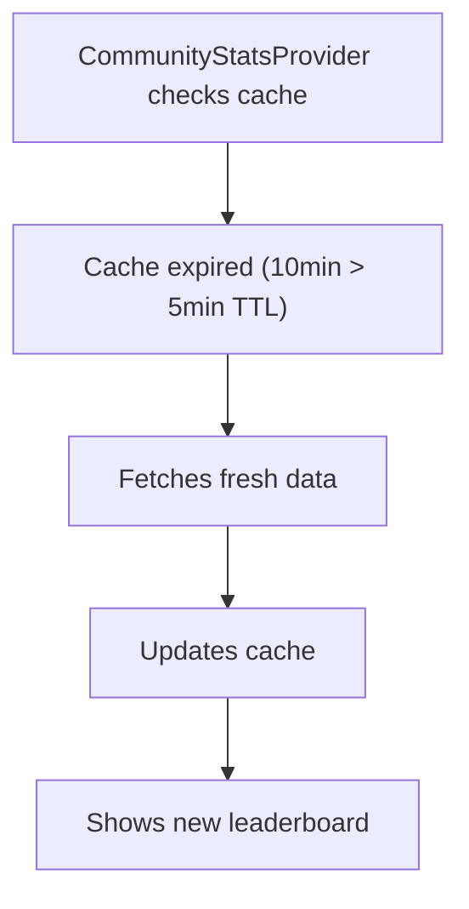

# Building a GitHub Organization Leaderboard: A Deep Dive into Recode Hive's Implementation

Ever wondered how to build a live leaderboard that tracks contributions across an entire GitHub organization? Let me walk you through how we built ours at Recode Hive. This isn't your typical "fetch and display" tutorial - we're talking about handling rate limits, caching strategies, time-based filtering, and creating a smooth user experience that doesn't make the GitHub API cry.

## What We're Building

Our leaderboard does a few things that make it interesting:
- Aggregates merged PRs from **all** repositories in an organization
- Calculates contributor rankings based on a simple point system 
- Supports time-based filtering (this week, month, year, or all time)
- Shows detailed PR information for each contributor
- Caches aggressively to avoid hitting API rate limits
- Handles concurrent requests efficiently

The whole thing is built with React, TypeScript, and integrates with Docusaurus. But the concepts here work for any stack.

## Architecture Overview

Here's how the pieces fit together:
┌─────────────────────────────────────────────────────────────┐
│                      User Interface                         │
│  (LeaderBoard Component + PRListModal)                      │
└────────────────────────┬────────────────────────────────────┘
                         │
                         │ Consumes Context;
                         ▼
┌─────────────────────────────────────────────────────────────┐
│              CommunityStatsProvider                         │
│  • Manages state (contributors, stats, filters)             │
│  • Handles caching (5-minute TTL)                           │
│  • Orchestrates data fetching                               │
└────────────────────────┬────────────────────────────────────┘
                         │
                         │ Makes API Calls
                         ▼
┌─────────────────────────────────────────────────────────────┐
│                   GitHub REST API                           │
│  • Organization repos                                       │
│  • Pull requests per repo                                   │
│  • User information                                         │
└─────────────────────────────────────────────────────────────┘

## Data Flow: From API to UI

### Phase 1: Data Collection

When the app loads, we kick off a multi-stage process:

**Stage 1: Fetch All Organization Repositories**
```typescript
const fetchAllOrgRepos = async (headers: Record<string, string>) => {
  const repos: any[] = [];
  let page = 1;
  
  while (true) {
    const resp = await fetch(
      `https://api.github.com/orgs/${GITHUB_ORG}/repos?type=public&per_page=100&page=${page}`,
      { headers }
    );
    
    const data = await resp.json();
    repos.push(...data);
    
    if (data.length < 100) break; // Last page
    page++;
  }
  
  return repos;
};
```
This grabs every public repo in the organization. Simple pagination loop.

**Stage 2: Fetch Merged PRs for Each Repository**
Here's where it gets interesting. We need PRs from potentially dozens of repos, and we can't just fire off 50 requests at once.
```typescript
const fetchMergedPRsForRepo = async (repoName: string, headers: Record<string, string>) => {
  const mergedPRs: PullRequestItem[] = [];
  
  // Get first page to estimate total
  const firstResp = await fetch(
    `https://api.github.com/repos/${GITHUB_ORG}/${repoName}/pulls?state=closed&per_page=100&page=1`,
    { headers }
  );
  
  const firstPRs = await firstResp.json();
  const firstPageMerged = firstPRs.filter((pr) => Boolean(pr.merged_at));
  mergedPRs.push(...firstPageMerged);
  
  if (firstPRs.length < 100) return mergedPRs; // Only one page
  
  // Fetch remaining pages in parallel (with limit)
  const pagePromises: Promise<PullRequestItem[]>[] = [];
  const maxPages = Math.min(MAX_PAGES_PER_REPO, 10);
  
  for (let i = 2; i <= maxPages; i++) {
    pagePromises.push(
      fetch(
        `https://api.github.com/repos/${GITHUB_ORG}/${repoName}/pulls?state=closed&per_page=100&page=${i}`,
        { headers }
      )
      .then(async (resp) => {
        const prs = await resp.json();
        return prs.filter((pr) => Boolean(pr.merged_at));
      })
      .catch(() => [])
    );
  }
  
  const remainingPages = await Promise.all(pagePromises);
  remainingPages.forEach(pagePRs => {
    if (pagePRs.length > 0) mergedPRs.push(...pagePRs);
  });
  
  return mergedPRs;
};
```
**Key optimization**: we fetch the first page sequentially to see if there are more pages, then parallelize the remaining requests. This prevents unnecessary API calls for repos with few PRs.

**Stage 3: Process in Batches**
We don't process all repos at once. Instead, we batch them:
```typescript
const processBatch = async (
  repos: any[],
  headers: Record<string, string>
): Promise<{ contributorMap: Map<string, FullContributor>; totalMergedPRs: number }> => {
  const contributorMap = new Map<string, FullContributor>();
  let totalMergedPRs = 0;

  // Process 8 repos at a time
  for (let i = 0; i < repos.length; i += MAX_CONCURRENT_REQUESTS) {
    const batch = repos.slice(i, i + MAX_CONCURRENT_REQUESTS);
    
    const promises = batch.map(async (repo) => {
      if (repo.archived) return { mergedPRs: [], repoName: repo.name };
      
      try {
        const mergedPRs = await fetchMergedPRsForRepo(repo.name, headers);
        return { mergedPRs, repoName: repo.name };
      } catch (error) {
        console.warn(`Skipping repo ${repo.name} due to error:`, error);
        return { mergedPRs: [], repoName: repo.name };
      }
    });

    const results = await Promise.all(promises);
    
    // Aggregate contributor data
    results.forEach(({ mergedPRs, repoName }) => {
      totalMergedPRs += mergedPRs.length;
      
      mergedPRs.forEach((pr) => {
        const username = pr.user.login;
        if (!contributorMap.has(username)) {
          contributorMap.set(username, {
            username,
            avatar: pr.user.avatar_url,
            profile: pr.user.html_url,
            points: 0,
            prs: 0,
            allPRDetails: [],
          });
        }
        
        const contributor = contributorMap.get(username)!;
        contributor.allPRDetails.push({
          title: pr.title,
          url: pr.html_url,
          mergedAt: pr.merged_at,
          repoName,
          number: pr.number,
        });
      });
    });
  }

  return { contributorMap, totalMergedPRs };
};
```
Why batches of 8? Trial and error. Too many concurrent requests = rate limits. Too few = slow load times. Eight was the sweet spot.
### Phase 2: State Management & Filtering
Once we have all the data, we store it in a way that makes filtering fast. This is the secret sauce.
#### Data Structure
```typescript
interface FullContributor {
  username: string;
  avatar: string;
  profile: string;
  allPRDetails: PRDetails[]; // ALL PRs ever, unfiltered
  points: number;             // Calculated based on current filter
  prs: number;                // Calculated based on current filter
}
```
Notice allPRDetails stores everything. We never refetch when users change the time filter.
- **Time Filtering Logic**

``` typescript
const getTimeFilterDate = (filter: TimeFilter): Date | null => {
  const now = new Date();
  switch (filter) {
    case 'week':
      return new Date(now.getTime() - 7 * 24 * 60 * 60 * 1000);
    case 'month': {
      const lastMonth = new Date(now);
      lastMonth.setMonth(now.getMonth() - 1);
      return lastMonth;
    }
    case 'year':
      return new Date(now.getTime() - 365 * 24 * 60 * 60 * 1000);
    case 'all':
    default:
      return null;
  }
};

const isPRInTimeRange = (mergedAt: string, filter: TimeFilter): boolean => {
  if (filter === 'all') return true;
  
  const filterDate = getTimeFilterDate(filter);
  if (!filterDate) return true;
  
  const prDate = new Date(mergedAt);
  return prDate >= filterDate;
};
Computed Contributors
This is where React's useMemo shines:
typescriptconst contributors = useMemo(() => {
  if (!allContributors.length) return [];
  
  const filteredContributors = allContributors
    .map(contributor => {
      const filteredPRs = contributor.allPRDetails.filter(pr => 
        isPRInTimeRange(pr.mergedAt, currentTimeFilter)
      );
      
      return {
        username: contributor.username,
        avatar: contributor.avatar,
        profile: contributor.profile,
        points: filteredPRs.length * POINTS_PER_PR,
        prs: filteredPRs.length,
        prDetails: filteredPRs,
      };
    })
    .filter(contributor => contributor.prs > 0)
    .sort((a, b) => b.points - a.points || b.prs - a.prs);

  return filteredContributors;
}, [allContributors, currentTimeFilter]);
```
When the user changes the filter, this recalculates instantly. No API calls, no loading spinners.
The Context Provider Pattern
Everything runs through a Context Provider. This gives us a single source of truth and makes the data available anywhere in the component tree.
- **Context Definition**
```typescript
interface ICommunityStatsContext {
  // Organization stats
  githubStarCount: number;
  githubContributorsCount: number;
  githubForksCount: number;
  githubReposCount: number;
  
  // Leaderboard data
  contributors: Contributor[];
  stats: Stats | null;
  
  // Time filtering
  currentTimeFilter: TimeFilter;
  setTimeFilter: (filter: TimeFilter) => void;
  getFilteredPRsForContributor: (username: string) => PRDetails[];
  
  // Meta
  loading: boolean;
  error: string | null;
  refetch: (signal: AbortSignal) => Promise<void>;
  clearCache: () => void;
}
```
- **Using the Context**
```typescript
export const useCommunityStatsContext = (): ICommunityStatsContext => {
  const context = useContext(CommunityStatsContext);
  if (context === undefined) {
    throw new Error("useCommunityStatsContext must be used within a CommunityStatsProvider");
  }
  return context;
};
```
Any component can now access the leaderboard data:
```typescript
const { contributors, currentTimeFilter, setTimeFilter } = useCommunityStatsContext();
### Caching Strategy
GitHub API has rate limits. We cache everything for 5 minutes:
```typescript
const CACHE_DURATION = 5 * 60 * 1000; // 5 minutes

const [cache, setCache] = useState<{
  data: { contributors: FullContributor[]; rawStats: { totalPRs: number } } | null;
  timestamp: number;
}>({ data: null, timestamp: 0 });

// In fetchAllStats
const now = Date.now();
if (cache.data && (now - cache.timestamp) < CACHE_DURATION) {
  setAllContributors(cache.data.contributors);
  setLoading(false);
  return;
}
```
Simple but effective. On subsequent visits within 5 minutes, users see data instantly.
### UI Components
- **The Main Leaderboard**
The leaderboard component is pretty straightforward once you have the data:
```typescript
export default function LeaderBoard(): JSX.Element {
  const { 
    contributors, 
    stats, 
    loading, 
    error, 
    currentTimeFilter, 
    setTimeFilter 
  } = useCommunityStatsContext();
  
  const [searchQuery, setSearchQuery] = useState("");
  const [currentPage, setCurrentPage] = useState(1);
  
  // Filter by search
  const filteredContributors = contributors.filter((contributor) =>
    contributor.username.toLowerCase().includes(searchQuery.toLowerCase())
  );
  
  // Pagination
  const itemsPerPage = 10;
  const totalPages = Math.ceil(filteredContributors.length / itemsPerPage);
  const currentItems = filteredContributors.slice(
    (currentPage - 1) * itemsPerPage,
    currentPage * itemsPerPage
  );
  
  // Render...
}
```
- **Time Filter Dropdown**
```tsx
<select
  value={currentTimeFilter}
  onChange={(e) => {
    setTimeFilter(e.target.value as TimeFilter);
    setCurrentPage(1); // Reset to first page
  }}
  className="time-filter-select"
>
  <option value="all">🏆 All Time</option>
  <option value="year">📅 This Year</option>
  <option value="month">📆 This Month</option>
  <option value="week">📊 This Week</option>
</select>
```
- **Top 3 Performers**
We show the top 3 in a special layout:
```tsx{filteredContributors.length > 2 && (
  <div className="top-performers-grid">
    <TopPerformerCard contributor={filteredContributors[1]} rank={2} />
    <TopPerformerCard contributor={filteredContributors[0]} rank={1} />
    <TopPerformerCard contributor={filteredContributors[2]} rank={3} />
  </div>
)}
```
Notice rank 2, then 1, then 3? Creates a podium effect in the layout.
- **Contributor Rows**
```tsx
{currentItems.map((contributor, index) => (
  <div key={contributor.username} className="contributor-row">
    <div className="rank-cell">
      <div className={`rank-badge ${getRankClass(index)}`}>
        {filteredContributors.indexOf(contributor) + 1}
      </div>
    </div>
    <div className="avatar-cell">
      
    </div>
    <div className="username-cell">
      <a href={contributor.profile} target="_blank" rel="noreferrer">
        {contributor.username}
      </a>
    </div>
    <div className="prs-cell">
      <Badge 
        count={contributor.prs} 
        label="PRs" 
        onClick={() => handlePRClick(contributor)}
        clickable={true}
      />
    </div>
    <div className="points-cell">
      <Badge count={contributor.points} label="Points" />
    </div>
  </div>
))}
```
- **PR Details Modal**
When users click on a contributor's PR count, we show a modal with all their PRs:
```typescript
const getFilteredPRsForContributor = useCallback((username: string): PRDetails[] => {
  const contributor = allContributors.find(c => c.username === username);
  if (!contributor) return [];
  
  return contributor.allPRDetails
    .filter(pr => isPRInTimeRange(pr.mergedAt, currentTimeFilter))
    .sort((a, b) => new Date(b.mergedAt).getTime() - new Date(a.mergedAt).getTime());
}, [allContributors, currentTimeFilter]);
```
This function is exposed through the context, so the modal can call it:

```tsx
export default function PRListModal({ contributor, isOpen, onClose }: PRListModalProps) {
  const { getFilteredPRsForContributor, currentTimeFilter } = useCommunityStatsContext();
  
  const filteredPRs = getFilteredPRsForContributor(contributor.username);
  
  return (
    <AnimatePresence>
      {isOpen && (
        <motion.div className="pr-modal-backdrop" onClick={handleBackdropClick}>
          <motion.div className="pr-modal-container">
            <div className="pr-modal-header">
              <h2>{contributor.username}'s Pull Requests</h2>
              <p>
                {filteredPRs.length} merged PR{filteredPRs.length !== 1 ? 's' : ''} • 
                {filteredPRs.length * 10} points
              </p>
            </div>
            
            <div className="pr-modal-body">
              {filteredPRs.map((pr) => (
                <div key={`${pr.repoName}-${pr.number}`} className="pr-item">
                  <h3>{pr.title}</h3>
                  <div className="pr-item-meta">
                    <span><FaGithub /> {pr.repoName}</span>
                    <span>#{pr.number}</span>
                    <span>Merged on {formatDate(pr.mergedAt)}</span>
                  </div>
                  <a href={pr.url} target="_blank" rel="noopener noreferrer">
                    <FaExternalLinkAlt />
                  </a>
                </div>
              ))}
            </div>
          </motion.div>
        </motion.div>
      )}
    </AnimatePresence>
  );
}
```
### GitHub API Reference
Endpoints We Use
1. List Organization Repositories
GET https://api.github.com/orgs/{org}/repos
Parameters:

- *type (query)*: Repository type filter. We use public
- *per_page (query)*: Results per page. Max 100
- *page (query)*: Page number for pagination

#### Request Example:
bashcurl -H "Authorization: token YOUR_TOKEN" \
     -H "Accept: application/vnd.github.v3+json" \
     "https://api.github.com/orgs/recodehive/repos?type=public&per_page=100&page=1"
Response Example:
```json[
  {
    "id": 123456,
    "name": "awesome-project",
    "full_name": "recodehive/awesome-project",
    "private": false,
    "archived": false,
    "html_url": "https://github.com/recodehive/awesome-project",
    "description": "An awesome project",
    "fork": false,
    "created_at": "2024-01-15T10:30:00Z",
    "updated_at": "2024-12-20T15:45:00Z"
  }
]

```
Rate Limit: 5000 requests per hour (authenticated)

2. List Pull Requests
GET https://api.github.com/repos/{owner}/{repo}/pulls

Parameters:

- *state (query)*: PR state. We use closed to get merged PRs
- *per_page (query)*: Results per page. Max 100
- *page (query)*: Page number
- *sort (query, optional)*: Sort by created, updated, popularity, long-running
- *direction (query, optional)*: Sort direction asc or desc

Request Example:
bashcurl -H "Authorization: token YOUR_TOKEN" \
     -H "Accept: application/vnd.github.v3+json" \
     "https://api.github.com/repos/recodehive/awesome-project/pulls?state=closed&per_page=100&page=1"
Response Example:

```json
[
  {
    "id": 789012,
    "number": 42,
    "state": "closed",
    "title": "Add new feature",
    "user": {
      "login": "johndoe",
      "id": 12345,
      "avatar_url": "https://avatars.githubusercontent.com/u/12345?v=4",
      "html_url": "https://github.com/johndoe"
    },
    "body": "This PR adds a new feature...",
    "created_at": "2024-11-01T09:00:00Z",
    "updated_at": "2024-11-05T14:30:00Z",
    "closed_at": "2024-11-05T14:30:00Z",
    "merged_at": "2024-11-05T14:30:00Z",
    "merge_commit_sha": "abc123def456",
    "html_url": "https://github.com/recodehive/awesome-project/pull/42",
    "commits": 5,
    "additions": 150,
    "deletions": 30,
    "changed_files": 8
  }
]
```
Key Fields:

- *merged_at*: If not null, PR was merged (this is what we check)
- *user*: Contains contributor info (username, avatar, profile URL)
- *number*: PR number for the repo
- *title*: PR title
- *html_url*: Link to the PR

Rate Limit: Same as above

3. Get Organization Stats
GET https://api.github.com/orgs/{org}
Request Example:
bashcurl -H "Authorization: token YOUR_TOKEN" \
     -H "Accept: application/vnd.github.v3+json" \
     "https://api.github.com/orgs/recodehive"
Response Example:
```json
{
  "login": "recodehive",
  "id": 98765,
  "url": "https://api.github.com/orgs/recodehive",
  "repos_url": "https://api.github.com/orgs/recodehive/repos",
  "avatar_url": "https://avatars.githubusercontent.com/u/98765?v=4",
  "description": "Community-driven open source projects",
  "name": "Recode Hive",
  "company": null,
  "blog": "https://recodehive.com",
  "location": "Worldwide",
  "email": null,
  "public_repos": 25,
  "public_gists": 0,
  "followers": 150,
  "following": 0,
  "html_url": "https://github.com/recodehive",
  "created_at": "2023-06-15T08:00:00Z",
  "updated_at": "2024-12-01T12:00:00Z",
  "type": "Organization"
}
```
#### Authentication
All requests require a GitHub Personal Access Token:
typescriptconst headers: Record<string, string> = {
  Authorization: `token ${YOUR_GITHUB_TOKEN}`,
  Accept: "application/vnd.github.v3+json",
};

#### Getting a Token:

Go to GitHub Settings → Developer settings → Personal access tokens → Tokens (classic)
Generate new token
Select scopes: public_repo, read:org
Copy the token (you won't see it again!)

#### Storing the Token:
In Docusaurus, we store it in docusaurus.config.js:
```javascript
module.exports = {
  customFields: {
    gitToken: process.env.GITHUB_TOKEN || '',
  },
  // ...
};
```
Then access it:
```typescript
const {
  siteConfig: { customFields },
} = useDocusaurusContext();
const token = customFields?.gitToken || "";
```
#### Error Handling
**Rate Limit Exceeded (403)**

```json
{
  "message": "API rate limit exceeded for user ID 12345.",
  "documentation_url": "https://docs.github.com/rest/overview/resources-in-the-rest-api#rate-limiting"
}
```
#### How we handle it:
```typescript
try {
  const resp = await fetch(url, { headers });
  if (!resp.ok) {
    if (resp.status === 403) {
      throw new Error("Rate limit exceeded. Please try again later.");
    }
    throw new Error(`API error: ${resp.status} ${resp.statusText}`);
  }
  return await resp.json();
} catch (error) {
  console.error("Error fetching data:", error);
  // Fallback to cached data or show error message
}
```
**Not Found (404)**
Repository doesn't exist or is private:
```json
{
  "message": "Not Found",
  "documentation_url": "https://docs.github.com/rest/reference/repos#get-a-repository"
}
```
**Unauthorized (401)**
Invalid or expired token:
```json
{
  "message": "Bad credentials",
  "documentation_url": "https://docs.github.com/rest"
}
```
### Performance Optimizations
1. Concurrent Request Batching
Processing 50 repos sequentially takes forever. Processing them all at once hits rate limits. Solution: batches.
```typescript
const MAX_CONCURRENT_REQUESTS = 8;

for (let i = 0; i < repos.length; i += MAX_CONCURRENT_REQUESTS) {
  const batch = repos.slice(i, i + MAX_CONCURRENT_REQUESTS);
  const promises = batch.map(repo => fetchMergedPRsForRepo(repo.name, headers));
  await Promise.all(promises);
}
```
2. Early Pagination Termination
If a repo has 15 PRs, don't fetch 10 pages:
```typescript
const firstResp = await fetch(`${url}?page=1&per_page=100`, { headers });
const firstPRs = await firstResp.json();

if (firstPRs.length < 100) {
  return firstPRs.filter(pr => pr.merged_at); // Only one page
}


// Otherwise, fetch more pages
```
3. Memoization
Filter calculations are expensive when you have 200+ contributors:
```typescript
const contributors = useMemo(() => {
  return allContributors
    .map(c => ({
      ...c,
      prs: c.allPRDetails.filter(pr => isPRInTimeRange(pr.mergedAt, filter)).length
    }))
    .filter(c => c.prs > 0)
    .sort((a, b) => b.prs - a.prs);
}, [allContributors, currentTimeFilter]);
```
Only recalculates when allContributors or currentTimeFilter changes.
4. Abort Controllers
Clean up pending requests when component unmounts:
```typescript
useEffect(() => {
  const abortController = new AbortController();
  fetchAllStats(abortController.signal);

  return () => {
    abortController.abort(); // Cancel pending requests
  };
}, [fetchAllStats]);
```
### Best Practices
#### Security Considerations
#### Never Expose Tokens Client-Side:
Our implementation runs in the browser, but the token is injected at build time and never exposed in the bundle:
In production, this gets baked into the static build. The token never appears in client-side code.
##### Alternative: Backend Proxy
For more sensitive applications, proxy GitHub API calls through your backend:
Client → Your API → GitHub API
This way, tokens stay on the server.
Token Scopes
#### Use the minimum required scopes:
- public_repo (read access to public repos)
- read:org (read org data)
- repo (full access - not needed)
- admin:org (admin access - definitely not needed)

### Scalability Considerations
#### Caching Strategy
5-minute cache works for us, but adjust based on your needs:
```typescript
const CACHE_DURATION = 5 * 60 * 1000; // 5 minutes

// For very large orgs (100+ repos), increase to 15 minutes:
const CACHE_DURATION = 15 * 60 * 1000;


// For real-time requirements, decrease to 1 minute:
const CACHE_DURATION = 1 * 60 * 1000;
```
### Deployment Checklist
Before going live:

 - Token Security: Ensure GitHub token is in environment variables, not hardcoded
 - Rate Limits: Monitor API usage and adjust cache duration if needed
 - Error Handling: All API calls wrapped in try-catch with user-friendly messages
 - Loading States: Skeleton loaders in place for all async operations
 - Mobile Responsive: Test on various screen sizes
 - Accessibility: Keyboard navigation, screen reader support, ARIA labels
 - Performance: Check bundle size, lazy load components if needed
 - Analytics: Track usage patterns (filter changes, PR modal opens, etc.)
 - Monitoring: Set up alerts for API failures or performance degradation
 - Documentation: Update README with setup instructions

#### Complete Flow
Here's what the complete flow looks like in action:


2. User changes filter to "This Month":


3. User clicks PR badge:



4. User comes back 10 minutes later:



### Wrapping Up
Building a leaderboard like this taught us a few things:

- **Cache aggressively** - The GitHub API is fast, but not hitting it is faster
- **Batch intelligently** - Too much concurrency = rate limits, too little = slow
- **Store everything** - Fetch once, filter client-side for instant updates
- **Handle failures gracefully** - One bad repo shouldn't break the whole leaderboard
- **Optimize for perception** - Show something immediately, even if incomplete

The architecture here scales pretty well. We handle 10+ repos with 200+ contributors and the initial load takes about 8-10 seconds. After that, everything is instant because filtering happens in-memory.
If you're building something similar, start simple. Fetch all the data, display it, then add features. We started with just a list of contributors and added time filters, PR details, and search later.
The complete code is in our repo at [recodehive](https://github.com/recodehive/recode-website) check it out, steal liberally, and let us know if you build something cool with it.

Got questions? Open an issue on our repo or ping us on Discord.
Happy coding! 
