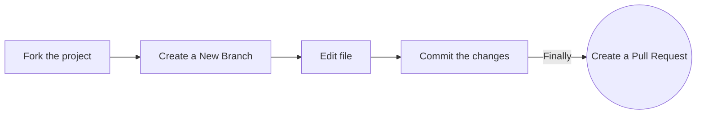

<div align="center">
  <a href="https://www.recodehive.com">
    
  </a>
</div>
<h1 align="center">recode hive</h1>

<div align="center">
<!-- ALL-CONTRIBUTORS-BADGE:START - Do not remove or modify this section --> 
 
[](#contributors-)
<a href="https://github.com/recodehive/recode-website/stargazers"></a>
<a href="https://github.com/recodehive/recode-website/network/members"></a> 
<a href="https://github.com/recodehive/recode-website/pulls"></a>
<a href="https://github.com/recodehive/recode-website/issues"></a>
<a href="https://github.com/recodehive/recode-website/graphs/contributors"></a>
<a href="https://github.com/recodehive/recode-website/LICENSE"></a>
[](https://visitcount.itsvg.in)
<!-- ALL-CONTRIBUTORS-BADGE:END -->
This is the all in one place for documentation help regarding How to contribute.
</div>

##

Now, resolve your all doubts and communicate with our all contributors.

[](https://discord.gg/Yxv9RA3r)
[](https://www.linkedin.com/in/sanjay-k-v/)

## Getting Started

To get started with contributing to Recode-Hive, please refer to our
[Contributing Guidelines](CONTRIBUTING.md).

<div>
    <a href="https://www.loom.com/share/c8d8d5f0c2534a1f86fc510dcef52ee0">
      <p>How to Contribute to this repo | How to Setup - Watch Video</p>
    </a>
    <a href="https://www.loom.com/share/c8d8d5f0c2534a1f86fc510dcef52ee0">
      
    </a>
  </div>
Follow these steps:



1. **Clone the repository:**

   ```bash
   git clone https://github.com/your-username/recodehive-website.git
   ```

2. **Navigate to the project directory:**

   ```bash
   cd recodehive-website
   ```

3. **Install dependencies:**

   ```bash
   npm install
   ```

4. **Start the development server:**
   ```bash
   npm start
   ```

## 🧹 Code Quality & Development Setup

This project uses ESLint, Prettier, and Husky to maintain code quality and consistency.

### Prerequisites

- Node.js 18+
- npm or yarn

### Development Setup

1. **Install dependencies (if not already done):**

   ```bash
   npm install
   ```

2. **Install recommended VS Code extensions:**
   - ESLint
   - Prettier - Code formatter
   - Tailwind CSS IntelliSense
   - Auto Rename Tag

### Available Scripts

| Command                | Description                    |
| ---------------------- | ------------------------------ |
| `npm start`            | Start development server       |
| `npm run build`        | Build for production           |
| `npm run lint`         | Run ESLint to check for issues |
| `npm run lint:fix`     | Run ESLint and auto-fix issues |
| `npm run format`       | Format code with Prettier      |
| `npm run format:check` | Check if code is formatted     |
| `npm run typecheck`    | Run TypeScript type checking   |

### Code Quality Tools

#### ESLint

Lints JavaScript and TypeScript files for code quality and potential errors.

```bash
# Check for linting issues
npm run lint

# Fix auto-fixable issues
npm run lint:fix
```

#### Prettier

Formats code consistently across the project.

```bash
# Format all files
npm run format

# Check if files are formatted
npm run format:check
```

#### Pre-commit Hooks

Husky and lint-staged automatically run linting and formatting on staged files before each commit.

To install pre-commit hooks:

```bash
npm run prepare
```

### Contributing Guidelines

1. **Before making changes:**

   ```bash
   # Create a new branch
   git checkout -b feature/your-feature-name

   # Make sure you're up to date
   git pull origin main
   ```

2. **While developing:**
   - Write clean, readable code
   - Follow existing code patterns
   - Use TypeScript for type safety
   - Add comments for complex logic

3. **Before committing:**

   ```bash
   # Run all checks
   npm run lint
   npm run format:check
   npm run typecheck
   npm run build
   ```

4. **Commit your changes:**

   ```bash
   git add .
   git commit -m "feat: add your feature description"
   ```

   The pre-commit hooks will automatically:
   - Run ESLint and fix issues
   - Format code with Prettier
   - Check TypeScript types

5. **Push and create PR:**
   ```bash
   git push origin feature/your-feature-name
   ```

### Code Style Guidelines

- Use **TypeScript** for all new components
- Follow **React best practices**
- Use **functional components** with hooks
- Implement **proper error handling**
- Write **meaningful commit messages**
- Add **JSDoc comments** for complex functions

### Troubleshooting

**ESLint errors?**

```bash
npm run lint:fix
```

**Formatting issues?**

```bash
npm run format
```

**Type errors?**

```bash
npm run typecheck
```

**Build failing?**

```bash
npm run build
```

For more help, check our [Discord community](https://discord.gg/Yxv9RA3r) or create an issue.

3. **Install dependencies:**

   ```bash
   npm install
   ```

4. **Running the Application:** There is a high chance you will face this issue due to the Next.js
   18 version conflict, which is global , so type the below to fix it and ignore the warnings while
   setup.

4. **Build the Docker Image:**
    Only do this if you are setting up this project locally for the first time. (only build)

   Once you have installed the dependencies, you can run the application locally using:
   
```bash
docker build -t recodehive-app .
```

5. Run the Container
```bash
docker run -p 3000:3000 recodehive-app
```

   ```bash
   npm i
   ```

   ```bash
   npm start
   ```

   This command will start a development server and open the application in your default web
   browser.

**If you'd like to contribute to CodeHarborHub, please follow these guidelines:**

- **Fork** the repository and clone it locally.
- Create a new branch for your feature or bug fix: `git checkout -b feature-name`
- Make your changes and test thoroughly.
- Commit your changes: `git commit -m "Brief description of your changes"`
- Push to the branch: `git push origin feature-name`
- Submit a pull request detailing your changes.


## Project Structure

```
recode-website/
|  
├── .github/                              🔹 GitHub meta files
|    ├── ISSUE_TEMPLATE/
|    ├── workflows/
|    └── pull_request_template.md
├── blog/                                 🔹Project Blog  
|    ├── git-coding-agent/
|    ├── google-backlinks/
|    ├──...
├── community/                            🔹 Contributor Docs  
|    ├── contributing-guidelines.md
|    ├── index.md
|    ├── our-documentation.md
|    └── understand-lint-checks.md
├── docs/                                 🔹Documentation
|    ├── GitHub/
|    ├── Google-Student-Ambassador/
|    ├── ...
├── src/                                  🔹Source Code  
|    └── compenents/
|    ├── css/
|        └── custom.css
|    ├── data/
|    ├── database/
|    ├── lib/
|    ├── pages/
|    ├── plugins/
|    ├── services/
|    ├── style/
|        └── globals.css
|    ├── theme/
|    └── utils/
├── static/                              🔹 Public Assets
|    ├── icons, img
|    ├── .nojekyll
|    └── *.png
├── .gitignore
├── CODE_OF_CONDUCT.md
├── LICENSE
├── README.md
└── ...              
```

## License

This project is licensed under the [MIT License](LICENSE).

## Badges


## Contributors

<a href="https://github.com/RecodeHive/recode-website/graphs/contributors">
  
</a>

<div align="center">


Happy open-source contributions and here’s to your career success! 🎉 <br>

<p align="center">
  
</p>


### recode-hive 2025

[Website](https://recodehive.com/) | [Instagram](https://www.instagram.com/nomad_brains/) |
[LinkedIn](https://www.linkedin.com/in/sanjay-k-v/) | [Twitter](https://x.com/sanjay_kv_) |
[YouTube](https://www.youtube.com/@RecodeHive)<br> **🔔 Don’t miss a beat!** <br> Subscribe to
receive our newsletter directly in your inbox for the latest career insights & tailored to your
journey.<br>
[](https://recodehive.substack.com/)
<br>

<a href="#top">
  
</a>

</div>
