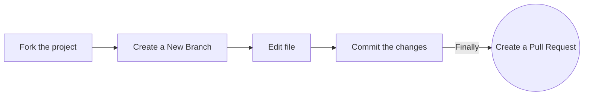

<div align="center">
  <a href="https://www.recodehive.com">
  
  </a>
</div>
<h1 align="center">recode hive</h1>

<br><br>
<div align="center">

[](#contributors)
[](https://github.com/recodehive/recode-website/stargazers)
[](https://github.com/recodehive/recode-website/network/members)
[](https://github.com/recodehive/recode-website/pulls)
[](https://github.com/recodehive/recode-website/issues)
[](https://github.com/recodehive/recode-website/graphs/contributors)
[](https://github.com/recodehive/recode-website/LICENSE)

**Your all-in-one resource for learning Git, GitHub, Python, and Next.js through comprehensive tutorials and hands-on projects.**

[Website](https://recodehive.com/) • [Documentation](https://recodehive.com/docs) • [Contributing](community/contributing-guidelines.md) • [Discord](https://discord.gg/Yxv9RA3r)
<div align="center">

</div>

</div>


<br><br>

## 📖 About

recode hive is an open-source educational platform built to help developers master essential technologies through interactive tutorials, practical guides, and community-driven learning. Whether you're a beginner taking your first steps in programming or an advanced developer looking to sharpen your skills, recode hive provides the resources you need.


## ✨ Vision
Empower every learner to master practical software skills through clear tutorials, hands-on projects, and a supportive open‑source community—so you can build confidently, ship faster, and grow your career.


## 🎯 Mission

- Build an accessible, high‑quality hub for learning Git, GitHub, Python, and Next.js.
- Turn learning into doing with guided setups, real projects, and contribution pathways.
- Sustain a vibrant community that celebrates progress with challenges, leaderboards, and mentorship.
- Keep everything open, transparent, and contributor‑friendly.


## ✨ Features

- **Comprehensive Tutorials** – Step-by-step guides for Git, GitHub, Python, and Next.js, suitable for beginners and advanced users
- **Hands-On Setup Guides** – Practical walkthroughs for setting up projects, repositories, and development environments
- **Leaderboards & Challenges** – Track your progress, earn points, and compete with others to stay motivated
- **Documentation Hub** – Centralized docs for quick reference, best practices, and deep dives into concepts
- **Merchandise Store** – Exclusive branded merchandise to celebrate your learning milestones
- **User Dashboard** – Personalized space to monitor your completed tutorials, achievements, and activity
- **Community & Collaboration** – Engage with other learners, share tips, and collaborate on projects


## 💡 Why Recode-website
● Learn by building: move from tutorial to working project without guesswork.
● All-in-one: docs, guides, challenges, and a dashboard in one place.
● Community-first: collaborate, ask questions, and level up together.
● Career momentum: showcase contributions, climb the leaderboard, and share verifiable progress.
● Modern stack: Docusaurus + React + TypeScript, Tailwind, Radix UI, Framer Motion.
● Open-source: extensible, auditable, and built by contributors like you.


## 🧩 Prerequisites
Set these up before running locally or contributing:

- Node.js 18.x or newer (LTS recommended)
- Git (for cloning and contributing)
- npm (bundled with Node.js) or your preferred package manager
Optional:
- [Docker](https://docs.docker.com/engine/install/) (optional, for containerized development)
- nvm-windows (to switch Node versions if needed)
- Docker Compose
- A GitHub account (for forking and PRs)


## 🚀 Quick Start
### Installation

**Clone the repository:**

```bash
git clone https://github.com/your-username/recode-website.git
cd recode-website
```

**Using Docker (Recommended):**

```bash
# Build the image (first time only)
docker build -t recodehive-app .

# Run the container
docker run -p 3000:3000 recodehive-app
```

**Using Docker Compose (with hot-reload):**

```bash
docker-compose up
```

Your application will be available at http://localhost:3000

**Traditional Setup:**

```bash
npm install
npm run start
```

### Production Build

```bash
npm run build
npm run serve
```


## 🛠️ Troubleshooting
Common issues and quick fixes (Windows PowerShell friendly):

- Node version mismatch
   - Symptom: install/build errors or unexpected syntax errors
   - Fix: Use Node 18.x (LTS). Consider nvm-windows to switch versions.
   - Optional commands:
       - ```node -v```
       - ```npm cache verify```
- Port 3000 already in use
    - Symptom: Dev server fails to start
    - Fix: Kill the process on port 3000 or change the port.
    - Optional commands:
        - netstat -ano | findstr :3000
        - taskkill /PID <pid> /F
- Dependency/install errors
    - Symptom: npm install fails with peer/audit/compile errors
    - Fix: Reinstall cleanly.
    - Optional commands:
        - ```Remove-Item -Recurse -Force node_modules```
        - ```Remove-Item -Force package-lock.json```
        - ```npm install```


## 🛠️ Tech Stack

### Core Technologies

- **Framework:** Docusaurus 3 (React + TypeScript)
- **Language:** TypeScript (Node.js ≥ 18)
- **Styling:** Tailwind CSS 4
- **UI Components:** Radix UI, Framer Motion

### Developer Tools

- **Linting & Formatting:** ESLint, Prettier
- **Type Checking:** TypeScript (`tsc`)


## 🔁 Project Flowchart


## 📁 Project Structure

```
recode-website/
│
├── .github/                    # GitHub configuration
│   ├── ISSUE_TEMPLATE/
│   ├── workflows/
│   └── pull_request_template.md
│
├── blog/                       # Blog posts
│   ├── git-coding-agent/
│   ├── google-backlinks/
│   └── ...
│
├── community/                  # Community documentation
│   ├── contributing-guidelines.md
│   ├── index.md
│   ├── our-documentation.md
│   └── understand-lint-checks.md
│
├── docs/                       # Main documentation
│   ├── GitHub/
│   ├── Google-Student-Ambassador/
│   └── ...
│
├── src/                        # Source code
│   ├── components/             # React components
│   ├── css/
│   │   └── custom.css
│   ├── data/
│   ├── database/
│   ├── lib/
│   ├── pages/
│   ├── plugins/
│   ├── services/
│   ├── style/
│   │   └── globals.css
│   ├── theme/
│   └── utils/
│
├── static/                     # Static assets
│   ├── icons/
│   ├── img/
│   ├── .nojekyll
│   └── *.png
│
├── .gitignore
├── CODE_OF_CONDUCT.md
├── LICENSE
├── README.md
└── ...
```


## 🤝 Contributing

We welcome contributions from developers of all skill levels! Here's how you can get started:

### Contribution Workflow



### Step-by-Step Guide

**Fork the repository** on GitHub

**Clone your fork:**

```bash
git clone https://github.com/your-username/recode-website.git
cd recode-website
```

**Create a new branch:**

```bash
git checkout -b feature/your-feature-name
```

**Make your changes** and test thoroughly

**Commit your changes:**

```bash
git commit
```

**Push to your fork:**

```bash
git push origin feature/your-feature-name
```

**Submit a Pull Request** with a detailed description of your changes


### Video Tutorial

<div>
    <a href="https://www.loom.com/share/c8d8d5f0c2534a1f86fc510dcef52ee0">
      <p>How to Contribute to this Repo | How to Setup - Watch Video</p>
    </a>
    <a href="https://www.loom.com/share/c8d8d5f0c2534a1f86fc510dcef52ee0">
      
    </a>
</div>

For detailed guidelines, please refer to our [Contributing Guidelines](community/contributing-guidelines.md).


## 📚 Documentation

- [Contributing Guidelines](community/contributing-guidelines.md)
- [Code of Conduct](CODE_OF_CONDUCT.md)
- [Understanding Lint Checks](community/understand-lint-checks.md)
- [Our Documentation Standards](community/our-documentation.md)


## 💬 Community

Join our community and connect with fellow learners:

[](https://discord.gg/Yxv9RA3r)
[](https://www.linkedin.com/in/sanjay-k-v/)


## 📊 Project Statistics


## 👥 Contributors

We appreciate all contributions to recode hive! Thank you to everyone who has helped make this project better.

<a href="https://github.com/RecodeHive/recode-website/graphs/contributors">
  
</a>


## ⚖️ License

This project is licensed under the [MIT License](LICENSE). See the LICENSE file for details.


## 📬 Stay Connected

Stay up to date with the latest from recode hive:

- **Website:** [recodehive.com](https://recodehive.com/)
- **Instagram:** [@nomad_brains](https://www.instagram.com/nomad_brains/)
- **LinkedIn:** [Sanjay K V](https://www.linkedin.com/in/sanjay-k-v/)
- **Twitter:** [@sanjay*kv*](https://x.com/sanjay_kv_)
- **YouTube:** [@RecodeHive](https://www.youtube.com/@RecodeHive)
- **Newsletter:** [Subscribe](https://recodehive.substack.com/)


<div align="center">

**Happy open-source contributions—here's to your career success! 🎉**

<p align="center">
  
</p>

Made with ❤️ by the recode hive community

<a href="#top">
  
</a>

</div>
