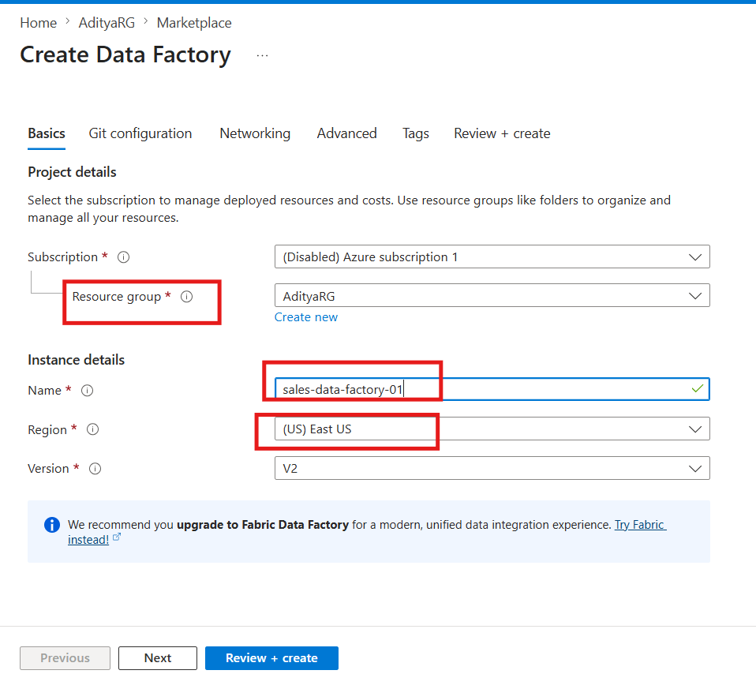
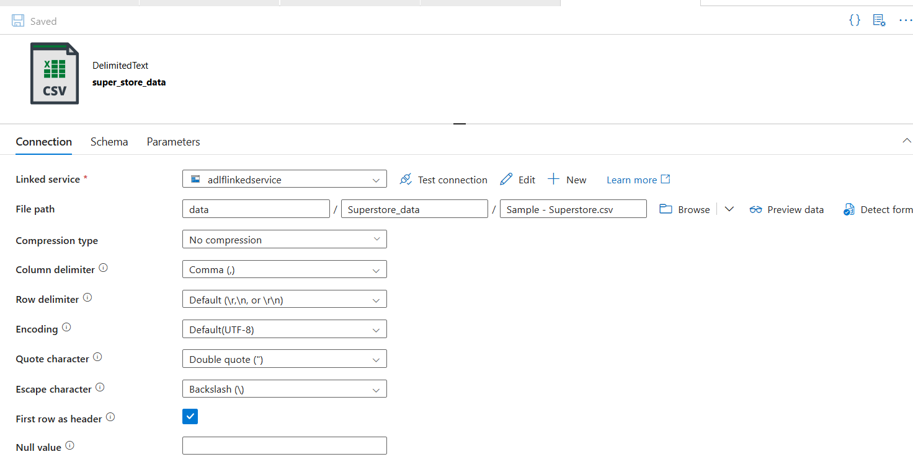

<!-- truncate -->

# Azure Data Factory Pipeline: Build Your First ETL in 10 Minutes

The first time someone asked me to "build an ETL pipeline," I nodded confidently and then quietly searched "what is ETL" on my second monitor.

Extract. Transform. Load.

Three words that describe something every data team does dozens of times a day — pulling data from somewhere, doing something to it, and putting it somewhere more useful. Simple idea. Historically, painful to implement.

You'd write Python scripts that broke when the source schema changed. You'd schedule them with cron jobs that nobody monitored. You'd debug failures at 2am by reading raw logs.

**Azure Data Factory** (ADF) exists to replace all of that with a visual, managed, scalable pipeline service, one where you can build a working ETL in minutes, not days, and monitor it from a dashboard instead of a terminal.

This guide walks you through everything, the concepts, the components, and a complete step-by-step pipeline you can build right now.


## What Is Azure Data Factory?

Azure Data Factory is Microsoft's cloud-native ETL and data integration service. It lets you build **data pipelines**, workflows that move data from one place to another, transform it along the way, and load it into a destination where it's actually useful.

The key word is *visual*. ADF gives you a drag-and-drop canvas where you connect activities, configure sources and destinations, and build complex workflows without writing infrastructure code.

Under the hood, it handles:
- Connecting to 90+ data sources (databases, APIs, files, SaaS apps)
- Moving data at scale using managed compute
- Scheduling and triggering pipeline runs
- Monitoring, alerting, and retry logic

Think of it as the **orchestration layer** of your Azure data stack, the thing that decides what data moves where, when, and how.


## The 4 Concepts You Need to Know First

Before you touch the UI, these four concepts need to click. Everything in ADF is built on them.

### 1. Linked Service: The Connection

A **Linked Service** is a connection string. It tells ADF how to connect to an external resource — a storage account, a database, an API.

Think of it as the key to a door. Before ADF can read from your Blob Storage or write to your SQL database, it needs a Linked Service that holds the credentials and connection details for that resource.

You create a Linked Service once, then reuse it across as many datasets and pipelines as you need.

<iframe
  width="100%"
  height="400"
  src="https://www.youtube.com/embed/EpDkxTHAhOs"
  title="YouTube video player"
  frameborder="0"
  allow="accelerometer; autoplay; clipboard-write; encrypted-media; gyroscope; picture-in-picture"
  allowfullscreen>
</iframe>

**Examples:**
- `AzureStorageLinkedService` → connects to your ADLS Gen2 account
- `AzureSqlLinkedService` → connects to your Azure SQL Database
- `RestApiLinkedService` → connects to an external HTTP API

### 2. Dataset: The Pointer

A **Dataset** points to the specific data within a Linked Service.

If the Linked Service is the key to the building, the Dataset is the directions to a specific room inside it. It tells ADF: *"The data I care about is in this container, in this folder, in this file format."*

**Examples:**
- A Dataset pointing to `bronze/sales/2024/jan/*.csv` in your ADLS Gen2 account
- A Dataset pointing to the `[dbo].[orders]` table in your SQL database
- A Dataset describing a Parquet file with a known schema

### 3. Activity: The Work

An **Activity** is a single step of work inside a pipeline. ADF has three categories:

- **Data Movement** — Copy data from source to destination. The **Copy Activity** is the most common one you'll use.
- **Data Transformation** — Transform data using Mapping Data Flows, Databricks notebooks, or stored procedures.
- **Control Flow** — Logic and orchestration: If/Else conditions, ForEach loops, Wait activities, Execute Pipeline (call another pipeline).

### 4. Pipeline — The Workflow

A **Pipeline** is a logical grouping of activities that together perform a unit of work.

Your pipeline might have three activities: a Copy Activity to land raw data, a Data Flow activity to clean it, and a Stored Procedure activity to update a watermark table. Together they form one repeatable workflow.


## The ETL Flow in ADF: Visualised

Here's how all four concepts connect in a real pipeline:


## Build Your First Pipeline: Step by Step

Let's build a real pipeline: copy a CSV file from Azure Blob Storage into ADLS Gen2, landing it in a `bronze/` folder.

**What you need before starting:**
- An Azure account (free trial works fine)
- A Storage Account with hierarchical namespace enabled (ADLS Gen2)
- A CSV file uploaded to a container called `source/`


### Step 1: Create an Azure Data Factory

1. Go to the [Azure Portal](https://portal.azure.com)
2. Search for **Data Factory** → click **Create**
3. Fill in the details:
   - Resource Group: your existing one or create new
   - Name: `sales-data-factory` (must be globally unique)
   - Region: same as your storage account
4. Click **Review + Create** → **Create**
5. Once deployed, click **Launch Studio**

You're now in **ADF Studio**, the visual authoring environment.




### Step 2: Create a Linked Service for Your Storage Account

1. In ADF Studio, click **Manage** (toolbox icon, left sidebar)
2. Click **Linked Services** → **New**
3. Search for **Azure Data Lake Storage Gen2** → Select → Continue
4. Fill in:
   - Name: `ADLSGen2LinkedService`
   - Authentication: Account Key (simplest for now)
   - Storage Account: select yours from the dropdown
5. Click **Test Connection** — you should see ✅ Connection successful
6. Click **Create**!


### Step 3: Create the Source Dataset

This dataset points to the CSV file in your `source/` container.

1. Click **Author** (pencil icon, left sidebar)
2. Click **+** → **Dataset**
3. Search for **Azure Data Lake Storage Gen2** → Continue
4. Select **Delimited Text** (CSV format) → Continue
5. Fill in:
   - Name: `SourceCSVDataset`
   - Linked Service: `ADLSGen2LinkedService`
   - File path: `source/` → browse and select your CSV file
   - First row as header: ✅ checked
6. Click **OK**




### Step 4: Create the Sink Dataset

This dataset points to where the file should land, your `bronze/` folder.

1. Click **+** → **Dataset** again
2. Same steps — **Azure Data Lake Storage Gen2** → **Delimited Text**
3. Fill in:
   - Name: `BronzeCSVDataset`
   - Linked Service: `ADLSGen2LinkedService`
   - File path: `bronze/sales/` (type this manually, it doesn't need to exist yet, ADF will create it)
4. Click **OK**


### Step 5: Build the Pipeline

1. Click **+** → **Pipeline** → name it `CopySalesToBronze`
2. From the **Activities** panel on the left, expand **Move & Transform**
3. Drag **Copy data** onto the canvas
4. Click the Copy Activity to open its settings:

**Source tab:**
- Source dataset: `SourceCSVDataset`

**Sink tab:**
- Sink dataset: `BronzeCSVDataset`
- Copy behavior: `PreserveHierarchy`

**Mapping tab:**
- Click **Import schemas** - ADF reads your CSV headers and maps columns automatically

5. Click **Validate** (toolbar) - you should see no errors
6. Click **Debug** - this runs the pipeline immediately without publishing


### Step 6: Publish and Add a Trigger

Once Debug runs successfully:

1. Click **Publish All** (top toolbar) - this saves everything to ADF
2. Click **Add trigger** → **New/Edit**
3. Click **New** → configure:
   - Type: **Schedule**
   - Start: today's date
   - Recurrence: **Every 1 Day** at `02:00 AM`
4. Click **OK** → **OK**
5. Click **Publish All** again

Your pipeline now runs automatically every night at 2am, copying new sales data into your bronze layer.


### Step 7: Monitor Your Pipeline

1. Click **Monitor** (chart icon, left sidebar)
2. You'll see all pipeline runs - status, duration, rows copied
3. Click any run to see activity-level details
4. If something fails, click the error icon to see exactly which activity failed and why


## What Just Happened: The Full Picture

Let's step back and look at what you built:


This is the **Extract and Load** part of ETL. The file is extracted from the source container and loaded into the bronze layer, untouched, exactly as it arrived.


## What Comes Next: Transform

The pipeline you built moves data. To transform it, you add one of two things after the Copy Activity:

**Option 1 — Mapping Data Flow** (no-code)
A visual transformation canvas inside ADF. Drag and drop Filter, Join, Aggregate, Derived Column activities. Runs on Spark under the hood. Great for teams that don't want to write code.

**Option 2 — Databricks Notebook Activity**
Call an existing Databricks notebook from your ADF pipeline. The notebook runs your Python/Spark transformation logic and writes cleaned data to the silver layer. Best for complex transformations that need code.

The full Medallion Architecture flow in ADF looks like this:

```
Source API / Database
        ↓
Copy Activity → bronze/ (raw data, as-is)
        ↓
Mapping Data Flow / Databricks Notebook → silver/ (cleaned, validated)
        ↓
Mapping Data Flow / Databricks Notebook → gold/ (aggregated, business-ready)
        ↓
Power BI DirectLake → Dashboard
```


## Triggers: When Does Your Pipeline Run?

ADF gives you three trigger types:

| Trigger Type | When it fires | Use case |
|---|---|---|
| **Schedule** | At a fixed time/frequency | Nightly batch loads |
| **Tumbling Window** | Fixed intervals with state | Hourly incremental loads |
| **Storage Event** | When a file arrives in storage | File-arrival driven pipelines |
| **Manual** | On demand | One-time loads, testing |

For production pipelines, **Storage Event triggers** are the most powerful, your pipeline fires automatically the moment a new file lands in your container, with no polling or scheduling lag.


## Common Mistakes Beginners Make

**1. Using the same Linked Service for every environment**
Create separate Linked Services for dev, staging, and production. Use ADF's **parameterisation** to swap them out without changing pipeline logic.

**2. Not testing with Debug before publishing**
Always Debug first. Publishing without testing means failures hit production. Debug runs don't count against your trigger history.

**3. Hardcoding file paths in datasets**
Parameterise your datasets so the same pipeline can process different files dynamically. One pipeline, many files, not one pipeline per file.

**4. No monitoring alerts**
Set up Azure Monitor alerts for pipeline failures. You shouldn't find out a pipeline failed when someone asks why last night's data is missing.


## Key Takeaways

**1. ADF is built on four concepts.** Linked Services (connections), Datasets (pointers), Activities (work), Pipelines (workflows). Everything else is a variation of these four.

**2. The Copy Activity is your workhorse.** It supports 90+ source/sink combinations and handles schema mapping, file format conversion, and retry logic out of the box.

**3. ADF is the orchestration layer, not the transformation layer.** For heavy transformations, ADF calls Databricks or Data Flows, it doesn't do the transformation itself.

**4. Triggers make pipelines production-ready.** A pipeline without a trigger is just a script you run manually. Add a trigger and it becomes infrastructure.

**5. ADF fits naturally into Medallion Architecture.** Copy Activity lands data in bronze. Data Flows or Databricks jobs process silver and gold. ADF orchestrates the whole sequence.


## References & Further Reading

- [Microsoft Docs: Introduction to Azure Data Factory](https://learn.microsoft.com/en-us/azure/data-factory/introduction)
- [Microsoft Docs: Copy Activity in ADF](https://learn.microsoft.com/en-us/azure/data-factory/copy-activity-overview)
- [Microsoft Docs - ADF Tutorial: Copy data using Azure portal](https://learn.microsoft.com/en-us/azure/data-factory/tutorial-copy-data-portal)
- [Microsoft Docs: Mapping Data Flows](https://learn.microsoft.com/en-us/azure/data-factory/concepts-data-flow-overview)
- [Microsoft Docs: Triggers in ADF](https://learn.microsoft.com/en-us/azure/data-factory/concepts-pipeline-execution-triggers)
- [RecodeHive - Azure Storage & ADLS Gen2: Where Does Your Data Actually Live?](https://www.recodehive.com/blog/azure-storage-adls-gen2-complete-guide)
- [RecodeHive: Medallion Architecture Explained](https://www.recodehive.com/blog/medallion-architecture)
- [RecodeHive - Microsoft Fabric: One Platform, One Lake](https://www.recodehive.com/blog/microsoft-fabric-one-platform-one-lake-every-data-workload)


## About the Author

I'm **Aditya Singh Rathore**, a Data Engineer passionate about building modern, scalable data platforms on Azure. I write about data engineering, cloud architecture, and real-world pipelines on [RecodeHive](https://www.recodehive.com/) breaking down complex concepts into things you can actually use.

🔗 [LinkedIn](https://www.linkedin.com/in/aditya-singh-rathore0017/) | [GitHub](https://github.com/Adez017)

📩 Stuck on a specific ADF activity or pipeline pattern? Drop your question in the comments.

<GiscusComments/>
