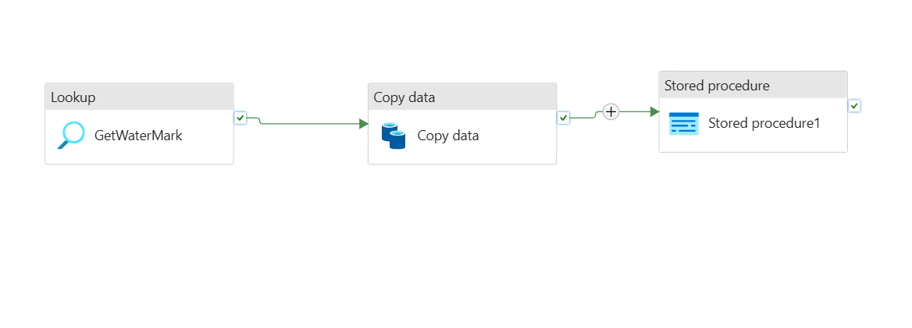
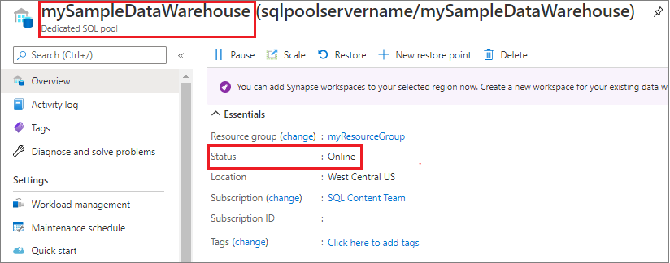
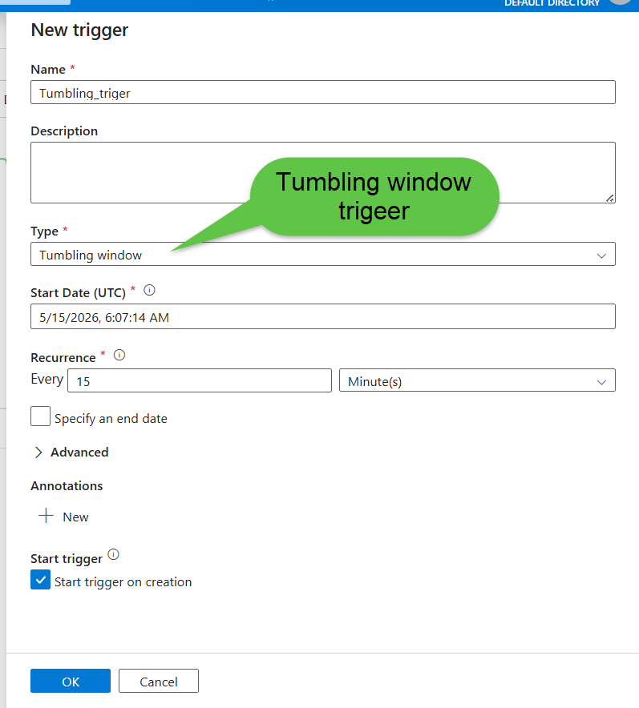
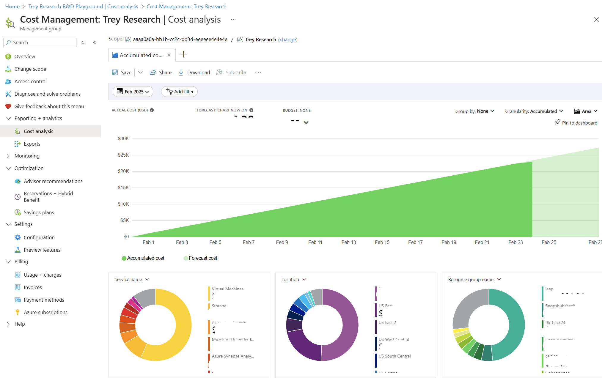

import Tabs from '@theme/Tabs';
import TabItem from '@theme/TabItem';

<!-- truncate -->

# Azure Data Pipeline Cost Optimization: How We Cut a $4,200 Bill by 73%

The Azure billing email arrived on the first of the month. **$4,247.83.**

Our pipeline processed roughly 2GB of sales data per day and served a Power BI dashboard to 30 users. There was no logical reason for a bill that size. Over the next three days, a line-by-line audit of Azure Cost Analysis revealed not one big mistake but **six medium-sized ones**, each silently running up costs in parallel, invisible until the invoice arrived.

This post is that investigation: every mistake explained, every fix documented, and the exact before-and-after numbers. If you're building data pipelines on Azure and haven't audited your costs recently, at least one of these is probably happening to you right now.

**What you'll learn in this post:**
- 1. Why a Dedicated SQL Pool running 24/7 is the single most expensive default mistake in Azure Synapse
- 2. How to replace nightly full loads with watermark-based incremental loads in Azure Data Factory
- 3. How to right-size Spark pools and configure auto-termination to stop paying for idle compute
- 4. How partition pruning on Delta Lake tables can reduce data scanned by over 90%
- 5. How ADLS Gen2 lifecycle policies passively save money on storage with zero ongoing effort
- 6. When a scheduled micro-batch replaces a 24/7 streaming pipeline without any business impact


## The Pipeline Architecture

Before the mistakes make sense, here is the full pipeline:

```
Daily sales data from REST API (~2GB/day)
    ↓
ADF Pipeline (ingestion)
    ↓
ADLS Gen2 — bronze/ (raw Parquet files)
    ↓
Spark job (transformation)
    ↓
ADLS Gen2 — silver/ (Delta tables)
    ↓
Dedicated SQL Pool (serving layer)
    ↓
Power BI dashboard (30 users)
```

A standard [Medallion Architecture](https://www.recodehive.com/blog/medallion-architecture), nothing exotic. 2GB of data per day. 30 users. Should have cost a few hundred dollars a month at most. It cost **~$4,247.83**. Here is exactly why.


## Mistake #1: Dedicated SQL Pool Running 24/7

**Monthly cost of this mistake: ~$1,800**

This was the single largest line item. A Dedicated SQL Pool at DW200c was provisioned to serve the Power BI dashboard and left running continuously 24 hours a day, 7 days a week because auto-pause had never been configured.

The fundamental billing model of a Dedicated SQL Pool is important to understand: **you pay for provisioned DWUs whether or not queries are running.** Our 30 users were active between 9am and 6pm on weekdays, 45 hours of actual usage per week. The pool was running for 168 hours per week. That is 123 hours of idle, fully-billed compute every single week. Over a month, that compounds into a significant waste.

:::note
Dedicated SQL Pool billing is based on **provisioned DWU-hours**, not query execution time. Pausing the pool stops the DWU billing entirely. Only storage costs continue when the pool is paused.
:::

### The Fix: Auto-Pause with Azure Automation Runbooks

The solution is two Azure Automation runbooks, one to pause the pool at the end of business hours, one to resume it in the morning. The runbooks use Managed Identity for authentication, which avoids hardcoding credentials.

```python title="pause-sql-pool.py"
# Azure Automation Runbook — pause Synapse SQL Pool outside business hours
from azure.identity import ManagedIdentityCredential
from azure.mgmt.synapse import SynapseManagementClient

credential = ManagedIdentityCredential()
client = SynapseManagementClient(credential, subscription_id)

# Pause at 7pm weekdays
client.sql_pools.begin_pause(
    resource_group_name,
    workspace_name,
    sql_pool_name
)
```

Schedule the pause runbook at 7pm weekdays and the resume runbook at 8am. Weekends stay paused unless a manual override is triggered through the Azure portal.

**Result:** Billed hours dropped from 720 to roughly 210 per month. SQL Pool cost fell from ~$1,800/month to ~$530/month, a saving of **$1,270/month**.

:::tip
If your workload is exploratory rather than dashboard-serving, consider whether [Serverless SQL Pool](https://learn.microsoft.com/en-us/azure/synapse-analytics/sql/on-demand-workspace-overview) is sufficient. Serverless pools bill per TB of data scanned rather than provisioned DWUs, which can be significantly cheaper for infrequent query patterns.
:::

---

## Mistake #2: Full Load Running Every Night Instead of Incremental

**Monthly cost of this mistake: ~$620**

The ADF pipeline was configured to pull **all records** from the source database on every nightly run — not just new or updated ones. Day 1 it pulled 2GB. By Day 60 it was pulling 120GB, processing records that had already been processed 59 times before.

This pattern is extremely common and extremely expensive. Every night, the ADF pipeline read the entire historical dataset, the Spark transformation job processed all of it, and the results were written back to Delta. The billable compute scaled with the dataset size, not with the actual volume of new data.

### The Fix — Watermark-Based Incremental Loading

A watermark stores the timestamp of the last successfully processed record. Every pipeline run reads only records newer than that timestamp, then updates the watermark on success.

The implementation in ADF uses two Lookup activities and a query parameterized by the watermark value:

<Tabs>
  <TabItem value="Query">

```sql title="get-watermark.sql"
-- Step 1: ADF Lookup activity — retrieve the last watermark
SELECT last_processed_date
FROM pipeline_watermarks
WHERE pipeline_name = 'sales_ingestion'
```

```sql title="incremental-source-query.sql"
-- Step 2: Source query, parameterized by watermark from Step 1
SELECT *
FROM orders
WHERE updated_at > '@{activity("GetWatermark").output.firstRow.last_processed_date}'
  AND updated_at <= '@{utcnow()}'
```

```sql title="update-watermark.sql"
-- Step 3: After successful pipeline run, advance the watermark
UPDATE pipeline_watermarks
SET last_processed_date = '@{utcnow()}'
WHERE pipeline_name = 'sales_ingestion'
```

  </TabItem>
  <TabItem value="Output">

| Pipeline Run | Records Processed | Data Volume | ADF Cost |
|---|---|---|---|
| Before (full load, Day 60) | ~4.8M rows | ~120 GB | ~$22/run |
| After (incremental) | ~8,000 rows | ~2 GB | ~$0.40/run |

  </TabItem>
</Tabs>

**Result:** ADF activity runtime dropped by 94%. Spark compute for the transformation step fell proportionally. Combined saving: **~$585/month**.



:::tip
The watermark pattern requires a reliable `updated_at` or `created_at` column in the source table. If your source does not have one, work with the source team to add it the cost saving on the pipeline side will far outweigh the schema migration effort.
:::


## Mistake #3: Spark Cluster Over-Provisioned for the Actual Workload

**Monthly cost of this mistake: ~$480**

When setting up the Spark pool in Azure Synapse, the default node size **DS3_v2 (4 cores, 14GB RAM)** was selected with 5 nodes. The actual workload: transforming 2–5GB of Parquet files daily with deduplication, type casting, and a few joins.

Two problems compounded each other. First, the cluster was consuming roughly 10x the compute it actually needed for the data volume. Second, auto-termination was set to 60 minutes, meaning after a 12-minute job, the cluster sat idle and fully billed for another 48 minutes before shutting down.

### The Fix — Right-Sizing, Autoscale, and Fast Termination

The fix has three components that work together:

```json title="synapse-spark-pool-config.json"
{
  "nodeSize": "Small",
  "minNodeCount": 2,
  "maxNodeCount": 4,
  "autoscaleEnabled": true,
  "autoTerminationEnabled": true,
  "autoTerminationDelayInMinutes": 5
}
```

The third component is tuning the shuffle partition count inside the Spark notebook. The default of 200 partitions is calibrated for large clusters and large datasets. For 2–5GB of data on a small cluster, 200 partitions creates unnecessary overhead that extends job runtime and therefore billed compute time.

```python title="spark-notebook-config.py"
# Place in the first cell of every Spark notebook
# Default is 200 partitions — designed for multi-TB workloads
# For 2–5 GB datasets, 8 is appropriate
spark.conf.set("spark.sql.shuffle.partitions", "8")
```

:::info
A good rule of thumb for `spark.sql.shuffle.partitions`: aim for roughly **128MB of data per partition**. For a 2GB dataset, that's approximately 16 partitions. Err slightly lower rather than higher for small datasets on small clusters.
:::

**Result:** Spark compute cost dropped from ~$580/month to ~$100/month, a saving of **$480/month**.


## Mistake #4: Reading ADLS Gen2 Files Without Partition Pruning

**Monthly cost of this mistake: ~$290**

The Silver layer Delta table was partitioned by `order_date`. The Spark transformation job, however, was reading the entire table and applying a date filter *after* the read not during it.

This subtle difference has an enormous cost impact. When a filter is applied after reading the table, Spark must open and scan every file in every partition before evaluating which rows to keep. When the filter is pushed down into the read, Spark uses the partition directory structure to skip every partition that does not match, opening only the relevant files.

With 90 days of accumulated history, the naive approach was scanning 90x more data than necessary on every single run.

<Tabs>
  <TabItem value="Before (Expensive)">

```python title="transformation-before.py"
# Reads the ENTIRE Delta table, then filters in memory
# With 90 days of history: scans ~180GB to get ~2GB of useful data
silver_df = spark.read.format("delta").load(
    "abfss://data@mylake.dfs.core.windows.net/silver/sales/"
)
filtered_df = silver_df.filter(col("order_date") == yesterday)
```

  </TabItem>
  <TabItem value="After (Optimized)">

```python title="transformation-after.py"
from datetime import datetime, timedelta

yesterday = (datetime.now() - timedelta(days=1)).strftime("%Y-%m-%d")

# Filter pushed into the read — Spark only opens yesterday's partition
# With 90 days of history: scans ~2GB instead of ~180GB
silver_df = (
    spark.read.format("delta")
    .load("abfss://data@mylake.dfs.core.windows.net/silver/sales/")
    .filter(col("order_date") == yesterday)
)
```

  </TabItem>
</Tabs>

**Result:** Data scanned per run dropped from ~180GB to ~2GB. Spark runtime fell from 18 minutes to 4 minutes. Monthly saving: **~$260/month**.

:::note
For partition pruning to work, two conditions must both be true. The table must be partitioned by the filter column, and the filter must be applied at read time — not in a subsequent transformation step. Applying the filter even one `.filter()` call after the `.load()` still results in full table scan in some execution contexts.
:::


## Mistake #5: Keeping Historical Data on Hot Storage Tier

**Monthly cost of this mistake: ~$180**

The ADLS Gen2 Bronze layer had 14 months of raw Parquet files sitting on the **Hot** storage tier. No lifecycle policy had ever been configured.

ADLS Gen2 charges different rates depending on the storage access tier. Hot tier is priced for data that is accessed frequently. Cool tier costs roughly 44% less. Archive tier costs over 90% less than Hot for storage, though retrieval carries an additional cost. For data that has not been touched in 6 months, paying Hot tier prices is straightforward waste.

Fourteen months of ~2GB/day accumulates to roughly 850GB in the Bronze layer. The storage cost difference between Hot and Cool on that volume is modest, but the pattern compounds across every container and every account and the fix requires exactly one policy configuration.

### The Fix: ADLS Gen2 Lifecycle Management Policy

```json title="lifecycle-policy.json"
{
  "rules": [
    {
      "name": "bronze-tier-management",
      "type": "Lifecycle",
      "definition": {
        "filters": {
          "prefixMatch": ["bronze/"],
          "blobTypes": ["blockBlob"]
        },
        "actions": {
          "baseBlob": {
            "tierToCool": {
              "daysAfterModificationGreaterThan": 30
            },
            "tierToArchive": {
              "daysAfterModificationGreaterThan": 180
            }
          }
        }
      }
    }
  ]
}
```

Bronze files automatically move to Cool after 30 days and Archive after 180 days — with no pipeline changes and no ongoing maintenance.



:::tip
Apply lifecycle policies to the Silver and Gold layers too, with longer thresholds. Silver data accessed for backfills after 90 days can move to Cool. Gold data older than 365 days can move to Archive if your reporting doesn't require historical drill-downs that old.
:::

**Result:** ~$160/month in combined storage and egress savings — purely passive, set once and forgotten.


## Mistake #6: A Streaming Pipeline for 15-Minute Update Requirements

**Monthly cost of this mistake: ~$380**

A secondary pipeline fed a "near real-time" inventory dashboard. The product team had asked for updates *as fast as possible*, which was interpreted as: build a Kafka + Flink streaming pipeline with always-on infrastructure.

What the product team actually needed, when pinned down to a specific number: inventory counts updated **every 15 minutes**.

A streaming pipeline running 24/7 to deliver 15-minute updates is the cloud equivalent of leaving your car engine running all night because you have an early meeting. The always-on Kafka cluster and Flink job cost $380/month. The business requirement was achievable with a job that runs for 2–3 minutes, 96 times a day.

### The Fix: Micro-Batch with ADF Tumbling Window Trigger

An ADF Tumbling Window trigger fires the pipeline every 15 minutes. Each run reads only the delta since the last watermark, processes it, and shuts down. No infrastructure stays running between executions.

```json title="tumbling-window-trigger.json"
{
  "type": "TumblingWindowTrigger",
  "typeProperties": {
    "frequency": "Minute",
    "interval": 15,
    "startTime": "2024-01-01T00:00:00Z",
    "retryPolicy": {
      "count": 3,
      "intervalInSeconds": 30
    }
  }
}
```

The pipeline runs for 2–3 minutes every 15 minutes, processes the delta since the last run using the same watermark pattern from Mistake #2, then shuts down. The product team's dashboard still updates every 15 minutes. They noticed zero difference.

:::info
A useful mental model for this decision: **streaming is the right choice when latency requirements are below 60 seconds**. For anything above that threshold, a well-designed micro-batch pipeline is almost always cheaper, simpler, easier to monitor, and easier to debug. The [hidden costs of streaming pipelines](https://www.recodehive.com/blog/batch-vs-stream-processing) go beyond compute they include more complex failure handling, harder-to-test logic, and longer debugging cycles.
:::

**Result:** Streaming infrastructure cost of $380/month replaced by ~$40/month in ADF + Spark compute. **$340/month saved.**




## Before and After Summary

:::info

| Mistake | Monthly Cost Before | Monthly Cost After | Saving |
|---|---|---|---|
| Dedicated SQL Pool running 24/7 | $1,800 | $530 | **$1,270** |
| Full load instead of incremental | $620 | $35 | **$585** |
| Over-provisioned Spark cluster | $580 | $100 | **$480** |
| No partition pruning | $290 | $30 | **$260** |
| Hot storage for historical data | $180 | $20 | **$160** |
| Streaming for 15-min updates | $380 | $40 | **$340** |
| **Total** | **$3,850** | **$755** | **$3,095** |

:::

From $4,247 down to approximately $1,150 after all fixes — a **73% cost reduction** on a pipeline doing exactly the same work on exactly the same data.




## Cost Optimization Checklist

Run through this every quarter. Each item is a question, if the answer is "no" or "I don't know," investigate it.

**Dedicated SQL Pool**
- [ ] Is auto-pause configured for outside business hours?
- [ ] Is Dedicated SQL Pool actually required, or would Serverless SQL Pool suffice for the query pattern?

**ADF Pipelines**
- [ ] Are any pipelines running full loads where incremental loads are possible?
- [ ] Is a watermark implemented for every pipeline reading time-series data?

**Spark Pools**
- [ ] Is node size right-sized for actual data volume, not default?
- [ ] Is auto-termination set to 5 minutes, not 30–60?
- [ ] Is `spark.sql.shuffle.partitions` tuned to actual data size?
- [ ] Is autoscale enabled with realistic min/max node counts?

**ADLS Gen2**
- [ ] Are lifecycle policies configured on all containers?
- [ ] Are Delta tables partitioned by the column filtered most frequently?
- [ ] Is partition pruning applied at read time in all Spark notebooks?

**Streaming Infrastructure**
- [ ] What is the actual latency requirement, in minutes?
- [ ] If it is above 5 minutes — is a micro-batch pipeline in use instead of always-on streaming?


## Key Lessons

**Defaults are expensive by design.** Azure's defaults 60-minute Spark termination, no SQL Pool auto-pause, no lifecycle policies are chosen for zero-friction setup, not cost efficiency. Every default should be reviewed and overridden deliberately on day one, not after the first billing surprise.

**Incremental loading is not a future optimization.** For any pipeline reading time-series data from a growing source, a full load that runs daily compounds in cost the same way interest compounds on debt. The watermark pattern takes a few hours to implement and pays for itself within a week.

**Partition pruning is free performance.** Setting up partitioning correctly at table creation and pushing filters into the read step costs nothing to implement and can reduce Spark compute by over 90%. The only requirement is knowing which column you filter on most frequently which you almost certainly already know.

**"Real-time" almost never means real-time.** The product team's requirement was 15-minute updates. The engineering interpretation was 24/7 streaming infrastructure. The gap between those two decisions cost $340/month and made the pipeline significantly harder to maintain. Before designing streaming, ask for a specific latency number, then design to that number.

**Azure Cost Analysis is a weekly habit, not a monthly emergency.** The six mistakes above were invisible until the invoice arrived. Fifteen minutes a week in [Azure Cost Management](https://learn.microsoft.com/en-us/azure/cost-management-billing/) catches problems while they are a $50 anomaly, not a $500 line item.


## Frequently Asked Questions

**Q: Should I always use Serverless SQL Pool instead of Dedicated SQL Pool to save costs?**
A: Not necessarily. Serverless SQL Pool bills per TB scanned, which is excellent for exploratory queries and infrequent access. Dedicated SQL Pool becomes more cost-effective when you have consistent, high-concurrency query loads — typically above 6–8 hours of active querying per day. The auto-pause approach gets the best of both: dedicated performance when needed, no billing when idle.

**Q: What if my source system doesn't have a reliable `updated_at` column for watermarking?**
A: There are fallback options. Change Data Capture (CDC) at the database level is the most reliable — tools like [Debezium](https://debezium.io/) can stream row-level changes without modifying the source schema. If CDC is not available, sequence-based watermarking (using an auto-incrementing primary key) works for append-only tables. As a last resort, row hash comparison can detect changes, though it requires reading the full source on each run.

**Q: How do I choose the right partition column for a Delta Lake table?**
A: Partition by the column that appears in your most frequent filter predicate — almost always a date column for time-series data. Avoid high-cardinality columns like user IDs or transaction IDs as partition columns; they create too many small files and make partition pruning less effective. A good partition should contain between 100MB and 1GB of data.

**Q: Will moving data to Archive tier in ADLS Gen2 break my backfill pipelines?**
A: Yes, if pipelines try to read from Archive without rehydrating first. Archive tier data must be rehydrated to Hot or Cool before it can be read, which takes hours. The solution is to only archive data that has a known, long rehydration lead time — typically raw Bronze data older than 6 months, where backfill requests can be anticipated. For Silver and Gold layers, move to Cool but not Archive.

**Q: Is a 5-minute Spark auto-termination window too aggressive for interactive notebooks?**
A: For scheduled jobs, 5 minutes is ideal. For interactive development notebooks, consider a separate Spark pool configuration with a longer termination window — 30 minutes is reasonable. Keep production job pools and development pools separate so cost optimization settings on production do not interrupt interactive work.

**Q: How do I detect whether partition pruning is actually working in my Spark job?**
A: Run the job with the Synapse or Databricks Spark UI open and inspect the query plan. Look for a `PartitionFilters` entry in the scan node of the physical plan. If partition pruning is active, it will list the filter predicate there. If the scan shows `PartitionFilters: []`, the filter is not being pushed down and you are scanning the full table.

---

## References and Further Reading

- [Microsoft Docs — Azure Cost Management and Billing](https://learn.microsoft.com/en-us/azure/cost-management-billing/)
- [Microsoft Docs — Synapse SQL Pool Pause and Resume](https://learn.microsoft.com/en-us/azure/synapse-analytics/sql-data-warehouse/pause-and-resume-compute-portal)
- [Microsoft Docs — ADLS Gen2 Lifecycle Management Policies](https://learn.microsoft.com/en-us/azure/storage/blobs/lifecycle-management-overview)
- [Delta Lake — Partition Pruning and Optimization](https://docs.delta.io/latest/optimizations-oss.html)
- [Microsoft Docs — ADF Tumbling Window Trigger](https://learn.microsoft.com/en-us/azure/data-factory/how-to-create-tumbling-window-trigger)
- [RecodeHive — Azure Storage and ADLS Gen2 Complete Guide](https://www.recodehive.com/blog/azure-storage-options)
- [RecodeHive — Hidden Cost of Streaming Pipelines](https://www.recodehive.com/blog/batch-vs-stream-processing)
- [RecodeHive — Medallion Architecture Explained](https://www.recodehive.com/blog/medallion-architecture)


## About the Author

**Aditya Singh Rathore** is a Data Engineer focused on building modern, scalable data platforms on Azure. He writes about data engineering, cloud architecture, and real-world pipelines on [RecodeHive](https://www.recodehive.com/) — turning hard-won production lessons into content anyone can apply.

🔗 [LinkedIn](https://www.linkedin.com/in/aditya-singh-rathore0017/) | [GitHub](https://github.com/Adez017)

📩 Got an Azure bill that surprised you? Drop the line item in the comments — happy to help debug it.

<GiscusComments/>