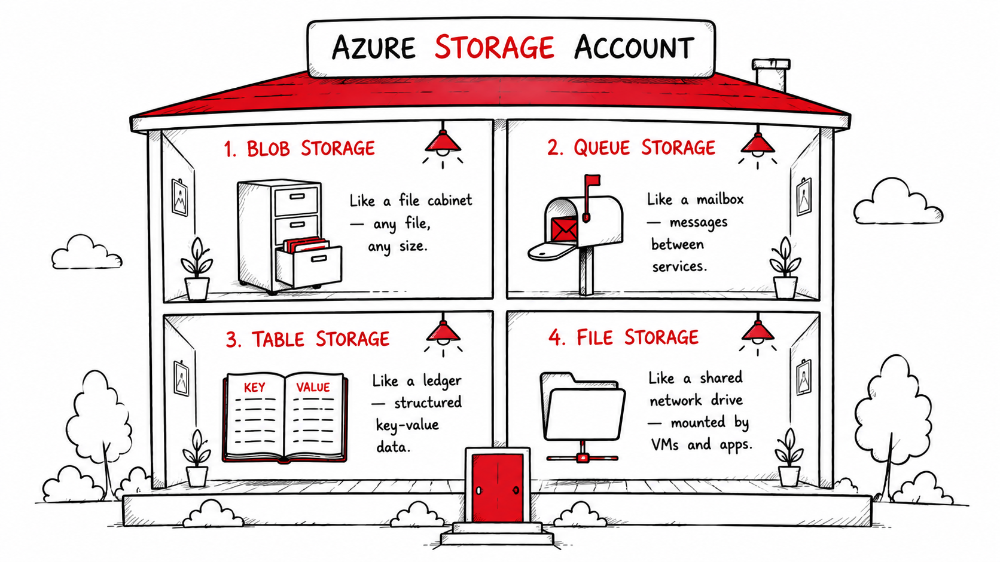
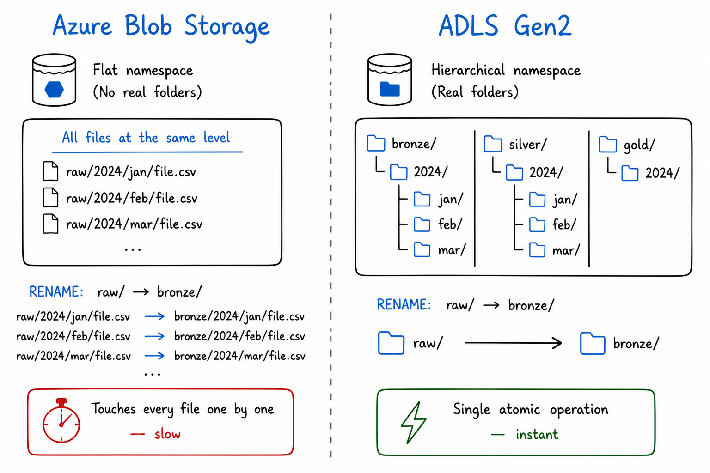
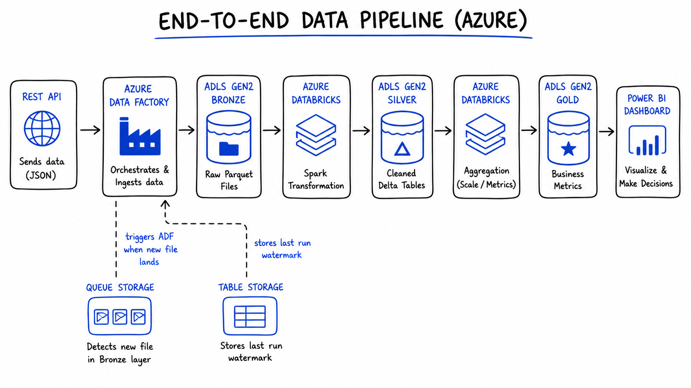

<!-- truncate -->

# Azure Storage & ADLS Gen2: Where Does Your Data Actually Live?

My first week working with Azure, I broke a pipeline before it even started.

I had a simple job: land some raw CSV files from a sales API into Azure so a Spark job could pick them up later. I searched "Azure storage", saw five different options staring back at me, panicked slightly, and clicked the first one that sounded sensible - **Azure Table Storage**.

Three hours later, I was staring at an error I didn't understand, in a service that was never designed for files.

Table Storage is a NoSQL key-value store. It stores entities and properties, not CSV files. My data had nowhere to go.

That confusion is more common than most Azure tutorials admit. And it happens because nobody explains the one question that actually matters before anything else:

**Where does your data actually live in Azure and why?**

This blog answers that. We'll walk through all four Azure storage types, show exactly where each one fits in a real data pipeline, and then go deep on the one that changes everything for data engineering: **Azure Data Lake Storage Gen2**.


## Azure Has Four Storage Types. Here's the Map.

Before we build anything, let's get oriented.

Azure bundles all storage services under a single **Storage Account**, one entry point, one namespace, one billing account. Inside that account, you get access to four distinct storage services, each built for a different job.




Here's the quick map before we go deeper:

| Storage Type | Think of it as | Stores | Used in pipelines for |
|---|---|---|---|
| **Blob Storage** | A file cabinet | Any file CSV, JSON, Parquet, images, logs | Raw data landing zone |
| **Queue Storage** | A mailbox | Messages between services | Triggering pipeline steps |
| **Table Storage** | A ledger | Structured key-value rows | Tracking run state, metadata |
| **File Storage** | A shared network drive | Files accessed over SMB | Legacy app file shares |

None of these is "better." They serve different stages of the same pipeline. The mistake most beginners make, including me is picking one at random instead of understanding the job each one does.

Let's walk through them in the order they matter for a real data engineering workflow.


## Blob Storage: The Foundation of Everything

When data arrives in Azure, it almost always lands in **Blob Storage** first.

Blob stands for **Binary Large Object** which is just a fancy way of saying "any file." CSV, JSON, Parquet, images, videos, audio, ZIP archives, raw log dumps, Blob Storage holds all of it without caring about structure or format.

There's no schema enforcement, no type checking. You put a file in, you get it back out. At any scale.

### The three blob types

Depending on how your data is written, you'll use one of three blob types:

- **Block Blob :** Upload a file all at once. This covers 95% of data engineering use cases, your CSVs, Parquet files, JSON exports all go here.
- **Append Blob :** Add data continuously without modifying what's already there. Perfect for log files that grow over time.
- **Page Blob :** Optimised for random read/write operations. Used mainly for VM disks. You'll rarely touch this directly.

### Access tiers: storage that adjusts to how often you actually need the data

One of Blob Storage's most underrated features is **access tiering**:

- **Hot :** Data you access daily. Higher storage cost, lowest read cost.
- **Cool :** Data you access occasionally. Cheaper to store, slightly more to read. 30-day minimum.
- **Archive :** Data you almost never access. Extremely cheap to store, but takes hours to retrieve. Think old compliance records.

You can set **lifecycle policies** to move data automatically between tiers as it ages. Last month's raw files move from hot to cool. Last year's move to archive. You save money without touching anything manually.

### Where Blob Storage fits in a pipeline

In Medallion Architecture, Blob Storage is the natural home for the **Bronze layer**, the raw, unprocessed data exactly as it arrived from source systems. Nothing is cleaned. Nothing is validated. It just lands and waits.

But here's where things get interesting.

Plain Blob Storage works perfectly for general file storage. But for big data analytics pipelines, the kind where you're processing millions of files, running Spark jobs, and building Bronze/Silver/Gold layers, it has a critical limitation that most tutorials don't mention until you've already hit it.


## The Problem with Plain Blob Storage at Scale

In standard Blob Storage, **folders don't actually exist.**

What looks like a folder structure:
```
raw/2024/jan/sales.csv
raw/2024/feb/sales.csv
raw/2024/mar/sales.csv
```

...is actually just flat key names. The `/` characters are part of the key string, not real directory separators. There are no real folders underneath.

This creates a serious problem when your data grows:

Imagine you need to rename the `raw/2024/` "folder" to `bronze/2024/`. In regular Blob Storage, Azure has to copy each file to the new key name and delete the old one, **one file at a time**. With a thousand files, that's a thousand individual operations. With ten million files, you're waiting hours.

At big data scale, this is a dealbreaker.

This is the exact problem that **Azure Data Lake Storage Gen2** was built to solve.


## ADLS Gen2: Blob Storage, Evolved

**Azure Data Lake Storage Gen2 (ADLS Gen2)** is not a separate service. It's Blob Storage with one critical feature enabled: the **Hierarchical Namespace**.

With hierarchical namespace turned on, folders become real. A directory with ten million files inside it can be renamed or deleted in a **single atomic operation**, instant, regardless of how many files it contains.

That one change makes ADLS Gen2 fast enough for serious analytics workloads. It's the storage layer that Databricks, Synapse, Azure Data Factory, and Microsoft Fabric are all built to work with.




### The full ADLS Gen2 structure

ADLS Gen2 organises data in three real levels:

```
Storage Account
    └── Container (called a File System in ADLS)
            └── Directories (real, nested folders)
                    └── Files (your actual data)
```

In practice, for a Medallion Architecture pipeline:

```
my-datalake/
    └── data/
            ├── bronze/
            │     └── sales/
            │           └── 2024/jan/raw_orders.parquet
            ├── silver/
            │     └── sales/
            │           └── 2024/jan/cleaned_orders.parquet
            └── gold/
                  └── sales/
                        └── 2024/jan/monthly_revenue.parquet
```

Bronze, Silver, Gold are real directories. Spark jobs move data between them. ADF pipelines write to them. Power BI reads from them. The Medallion pattern isn't an abstract concept it's a folder structure in ADLS Gen2 with transformation logic connecting the layers.

### The ABFS driver: why this matters for Spark

When Spark, Databricks, Synapse, or Fabric connect to ADLS Gen2, they use the **Azure Blob File System (ABFS) driver**, accessed via the `abfss://` protocol.

This driver was purpose-built for analytics workloads. It's significantly faster than the old WASB driver for directory-heavy operations, and it's the reason tools like Databricks can list, read, and write millions of files in ADLS Gen2 efficiently.

Every time you see `abfss://container@storageaccount.dfs.core.windows.net/` in a notebook or pipeline config, that's ADLS Gen2 being accessed via the ABFS driver.

### Fine-grained access control with POSIX ACLs

Regular Blob Storage gives you Role-Based Access Control (RBAC) at the container level. ADLS Gen2 goes further with [**POSIX-style Access Control Lists (ACLs)**](https://www.komprise.com/glossary_terms/posix-acls/), the same permission model used in Linux file systems.

This means you can grant a data science team read access to only the `silver/` directory, without exposing `bronze/` (raw, potentially sensitive data) or `gold/` (business metrics). Fine-grained, at the folder and file level.

For regulated industries - finance, healthcare, government, this isn't a nice-to-have. It's a requirement.

### Storage tiers work at directory level

Just like Blob Storage, ADLS Gen2 supports Hot, Cool, and Archive tiers. But now you can apply lifecycle policies at the **directory level** automatically archiving `bronze/2023/` partitions when they're more than a year old, while keeping `bronze/2024/` hot for active pipeline use.

### ADLS Gen2 is what OneLake is built on

If you've read about [Microsoft Fabric](https://www.recodehive.com/blog/microsoft-fabric-explained), you know that OneLake is Fabric's unified data lake, the single storage layer that every Fabric workload reads from and writes to.

OneLake is fundamentally ADLS Gen2 with a unified namespace across your entire Fabric workspace. Understanding ADLS Gen2 means you understand the storage engine that powers Fabric, Synapse, Databricks on Azure, and every serious Azure data platform.

| Azure Service | How it uses ADLS Gen2 |
|---|---|
| **Azure Data Factory** | Reads source files, writes pipeline outputs |
| **Azure Databricks** | Reads/writes Delta tables via ABFS driver |
| **Azure Synapse Analytics** | Queries files directly with SQL serverless |
| **Microsoft Fabric / OneLake** | OneLake IS ADLS Gen2 unified namespace |
| **Azure Machine Learning** | Stores training datasets and model artifacts |
| **Power BI** | DirectLake mode reads Delta files from ADLS Gen2 |


## The Supporting Cast: Queue and Table Storage

ADLS Gen2 stores your data. But a pipeline isn't just storage, it's coordination, state management, and event triggering. That's where Queue Storage and Table Storage come in.

They're not glamorous. But remove them from a production pipeline and things fall apart quickly.

### Queue Storage: The Pipeline Trigger

Queue Storage stores **messages**, small packets of information passed between services asynchronously.

In a data pipeline context, Queue Storage is typically used as a **trigger mechanism**. When a new file lands in ADLS Gen2, Azure Blob Storage can emit an event that drops a message into a Queue. Azure Data Factory (or an Azure Function) listens to that Queue and kicks off the pipeline automatically.

```
New file lands in ADLS Gen2 bronze/
    → Event triggers a Queue message: "new file: sales_2024_jan.parquet"
    → ADF pipeline picks up the message
    → Pipeline runs transformation
    → Cleaned data written to silver/
```

Without Queue Storage, you'd either poll for new files on a schedule (wasteful) or trigger pipelines manually (not scalable).

**Key facts:**
- Messages up to **64 KB** in size
- Queue holds up to **200 TB** of messages
- Messages expire after **7 days** if unconsumed
- Built-in retry logic if a consumer fails, the message reappears for another attempt


### Table Storage: The Pipeline Memory

Table Storage is Azure's **NoSQL key-value store**, schemaless rows of properties, queried by partition and row key.

In data pipelines, Table Storage earns its place as the **watermark store**, the place that remembers where a pipeline left off.

Imagine your ADF pipeline runs every night and ingests new rows from a source database. It can't re-read everything from day one every night. Instead, it records the `last_run_timestamp` in a Table Storage entity:

```
PartitionKey: "sales_pipeline"
RowKey:       "last_run"
Timestamp:    "2024-01-15T02:00:00Z"
```

Next run, the pipeline reads this value, queries only rows updated since then, and updates the watermark when done. This is called **incremental ingestion** and Table Storage is the simplest, cheapest place to track it.

**Other pipeline uses for Table Storage:**
- Pipeline run metadata (status, row counts, duration)
- Configuration values shared across pipeline activities
- Simple lookup tables for reference data enrichment


## File Storage: A Quick Note

Azure File Storage provides a **managed SMB file share** in the cloud, the kind you mount as a network drive in Windows (`\\server\share`).

For data engineering pipelines, you'll rarely reach for File Storage. It's primarily useful for **lift-and-shift migrations**, moving on-premises applications to Azure when those applications expect to read from a network file share and you don't want to refactor them.

If you're building a new pipeline from scratch, ADLS Gen2 is almost always the right choice over File Storage for analytics workloads.


## ADLS Gen2 vs Plain Blob Storage — When to Use Which

| Scenario | Use |
|---|---|
| Raw file landing zone for a big data pipeline | **ADLS Gen2** |
| Serving images or videos to a web application | **Blob Storage** |
| VM disk backups or snapshots | **Blob Storage** |
| Spark / Databricks / Synapse analytics workloads | **ADLS Gen2** |
| Bronze / Silver / Gold Medallion layers | **ADLS Gen2** |
| Simple static file hosting | **Blob Storage** |
| ML training datasets and model artifacts | **ADLS Gen2** |
| Microsoft Fabric / OneLake backend | **ADLS Gen2** |

The pricing is identical. The difference is entirely in the **hierarchical namespace** and the performance characteristics it unlocks for analytics.


## The Full Picture: One Pipeline, All Four Storage Types

Here's how everything we've covered fits into a single, real data engineering pipeline — the kind you'd actually build in Azure:




```
REST API (sales data source)
        ↓
Azure Data Factory (orchestration)
        ↓ writes raw Parquet
ADLS Gen2 — bronze/sales/2024/
        ↓
Azure Databricks (Spark: clean, deduplicate, validate)
        ↓ writes Delta tables
ADLS Gen2 — silver/sales/2024/
        ↓
Azure Databricks (Spark: aggregate, calculate metrics)
        ↓ writes business-ready Delta tables
ADLS Gen2 — gold/sales/2024/
        ↓
Power BI (DirectLake mode — no import, always current)
        ↓
Business dashboard

Supporting roles:
├── Queue Storage → ADF pipeline triggered by file arrival event
└── Table Storage → watermark ("last ingested: 2024-01-15T02:00:00Z")
```

Every storage type has one job. None of them overlap. And ADLS Gen2 is the spine the whole thing runs on.


## The Decision Guide: One Question at a Time

When you're building a pipeline and need to decide where something lives, ask these questions in order:

**Is it a file that a Spark job or analytics tool needs to read?**
→ ADLS Gen2

**Is it a file served to end users (images, videos, downloads)?**
→ Blob Storage

**Is it a message that needs to trigger something downstream?**
→ Queue Storage

**Is it small structured data - a config value, a watermark, a metadata record?**
→ Table Storage

**Is it a file share that a VM or legacy app needs to mount over SMB?**
→ File Storage


## The Key Lessons

**1. Azure storage is four different things.** Each one has a specific job. Using the wrong one is a surprisingly easy mistake to make on day one and a frustrating one to debug.

**2. ADLS Gen2 is Blob Storage with one upgrade that changes everything.** The hierarchical namespace turns flat object storage into a real file system. That single feature is why every serious Azure analytics service is built on top of it.

**3. ADLS Gen2 is the Bronze/Silver/Gold spine of Medallion Architecture.** The layers aren't abstract concepts, they're real directories in a container, with Spark jobs and ADF pipelines connecting them.

**4. Queue and Table Storage are the glue.** They're not glamorous, but production pipelines depend on them for event triggering and state management.

**5. OneLake is ADLS Gen2.** When you use Microsoft Fabric, you're using ADLS Gen2 underneath. Understanding the storage layer means you understand what every Azure data platform is actually built on.


## References & Further Reading

- [Microsoft Docs — Introduction to Azure Data Lake Storage Gen2](https://learn.microsoft.com/en-us/azure/storage/blobs/data-lake-storage-introduction)
- [Microsoft Docs — Azure Storage Overview](https://learn.microsoft.com/en-us/azure/storage/common/storage-introduction)
- [Microsoft Docs — Storage Account Overview](https://learn.microsoft.com/en-us/azure/storage/common/storage-account-overview)
- [Microsoft Docs — ABFS Driver for ADLS Gen2](https://learn.microsoft.com/en-us/azure/storage/blobs/data-lake-storage-abfs-driver)
- [RecodeHive — Medallion Architecture Explained](https://www.recodehive.com/blog/medallion-architecture)
- [RecodeHive — Microsoft Fabric: One Platform, One Lake](https://www.recodehive.com/blog/microsoft-fabric-one-platform-one-lake-every-data-workload)
- [RecodeHive — Lakehouse vs Data Warehouse](https://www.recodehive.com/blog/lakehouse-vs-data-warehouse)


## About the Author

I'm **Aditya Singh Rathore**, a Data Engineer passionate about building modern, scalable data platforms on Azure. I write about data engineering, cloud architecture, and real-world pipelines on [RecodeHive](https://www.recodehive.com/) — breaking down complex concepts into things you can actually use.

🔗 [LinkedIn](https://www.linkedin.com/in/aditya-singh-rathore0017/) | [GitHub](https://github.com/Adez017)

📩 Building something on Azure and stuck on storage decisions? Drop your question in the comments.

<GiscusComments/>
