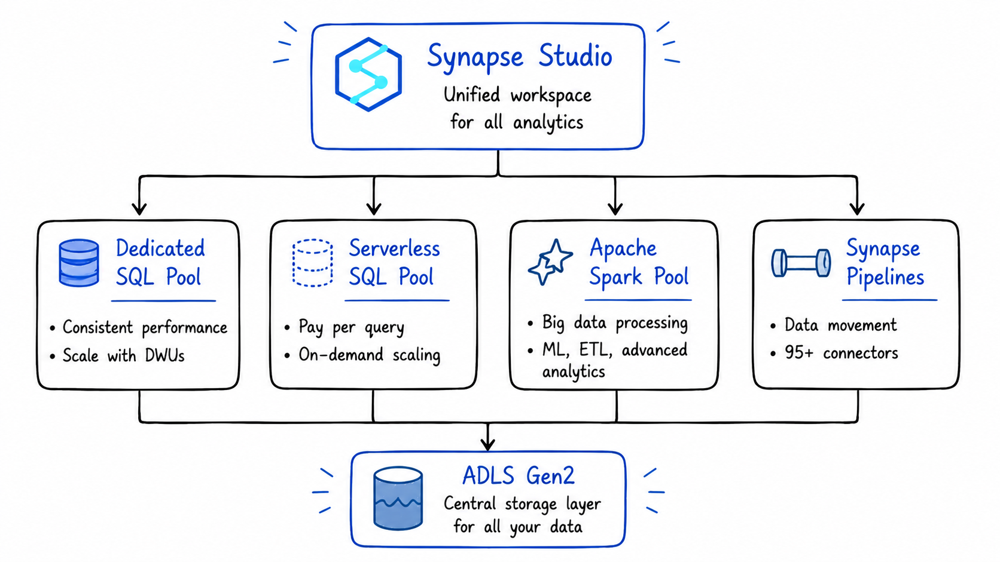
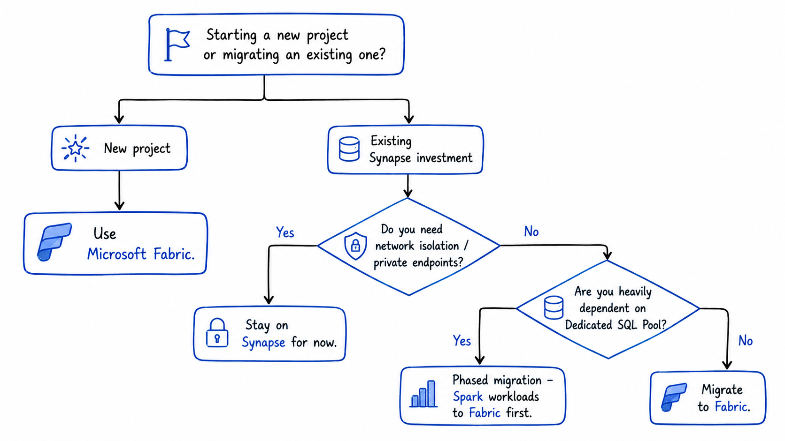

<!-- truncate -->

# Azure Synapse Analytics: When to Use It (And When to Choose Fabric Instead)

When I first started working seriously with Azure, Synapse was the answer to almost every data question.

Need a SQL warehouse? Synapse. Need Spark for big data? Synapse. Need pipelines to move data? Synapse. Need to query files sitting in ADLS Gen2 without loading them anywhere? Synapse.

It was genuinely impressive, one workspace that brought together SQL, Spark, pipelines, and storage into a single studio. I built three production pipelines on it and it worked well.

Then Microsoft Fabric arrived.

And now the question I get asked most often is: *"Should I still use Synapse, or should I move to Fabric?"*

The honest answer is: **it depends on where you are in your Azure journey.** This blog gives you the full picture, what Synapse actually is, when it's the right call, when Fabric is the better choice, and how to think about the transition if you're already on Synapse.


## What Azure Synapse Analytics Actually Is

Azure Synapse Analytics started as the next step beyond Azure SQL Data Warehouse, but over time it evolved into a much broader analytics platform rather than remaining just a cloud data warehouse solution.

What changed significantly was the addition of multiple processing engines and integrated tooling within a single workspace. Instead of working only with SQL-based warehousing, teams could now combine:
- large-scale Spark processing
- SQL analytics
- real-time exploration capabilities
- orchestration pipelines
- integrated data lake access

This shift made Synapse more of a unified analytics ecosystem on Azure, where data engineering, big data processing, and reporting workloads could coexist within the same platform experience.

One of the biggest differences compared to the earlier SQL Data Warehouse model is that Synapse tries to reduce the fragmentation between storage, transformation, orchestration, and analytics services that previously had to be managed separately.

In plain terms: it's a unified analytics platform that brings together four things that used to require four separate Azure services:

- **SQL analytics** - for querying structured data at scale
- **Apache Spark** - for big data processing, ML, and complex transformations
- **Data integration (Synapse Pipelines)** - for moving and transforming data across systems
- **A unified workspace (Synapse Studio)** - where all of the above live together



The key architectural principle underneath all of this is the **separation of compute and storage**. This decoupling allows organizations to scale their processing power independently of their data volume, compute resources can be ramped up to handle peak query loads and then scaled down or even paused during periods of inactivity, all without affecting the underlying data stored in ADLS Gen2.

That's a big deal in practice. You pay for compute only when you use it.


## The Four Core Components - What Each One Does

### 1. Dedicated SQL Pools: High-Performance Data Warehousing

Dedicated SQL Pools are Synapse's data warehousing engine. You provision a fixed amount of compute capacity measured in **Data Warehouse Units (DWUs)**, and in return you get consistent, predictable query performance.

Dedicated SQL pools provision reserved compute capacity measured in Data Warehouse Units. They deliver consistent performance for production workloads, scheduled reports, and dashboards that need predictable response times.

This is the right choice when:
- You have large, structured datasets that are queried repeatedly by BI tools
- You need consistent sub-second query performance for dashboards
- Your team works primarily in T-SQL
- You're migrating from an on-premises SQL Server or Oracle data warehouse

The trade-off: you pay for the provisioned DWUs whether you're running queries or not. It's expensive to leave a Dedicated SQL Pool running 24/7 for workloads that only query it during business hours.

**The practical fix:** pause your Dedicated SQL Pool outside business hours. Synapse lets you do this programmatically via Azure Automation or ADF pipelines — you only pay for compute when it's actually running.

### 2. Serverless SQL Pool: Query Without Loading

Serverless SQL Pool is probably one of the most practical and underrated capabilities inside Azure Synapse.

What makes it interesting is how quickly you can start querying data directly from your data lake without provisioning dedicated infrastructure upfront. Instead of maintaining a constantly running cluster, the engine dynamically allocates compute only when a query is executed.

Under the hood, queries are distributed across multiple compute resources and processed in parallel, which makes it surprisingly efficient for exploratory analysis and lightweight analytical workloads.

The pricing model is also very different from traditional warehouses. Since billing is based on the amount of data scanned per query, it works particularly well for:
- ad-hoc analysis
- one-time investigations
- querying historical files
- lightweight reporting workloads
- infrequently accessed datasets

The first time I used it, the biggest surprise was how quickly I could run SQL directly on files sitting in ADLS without setting up ingestion pipelines or persistent compute.

In practice: you can write a SQL query directly against Parquet, CSV, or Delta files sitting in ADLS Gen2 **without loading them into any database first**.

```sql
-- Query a Parquet file in ADLS Gen2 directly — no loading required
SELECT
    region,
    SUM(amount) AS total_revenue,
    COUNT(order_id) AS total_orders
FROM
    OPENROWSET(
        BULK 'https://mylake.dfs.core.windows.net/silver/sales/2024/**',
        FORMAT = 'PARQUET'
    ) AS sales_data
GROUP BY region
ORDER BY total_revenue DESC;
```

You pay for the bytes scanned by that query. Nothing more.

This is the right choice when:
- You need to explore raw data in ADLS Gen2 before deciding how to model it
- You have analysts who know SQL but don't want to write Spark code
- You're running occasional ad-hoc queries that don't justify provisioning a dedicated warehouse
- You want to build a **logical data warehouse** on top of your data lake without moving data

### 3. Apache Spark Pools: Big Data and ML Workloads

Azure Synapse Analytics tightly integrates Apache Spark pools, providing a first-class, managed Spark environment for large-scale data engineering, data preparation, ETL processes, machine learning model training and scoring, and processing diverse data types including unstructured and semi-structured data.

Spark Pools in Synapse give you a fully managed Apache Spark environment. You write notebooks in Python, Scala, SQL, or R and Synapse handles cluster management, scaling, and shutdown.

This is the right choice when:
- Your transformations are too complex for SQL alone
- You're building ML pipelines or training models on large datasets
- You need to process semi-structured data (JSON, nested arrays) at scale
- Your data engineering team is comfortable in PySpark or Scala

The key advantage over standalone Spark clusters: Spark Pools share the same workspace as your SQL Pools and Pipelines. A Spark notebook can write a Delta table that a SQL analyst can immediately query without any data movement or cross-service configuration.

### 4. Synapse Pipelines: Data Integration and Orchestration

Synapse Pipelines is the data integration layer. It uses the same engine as Azure Data Factory, which means teams already using ADF will recognize the interface and functionality. Pipelines handle the movement and transformation of data across systems connecting to sources, extracting data, applying transformations, and loading results into destinations.

If you've used Azure Data Factory, Synapse Pipelines will feel immediately familiar. It's the same visual, activity-based orchestration tool with 95+ connectors to external systems, built directly into the Synapse workspace.

The advantage over standalone ADF: your pipelines live in the same workspace as your SQL and Spark workloads. You can trigger a Spark notebook, run a SQL script, and copy data to ADLS Gen2, all within a single pipeline, without leaving Synapse Studio.


## What Synapse Studio Actually Looks Like

Synapse Studio is the unified web-based interface that ties everything together. From one interface, teams can write and execute SQL queries against data warehouse tables, build and run Apache Spark notebooks, design data pipelines using visual drag-and-drop tools, monitor jobs, manage resources, and configure security settings. Data engineers building pipelines and analysts writing reports work in the same environment with access to the same underlying data.

In practice, this means less context-switching. When I was building pipelines on Synapse, the biggest quality-of-life win was being able to debug a Spark notebook, run a SQL query against its output, and check the pipeline that triggered it, all in the same browser tab.


## Real-World Use Cases - When Synapse Is the Right Call

### Use Case 1: Enterprise Data Warehouse Migration

Organizations moving from on-premises data warehouses like SQL Server or Oracle to Azure Synapse benefit from enhanced scalability, cost savings, and better performance.

If your team is deeply invested in T-SQL, has existing stored procedures and reporting logic, and is migrating from SQL Server or Azure SQL DW — Synapse's Dedicated SQL Pool is the most natural landing spot. The syntax is familiar, the tooling is mature, and the migration path is well-documented.

### Use Case 2: Ad-Hoc Exploration on a Data Lake

You've landed months of raw data in ADLS Gen2 and need to understand what's in it before building a formal pipeline. Serverless SQL Pool lets analysts write SQL against those files immediately without waiting for a data engineer to model the data first.

This is genuinely one of Synapse's strongest differentiators. No other Azure service lets SQL analysts query raw Parquet files on a data lake this directly, this cheaply.

### Use Case 3: Mixed SQL + Spark Workloads

Your team has SQL analysts querying a data warehouse and data engineers running Spark transformation jobs. In most stacks, these two groups work in separate tools with separate data copies.

In Synapse, Spark can write a Delta table that the SQL pool reads, and SQL results can feed back into Spark notebooks without data movement between services. Both groups work against the same underlying data in ADLS Gen2.

### Use Case 4: Regulated Industries Requiring Network Isolation

Synapse has mature support for managed virtual networks and private endpoints. For teams in finance, healthcare, or government where strict data residency and network isolation are non-negotiable requirements, Synapse's mature networking controls are a significant advantage over Fabric, whose networking story is still evolving.


## The Elephant in the Room: Microsoft Fabric

Here's what I'd be doing you a disservice not to address directly.

If you're starting net-new analytics development today, build on Microsoft Fabric. The OneLake architecture, the Power BI integration, and Microsoft's clear investment trajectory all point in that direction.

Microsoft Fabric has surpassed a $2 billion annual revenue run rate, serves more than 31,000 customers, and is growing revenue at 60% year over year, making it the fastest-growing analytics platform in the market.

Microsoft is clearly betting on Fabric as the future. New features are going into Fabric first. The migration tooling from Synapse to Fabric is getting better every month. Azure Synapse Analytics Data Explorer was retired on October 7, 2025 a signal that parts of Synapse are actively being wound down in favor of Fabric equivalents.

So where does that leave Synapse?




## Synapse vs Fabric: The Honest Comparison

Azure Synapse Analytics is a platform-as-a-service (PaaS) solution that provides modular components giving fine-grained control over data workflows. Microsoft Fabric represents a software-as-a-service (SaaS) approach bringing everything together into a single unified platform with shared governance, compute, and storage through OneLake.

| Dimension | Azure Synapse | Microsoft Fabric |
|---|---|---|
| **Deployment model** | PaaS - you manage compute resources | SaaS - fully managed |
| **Storage** | ADLS Gen2 (you manage) | OneLake (unified, managed for you) |
| **SQL engine** | Dedicated + Serverless SQL Pools | Fabric Warehouse + SQL analytics endpoint |
| **Spark** | Apache Spark Pools | Fabric Spark (same engine, newer experience) |
| **Pipelines** | Synapse Pipelines (ADF engine) | Fabric Data Factory (next-gen ADF) |
| **Real-time** | Data Explorer (partially retired) | Eventstreams + Eventhouse (KQL) |
| **Network isolation** | Mature - managed VNet, private endpoints | Still evolving |
| **T-SQL support** | Full | Some gaps (OPENROWSET and others) |
| **AI / Copilot** | Limited | Built-in Copilot across all workloads |
| **Direction** | Maintenance mode | Active investment - new features land here first |
| **Best for** | Existing investments, regulated industries, SQL-heavy teams | Greenfield projects, unified analytics, AI workloads |


## Should You Migrate from Synapse to Fabric?

If you're already on Synapse, here's the pragmatic framework:

**Migrate these workloads to Fabric now:**
- Spark-based data engineering notebooks and jobs
- Synapse Pipelines (the migration assistant handles most of this automatically)
- Real-time analytics workloads (Fabric's Eventhouse is better than Data Explorer)
- Power BI-connected workloads (DirectLake mode is a significant upgrade)

**Keep these on Synapse for now:**
- Workloads that depend heavily on Dedicated SQL Pool features
- Pipelines that require complex network isolation or private endpoints
- Anything using features that don't have a Fabric equivalent yet (OPENROWSET, Synapse Link for some sources)

A phased approach works best: migrate greenfield workloads to Fabric immediately, then build a roadmap for existing Synapse workloads as Fabric's feature gaps close.

The good news: the migration assistant automatically migrates core Spark artifacts from Azure Synapse Analytics into Fabric Data Engineering, bringing over Spark pools, notebooks, and Spark job definitions with no data moved during the process.


## The Key Lessons

**1. Synapse is not dead but it's not the future either.** It's a fully supported, production-ready platform that will be around for years. But Microsoft's innovation is going into Fabric, not Synapse.

**2. Serverless SQL Pool is genuinely underrated.** The ability to query raw files in ADLS Gen2 with SQL, paying only for bytes scanned, is one of the most cost-efficient features in the entire Azure data stack. Even if you move to Fabric, this pattern is worth understanding.

**3. For greenfield projects in 2026, start with Fabric.** The OneLake architecture, the unified experience, and the Copilot integration make it the better starting point for anything new.

**4. For existing Synapse investments, migrate in phases.** Don't rush a full migration. Move Spark workloads and pipelines first. Evaluate Dedicated SQL Pool workloads carefully before touching them.

**5. The separation of compute and storage matters.** Whether you're on Synapse or Fabric, the underlying principle is the same, your data lives in ADLS Gen2 / OneLake, and your compute scales independently. Understanding this makes both platforms easier to reason about.


## References & Further Reading

- [Microsoft Docs - Azure Synapse Analytics Overview](https://learn.microsoft.com/en-us/azure/synapse-analytics/overview-what-is)
- [Microsoft Docs - Serverless SQL Pool](https://learn.microsoft.com/en-us/azure/synapse-analytics/sql/on-demand-workspace-overview)
- [Microsoft Fabric Blog - Migrating from Synapse to Fabric](https://community.fabric.microsoft.com/t5/Fabric-Updates-Blogs/From-Azure-Synapse-and-Azure-Data-Factory-to-Microsoft-Fabric/ba-p/5172227)
- [Microsoft Docs - Migrate Synapse Pipelines to Fabric](https://learn.microsoft.com/en-us/fabric/data-engineering/migrate-synapse-data-pipelines)
- [RecodeHive - Microsoft Fabric: One Platform, One Lake](https://www.recodehive.com/blog/microsoft-fabric-explained)
- [RecodeHive - Azure Storage & ADLS Gen2](https://www.recodehive.com/blog/azure-storage-options)
- [RecodeHive - Lakehouse vs Data Warehouse](https://www.recodehive.com/blog/lakehouse-vs-warehouse)


## About the Author

I'm **Aditya Singh Rathore**, a Data Engineer passionate about building modern, scalable data platforms on Azure. I write about data engineering, cloud architecture, and real-world pipelines on [RecodeHive](https://www.recodehive.com/) breaking down complex concepts into things you can actually use.

🔗 [LinkedIn](https://www.linkedin.com/in/aditya-singh-rathore0017/) | [GitHub](https://github.com/Adez017)

📩 Still on Synapse and thinking about Fabric? Drop your questions in the comments, happy to help you think through the migration.

<GiscusComments/>
