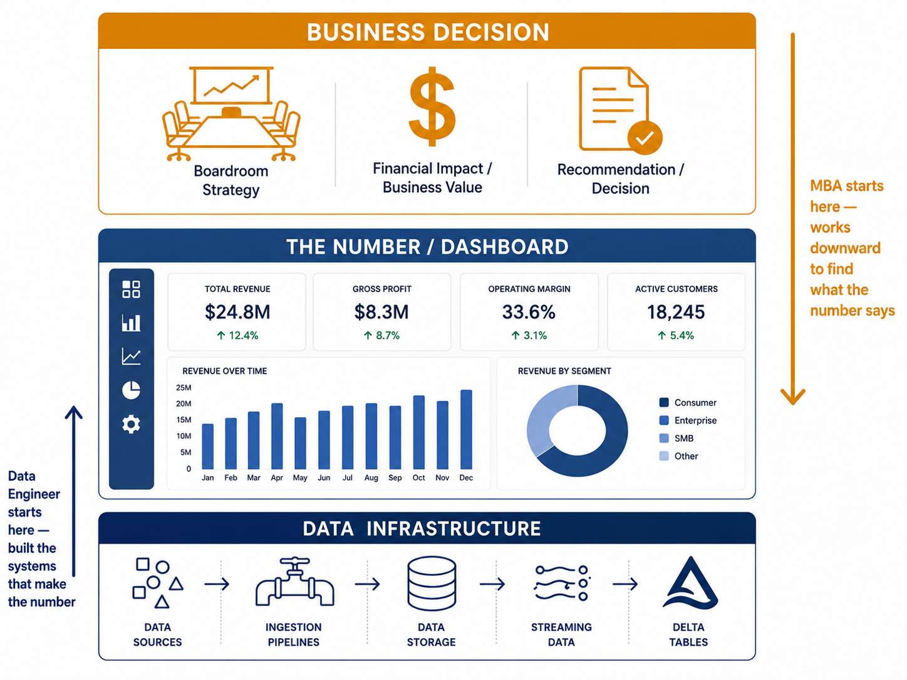
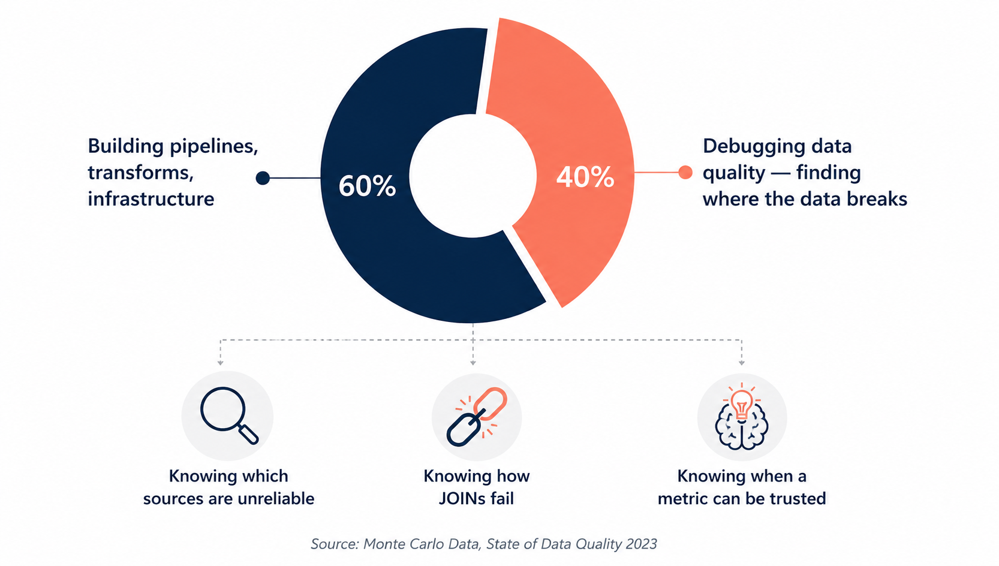
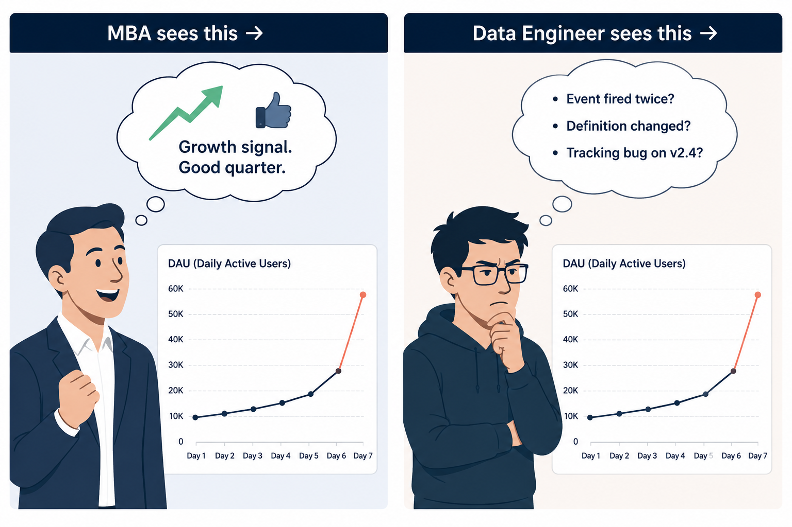
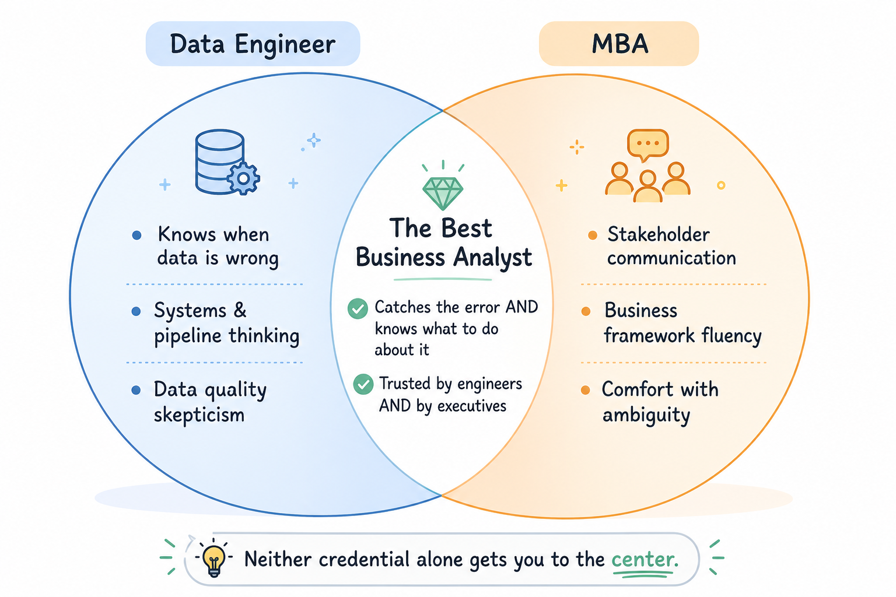
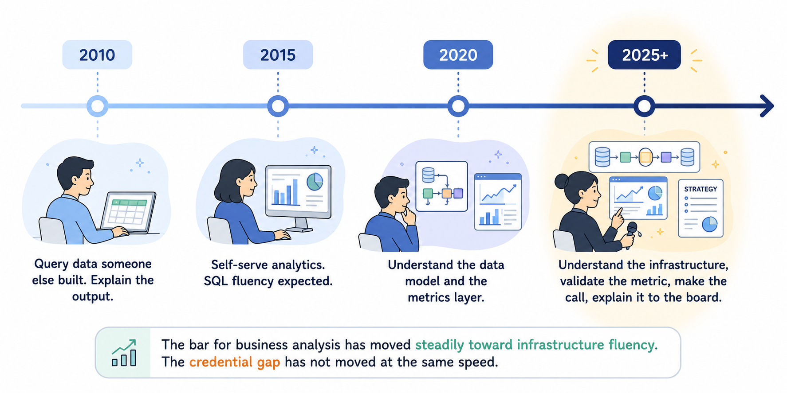

import Tabs from '@theme/Tabs';
import TabItem from '@theme/TabItem';

<!-- truncate -->

The VP of Marketing walked into the quarterly business review with a slide deck. Forty-three slides. The headline on slide 7 read: **"Customer acquisition cost down 18% QoQ."**

The data engineer sitting in the back of the room knew something was wrong before the slide finished loading.

Three weeks earlier, she had noticed a JOIN condition in the CAC calculation pipeline that was double-counting leads from the new referral program. She had filed a ticket. The ticket was still open. The number on that slide — the one the VP was presenting to the CEO, the one that would inform next quarter's $2M budget allocation — was wrong by a factor that would embarrass everyone in the room once someone finally ran the corrected query.

She raised her hand.

That moment, the data engineer who knows the data is wrong before the analyst finishes presenting it, is not an accident. It is the structural consequence of a difference in how MBAs and data engineers relate to business data. One group studies it. The other one builds the systems that produce it.

**What this post argues:**
- Why proximity to data systems is a more durable analytical advantage than business frameworks
- The five specific skills data engineers have that MBAs typically don't — and why each one matters for business analysis
- Where MBAs still have a genuine edge (and data engineers should stop pretending otherwise)
- What the best business analysts of the next decade will look like — and why neither camp gets there alone

This is going to step on some toes. That is intentional.

## First, a Fair Definition of Terms

Before making the argument, it is worth being precise about what is actually being compared.

**MBA** here means someone trained in the traditional business school tradition: frameworks for strategy (Porter's Five Forces, BCG Matrix), finance (DCF, unit economics), and organizational behavior. They are taught to analyze businesses from the outside, to take a set of numbers, apply a framework, and produce a recommendation.

**Data engineer** here means someone who designs, builds, and operates the systems that collect, transform, store, and serve data. They spend their days inside pipelines, schemas, and query plans in direct contact with how data is actually produced, not just how it eventually appears in a report.

**Business analyst** here means the role that sits between raw data and business decisions: translating what the data says into what the business should do.

The argument is not that MBAs are bad at analysis in general. It is that data engineers have a structural advantage specifically in the business analyst role, because that role increasingly depends on understanding the data infrastructure underneath the numbers — not just the numbers themselves.

## Reason #1: Data Engineers Know When the Number Is Wrong

This is the most important one, and it is the one that is hardest to teach.

Every metric in a business, be it revenue, churn, CAC, LTV, retention, is produced by a pipeline. That pipeline has JOIN conditions, aggregation logic, filter predicates, and data source assumptions baked into it. When the pipeline has a bug, or when upstream data quality degrades, or when the definition of a metric silently changes because someone modified a dbt model, the number in the dashboard changes too.

An MBA looking at that number sees: a trend. A data engineer who built or maintains that pipeline sees: the JOIN that changed last Tuesday, the source table that started receiving nulls on day 14 of last month, the filter that was added to "clean up outliers" that accidentally excluded an entire customer segment.

This is not a hypothetical. It happens constantly, in every organization that runs on data, at every scale. The question is not whether there are errors in your metrics, there are. The question is who in the room knows about them before the decision gets made.

:::note
A 2023 survey by Monte Carlo Data found that data engineers spend an average of **40% of their time** on data quality issues, finding them, diagnosing them, and fixing them. That is not a cost center. That is 40% of someone's professional life spent developing an intimate understanding of where and how business data breaks.
:::

The MBA in that quarterly business review learned Porter's Five Forces. The data engineer learned that the CAC pipeline double-counts referral leads. Both are forms of knowledge. Only one of them catches the error before the budget gets misallocated.

## Reason #2: They Understand the Difference Between What Data Says and What Data Means

Here is a question that sounds simple and is actually hard: **Is a spike in daily active users good news?**

The MBA answers: yes, obviously. Growth is good.

The data engineer asks three questions before answering anything:
1. Did the event tracking code change recently? (A new `screen_view` event being fired twice could double DAU artificially.)
2. Did the definition of "active" change in the metrics layer?
3. Is this spike uniform across platforms, or is it isolated to one app version that might have a tracking bug?

This is not paranoia. This is pattern recognition earned by having debugged dozens of "spikes" that turned out to be instrumentation errors, schema migrations, or upstream data source changes. Data engineers develop a strong prior that anomalies in data are more likely to be measurement errors than real business events because, in their experience, that is usually true.

Business analysis requires exactly this skepticism. The job is not to report what the number says. It is to assess whether the number is trustworthy, what it actually measures, and what legitimate conclusions can be drawn from it. Data engineers are trained for this by doing it wrong enough times that it becomes instinct.

**A real pattern, seen repeatedly across teams:**

| Scenario | MBA interpretation | Data engineer's first question |
|---|---|---|
| Revenue up 12% MoM | Strong growth signal | Did the billing pipeline change? |
| Churn down 3% | Retention improving | Was the churn definition updated? |
| Support tickets up 40% | Product quality issue | Did we change the ticket tagging logic? |
| Page load time improved | Engineering win | Is the new monitoring missing slow requests? |

The MBA is not wrong to interpret those signals. The data engineer is right to interrogate them first.

## Reason #3: They Think in Systems, Not Snapshots

MBA training is heavily oriented around snapshots: a financial model at a point in time, a competitive analysis as of this quarter, a market sizing exercise based on current data. The analytical unit is the report.

Data engineering is, fundamentally, about systems that produce data continuously over time. The analytical unit is the pipeline, a thing that runs repeatedly, handles changing inputs, breaks in specific ways under specific conditions, and accumulates state.

This shapes how you think about business problems in ways that matter.

When an MBA sees declining retention, they reach for a segmentation analysis: which cohort is churning, what do those users have in common, what intervention addresses the segment. This is useful analysis.

When a data engineer sees declining retention, they also ask: is the retention calculation correct, is it consistent across cohorts, are we measuring the same thing for users who signed up six months ago as for users who signed up last week, did the product change in a way that makes the old metric definition no longer comparable?

The MBA is doing cross-sectional analysis. The data engineer is doing longitudinal systems thinking — asking whether the measurement is stable across time, not just whether the trend is meaningful within one period.

This difference shows up in business analysis as the gap between finding a pattern and understanding whether the pattern is real.

:::info
**The classic example:** A SaaS company sees retention improving in their cohort analysis. The data engineer checks whether the cohort definition changed. It did — the team quietly started excluding users who never completed onboarding from the retention denominator. Retention "improved" because the measurement changed, not because users stopped churning. The MBA writes a memo about the success of the new onboarding flow. The data engineer spots the denominator change in a Git commit.
:::

## Reason #4: They Know What It Costs to Answer a Question

Here is something MBA programs do not teach: some business questions are expensive to answer, and the cost of answering them should factor into whether you ask them.

Data engineers know this instinctively. They have seen a well-meaning analyst write a query that full-scanned a 10TB table to answer a question that could have been answered with a 50MB aggregate. They have been paged at 2am because a dashboard query took down a production database. They have estimated the engineering cost of building the data infrastructure required to answer a question that turned out not to need answering.

This changes how you frame business analysis questions. When a data engineer considers a business question, they are simultaneously asking:
- 1. Is this data available, or does it need to be collected?
- 2. If collected, how clean is it, and what cleaning effort is required to use it?
- 3. What is the query cost of answering this at the granularity the question implies?
- 4. Is the question answerable at all with the data that exists, or is it being asked in a form that sounds precise but cannot be operationalized?

The last one is underrated. A lot of business questions, stated precisely, cannot be answered with existing data. "What is our true customer lifetime value?" sounds like a concrete question. A data engineer knows that answering it requires solving a customer identity resolution problem, a revenue attribution problem, and a survivorship bias problem before the math even starts and that the data to solve all three may not exist in a form that supports the precision implied by the question.

An MBA will build a DCF model around an LTV number. A data engineer will ask how the LTV was calculated and whether the denominator includes the customers who churned before their first purchase. These are not the same conversation.

## Reason #5: They Have Built Things That Failed in Production

There is a specific kind of knowledge that only comes from building systems that fail in production: the knowledge that the gap between how something is supposed to work and how it actually works is almost always larger than you expect.

Data engineers live in that gap. A pipeline that processes customer events correctly in staging fails in production when the API starts sending Unicode characters in a field that was always ASCII in the test environment. A join that works perfectly on last month's data produces duplicates on this month's data because an upstream system changed its primary key generation logic. A metric that was correct for two years becomes incorrect when the product introduces a new pricing tier that the original calculation logic never anticipated.

The cumulative effect of building, breaking, debugging, and fixing data systems is a deeply skeptical relationship with any number that comes out of a system you didn't build yourself. This skepticism is not cynicism. It is calibration.

Business analysis depends on calibrated skepticism about data. The analyst who trusts every number in the dashboard is going to make bad recommendations. The analyst who knows, from experience, that dashboards lie in specific ways and in predictable circumstances is going to ask the right questions before drawing conclusions.

MBAs are trained in analytical frameworks. Data engineers are trained, by production to distrust the inputs to those frameworks until proven otherwise. In business analysis, that is often the more valuable skill.

## Where MBAs Still Have the Edge (And Data Engineers Should Admit It)

This argument would be dishonest if it stopped here. MBAs have genuine advantages in business analysis that data engineers tend to lack, and those advantages are not trivial.

1. **Stakeholder communication.** The ability to take a complex finding and present it clearly to a non-technical audience, to a CFO, a board, a product team, is a skill that MBA programs drill explicitly and data engineering programs largely ignore. Data engineers frequently know the right answer and communicate it in a way that nobody acts on. That is an analytical failure, even if the analysis is technically correct.

2. **Business context and domain knowledge.** MBA training includes deliberate exposure to finance, operations, marketing, strategy, and organizational behavior. Data engineers often develop deep expertise in one or two functional areas, wherever their pipelines touch and shallow knowledge everywhere else. A data engineer who works on the payments pipeline knows a lot about transaction data and relatively little about go-to-market strategy. Business analysis requires breadth.

3. **Framework fluency.** Porter's Five Forces, the BCG matrix, unit economics, customer segmentation frameworks, these are not just jargon. They are shared vocabulary that allows business analysts to communicate efficiently with executives and cross-functional stakeholders. Data engineers who lack this vocabulary can be technically right and organizationally invisible.

4. **Comfort with ambiguity in the absence of data.** Sometimes there is no data for the decision that needs to be made. Sometimes the best analysis is qualitative, customer interviews, expert judgment, market intuition. MBA training includes frameworks for making decisions under genuine uncertainty. Data engineers can be paralyzed by the absence of clean data, waiting for a complete dataset before forming a view.

The honest summary: data engineers are better at knowing whether the data is trustworthy. MBAs are better at knowing what to do with it once trust is established. The best business analysts do both.

## What the Best Business Analysts of the Next Decade Will Look Like

The role of business analyst is changing faster than either MBA programs or data engineering teams are adjusting to.

Five years ago, business analysis meant querying data that someone else built and explaining what it showed. Today, it increasingly means understanding the systems that produce the data, the definitions embedded in the pipelines, the quality characteristics of each source, and the engineering cost of the insights that the business is asking for. The data infrastructure is no longer a background condition of business analysis. It is part of the analysis itself.

This shift favors data engineers. Not because MBAs cannot learn the technical side, they can, and many of the best analysts today have done exactly that, but because the default starting point of a data engineer (systems thinking, data skepticism, production-failure experience) is closer to where the role is going than the default starting point of an MBA (framework fluency, stakeholder communication, comfort with abstraction).

The analyst who will be most valuable in 2030 is probably not a data engineer who learned to give better presentations, though that person is useful. It is probably someone who started in data engineering, developed genuine business and communication fluency, and can operate at both layers simultaneously — who can tell you that the CAC number is wrong because of a JOIN condition and also tell you what to do about the marketing budget given the corrected number.

That person is rare. Both communities should be trying to produce more of them.

## The Practical Implication for Hiring Managers

If you are hiring business analysts and you are only looking at MBA credentials, you are filtering out a large population of candidates who have the specific skills that increasingly define excellent business analysis.

Some questions worth asking of any analyst candidate - MBA or data engineer:

- 1. "Walk me through a time when you questioned a metric that the business was relying on. What did you find?"
- 2. "How do you validate that a number in a dashboard is trustworthy before you use it in a recommendation?"
- 3. "Describe a business question you were asked that turned out to be unanswerable with existing data. What did you do?"
- 4. "How would you explain your most complex analysis to someone who has never seen the underlying data?"

The first three questions tend to favor data engineers. The fourth tends to favor MBAs. The best candidates handle all four.

## The Practical Implication for Data Engineers

If you are a data engineer who wants to move into business analysis, the technical credibility is already there. The gap is almost always on the communication and business context side.

Specifically:

**Learn to write for non-technical audiences.** Your analysis is only as valuable as the decision it informs. If the decision-maker cannot understand your analysis, it will not inform the decision regardless of how technically correct it is.

**Develop opinions about the business, not just the data.** Business analysts are paid to have views, not just to report numbers. Build the habit of ending every analysis with a recommendation, not just a finding.

**Learn enough finance to speak the language of decisions.** Unit economics, margin, payback period, ROI, these are not complicated concepts, but they are the vocabulary in which business decisions get made. Fluency costs a few weeks of deliberate study and pays dividends for a career.

**Stop waiting for perfect data.** The business will not wait. Learn to state your assumptions explicitly, quantify your uncertainty, and make a recommendation anyway. That is what business analysis actually looks like in practice.

## Key Takeaways

**Data engineers are closer to the truth of the data.** They know where it breaks, when to distrust it, and what the numbers actually measure. This is not a minor advantage in business analysis. It is the foundation the entire role sits on.

**MBA training optimizes for communication and framework fluency.** These are real skills that data engineers typically underinvest in. The ability to turn a correct analysis into a decision requires them.

**The distinction between "knowing the data is wrong" and "knowing what to do when it's right" maps almost exactly onto the skill gaps between these two communities.** The most valuable analysts close both gaps.

**Proximity to data systems is becoming a core business analysis competency.** As data infrastructure complexity grows, the analyst who does not understand the systems producing the data is increasingly at a disadvantage — not just technically, but analytically.

**The future belongs to neither camp exclusively.** It belongs to people who take the best of both: the systems thinking and data skepticism of the data engineer, and the communication fluency and business judgment of the MBA. Both communities should be building toward that combination, not defending their territory.

## Frequently Asked Questions

**Q: Isn't this just survivorship bias? You're describing the best data engineers, not the average one.**

Fair point. The average data engineer is not a strong business analyst, they may have all the technical instincts described above but communicate them poorly, lack business context, or have no interest in the strategy side. The argument is not that all data engineers are better business analysts. It is that the skills data engineering develops are more directly applicable to modern business analysis than MBA training is, when those skills are coupled with business communication ability.

**Q: Do MBAs actually lack technical data skills? Many MBA programs now teach analytics.**

MBA programs have added data analytics courses, and some graduates are technically capable. But there is a meaningful difference between coursework in SQL or Tableau and two years of debugging production pipelines. The experiential depth of a working data engineer, the calibration that comes from building systems that fail and fixing them, is not replicable by a semester of coursework.

**Q: Isn't the real answer just to hire both and have them work together?**

Yes, and many strong organizations do exactly this. But the question is about individual capability in the business analyst role, not team composition. The argument is that a single data engineer with communication skills is often more effective in that role than a single MBA without data infrastructure fluency because the errors that compound silently in business analysis tend to live in the data layer, not the framework layer.

**Q: What about domain-specific industries like finance or healthcare where the MBA's domain knowledge is critical?**

Domain knowledge matters enormously, and in highly specialized industries, the MBA's domain fluency may outweigh the data engineer's infrastructure intuition. The argument applies most cleanly to tech and data-intensive consumer businesses, where the data infrastructure is the business in a meaningful sense and errors in data systems directly translate into errors in business decisions.

## References and Further Reading

- [Monte Carlo Data — State of Data Quality 2023](https://www.montecarlodata.com/state-of-data-quality/)
- [RecodeHive — Medallion Architecture Explained](https://www.recodehive.com/blog/medallion-architecture)
- [RecodeHive — Hidden Cost of Streaming Pipelines](https://www.recodehive.com/blog/batch-vs-stream-processing)
- [Gartner — Data Quality Market Guide 2024](https://www.gartner.com/en/documents/6648734)
- [dbt Labs — The Analytics Engineering Handbook](https://www.getdbt.com/analytics-engineering/transformation/)

## About the Author

**Aditya Singh Rathore** is a Data Engineer focused on building modern, scalable data platforms on Azure. He writes about data engineering, cloud architecture, and real-world pipelines on [RecodeHive](https://www.recodehive.com/), turning hard-won production lessons into content anyone can apply.

🔗 [LinkedIn](https://www.linkedin.com/in/aditya-singh-rathore0017/) | [GitHub](https://github.com/Adez017)

📩 Data engineer who made the move into business analysis? MBA who learned the data engineering side? Drop your story in the comments, the best takes on this come from people who've lived both sides.

<GiscusComments/>