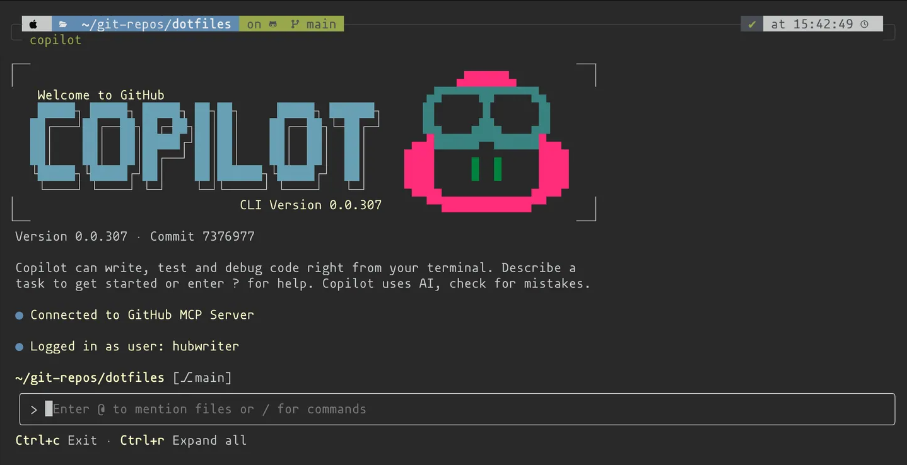
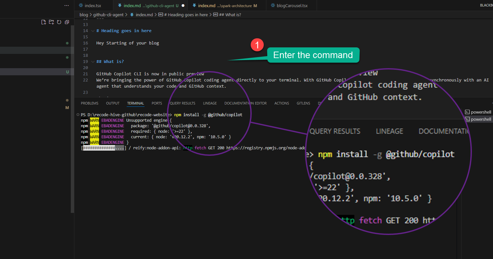
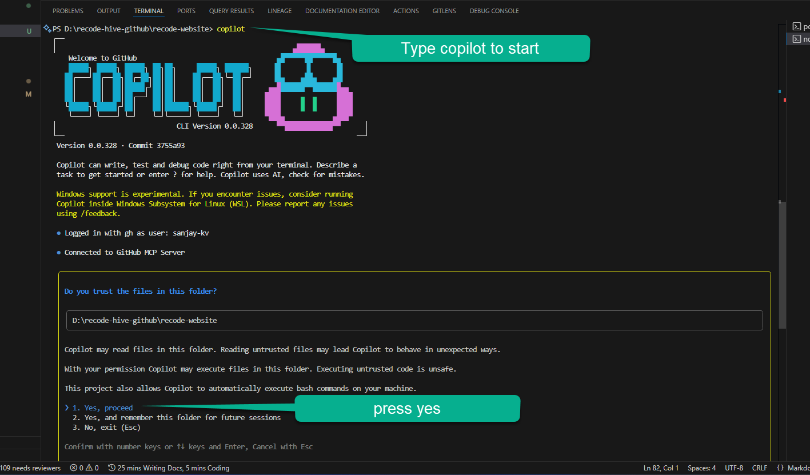
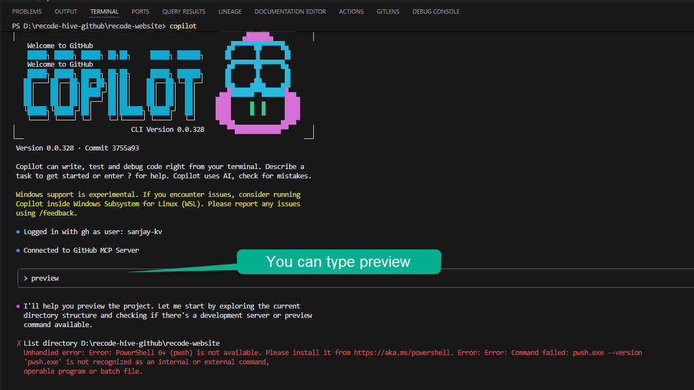

 <!-- truncate -->

GitHub Copilot CLI is now in public preview
GitHub bought power of GitHub Copilot coding agent directly to your terminal, with GitHub Copilot CLI, you can work locally and synchronously with an AI agent that understands your code and GitHub context in depth.

---

## 📖 Overview

GitHub Copilot CLI is now in `public preview`, and it’s designed to bring AI-powered development right to your command line. You can work locally and synchronously with an AI agent that understands your code and GitHub context no IDE switching required.




✨**Key features:**

- ✅**Terminal-native dev** – Use the Copilot coding agent directly in your terminal.
- ✅**GitHub integration** – Work with repositories, issues, and pull requests using llm.
- ✅**Agentic capabilities** – Build, edit, debug, and refactor code with AI.
- ✅**MCP-powered extensibility** – Extend with `custom MCP servers`.
- ✅**Full control** – Every action requires your explicit approval.

Plus, extend Copilot CLI's capabilities and context through **custom MCP servers**.


---

## 📦 Getting Started

### Supported Platforms

- ✅Linux
- ✅macOS
- ✅Windows (experimental)

### Prerequisites

- ⚙️Node.js **v22+**
- ⚙️npm **v10+**
- ⚙️PowerShell **v6+** (Windows only)
- ⚙️Active GitHub Copilot subscription (Pro, Pro+, Business, or Enterprise)


You can install the latest version of the powershell using this command and check the version as mentioned above it should be more than V6.
```
winget install Microsoft.PowerShell
```

```
pwsh --version
```

*If you have access to GitHub Copilot via your organization of enterprise, you cannot use GitHub Copilot CLI if your organization owner or enterprise administrator has disabled it in the organization or enterprise settings. See Managing policies and features for GitHub Copilot in your organization for more information.*

---

## 💽 Installation

Install globally with npm:
Powered by the same agentic harness as GitHub's Copilot coding agent, it provides intelligent assistance while staying deeply integrated with your GitHub workflow.
Enter the promt in the command line. 

```bash
npm install -g @github/copilot
```




Verify installation: the below command will run the banner start image of GitHub Copilot.

```bash
copilot --banner
```

Authenticate with your GitHub account:

```bash
/login
```

Or authenticate using a **Personal Access Token (PAT):**

```bash
# Linux/macOS
export GH_TOKEN=your_token_here  

# Windows
setx GH_TOKEN your_token_here
```

---

## 🖥️ Usage
Once you installed run copilot on your terminal, Image of the splash screen for the Copilot CLI. The usage is pretty straight forward you can use the arrow keys to navigate to proceed cancel instruction etc.



Launch Copilot CLI in a project folder:

```bash
copilot
```

By default, it runs **Claude Sonnet 4**. To switch to **GPT-5**:

```bash
# Linux/macOS
COPILOT_MODEL=gpt-5 copilot

# Windows
set COPILOT_MODEL=gpt-5
```

## Version checking and Exit CLI
```bash
gh copilot --version
```

Exit anytime with:

```
Ctrl + C (twice)
```

## Get Suggestions for Common Dev Tasks

Now lets get start with development, here fork this repo and activate GitHub CLI and enter the below bash commands. [Website](https://github.com/recodehive/recode-website)

### Development

```bash
gh copilot suggest "start development server for docusaurus"
gh copilot suggest "build docusaurus site for production"
gh copilot suggest "deploy docusaurus site"
```


### Package Management

```bash
gh copilot suggest "install new dependencies for react project"
gh copilot suggest "update docusaurus to latest version"
```

### Git Workflow

```bash
gh copilot suggest "create feature branch for new blog post"
gh copilot suggest "commit changes to blog content"
gh copilot suggest "create pull request for documentation updates"
```

### Repository Maintenance

```bash
gh copilot suggest "check repository status and pending changes"
gh copilot suggest "merge feature branch after review"
```

### Documentation

```bash
gh copilot suggest "create new documentation page in docusaurus"
gh copilot suggest "organize documentation with sidebars"
gh copilot suggest "create code of conduct for repository"
```

### Testing & Quality

```bash
gh copilot suggest "run linting checks on typescript files"
gh copilot suggest "fix build errors in docusaurus"
```

---

## 🔗 Resources

* [Official Documentation](https://docs.github.com/en/copilot/how-tos/use-copilot-agents/use-copilot-cli)
* [Copilot CLI GitHub Repository](https://github.com/github/copilot-cli)
* [Copilot Features](https://github.com/features/copilot/cli)

---

## ✅ Final Verdict

*GitHub Copilot CLI is the next step in developer productivity bringing AI assistance natively to your terminal. With support for repositories, workflows, testing, and documentation, it simplifies development without taking control away from you.*

Less setup, more shipping.

---

<GiscusComments/>