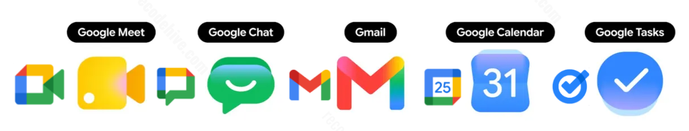
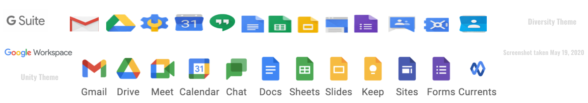
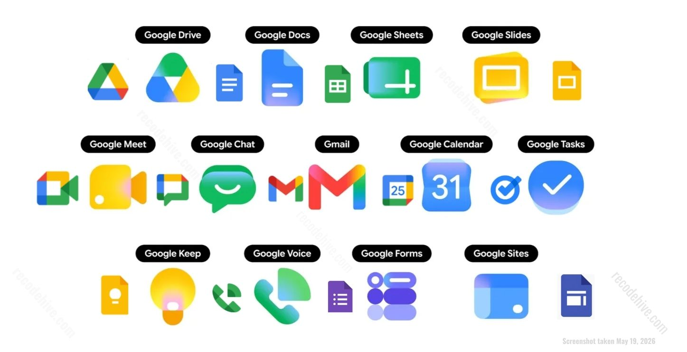
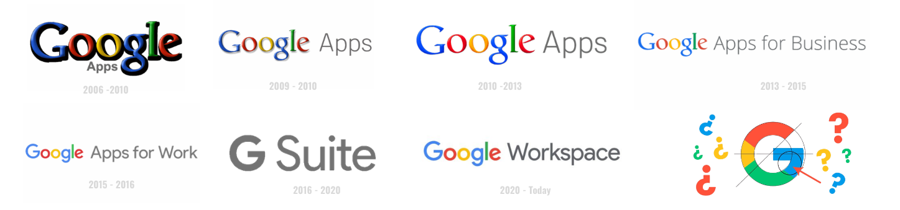
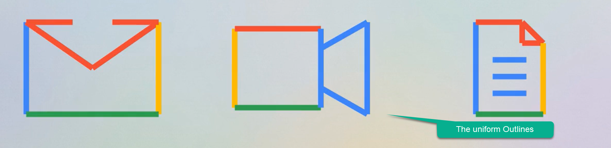
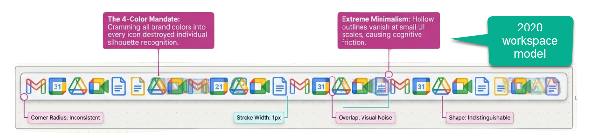
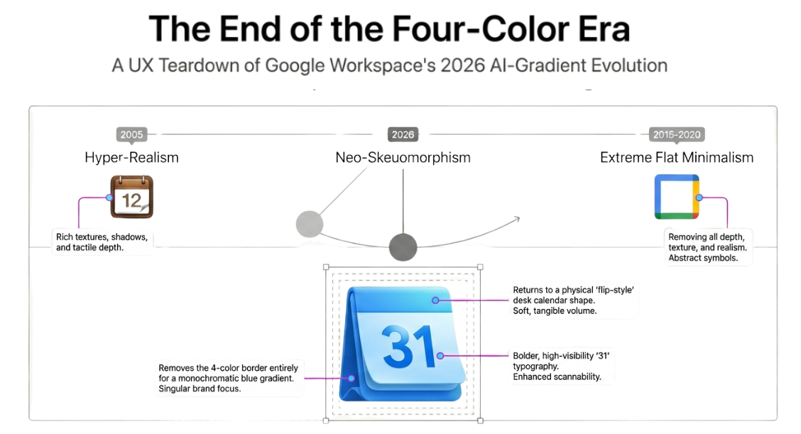
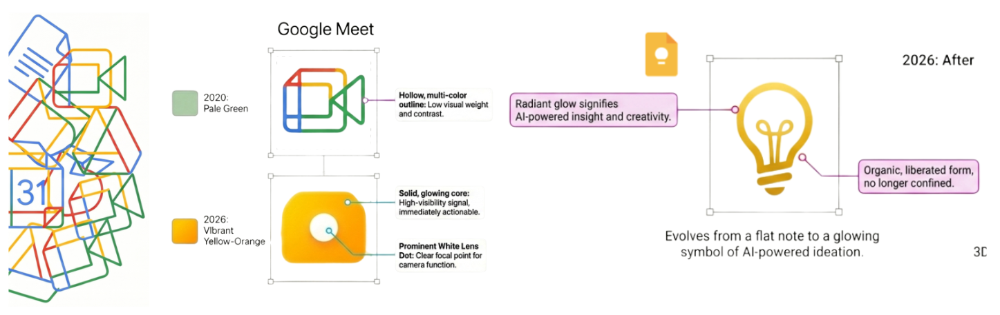
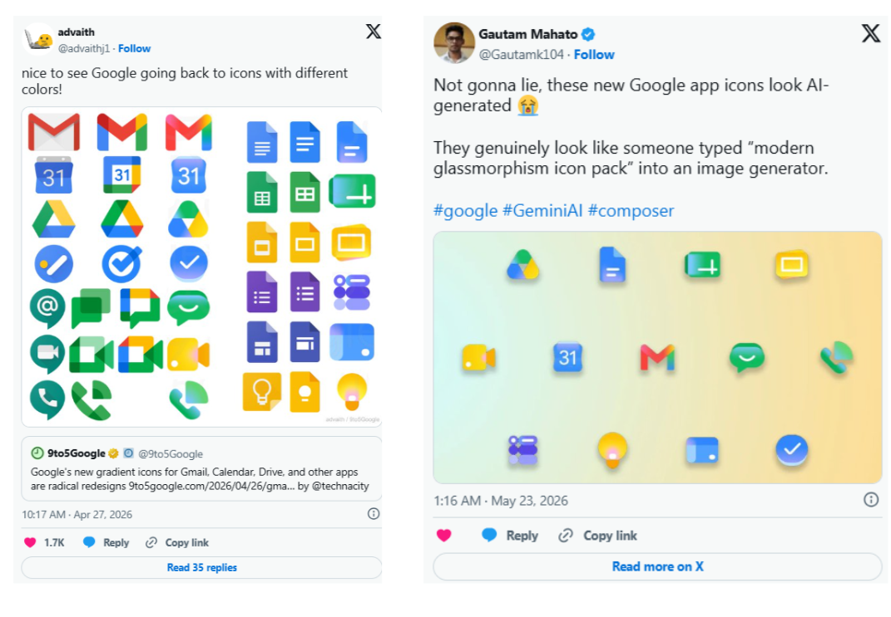
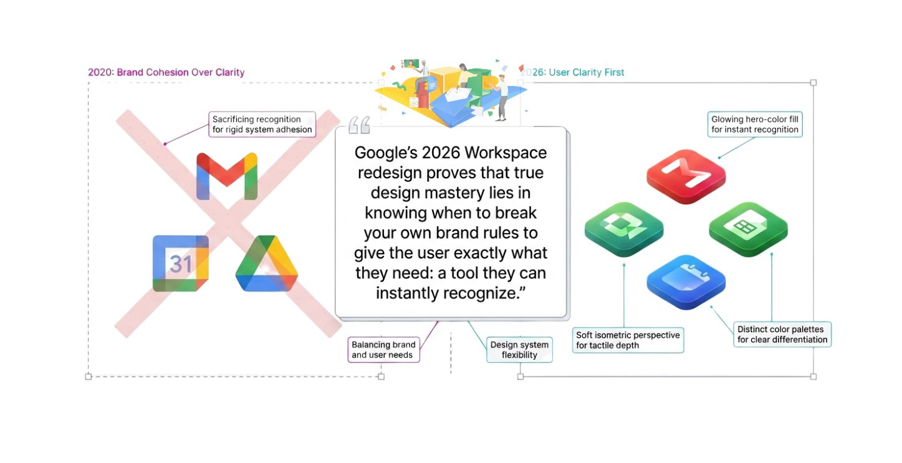

---
title: "Google Changed Workspace Icon after 6 years"
authors: [sanjay-kv]
sidebar_label: "Google Changed Workspace Icon after 6 years"
tags: [google, icons, workspace, UI, UX, UI-update, 2026, google-apps, cognitive]
date: 2026-05-21

description: Google Changed Workspace Icon after 6 years, What Changed, What Did Not, and Why It Took Six Years

draft: false
canonical_url: https://www.recodehive.com/blog/google-icon-update

meta:
  - name: "robots"
    content: "index, follow"
  - property: "og:title"
    content: "Google Changed Workspace Icon after 6 years"
  - property: "og:description"
    content: "Google Just Changed Every Workspace Icon: What Actually Changed and Why It Took Six Years."
  - property: "og:type"
    content: "article"
  - property: "og:url"
    content: "https://www.recodehive.com/blog/google-icon-update"
  - property: "og:image"
    content: "./assets/cover-google-icon.jpg"
  - name: "twitter:card"
    content: "summary_large_image"
  - name: "twitter:title"
    content: "Google Just Changed Every Workspace Icon: What Actually Changed and Why It Took Six Years"
  - name: "twitter:description"
    content: "Google Changed Workspace Icon after 6 years"
  - name: "twitter:image"
    content: "./assets/cover-google-icon.jpg"
---

import Tabs from '@theme/Tabs';
import TabItem from '@theme/TabItem';
import ZoomImage from '@site/src/components/ZoomImage';
import imgGsuite from './assets/03-google-old-gsuite-logo.png';

<!-- truncate -->

Last week I clicked Google Meet when I meant to click Google Calendar.

Have you experienced the simillar issue? let's decode the new icon Changes from Google. Rather than judging the new icons and feeling hesistant to new changes, Let's look at the old icons and the problems. When you stare at a grid of identical shapes outlined in the exact same colors, your brain hits a speed bump. 

:::info
It's a phenomenon called cognitive friction. You have to stop searching for a recognizable silhouette and start reading the tiny text underneath.
:::

   <BrowserWindow url="https://github.com/recodehive/recode-website/issues" bodyStyle={{padding: 0}}>    
    
    </BrowserWindow>

**So From when the issue started happening?**
This specific daily annoyance traces back to 2020, when Google retired G Suite and rolled out Google Workspace. They erased the unique shapes of their most popular apps and replaced them with uniform outlines. 

So lets look at Gsuite Icons. 👇🏻
   <BrowserWindow url="https://github.com/recodehive/recode-website/issues" bodyStyle={{padding: 0}}>    
    
    </BrowserWindow>

    **The problem**
It has been happening for five years. The four icons sit in my browser tab bar looking almost identical: same four colors, same flat shapes, same overall vibe. My brain processes them as one visual blob rather than four separate apps. I once spent 30 seconds in a Google Meet waiting room before realizing I had joined my own meeting instead of opening my calendar to check the time.

 **The Solution** If that sounds familiar, Google finally heard you. And me. And apparently everyone who has ever stared at a browser tab bar wondering which shade of blue-red-yellow-green meant Calendar versus Drive.
  <BrowserWindow url="https://github.com/recodehive/recode-website/issues" bodyStyle={{padding: 0}}>    
    
    </BrowserWindow>

This week, Google started rolling out a complete redesign of its Workspace app icons across Gmail, Drive, Docs, Sheets, Slides, Calendar, Meet, Chat, Forms, Keep, Voice, and Tasks. The rollout is live right now in the web app launcher and Chrome's New Tab page. Here is what actually changed, why it took this long, and whether the new design actually solves the problem..

---

## The Problem That Started in 2020

To understand why this redesign matters, you have to go back to October 2020 when Google rebranded G Suite to Google Workspace.

At the time, the rebrand looked clean on paper. Google unified its entire app suite under one design language: every icon would use all four company colors, blue, red, yellow, and green, in the same flat style. The thinking was brand consistency. The result was visual chaos.

 

Within hours of the 2020 announcement, the internet responded with a very specific complaint: all the icons now look the same. The new Gmail icon was the most mocked. The classic envelope with a red M that everyone recognized was replaced with a four-color M that looked like a child's art project. People struggled to tell Calendar from Drive, Drive from Docs, and Meet from everything else at a glance.
  <BrowserWindow url="https://github.com/recodehive/recode-website/issues" bodyStyle={{padding: 0}}>    
    
    </BrowserWindow>

The complaint was not just aesthetic. It was functional. When apps share the same four colors and similar shapes, your brain cannot build distinct visual shortcuts for each one. You have to read the icon rather than recognize it. That adds cognitive friction dozens of times a day. Multiply that across 3 billion Google Workspace users (Source: [Google Workspace](https://workspace.google.com/howitsdone/)) and the accumulated frustration becomes significant.

  <BrowserWindow url="https://github.com/recodehive/recode-website/issues" bodyStyle={{padding: 0}}>    
    
    </BrowserWindow>

 **Thought process behind Google**? In 2020
millions of employees were suddenly forced out of physical offices and onto their laptops at kitchen tables. Google needed to convince these remote teams that separate productivity tools like Docs, Sheets, and Meet were actually one single, highly integrated cloud ecosystem.

---

## Why Google Is Doing This Now

Two reasons. One practical, one strategic.

The practical reason is simple: they finally ran out of excuses not to fix it. The 2020 design was criticized immediately and consistently for five years. Every redesign rumor that surfaced got user hopes up. Fixing the icon confusion was low-hanging fruit with a clear user benefit and Google had no strong argument for keeping the broken version.

The strategic reason is more interesting. Google did not apply the gradient design language to all products simultaneously. The rollout followed a deliberate sequence: the Google G logo, Gemini, Google Photos, and Google Maps received gradient treatment before Workspace did. According to 9to5Google, this visual shift was intentional — the gradient effect was specifically chosen to reflect the presence of AI-powered features across those products ([9to5Google, April 2026](https://9to5google.com)).

What this sequencing reveals is a positioning strategy, not just a design refresh. By first applying the gradient language to AI-forward products like Gemini and then extending it to Workspace, Google is visually signaling that its productivity suite belongs in the same category as its AI tools. The design change functions as a branding bridge — connecting everyday work apps to the AI narrative Google is building around Google I/O 2026. The icons are doing marketing work, not just usability work.
  <BrowserWindow url="https://github.com/recodehive/recode-website/issues" bodyStyle={{padding: 0}}>    
    
    </BrowserWindow>

Google I/O 2026 is happening this week. The timing of this rollout is not accidental. Google is walking into its biggest annual developer event with a refreshed product suite that looks modern, AI-adjacent, and ready for the next phase of Workspace. The icon redesign is as much a marketing signal as a usability fix.

---

## What Changed in 2026

The new icons do one thing that the 2020 redesign refused to do: they let each app look different from the others.

The strict four-color rule is gone. Instead of forcing every icon to carry all four brand colors, the new design gives each app its own dominant color identity with gradients replacing the flat hard-edged color blocks.

Looking at the new icons directly, here is what stands out:
  <BrowserWindow url="https://github.com/recodehive/recode-website/issues" bodyStyle={{padding: 0}}>    
    
    </BrowserWindow>

The icons are also physically larger in the launcher. Google removed the Workspace page container that previously boxed each icon in, giving more visual real estate to the icon shapes themselves.

---

## What the Internet Actually Thinks

Reactions are split, which is predictable and honestly fair.

The people who are happy are mostly the ones who experienced the confusion problem most acutely. People who live in browser tabs with ten Google services pinned simultaneously. People whose phone home screens are a wall of identical four-color squares. For this group, the new icons are a long-overdue fix and the response is straightforward relief.
Looking at the new icons directly, here is what stands out:

  <BrowserWindow url="https://x.com/Gautamk104/status/2057843133392842780?ref_src=twsrc%5Etfw%7Ctwcamp%5Etweetembed%7Ctwterm%5E2057843133392842780%7Ctwgr%5E3dbaf20e8e4f9f64fd6032e85f7ed7c1e1b5fe0f%7Ctwcon%5Es1_c10&ref_url=https%3A%2F%2Fpublish.twitter.com%2F%3Furl%3Dhttps%3A%2F%2Ftwitter.com%2FGautamk104%2Fstatus%2F2057843133392842780" bodyStyle={{padding: 0}}>    
     
    </BrowserWindow>

My honest take: some of the new icons are significantly better, Drive and Calendar especially. A few are sideways moves rather than improvements. Gmail's gradient version is fine but the 2020 version was not actually the confusing one, the envelope shape was always distinctive enough. The icons that most needed differentiation got it. The ones that were already recognizable got gradients they did not necessarily need.

---

## Does It Actually Solve the Problem?

 **Yes. Partially.** 

The core complaint for five years was that all the icons look the same. That complaint is addressed. Calendar is now blue. Drive is now gradient-triangle. Gmail is now warm red-pink. Each app has a visual identity that survives a glance rather than requiring a read.

What is not addressed is the deeper question of whether icon design is even the right layer to solve the problem at. The real confusion in a modern Google workflow is not which icon to click. It is which Google product to use for which task. Should this document live in Drive or Sites? Should this conversation happen in Chat or Gmail? Should this meeting be in Meet or Calendar notes?
  <BrowserWindow url="https://github.com/recodehive/recode-website/issues" bodyStyle={{padding: 0}}>    
    
    </BrowserWindow>

Icon legibility is a surface-level fix for a suite that has genuine overlap and redundancy problems underneath. The new icons will help you click the right app faster. They will not help you decide which app you actually need.

That is a bigger problem. One that gradients cannot solve.

---

## The Bigger Picture

Google changing its icons is a small thing in isolation. But it is interesting as a signal.

Companies only fix long-standing UX complaints when something else is changing around them. The gradient design language, the AI product push, Google I/O timing, the Workspace positioning against Microsoft 365 and Microsoft Copilot. The icon redesign is a small piece of a larger repositioning story that Google is telling right now.

Whether the new icons are beautiful or not matters less than whether they work. And by the only measure that actually counts, distinguishing one app from another in half a second,  **the 2026 redesign works better than the 2020 one did.**

<GiscusComments/>