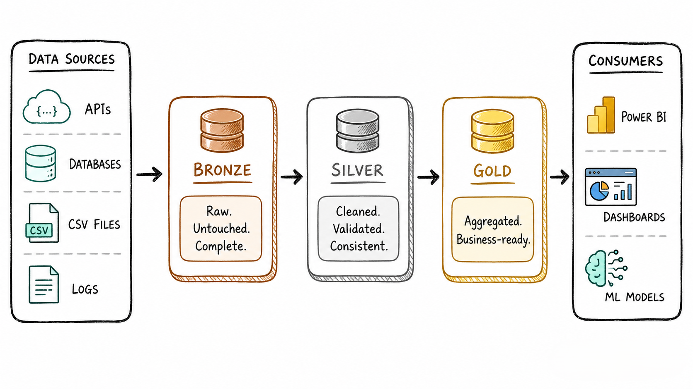
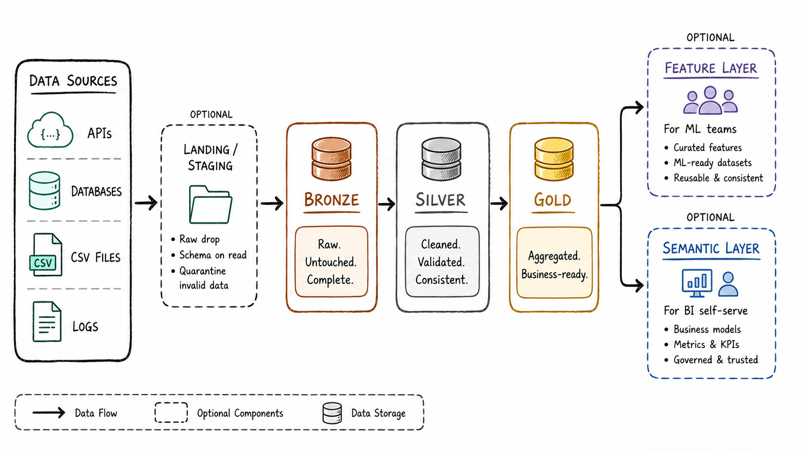

<!-- truncate -->

# Medallion Architecture: How to Stop Your Data Pipeline from Becoming a Nightmare

It was a Tuesday afternoon when our analytics lead sent a message that made my stomach drop.

*"The revenue numbers in the dashboard don't match what finance is reporting. We're off by $180,000. Can you check the pipeline?"*

I spent the next four hours tracing data through a tangled mess of transformations, none of them documented, some running directly on raw API responses, others written six months ago by someone who had since left the team. By the time I found the issue (a deduplication step that had silently stopped working after a schema change upstream), the damage was done. Three teams had been working off wrong numbers for two weeks.

That incident is what introduced me to **Medallion Architecture**.

Not as a concept from a blog post. As a solution to a real, expensive, embarrassing problem that could have been caught immediately if we'd had any structure in how data moved through our pipeline.


## So, What Is It?

Think of Medallion Architecture like a water filtration system.

Water from a river (your raw data) goes through multiple stages of filtering before it's safe to drink (your final reports). You wouldn't drink straight from the river — and you shouldn't build reports directly on raw, unvalidated data either.

The architecture divides your data journey into three layers:

> **Bronze → Silver → Gold**

Each layer has one job. Each layer makes the data a little more trustworthy. By the time data reaches the end, it's reliable, consistent, and ready to power real business decisions.




## 🥉 Bronze: The "Keep Everything" Layer

Bronze is where data arrives, exactly as it came from the source. No cleaning, no filtering, no judgment.

APIs, databases, logs, CSV exports, it all lands here, untouched.

After the revenue incident, the first thing we did was create a Bronze layer in ADLS Gen2, a dedicated folder where every raw API response landed as-is, timestamped, and never overwritten.

**Why not clean it immediately?**

Because you *will* make mistakes in your pipeline. And when you do, you need to be able to go back to the original data and start over, without re-calling the API, without re-pulling from a source that may have already changed.

Bronze is your safety net. It's immutable, append-only, and complete.

> **Think of it as your data's long-term memory**, messy, raw, but irreplaceable.

### What Bronze looks like in practice

```
adls-gen2/
  └── bronze/
        └── sales/
              └── 2024/
                    ├── 01/raw_orders_20240115.parquet
                    ├── 02/raw_orders_20240201.parquet
                    └── 03/raw_orders_20240305.parquet
```

Files land here partitioned by date. Nothing is modified after landing. If the pipeline fails three steps later, you don't re-ingest, you reprocess from Bronze.

### Key rules for Bronze

- **Append only**: never overwrite or delete records
- **No transformation**: store exactly what the source sent, including bad records
- **Schema as-received**: don't enforce structure here, even if the source changes its format
- **Partition by ingestion date**: makes reprocessing specific time ranges simple


## 🥈 Silver: Where the Real Work Happens

This is where data engineering gets interesting and where most of the actual work lives.

In the Silver layer, you take everything from Bronze and make it usable:

- **Deduplicate** - remove duplicate records from retry logic or overlapping ingestion windows
- **Standardize** - dates in ISO format, currencies in base units, strings trimmed and consistent
- **Validate** - flag or quarantine records that fail business rules (negative prices, missing required fields)
- **Enforce schema** - write Delta tables with defined column types and constraints
- **Enrich** - join raw records with reference data (product names, region codes, customer tiers)

Most of the heavy lifting in a data pipeline lives here. It's not glamorous work but it's what separates trustworthy analytics from chaos.

> **Think of it as the editorial desk**, messy raw material goes in, clean, consistent content comes out.

### What Silver looks like in practice

Here's a simple PySpark transformation from Bronze to Silver:
- [Reference code](https://oneuptime.com/blog/post/2026-02-17-how-to-build-a-data-lakehouse-architecture-on-gcp-using-cloud-storage-dataproc-and-bigquery/view)

```python
from pyspark.sql import SparkSession
from pyspark.sql.functions import col, to_date, lower, trim, when

spark = SparkSession.builder.appName("BronzeToSilver").getOrCreate()

# Read from Bronze
bronze_df = spark.read.format("parquet").load(
    "abfss://data@mylake.dfs.core.windows.net/bronze/sales/2024/"
)

# Clean and validate
silver_df = (
    bronze_df
    .dropDuplicates(["order_id"])                              # deduplicate
    .withColumn("order_date", to_date(col("order_date"), "yyyy-MM-dd"))
    .withColumn("region", lower(trim(col("region"))))          # standardize
    .withColumn("product", lower(trim(col("product"))))
    .withColumn(
        "is_valid",
        when(col("amount") > 0, True).otherwise(False)        # validate
    )
    .filter(col("order_id").isNotNull())                       # remove nulls
)

# Write to Silver as Delta table
(
    silver_df.write
    .format("delta")
    .mode("overwrite")
    .option("overwriteSchema", "true")
    .save("abfss://data@mylake.dfs.core.windows.net/silver/sales/")
)

print(f"Silver layer written: {silver_df.count()} records")
```

The deduplication step alone would have prevented our $180,000 revenue discrepancy. The raw Bronze data had duplicate order records from a retry bug in the API client. Silver catches them. Gold never sees them.

One big win beyond fixing bugs: multiple teams can now pull from the *same* Silver datasets instead of each building their own version of the truth. That alone eliminates an enormous amount of duplicate work and conflicting numbers.

### What Silver looks like in storage

```
adls-gen2/
  └── silver/
        └── sales/
              ├── _delta_log/     ← Delta Lake transaction log
              ├── part-00000.parquet
              └── part-00001.parquet
```

Unlike Bronze (raw files), Silver is a proper **Delta table** with ACID guarantees, time travel, and schema enforcement.


## 🥇 Gold: Built for Business, Not Engineers

Gold is what your stakeholders actually see.

This layer takes clean Silver data and shapes it for specific use cases, sales dashboards, executive reports, product metrics. It's aggregated, optimized, and structured for fast queries.

You're not building for flexibility here. You're building for **clarity**.

> **Think of it as the finished product on the shelf**, packaged, polished, and ready to use.

### What Gold looks like in practice

```python
from pyspark.sql.functions import sum, count, avg, col

# Read from Silver
silver_df = spark.read.format("delta").load(
    "abfss://data@mylake.dfs.core.windows.net/silver/sales/"
)

# Build Gold: monthly revenue by region
gold_df = (
    silver_df
    .filter(col("is_valid") == True)
    .groupBy("region", "order_date")
    .agg(
        count("order_id").alias("total_orders"),
        sum("amount").alias("total_revenue"),
        avg("amount").alias("avg_order_value")
    )
    .orderBy("order_date", "region")
)

# Write to Gold
(
    gold_df.write
    .format("delta")
    .mode("overwrite")
    .save("abfss://data@mylake.dfs.core.windows.net/gold/revenue_by_region/")
)
```

The Gold table is what Power BI connects to. Pre-aggregated, fast, shaped exactly for the business question it answers.

### What Gold looks like in storage

```
adls-gen2/
  └── gold/
        ├── revenue_by_region/      ← one table per business use case
        ├── customer_summary/
        └── product_performance/
```

Notice: Gold is not one big table. Each Gold table answers one specific business question.


## Why This Actually Matters

Here's what Medallion Architecture would have changed about our Tuesday afternoon incident:

| Problem we had | Without Medallion | With Medallion |
|---|---|---|
| Duplicate orders from API retry bug | Silently corrupted revenue reports | Caught and removed in Silver |
| Couldn't find where numbers went wrong | Four hours of undocumented rabbit holes | Isolated to exactly one layer |
| Re-ingesting data after the fix | Re-called the API (data had since changed) | Replayed from Bronze (data preserved) |
| Finance and analytics had different numbers | Both teams built their own transforms | Both teams use the same Silver table |
| Schema changed upstream, broke pipeline | Broke everything simultaneously | Bronze absorbed it, Silver flagged it |

The pattern isn't just about organization, it's about **trust**. When your team knows exactly where data came from and how it was transformed at each step, confidence in analytics goes up. Decisions improve. Four-hour debugging sessions stop happening.


## It's Not Always Perfect

Let's be honest: Medallion Architecture does add complexity.

More layers = more storage, more pipelines, more things to maintain. For a small team doing simple reporting, it might genuinely be overkill.

**It's a great fit when:**
- You have multiple data sources with varying quality
- Multiple teams consume the same data
- Data quality is non-negotiable
- Pipelines need to be recoverable and replayable
- You need to audit exactly where a number came from

**It's probably overkill when:**
- You have one small, clean dataset
- It's a one-time analysis
- You're just building a proof of concept


## Beyond the Three Layers

In practice, teams often extend the model:

- **Landing / Staging layer** — temporary storage before Bronze, used when data needs to be decrypted, unzipped, or format-converted before it can be stored
- **Feature layer** — prepared datasets for ML model training, maintained by data science teams on top of Silver
- **Semantic layer** — business-friendly models sitting between Gold and end users for self-serve BI



The three-tier model is a starting point, not a ceiling. The right number of layers is whatever your team actually needs.


## The Full Folder Structure

Here's what a complete Medallion Architecture implementation looks like in ADLS Gen2:

```text
adls-gen2/
  └── data/
        ├── bronze/
        │     ├── sales/2024/01/raw_orders_20240115.parquet
        │     └── customers/2024/01/raw_customers_20240115.json
        │
        ├── silver/
        │     ├── sales/
        │     │     ├── _delta_log/
        │     │     └── part-00000.parquet
        │     └── customers/
        │           ├── _delta_log/
        │           └── part-00000.parquet
        │
        └── gold/
              ├── revenue_by_region/
              ├── customer_summary/
              └── product_performance/
```

This is the exact structure we adopted after the revenue incident. Bronze preserved everything. Silver caught the duplicates. Gold gave the business team numbers they could trust.


## The Key Lessons

**1. Raw data and report data should never live in the same layer.** The moment raw data flows directly into a dashboard, you've lost the ability to catch errors before they reach stakeholders.

**2. Bronze is not a dumping ground, it's a source of truth.** Its value is that it's complete and immutable. The messiness is the point.

**3. Most data engineering work happens in Silver.** Deduplication, validation, standardization this is where pipeline quality is actually built.

**4. Gold tables are specific, not flexible.** One table per business use case. Pre-aggregated, fast, and shaped exactly for the question it answers.

**5. When something breaks, you replay from Bronze.** You never re-ingest from source. Bronze is your checkpoint.


## References & Further Reading

- [Databricks - Medallion Architecture](https://www.databricks.com/glossary/medallion-architecture)
- [Microsoft Learn - Medallion Lakehouse Architecture](https://learn.microsoft.com/en-us/azure/databricks/lakehouse/medallion)
- [Delta Lake - What is Delta Lake?](https://docs.delta.io/)
- [RecodeHive - Lakehouse vs Data Warehouse](https://www.recodehive.com/blog/lakehouse-vs-warehouse)
- [RecodeHive - Microsoft Fabric: One Platform, One Lake](https://www.recodehive.com/blog/microsoft-fabric-explained)
- [RecodeHive - Azure Storage & ADLS Gen2](https://www.recodehive.com/blog/azure-storage-options)
- [OneUptime - Build a Data Lakehouse on GCP](https://oneuptime.com/blog/post/2026-02-17-how-to-build-a-data-lakehouse-architecture-on-gcp-using-cloud-storage-dataproc-and-bigquery/view)

## About the Author

I'm **Aditya Singh Rathore**, a Data Engineer passionate about building modern, scalable data platforms. I write about data engineering, Azure, and real-world pipeline design on [RecodeHive](https://www.recodehive.com/) — turning hard-won lessons into content anyone can learn from.

🔗 [LinkedIn](https://www.linkedin.com/in/aditya-singh-rathore0017/) | [GitHub](https://github.com/Adez017)

📩 Had a similar pipeline disaster? Drop it in the comments I'd love to hear how you solved it.

<GiscusComments/>
