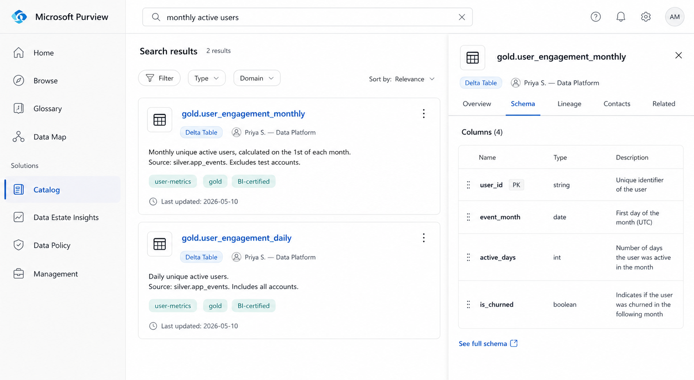
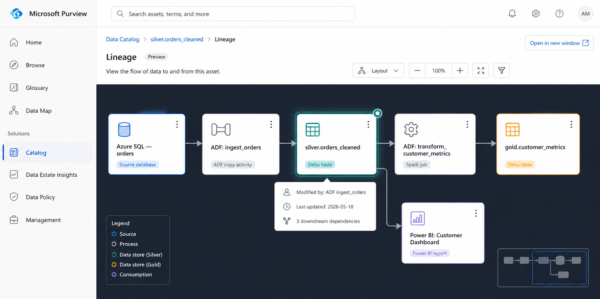
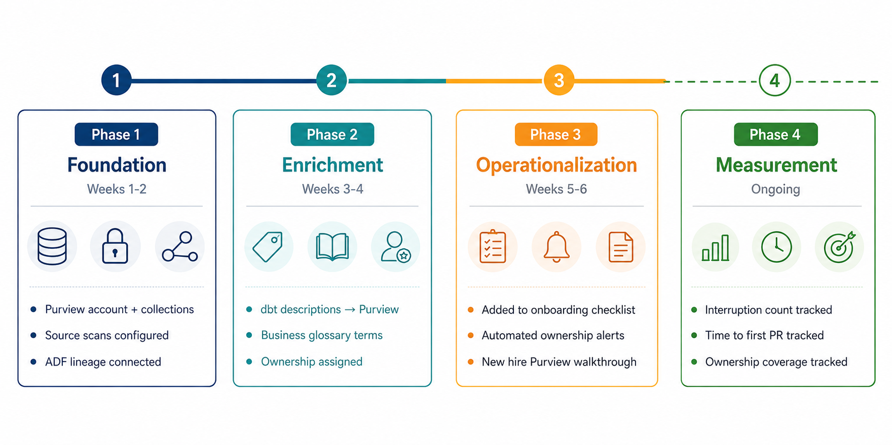

import Tabs from '@theme/Tabs';
import TabItem from '@theme/TabItem';

<!-- truncate -->

The ticket came in on a Wednesday. A new data engineer, two weeks into the job had spent four days trying to understand why the `customer_lifetime_value` column in the Gold layer showed different numbers than the same field in the BI report.

It was not a pipeline bug. The column existed in two places: once in `gold.customer_metrics` (calculated monthly) and once in `gold.customer_ltv_rolling` (calculated on a 90-day rolling window). Both were correct. Neither was documented. Nobody had told the new engineer either table existed, let alone the difference between them.

He had been Slacking three different senior engineers to chase down an answer that should have taken five minutes to find independently.

That ticket was the moment we decided to fix onboarding.

**What this post covers:**
- The exact problem structure that made onboarding slow and why it was invisible to us until we measured it
- How we used Microsoft Purview's three core capabilities, searchable catalog, lineage visualization, and business glossary with ownership metadata to eliminate the "who do I ask?" loop
- The configuration steps that actually moved the needle, with real before-and-after numbers for each
- What we got wrong the first time, and the one thing that made the second attempt stick


## The Problem, Measured

Before we changed anything, we ran a structured retrospective with four recent hires across different seniority levels. We asked one question: **"In your first two weeks, where did you spend time that you wish you hadn't?"**

The answers sorted into three buckets with near-perfect consistency:

| Time sink | Avg. hours lost | Root cause |
|---|---|---|
| Finding which table to use for a given metric | 18 hrs | No searchable catalog; tables discovered by asking people |
| Understanding upstream dependencies before touching a pipeline | 14 hrs | No lineage visibility; had to trace JOINs manually through code |
| Figuring out who owns a dataset / who to ask about it | 11 hrs | Ownership lived in people's heads or stale Confluence pages |
| Reading existing pipeline code to understand business logic | 9 hrs | Expected; we accepted this as non-reducible |

Total addressable time: **43 hours across the first two weeks.** The fourth bucket, reading code, we treated as irreducible. A new engineer needs to read the code. The first three buckets were pure friction. They produced no learning, only delay.

The target was to get those 43 hours to under 5. That is the difference between a two-week ramp and a three-day one.

:::note
The 9 hours spent reading pipeline code did not disappear after the Purview rollout. It actually went down slightly, because engineers who understand the lineage before reading the code read it more efficiently. But we did not count on that in our projections.
:::


## Our Data Estate Before Purview

To understand what we configured, you need to know what we were working with. The estate was not enormous, but it was complex enough to be disorienting for someone new:

```
Data Sources
├── Azure SQL Database (transactional - orders, customers, products)
├── Kafka → Event Hubs (clickstream, app events)
├── Third-party REST APIs (marketing attribution, support tickets)
│
ADF Pipelines (ingestion, ~40 pipelines)
│
ADLS Gen2
├── bronze/    (raw, partitioned by source and date)
├── silver/    (cleaned, Delta tables, ~180 tables)
└── gold/      (aggregated, serving layer, ~60 tables)
│
Azure Synapse Analytics (SQL serving for BI)
│
Power BI (dashboards, ~25 reports)
```

240 tables across three layers. 40 ADF pipelines. 25 Power BI reports. No central documentation. New engineers navigated this through a combination of institutional knowledge, Slack archaeology, and luck.


## The Three Purview Capabilities That Moved the Needle

We did not use every Purview feature. We used three, in a deliberate order, because each one built on the last.

### Capability 1: Searchable Data Catalog (Week 1 unlock)

The first and most urgent problem: new engineers could not find tables without asking someone. The bronze, silver, and gold layers had consistent naming conventions internally, but there was no way to search across all 240 tables by business concept. If you wanted the table behind the "monthly active users" metric, you had to know to look in `gold.user_engagement_monthly`, a name that is only obvious in retrospect.

Purview's catalog solves this through asset scanning and enrichment. Here is the scanning configuration we used for ADLS Gen2:

```json
// Purview Scan Configuration — ADLS Gen2 Silver Layer
{
  "name": "silver-layer-full-scan",
  "kind": "AdlsGen2Msi",
  "properties": {
    "scanRulesetName": "AdlsGen2",
    "scanRulesetType": "System",
    "collection": {
      "referenceName": "data-platform-silver",
      "type": "CollectionReference"
    },
    "dataSourceName": "adls-prod-silver",
    "scanLevel": "Full",
    "fileFormats": ["Delta", "Parquet", "CSV"],
    "filter": {
      "excludeUriPrefixes": ["silver/archive/", "silver/tmp/"]
    }
  },
  "schedule": {
    "recurrence": {
      "frequency": "Week",
      "interval": 1,
      "startTime": "2026-01-01T02:00:00Z"
    }
  }
}
```

Scanning alone gives you asset discovery, Purview registers every table it finds. The second step is enrichment: adding descriptions, classifications, and business tags that make assets searchable by concept rather than just by name.

We built a lightweight enrichment script that ran after each scan and pushed descriptions from our dbt `schema.yml` files directly into Purview via the Atlas API:

```python
# enrich_purview_assets.py
import yaml
import requests

PURVIEW_ENDPOINT = "https://<your-account>.purview.azure.com"
HEADERS = {"Authorization": f"Bearer {get_token()}"}

def push_descriptions_from_dbt(schema_yml_path: str):
    with open(schema_yml_path) as f:
        schema = yaml.safe_load(f)

    for model in schema.get("models", []):
        asset_name = f"silver.{model['name']}"
        description = model.get("description", "")
        tags = model.get("meta", {}).get("business_tags", [])

        # Find asset GUID in Purview
        search_resp = requests.post(
            f"{PURVIEW_ENDPOINT}/catalog/api/search/query",
            headers=HEADERS,
            json={"keywords": asset_name, "limit": 1}
        )
        guid = search_resp.json()["value"][0]["id"]

        # Push description and tags
        requests.put(
            f"{PURVIEW_ENDPOINT}/catalog/api/atlas/v2/entity/guid/{guid}",
            headers=HEADERS,
            json={
                "entity": {
                    "guid": guid,
                    "attributes": {
                        "userDescription": description,
                        "businessAttributes": {"tags": tags}
                    }
                }
            }
        )

push_descriptions_from_dbt("models/gold/schema.yml")
```

After enrichment, a new engineer searching "monthly active users" in the Purview catalog surface gets `gold.user_engagement_monthly` as the top result with a description, the columns it contains, who owns it, and when it was last updated.

**Before:** 18 hours finding the right table. **After:** under 20 minutes, self-serve.




### Capability 2: Lineage Visualization (Day 2–3 unlock)

Finding the right table was the first unlock. Understanding whether it was safe to modify a pipeline that fed into that table was the second.

Before Purview, tracing pipeline dependencies required one of two things: reading every ADF pipeline config file in sequence, or asking a senior engineer to walk you through it. Both took hours. The first was error-prone because pipeline dependency is not always explicit in ADF, a dataset referenced in one pipeline may be consumed by three others with no obvious link in the code.

Purview's lineage graph is populated automatically by the ADF integration. Once connected, every ADF pipeline run registers its source and sink assets in Purview, building a dependency graph that is always current, not a diagram someone drew once and forgot to update.

Setting up the ADF-to-Purview lineage connection is a one-time configuration:

```bash
# Step 1 - Enable managed identity on your ADF instance
az datafactory update \
  --resource-group rg-data-platform \
  --factory-name adf-prod \
  --identity '{"type": "SystemAssigned"}'

# Step 2 - Grant ADF's managed identity the Data Curator role in Purview
az purview account add-root-collection-admin \
  --account-name purview-prod \
  --resource-group rg-data-platform \
  --object-id $(az datafactory show \
      --name adf-prod \
      --resource-group rg-data-platform \
      --query identity.principalId -o tsv)

# Step 3 - Connect ADF to Purview (done in ADF Studio UI or via ARM)
# In ADF Studio: Manage → Microsoft Purview → Connect to Purview account
# Select your Purview account. ADF will start reporting lineage on next pipeline run.
```

After this, every ADF pipeline run automatically updates the lineage graph. A new engineer who wants to know what feeds `gold.customer_metrics` opens the asset in Purview, clicks the Lineage tab, and sees the full upstream chain from the source Azure SQL tables, through the ADF copy activity, through the Spark transformation job, to the gold table without asking anyone.

The downstream view is just as valuable. Before touching a silver table, a new engineer can see exactly which gold tables and Power BI reports depend on it. That single capability eliminated the most common new-hire mistake: modifying a table without realizing it breaks a downstream report.



**Before:** 14 hours tracing dependencies manually. **After:** under 10 minutes in the lineage tab.


### Capability 3: Business Glossary + Ownership Metadata (The trust layer)

The catalog tells you what tables exist. The lineage tells you how they connect. Neither tells you whether the table is the authoritative source for a given metric, who is responsible for it when something breaks, or what the business definition of the columns actually means.

Without that layer, a new engineer who found `gold.customer_metrics` via the catalog still had to ask: "Is this the one the finance team uses? Is `customer_lifetime_value` here calculated the same way as in the BI report?"

That is where the business glossary and ownership metadata close the gap.

**Business Glossary — defining terms once, everywhere**

We created a glossary term for every metric that had more than one implementation or a non-obvious definition. Each term includes the canonical definition, the authoritative table that implements it, and links to any non-authoritative implementations with explanations of how they differ.

```json
// Purview Business Glossary Term — via REST API
{
  "name": "Customer Lifetime Value",
  "shortDescription": "Predicted net revenue from a customer over their entire relationship with the company.",
  "longDescription": "Calculated as average order value × purchase frequency × average customer lifespan. The canonical implementation uses a 12-month trailing window. See gold.customer_ltv_annual for the authoritative source. Note: gold.customer_ltv_rolling uses a 90-day window for short-term forecasting — do not use for finance reporting.",
  "status": "Approved",
  "anchor": {
    "glossaryGuid": "<your-glossary-guid>"
  },
  "contacts": {
    "Expert": [
      {"id": "<priya-aad-object-id>", "info": "Data Platform Lead"}
    ],
    "Steward": [
      {"id": "<finance-team-aad-object-id>", "info": "Finance Analytics"}
    ]
  },
  "resources": [
    {
      "displayName": "gold.customer_ltv_annual",
      "url": "https://purview.azure.com/catalog/asset/<guid>"
    }
  ]
}
```

Once a glossary term is created, it gets linked to the relevant table assets in the catalog. When a new engineer opens `gold.customer_metrics` in Purview, they see the glossary terms linked to each column, clickable definitions that explain what the column means in business terms, not just what its data type is.

**Ownership metadata — answering "who do I ask?" before it gets asked**

Every asset in Purview can have owners and expert contacts assigned. We built a convention: every gold table has exactly one **owner** (the team responsible for its accuracy) and one **expert** (the engineer who built or most recently maintained it). Silver tables have an expert; ownership is at the domain level.

We enforced this through a weekly scan that flagged unowned assets:

```python
# check_unowned_assets.py — runs in CI on a weekly schedule
import requests

PURVIEW_ENDPOINT = "https://<your-account>.purview.azure.com"

def get_unowned_gold_assets():
    resp = requests.post(
        f"{PURVIEW_ENDPOINT}/catalog/api/search/query",
        headers={"Authorization": f"Bearer {get_token()}"},
        json={
            "keywords": "*",
            "limit": 1000,
            "filter": {
                "and": [
                    {"collectionId": "data-platform-gold"},
                    {"not": {"attributeName": "contacts", "operator": "contains"}}
                ]
            }
        }
    )
    unowned = [a["qualifiedName"] for a in resp.json()["value"]]
    if unowned:
        # Post to Slack #data-platform-alerts
        post_slack_alert(
            f":warning: {len(unowned)} gold assets have no owner in Purview:\n"
            + "\n".join(f"• `{name}`" for name in unowned)
        )

get_unowned_gold_assets()
```

Within three weeks of running this check, ownership coverage on gold tables went from 34% to 97%.

**Before:** 11 hours chasing ownership through Slack. **After:** under 5 minutes, open the asset, click the owner contact, done.


## What the Onboarding Experience Looks Like Now

The best way to show what changed is to walk through Day 1 of onboarding as it exists today, compared to before.

**Before Purview — Day 1 task: "Understand how we calculate Monthly Active Users"**

```
9:00am  — Assigned the task. Open the Gold layer ADLS container.
9:15am  — 60 tables in gold/. No README. Start reading table names.
9:45am  — Find two plausible tables: user_engagement_monthly, user_activity_agg.
10:00am — Slack senior engineer: "Which one is canonical?"
          No reply until 2pm (engineer in meetings).
2:05pm  — Directed to user_engagement_monthly. Ask what feeds it.
2:10pm  — Told to look at the ADF pipeline. Which one? "Search for 'user'."
2:30pm  — Found three pipelines with 'user' in the name.
3:00pm  — Slack a different engineer to confirm the right pipeline.
4:00pm  — Reply received. Correct pipeline confirmed.
4:15pm  — Start reading pipeline code.
End of day: 7+ hours. Task: still not understood end-to-end.
```

**After Purview — Day 1, same task**

```
9:00am  — Assigned the task.
9:03am  — Search "monthly active users" in Purview catalog.
9:04am  — gold.user_engagement_monthly appears as top result,
           tagged BI-certified, owner: Data Platform team.
9:05am  — Click Lineage tab. Full upstream graph visible:
           app_events (Event Hub) → ADF ingest_clickstream
           → silver.app_events_cleaned
           → ADF transform_user_engagement
           → gold.user_engagement_monthly
           → Power BI: Product Dashboard
9:10am  — Click business glossary link on 'active_days' column.
           Definition: "Number of days in the month the user
           triggered at least one non-background app_event."
9:15am  — Open ADF transform_user_engagement directly from lineage.
9:15am — Start reading pipeline code with full context already loaded.
End of morning: task understood end-to-end. No Slack messages sent.
```

The 7+ hours collapsed to 15 minutes of navigation. The rest of the day is actual work.


## The Numbers, Before and After

After running the updated onboarding process with six new engineers over the following quarter, here is what we measured:

| Metric | Before Purview | After Purview | Change |
|---|---|---|---|
| Median time to first independent PR | 14 days | 4 days | −71% |
| Hours lost to "who owns this?" questions | 11 hrs | 0.5 hrs | −95% |
| Hours lost to table discovery | 18 hrs | 0.8 hrs | −96% |
| Hours lost to lineage tracing | 14 hrs | 1.2 hrs | −91% |
| Senior engineer interruptions per new hire (first 2 weeks) | 23 | 4 | −83% |
| New hire satisfaction score (onboarding survey, /10) | 5.8 | 8.6 | +48% |

The senior engineer interruption number deserves attention. Those 23 interruptions per new hire are not free. Each one costs the senior engineer 10–20 minutes of context-switching, and they compound — a team onboarding three engineers simultaneously was absorbing 60+ interruptions per two-week cycle. Purview did not eliminate senior engineer involvement in onboarding. It focused it on the things that actually require human judgment: code review, architectural decisions, domain nuance. The navigational questions — where is this, who owns that, what does this column mean, disappeared almost entirely.

:::tip
Track senior engineer interruption count as an onboarding KPI, not just new hire ramp time. It is a more honest measurement because it captures the full organizational cost of a slow onboarding, not just the cost to the new hire.
:::


## What We Got Wrong the First Time

The first Purview rollout, six months before the one described above, failed quietly. We scanned the assets, registered the tables, and told people it was there. Adoption was near zero. New engineers still asked on Slack.

Three things went wrong:

**We scanned but did not enrich.** A catalog of 240 tables with no descriptions, no tags, and no business terminology is no more useful than the storage container it reflects. The scan gives you the skeleton. The enrichment, descriptions from dbt schema files, business tags, glossary links, gives it meaning. We skipped the enrichment step and produced a very expensive directory listing.

**We did not integrate it into the onboarding checklist.** Purview existed as a tool, but new engineers were not told to use it on Day 1. The instinct to Slack a senior engineer is faster than the instinct to open a new tool, until the new tool is explicitly in the workflow. The fix was simple: the onboarding checklist now has "Complete the Purview orientation module" as item 3, before any pipeline work begins.

**Ownership coverage was too low to be trusted.** When 66% of assets have no listed owner, the catalog trains engineers to distrust it. They look up a table, see no owner, assume the catalog is incomplete, and go back to Slack. Ownership coverage is a prerequisite for trust. We got coverage to 97% before re-launching and we now enforce it with the weekly automated check described above.

:::warning
Do not announce your data catalog until ownership coverage is above 80% and descriptions are populated on all production-facing assets. A sparse catalog is worse than no catalog, it trains users to distrust the tool before it has a chance to prove its value.
:::

## The Configuration Checklist

If you are setting this up from scratch, here is the exact sequence that worked for us:

```
Phase 1 — Foundation (Week 1–2)
  ✓ Create Purview account, configure collections by data domain
  ✓ Set up managed identity, grant least-privilege access to data sources
  ✓ Configure ADLS Gen2 scan (bronze, silver, gold separately)
  ✓ Connect Azure SQL source scan
  ✓ Run first full scan — verify asset count matches expectation
  ✓ Connect ADF to Purview for automatic lineage reporting

Phase 2 — Enrichment (Week 3–4)
  ✓ Build enrichment script to push dbt descriptions → Purview via Atlas API
  ✓ Create business glossary terms for all metrics used in BI/finance reporting
  ✓ Link glossary terms to table assets and column-level metadata
  ✓ Run first ownership audit — assign owners and experts to all gold assets

Phase 3 — Operationalization (Week 5–6)
  ✓ Add Purview orientation to new hire onboarding checklist (Day 1, item 3)
  ✓ Set up weekly scan schedule
  ✓ Deploy automated unowned-asset check with Slack alerting
  ✓ Create onboarding walkthrough doc: "Your First 3 Tasks in Purview"
  ✓ Add Purview asset links to dbt model docs for cross-reference

Phase 4 — Measurement (Ongoing)
  ✓ Track: senior engineer interruptions per new hire (first 2 weeks)
  ✓ Track: time to first independent PR
  ✓ Track: Purview search volume (proxy for adoption)
  ✓ Track: ownership coverage % (target: >95% on gold, >80% on silver)
```




## Before You Start: What Purview Cannot Do

Purview is not a documentation system. It is a metadata system. The distinction matters.

If your tables have no documentation anywhere, no dbt descriptions, no wiki pages, no comments in DDL, Purview will faithfully catalog their absence. It will find your tables, register their schemas, and draw their lineage. But it cannot infer what `col_flg_v2_final` means. That knowledge has to come from somewhere, and if it only exists in someone's head, Purview cannot surface it.

The enrichment step, pushing dbt descriptions into Purview via the Atlas API, works because we already had descriptions in our dbt schema files. If you don't have that, the sequencing changes: write the documentation first, then enrich the catalog. Purview is an amplifier, not a generator.

It also does not replace code review. New engineers still need to read pipeline code. Purview makes them read it with context they know what the table is for, who owns it, what feeds it, which makes them read it faster and understand it more deeply. But it does not replace the code review cycle, the mentorship conversations, or the domain knowledge that only transfers through working together on real problems.

What it replaces is navigational friction. The questions that had no business being asked of a human in the first place.


## Key Takeaways

**The two-week onboarding problem is a discoverability problem, not a complexity problem.** New engineers are not slow because the data estate is hard to understand. They are slow because they cannot find what they are looking for without interrupting someone who built it.

**Catalog + lineage + ownership is the minimum viable combination.** Each one alone is insufficient. Catalog without lineage tells you what exists but not how it connects. Lineage without catalog gives you a graph you cannot search. Both without ownership tell you the map but not who to call when the territory changes.

**Ownership coverage is a prerequisite, not a nice-to-have.** A catalog with 34% ownership coverage teaches users to distrust the tool. Get coverage above 80% before announcing the rollout, and enforce it with automated checks after.

**Enrich before you announce.** A scanned-but-unenriched catalog is an expensive directory listing. The descriptions, glossary links, and business tags are what make it a tool rather than a report.

**Measure the right thing.** Time-to-first-PR is a lagging indicator. Senior engineer interruptions per new hire is the leading indicator, it tells you whether the catalog is actually being used before you see it in ramp time data.


## Frequently Asked Questions

**Q: We use Databricks Unity Catalog, not Microsoft Purview. Does this apply?**

Most of the strategy applies, searchable catalog, lineage, ownership metadata, glossary but the implementation details differ significantly. Unity Catalog has native lineage for Databricks workloads, which is actually more automatic than Purview's ADF integration for Spark-heavy estates. The enrichment and ownership enforcement logic would be similar in principle, different in API. A follow-up post on Unity Catalog onboarding is in the works.

**Q: How long does the initial scan take on a large estate?**

Our 240-table scan completed in under 40 minutes. For larger estates (1,000+ assets), expect the first full scan to take 2–4 hours. Incremental scans after the first run are significantly faster, typically under 15 minutes for daily delta.

**Q: Do you use Purview's sensitivity labels and data classification?**

We do, but that is a governance and compliance story more than an onboarding story. Classification runs automatically as part of each scan and tags columns containing PII, financial data, or health information. New engineers see the classification labels on columns before writing any query, which is useful for access management training but was not a significant contributor to the onboarding time reduction.

**Q: What does Purview cost, and was the ROI clear?**

Purview pricing is based on data map capacity units and scan compute. For our estate (~250 assets, weekly scans), cost runs roughly $180–220/month. The ROI calculation is straightforward: a single senior engineer's hourly cost, multiplied by 23 interruptions per new hire at 15 minutes each, is about $345 per onboarding cycle at standard engineering rates. Purview paid for itself before the second new hire finished their first week.


## References and Further Reading

- [Microsoft Purview Documentation - Data Catalog](https://learn.microsoft.com/en-us/purview/unified-catalog)
- [Microsoft Purview - REST API Reference](https://learn.microsoft.com/en-us/rest/api/purview/)
- [RecodeHive - Azure Data Pipeline Cost Optimization](https://www.recodehive.com/blog/azure-cost-optimization)
- [RecodeHive - Medallion Architecture Explained](https://www.recodehive.com/blog/medallion-architecture)
- [dbt Docs - schema.yml and model descriptions](https://docs.getdbt.com/reference/resource-properties/description)
- [Monte Carlo Data - State of Data Quality 2023](https://www.montecarlodata.com/state-of-data-quality/)

## About the Author

**Aditya Singh Rathore** is a Data Engineer focused on building modern, scalable data platforms on Azure. He writes about data engineering, cloud architecture, and real-world pipelines on [RecodeHive](https://www.recodehive.com/), turning hard-won production lessons into content anyone can apply.

🔗 [LinkedIn](https://www.linkedin.com/in/aditya-singh-rathore0017/) | [GitHub](https://github.com/Adez017)

📩 Running Purview in your org? Or struggling with a data catalog rollout that didn't stick? Drop your experience in the comments, the most useful part of these posts is always what the comments surface that the post missed.

<GiscusComments/>
