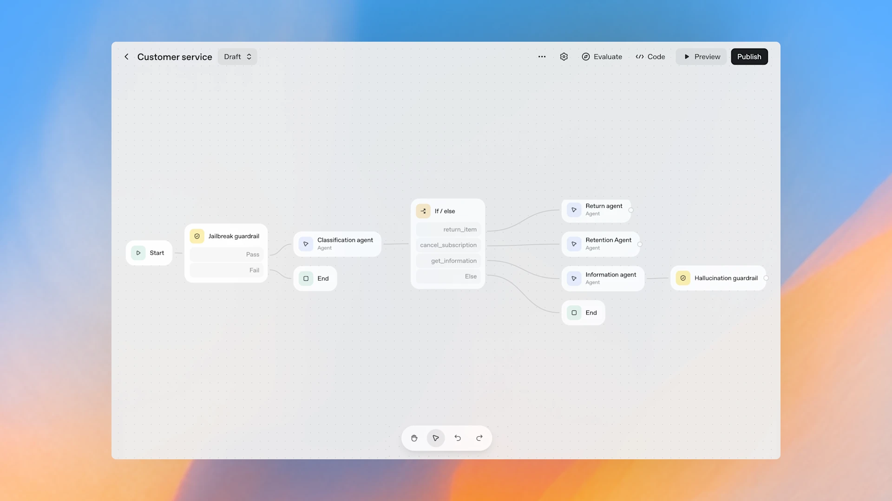

 <!-- truncate -->
# OpenAI AgentKit: Democratizing AI Agent Development for Everyone

Hey there, AI builders! 👋

I still remember the days when building an AI agent meant wrestling with fragmented tools, managing complex API calls, debugging mysterious failures, and spending more time on infrastructure than actual innovation. It felt like trying to build a house while simultaneously manufacturing your own bricks.

That changed on October 6, 2025, when Sam Altman took the stage at OpenAI's Dev Day and unveiled AgentKit - a complete toolkit that promises to transform how we build, deploy, and optimize AI agents. Today, I want to walk you through what makes AgentKit special and why it might be the most significant developer tool launch from OpenAI yet.

## What is AgentKit?

[**AgentKit**](https://openai.com/index/introducing-agentkit/) is described by OpenAI CEO Sam Altman as a comprehensive set of building blocks designed to help developers take agents from prototype to production. But that simple description doesn't do it justice.

Think of AgentKit as the unified development platform that the AI agent ecosystem has been desperately needing. Instead of piecing together multiple tools, APIs, and services from different providers, you get everything in one coherent package that actually works together.

The promise? Build, deploy, and optimize agent workflows with significantly less friction.

## Why AgentKit Matters Now

Before we dive into the components, let's talk about timing. OpenAI's ChatGPT has reached 800 million weekly active users, making it one of the most widely used AI platforms in history. This massive user base represents an equally massive opportunity for developers to build AI-powered solutions.

The launch signals OpenAI's competitive move against other AI platforms racing to offer integrated tools for building autonomous agents that can perform complex tasks, not just respond to prompts. We're witnessing the shift from conversational AI to truly agentic AI - systems that can take action, use tools, and accomplish multi-step goals autonomously.

## The Four Pillars of AgentKit

AgentKit isn't just one tool - it's a complete ecosystem built around four core capabilities. Let's explore each one and understand how they work together.

### 1. Agent Builder: The Visual Workflow Editor

Altman described Agent Builder as "like Canva for building agents" - a fast, visual way to design the logic, steps, and ideas.

This is the headline feature that's getting everyone excited, and for good reason. Remember when website builders transformed from hand-coding HTML to drag-and-drop interfaces? Agent Builder does the same thing for AI agent development.

**What Agent Builder Does:**
- Provides a visual canvas for designing agent workflows
- Uses drag-and-drop components to define agent logic
- Built on top of the Responses API that hundreds of thousands of developers already use
- Eliminates the need to write boilerplate code for common agent patterns

**Why This Matters:**
Here's the thing - even experienced developers spend a disproportionate amount of time on scaffolding and infrastructure when building agents. Agent Builder abstracts away the repetitive parts while still giving you control over the important decisions.

**The Power of Visual Design:**
When you can see your agent's workflow as a visual graph, you can:
- Spot logical errors before they become runtime bugs
- Understand complex conditional flows at a glance
- Iterate faster by rearranging components visually
- Collaborate with non-technical stakeholders who can understand the visual representation

Think of it this way: If traditional agent development is like writing assembly code, Agent Builder is like using a modern IDE with IntelliSense, debugger, and visual tools all built in.

### 2. ChatKit: Embeddable Chat Interfaces Made Simple

The second pillar of AgentKit is ChatKit - and this is where things get really practical for product builders.

**What ChatKit Provides:**
A simple embeddable chat interface that developers can use to bring chat experiences into their own apps, with the ability to bring your own brand, workflows, and whatever makes your product unique.

**Why ChatKit Is Brilliant:**
Building a good chat interface is harder than it looks. You need to handle:
- Message threading and history
- Streaming responses for better UX
- Error handling and retry logic
- Mobile responsiveness
- Accessibility features
- Loading states and animations

ChatKit handles all of this out of the box, but here's the clever part - it's not a black box. You can customize it to match your brand, inject your own business logic, and integrate it seamlessly into existing applications.

The beauty is that you're not starting from scratch. You're building on a foundation that's been battle-tested by millions of users in ChatGPT.

### 3. Evals for Agents: Measuring What Matters

This is where AgentKit gets serious about production deployments. Anyone can build a demo that works once. Building something reliable enough to bet your business on requires rigorous evaluation.

**What Evals for Agents Includes:**
Tools to measure AI agent performance, including step-by-step trace grading, datasets for assessing individual agent components, automated prompt optimization, and the ability to run evaluations on external models.

**The Evaluation Challenge:**
Here's what makes evaluating AI agents tricky:
- Unlike traditional software, agents are probabilistic - they might behave differently each time
- Success isn't binary - there are degrees of correctness
- Complex workflows have multiple failure points
- Optimization in one area might break something else

**How Evals for Agents Solves This:**

**Step-by-Step Trace Grading:**
Instead of just looking at final outputs, you can evaluate each step in your agent's reasoning process. This is game-changing for debugging. When something goes wrong, you can pinpoint exactly which step failed and why.

**Component-Level Datasets:**
You can create evaluation datasets for individual components of your agent. This modular approach means you can improve specific parts without worrying about breaking the whole system.

**Automated Prompt Optimization:**
Prompt engineering is more art than science, but it doesn't have to be. With automated optimization, you can test variations systematically and let data drive your decisions.

**Cross-Model Evaluation:**
The ability to run evaluations on external models directly from the OpenAI platform is subtle but powerful. It means you can compare performance across different models, optimize for cost vs. quality, and make informed decisions about model selection.

### 4. Connector Registry: Secure Integration at Scale

The fourth pillar ties everything together by solving one of the thorniest problems in enterprise AI: secure, controlled access to internal tools and external services.

**What the Connector Registry Provides:**
Developers can securely connect agents to internal tools and third-party systems through an admin control panel while maintaining security and control.

**Why This Matters for Enterprises:**
When I talk to enterprise developers, the same concerns come up repeatedly:
- How do we give AI agents access to our systems without compromising security?
- How do we audit what agents are doing with sensitive data?
- How do we revoke access quickly if needed?
- How do we comply with regulatory requirements?

The Connector Registry addresses all of these with a centralized, controlled approach to integrations.

**The Security Model:**
- Centralized admin control panel for managing all connections
- Granular permissions at the agent and tool level
- Audit logs for compliance and debugging
- Easy revocation and rotation of credentials
- Support for OAuth and other enterprise authentication methods

**The Developer Experience:**
For developers, it's beautifully simple. Instead of managing API keys in environment variables and writing custom integration code, you:
1. Select the connector you need from the registry
2. Authenticate through the admin panel
3. Use it in your agent with a simple reference

The platform handles the rest - credential management, retries, rate limiting, and error handling.

## Seeing Is Believing: The Live Demo

One of the most compelling moments from Dev Day was when OpenAI engineer Christina Huang built an entire AI workflow and two AI agents live onstage in under eight minutes.

Let me repeat that: **under eight minutes**. From zero to a working multi-agent system.

This wasn't a pre-recorded demo with everything perfectly set up. This was live, unscripted development that showed what's possible when you remove unnecessary friction from the development process.

What would that same task have taken before AgentKit? Probably hours of coding, debugging, and testing. And that's if you're an experienced AI developer who knows all the APIs and best practices.

## How the Components Work Together

Now that we've covered the four pillars individually, let's see how they create a unified development experience:

### The Development Flow

**Step 1: Design Your Agent**
Start in Agent Builder, visually mapping out your agent's workflow. Define the steps, decision points, and tool usage without writing any code.

**Step 2: Connect Your Tools**
Use the Connector Registry to securely link your agent to the services it needs - databases, APIs, internal tools, whatever your use case requires.

**Step 3: Add the Interface**
Integrate ChatKit to give your users a polished way to interact with your agent. Customize it to match your brand and product experience.

**Step 4: Evaluate and Optimize**
Use Evals for Agents to measure performance, identify weaknesses, and systematically improve your agent's reliability.

**Step 5: Deploy and Monitor**
Push to production with confidence, knowing you have the evaluation framework to catch issues and the tools to iterate quickly.

### The Iteration Loop

Here's where the integrated approach really shines. Traditional development has a slow feedback loop:
1. Write code
2. Deploy to test environment
3. Manually test
4. Find bugs
5. Fix bugs
6. Repeat

With AgentKit, the loop is much tighter:
1. Adjust agent visually in Agent Builder
2. Run automated evals
3. See results immediately
4. Iterate based on data

This faster iteration cycle means you can explore more possibilities, validate assumptions quickly, and get to production-ready faster.

## The Philosophy Behind AgentKit

Altman noted that AgentKit is "all the stuff that we wished we had when we were trying to build our first agents". This statement reveals something important about OpenAI's approach.

AgentKit wasn't designed in a vacuum by people who don't build with AI. It was designed by the same team that's been building ChatGPT, GPT-4, and other cutting-edge AI systems. They've felt the pain points, hit the roadblocks, and now they're sharing the solutions they wish they'd had.

### Opinionated But Flexible

AgentKit makes strong opinions about the right way to build agents:
- Visual design over code-first approaches
- Evaluation-driven development over manual testing
- Secure, centralized integrations over scattered API keys
- Component reusability over monolithic builds

But these opinions don't lock you in. Agent Builder is built on top of the Responses API that hundreds of thousands of developers already use, which means you can drop down to code when you need more control.

### Production-Ready from Day One

Many developer tools focus on getting you to "hello world" quickly but leave you on your own for production concerns. AgentKit takes the opposite approach - it's designed for production from the start.

The inclusion of Evals, the Connector Registry with admin controls, and the focus on security and reliability all signal that this isn't a toy for prototypes. It's infrastructure for building real businesses on.

## Who Benefits Most from AgentKit?

### Individual Developers
If you're a solo developer with an idea for an AI-powered product, AgentKit dramatically lowers the barrier to entry. You don't need a team of ML engineers and DevOps specialists. You can build, evaluate, and deploy agents yourself.

### Startups
For startups, AgentKit means faster time to market and lower development costs. Instead of spending months on infrastructure, you can focus on your unique value proposition and get to product-market fit faster.

### Enterprise Teams
OpenAI has already signed on several launch partners that have scaled agents using AgentKit. For enterprises, the value is in the security model, evaluation framework, and ability to standardize on a single platform across teams.

### Non-Technical Founders
Here's a bold prediction: AgentKit will enable non-technical founders to build AI products that would have previously required a technical co-founder. The visual nature of Agent Builder, combined with the pre-built components, puts agent development within reach of anyone willing to learn.

## The Competitive Landscape

The launch highlights OpenAI's push to increase developer adoption by making agent building faster and easier, and signals a competitive move against other AI platforms racing to offer integrated tools.

The AI infrastructure space is heating up, with players like:
- LangChain providing agent frameworks
- AutoGen offering multi-agent systems
- Anthropic's Claude with computer use
- Numerous startups building agent platforms

What makes AgentKit different is the integration. While other tools focus on one piece of the puzzle, AgentKit provides the whole solution - from design to deployment to evaluation.

## Best Practices for Building with AgentKit

Based on what we know about AgentKit and agent development in general, here are some principles to keep in mind:

### Start Simple, Then Expand
Don't try to build a complex multi-agent system on day one. Start with a single, focused agent that does one thing well. Use Evals to make sure it's reliable, then add complexity gradually.

### Evaluation-Driven Development
Make evaluation a first-class part of your development process. Create eval datasets before you build, not after. This forces you to think clearly about what success looks like.

### Embrace the Visual Paradigm
If you're a code-first developer, give the visual builder a real chance. It might feel awkward at first, but the benefits of being able to see your agent's logic at a glance are substantial.

### Security First
Use the Connector Registry's admin controls from the start. Don't cut corners on security even in development. It's much harder to add security later than to build it in from the beginning.

### Iterate Based on Real Usage
Deploy early (to a small audience) and let real usage guide your improvements. The evaluation tools will help you identify where your agent is struggling with actual user queries.

## The Future of Agent Development

AgentKit represents a bet on the future of software development. OpenAI is betting that:

1. **Agents will be everywhere** - Not just chatbots, but agents handling complex workflows across industries
2. **Visual tools will dominate** - The future of development is more visual, more accessible, and less code-heavy
3. **Evaluation matters** - As agents become critical infrastructure, systematic evaluation becomes non-negotiable
4. **Integration is key** - The value is in connecting AI to your existing tools and data, not just in the AI itself

I think they're right on all counts.

## Challenges and Considerations

Of course, no tool is perfect. Here are some things to keep in mind:

### Vendor Lock-In
Building on AgentKit means building on OpenAI's platform. While you can run evaluations on external models, you're still deeply integrated with OpenAI's ecosystem. Make sure you're comfortable with that dependency.

### Learning Curve
While AgentKit aims to make agent development easier, there's still a learning curve. Understanding how to design effective agent workflows, write good evaluation criteria, and optimize for production takes time and practice.

### Cost Considerations
Using AI at scale isn't free. Make sure you understand the pricing model and factor in API costs when planning your application.

### Limits of Automation
Agent Builder is powerful, but it can't replace deep thinking about your problem domain. You still need to understand your users, design good workflows, and make strategic decisions.

## Getting Started

Ready to dive in? Here's how to get started with AgentKit:

1. **Explore the Documentation** - [OpenAI's documentation](https://openai.com/index/introducing-agentkit/) is comprehensive and includes tutorials for common use cases

2. **Start with Templates** - Don't build from scratch if you don't have to. Start with templates and modify them for your needs

3. **Join the Community** - Connect with other developers building with AgentKit. Share patterns, ask questions, and learn from others here : https://community.openai.com/

4. **Build in Public** - Share your progress and learnings. The community grows stronger when we share knowledge

## Conclusion: The Agent Era Begins

AgentKit isn't just another developer tool - it's OpenAI's vision for how AI agent development should work. By removing friction, providing integrated tools, and making evaluation a first-class concern, AgentKit makes it possible for far more people to build production-grade AI agents.

Altman's statement that this is "all the stuff we wished we had when we were trying to build our first agents" resonates because it comes from real experience. This isn't theoretical - it's battle-tested approaches packaged for everyone.

Whether you're a seasoned AI developer looking to build faster, a startup trying to find product-market fit, or an enterprise scaling AI across your organization, AgentKit provides the foundation you need.

The question isn't whether agents will transform how we build software - they already are. The question is whether you'll be part of that transformation. With AgentKit, the barrier to entry has never been lower.

---

*The future of software is agentic, and AgentKit is your toolkit for building it. The only question left is: what will you build? 🚀*

<GiscusComments/>