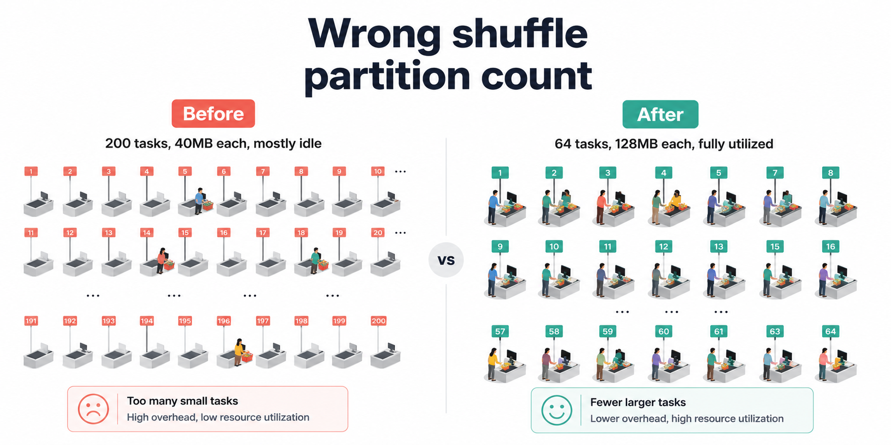
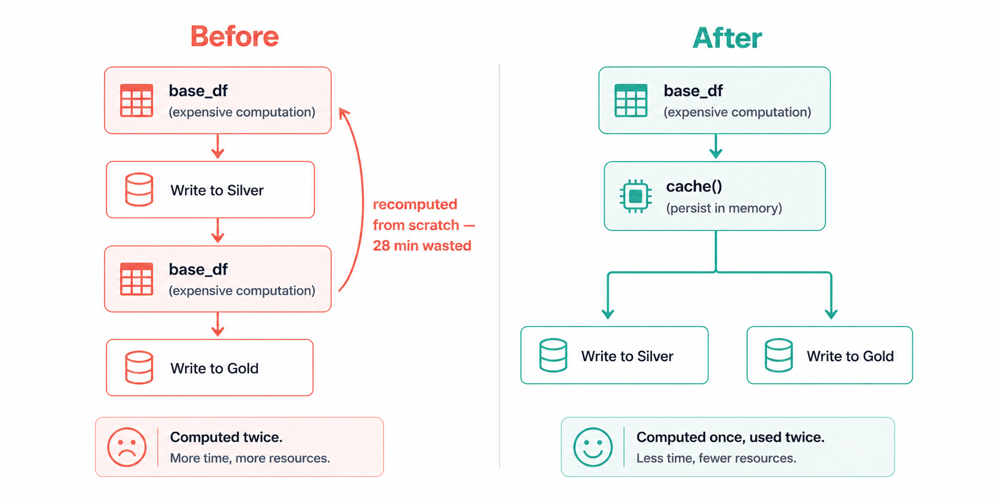
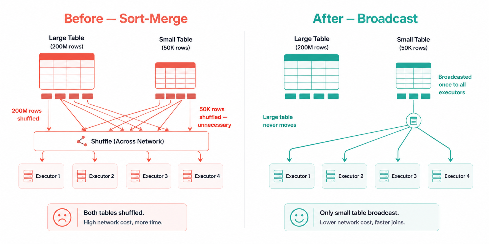
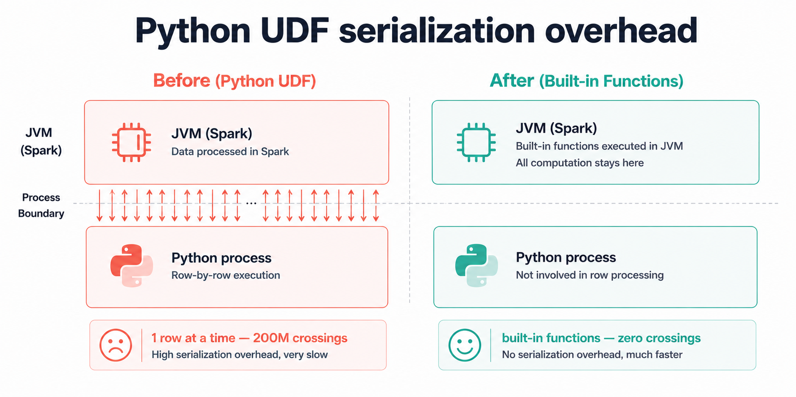

import Tabs from '@theme/Tabs';
import TabItem from '@theme/TabItem';

<!-- truncate -->

The job ran for four hours. It processed 8GB of data.

A file copy of that same 8GB on the same machine would have taken about 45 seconds.

That gap between what Spark *could* do and what it actually did was entirely self-inflicted. Not because the logic was wrong. The output was correct. But six decisions that seemed harmless at the time were quietly multiplying the runtime: a Python UDF where a built-in function existed, a join that shuffled 200 million rows when it didn't have to, a read that scanned 90 days of data to find yesterday's records.

This post is about those six decisions. Each one is a pattern that beginners hit constantly, not because they're careless, but because PySpark doesn't stop you. It runs the slow version just as willingly as the fast one. You only find out at 3am when the SLA is missed.

**What you'll learn in this post:**
- Why too many shuffle partitions is just as bad as too few and how to pick the right number
- How caching works under the hood, and when it actively hurts performance
- The three join strategies Spark supports and exactly when to use each one
- Why Python UDFs are a performance trap and what to use instead
- How predicate pushdown and column pruning reduce data read before any Spark code runs
- How to size executors so you stop leaving half your cluster idle


## The Pipeline We'll Optimize

Every example in this post uses a single, realistic pipeline so you can see how the fixes interact with each other:

```
Raw sales events (JSON, S3/ADLS)
    ↓
Bronze Delta table (~200M rows, partitioned by event_date)
    ↓
PySpark transformation job
    ↓
Silver Delta table (deduplicated, enriched, typed)
    ↓
Reporting aggregation
    ↓
Gold Delta table (daily summaries)
```

Before any optimization: **4 hours 12 minutes** end-to-end on a 4-node cluster.  
After all six fixes: **34 minutes** on the same cluster.

Let's go through every mistake.

## Mistake #1: Wrong Number of Shuffle Partitions

**Time lost to this mistake: ~55 minutes**

Every time Spark needs to reorganize data across the network after a `groupBy`, a `join`, or a `distinct`, it performs a **shuffle**. The shuffled data is split into partitions, and the number of those partitions is controlled by one setting:

```python
spark.conf.get("spark.sql.shuffle.partitions")
# Default: "200"
```

The default is 200. That number made sense for the era of multi-TB Hadoop clusters it was designed for. On our 8GB pipeline, it created a different problem entirely: 200 tasks launched, each assigned a few megabytes of data, spending more time on Spark's task scheduling machinery than on the actual groupBy computation. The cluster looked busy. The progress bar moved. But most of what was happening was overhead, not work.

The inverse bites you just as hard in the other direction. Too few partitions on a genuinely large dataset means each task takes on more data than it can hold in memory and starts spilling to disk — and disk spills are catastrophically slow compared to in-memory operations.



### Understanding Partitions First

Think of shuffle partitions like checkout lanes at a supermarket. If you open 200 lanes for 64 customers, each cashier handles one customer and then sits idle, you're paying for 136 empty lanes. Open 4 lanes for 200 customers and you get a queue that never moves. The goal is matching lane count to the actual number of customers, not picking a number that sounds safe.

In Spark terms: target **128MB to 200MB of data per partition** after a shuffle.

```
Ideal partitions = Total data size after shuffle ÷ 128MB
```

For our 8GB transformation job (data after the join/groupBy, not raw input):

```
Ideal partitions = 8,000MB ÷ 128MB ≈ 63
```

We round to a clean number, 64 and set it before any transformation runs.

<Tabs>
  <TabItem value="Before">

```python title="transformation-before.py"
# Default: 200 shuffle partitions
# On 8GB of data, each partition is ~40MB
# 200 tasks scheduled, most doing trivial work
# Task launch overhead dominates actual compute time

df = (
    spark.read.format("delta")
    .load("abfss://data@lake.dfs.core.windows.net/bronze/sales/")
    .groupBy("product_id", "event_date")
    .agg(sum("revenue").alias("total_revenue"))
)
```

  </TabItem>
  <TabItem value="After">

```python title="transformation-after.py"
# Set BEFORE any transformations run
# Rule of thumb: Total shuffle data size ÷ 128MB
# For ~8GB post-shuffle data: 8000 ÷ 128 ≈ 64

spark.conf.set("spark.sql.shuffle.partitions", "64")

df = (
    spark.read.format("delta")
    .load("abfss://data@lake.dfs.core.windows.net/bronze/sales/")
    .groupBy("product_id", "event_date")
    .agg(sum("revenue").alias("total_revenue"))
)
```

  </TabItem>
  <TabItem value="Impact">

| Setting | Shuffle Partitions | Stage Duration | Tasks Launched |
|---|---|---|---|
| Default (200) | 200 | 48 min | 200 |
| Tuned (64) | 64 | 11 min | 64 |

  </TabItem>
</Tabs>

**Result:** Aggregation stage dropped from 48 minutes to 11 minutes. **~37 minutes saved.**

:::tip
For Databricks on Delta Lake, you can also enable **Adaptive Query Execution (AQE)**, which automatically adjusts shuffle partitions at runtime based on actual data size:

```python
spark.conf.set("spark.sql.adaptive.enabled", "true")
spark.conf.set("spark.sql.adaptive.coalescePartitions.enabled", "true")
```

AQE doesn't replace manual tuning but it acts as a safety net when your estimate is off. We run both: manual tuning as the primary setting, AQE as the fallback.
:::


## Mistake #2: Caching Everything (Or Nothing)

**Time lost to this mistake: ~28 minutes**

Caching is one of the most misunderstood features in PySpark. Beginners either avoid it entirely (paying to recompute the same DataFrame multiple times) or cache everything (consuming all available memory and forcing everything else to spill to disk).

### What Caching Actually Does

Calling `.cache()` on a DataFrame doesn't immediately store anything, Spark is lazy, so nothing happens until an action triggers computation. What `.cache()` actually does is plant a flag that says: *the first time you compute this, hold onto the result.* The next time something references this DataFrame, Spark reads from that stored result instead of re-running the entire computation from scratch.

The reason this matters is that Spark has no implicit memory of previous computations. Without caching, every action that references `base_df` starts from the beginning, re-reading the source files, re-running the joins, re-applying the filters. We discovered this the painful way when a pipeline that looked like one job was actually running the most expensive stage twice, adding 28 minutes to every run.

This only helps if you reference the same DataFrame more than once. If you compute a DataFrame, transform it once, and write it, caching adds overhead with zero benefit.



```python
# This caching is useless — df is only used once
df = spark.read.format("delta").load(silver_path).cache()
df.write.format("delta").save(gold_path)
```

The right time to cache is when a DataFrame is expensive to compute *and* you reference it in multiple downstream operations.

<Tabs>
  <TabItem value="Before (No Cache)">

```python title="pipeline-no-cache.py"
# base_df is computed TWICE — once for each write
# Spark re-reads and re-joins from scratch each time

base_df = (
    spark.read.format("delta").load(bronze_path)
    .join(products_df, "product_id", "left")
    .filter(col("event_date") == yesterday)
)

# First action — triggers full computation of base_df
base_df.write.format("delta").mode("append").save(silver_path)

# Second action — triggers FULL recomputation of base_df again
base_df.groupBy("category").agg(sum("revenue")).write.format("delta").save(gold_path)
```

  </TabItem>
  <TabItem value="After (Targeted Cache)">

```python title="pipeline-with-cache.py"
from pyspark import StorageLevel

base_df = (
    spark.read.format("delta").load(bronze_path)
    .join(products_df, "product_id", "left")
    .filter(col("event_date") == yesterday)
)

# Cache BEFORE the first action — base_df is used twice
# MEMORY_AND_DISK: spills to disk if memory is full (safer than MEMORY_ONLY)
base_df.persist(StorageLevel.MEMORY_AND_DISK)

# First use — computes and stores base_df
base_df.write.format("delta").mode("append").save(silver_path)

# Second use — reads from cache, no recomputation
base_df.groupBy("category").agg(sum("revenue")).write.format("delta").save(gold_path)

# Always unpersist when done — frees executor memory for the next stage
base_df.unpersist()
```

  </TabItem>
</Tabs>

:::note
We always use `MEMORY_AND_DISK` rather than `MEMORY_ONLY`. The reason: when memory fills up, `MEMORY_ONLY` silently drops the cached data and recomputes it on demand, you get none of the benefit and all of the overhead. We got burned by this once when a larger-than-usual dataset caused silent eviction mid-pipeline. `MEMORY_AND_DISK` spills the overflow to disk instead of evicting, which is slower than memory but far better than recomputing from scratch.
:::

**Result:** Eliminated one full recomputation of the join + filter stage. **~28 minutes saved.**

## Mistake #3: Using the Wrong Join Strategy

**Time lost to this mistake: ~62 minutes**

Joins are the most expensive operation in distributed computing. When two datasets need to be joined, Spark has to get rows with matching keys onto the same machine which usually means moving large amounts of data across the network. That network movement is called a shuffle, and it's where most of the time in a join stage actually goes.

PySpark supports three join strategies. Understanding which one to use and when is one of the highest-leverage optimizations available.

### The Three Strategies

**Sort-Merge Join (default for large tables)**
Both datasets are shuffled so matching keys land on the same partition, then sorted, then merged. Correct for any size. Expensive because of the full shuffle.

**Broadcast Join (best for large + small table)**
The smaller table is collected to the driver and sent as a complete copy to every executor. The large table never moves. Dramatically faster when the small table fits comfortably in memory.

**Bucket Join (best for repeated joins on the same key)**
Both tables are pre-arranged on disk by join key at write time. When you join two bucketed tables on their bucket key, Spark skips the shuffle entirely, the data is already sitting where it needs to be. Expensive upfront, free on every subsequent join.



<Tabs>
  <TabItem value="Before (Default Sort-Merge)">

```python title="join-before.py"
# Spark defaults to Sort-Merge Join
# products_df has 50,000 rows — tiny
# But Spark doesn't know that and shuffles BOTH tables
# 200M rows of sales_df shuffled across the network

sales_df = spark.read.format("delta").load(bronze_path)
products_df = spark.read.format("delta").load(products_path)

enriched_df = sales_df.join(products_df, "product_id", "left")
```

  </TabItem>
  <TabItem value="After (Broadcast Join)">

```python title="join-after.py"
from pyspark.sql.functions import broadcast

sales_df = spark.read.format("delta").load(bronze_path)
products_df = spark.read.format("delta").load(products_path)

# Hint tells Spark to broadcast products_df to every executor
# sales_df (200M rows) is NEVER shuffled
# products_df (50K rows) is collected once and sent to all nodes
enriched_df = sales_df.join(broadcast(products_df), "product_id", "left")
```

  </TabItem>
  <TabItem value="Bucket Join (Advanced)">

```python title="bucket-join.py"
# Write tables once with bucketing — expensive upfront, free on every future join
# Use when the same large-to-large join runs repeatedly

sales_df.write \
    .bucketBy(64, "product_id") \
    .sortBy("product_id") \
    .format("parquet") \
    .saveAsTable("sales_bucketed")

events_df.write \
    .bucketBy(64, "product_id") \
    .sortBy("product_id") \
    .format("parquet") \
    .saveAsTable("events_bucketed")

# Now this join has ZERO shuffle — data is already co-located
result = spark.table("sales_bucketed").join(
    spark.table("events_bucketed"), "product_id"
)
```

  </TabItem>
  <TabItem value="Strategy Guide">

| Scenario | Strategy | Why |
|---|---|---|
| Large table + small table (< 200MB) | Broadcast join | Eliminates shuffle of large table |
| Large table + large table, one-time | Sort-merge (default) | No alternative without pre-partitioning |
| Large table + large table, repeated | Bucket join | Pre-pays shuffle cost once, eliminates it forever |
| Skewed keys (a few keys have millions of rows) | Salting + broadcast | See tip below |

  </TabItem>
</Tabs>

:::tip
**Join skew** is a related problem: when a small number of keys have a disproportionate number of rows, all that data lands on one executor which becomes a bottleneck while the rest of the cluster sits idle. The fix is **salting**: add a random integer (0–N) to the skewed key, replicate the smaller table N times with matching salt values, join on the salted key, then drop the salt column. This spreads the skewed key across N executors.
:::

**Result:** Switching the dimension join from sort-merge to broadcast eliminated the largest shuffle in the pipeline. **~62 minutes saved.**


## Mistake #4: Writing Python UDFs Instead of Using Built-in Functions

**Time lost to this mistake: ~38 minutes**

Python UDFs (User Defined Functions) feel like a natural escape hatch. The built-in Spark functions don't cover what you need, so you write a Python function, decorate it with `@udf`, and move on. It works. It's just slow in a way that isn't immediately obvious and on a 200-million-row dataset, "not immediately obvious" can mean 38 extra minutes per run.

### Why UDFs Are Expensive

Here's what's actually happening when a Python UDF runs on a Spark cluster: PySpark lives on the JVM, and Python lives in a completely separate process. Every single row your UDF touches has to be packaged up, handed across a process boundary into the Python runtime, processed, and then packaged back up and handed back to the JVM. It's the equivalent of passing every item from a warehouse to a worker standing outside the building through a narrow window, one item at a time, both ways.

We had three UDFs doing string cleaning on a 200-million-row DataFrame. Each UDF triggered that full cross-process handoff 200 million times. The functions themselves were trivial, a regex and some string lowercasing. The cost wasn't in the logic, it was in the 600 million window-handoffs happening around it.

Built-in Spark functions (`pyspark.sql.functions`) don't have this problem. They run entirely inside the JVM alongside Spark's own engine, with no process boundary to cross and no per-row packaging overhead.


<Tabs>
  <TabItem value="Before (Python UDF)">

```python title="udf-before.py"
from pyspark.sql.functions import udf
from pyspark.sql.types import StringType
import re

# Registered as a Python UDF
# For 200M rows: cross-process handoff happens 200M times per UDF
@udf(returnType=StringType())
def clean_phone(phone):
    if phone is None:
        return None
    digits = re.sub(r"\D", "", phone)
    return digits if len(digits) == 10 else None

@udf(returnType=StringType())
def normalize_category(cat):
    if cat is None:
        return "unknown"
    return cat.strip().lower().replace(" ", "_")

df = (
    df.withColumn("phone_clean", clean_phone(col("phone")))
      .withColumn("category_norm", normalize_category(col("category")))
)
```

  </TabItem>
  <TabItem value="After (Built-in Functions)">

```python title="udf-after.py"
from pyspark.sql.functions import (
    regexp_replace, when, length, trim, lower, col
)

# All native JVM execution — no cross-process overhead at all
df = (
    df
    # Strip non-digits from phone
    .withColumn("phone_digits", regexp_replace(col("phone"), r"\D", ""))
    # Keep only 10-digit numbers, null otherwise
    .withColumn(
        "phone_clean",
        when(length(col("phone_digits")) == 10, col("phone_digits")).otherwise(None)
    )
    # Normalize category: trim, lowercase, replace spaces
    .withColumn(
        "category_norm",
        when(col("category").isNull(), "unknown")
        .otherwise(
            regexp_replace(lower(trim(col("category"))), " ", "_")
        )
    )
    .drop("phone_digits")
)
```

  </TabItem>
  <TabItem value="When UDFs Are Unavoidable">

```python title="pandas-udf.py"
# If no built-in equivalent exists, use a Pandas UDF (vectorized)
# Pandas UDFs process data in Arrow batches, not row-by-row
# Still crosses the process boundary, but once per batch instead of once per row

from pyspark.sql.functions import pandas_udf
from pyspark.sql.types import StringType
import pandas as pd

@pandas_udf(StringType())
def complex_transform(series: pd.Series) -> pd.Series:
    # This runs on batches of rows, not individual rows
    # Use only when no built-in function covers your logic
    return series.apply(lambda x: your_complex_logic(x) if x else None)

df = df.withColumn("result", complex_transform(col("input_col")))
```

  </TabItem>
</Tabs>

:::note
The decision tree we follow for function choice:
1. Does a `pyspark.sql.functions` built-in exist? → **Use it.**
2. Does the logic involve complex Python libraries (ML models, regex with lookbehind, etc.)? → **Use a Pandas UDF.**
3. Is there truly no alternative? → **Use a Python UDF, and leave a comment explaining why.**

The vast majority of string cleaning, type casting, null handling, and conditional logic is covered by built-in functions. Check the [PySpark function docs](https://spark.apache.org/docs/latest/api/python/reference/pyspark.sql/functions.html) before reaching for `@udf` — it takes 5 minutes and has saved us hours.
:::

**Result:** Replaced three Python UDFs with built-in equivalents. Stage runtime dropped from 41 minutes to 3 minutes. **~38 minutes saved.**

## Mistake #5: Reading More Data Than Necessary

**Time lost to this mistake: ~44 minutes**

Before any transformation runs, the data has to come off storage and into Spark's memory. If you pull 180GB when you only need 2GB, you've already lost, no amount of smart transformation logic downstream recovers those wasted read operations.

Two mechanisms cut data at the source: **predicate pushdown** and **column pruning**. Both work with Parquet and Delta Lake natively. Both get silently deactivated by small, easy-to-miss coding patterns.

### Predicate Pushdown

Imagine your Delta table as a library where each day's data lives in its own room, with the date on the door. Partition pruning is walking straight to yesterday's room. What we were doing instead was opening every room in the library, pulling every book off every shelf, carrying it all to a reading table, and then only reading the ones with yesterday's date on the spine before putting everything else back. The library was organized correctly. We just weren't reading the signs on the doors.

With 90 days of history accumulated, we were reading 90x more data than the job actually needed on every single run. The fix is pushing the date filter into the read itself, so Spark can use the partition directory structure to skip everything irrelevant before a single file is opened.

### Column Pruning

Parquet stores data column by column, not row by row. This means if your table has 40 columns but your transformation uses 6, you can tell Spark to only load those 6 columns' physical data from disk. The other 34 are never touched. The catch: you have to select those columns at read time, not after a chain of transformations.

<Tabs>
  <TabItem value="Before (Full Scan)">

```python title="read-before.py"
from datetime import datetime, timedelta

yesterday = (datetime.now() - timedelta(days=1)).strftime("%Y-%m-%d")

# Reads ALL columns from ALL partitions
# Then filters in memory — after all 180GB is already read
bronze_df = spark.read.format("delta").load(bronze_path)

# Filter applied AFTER load — no partition pruning, no column pruning
filtered_df = (
    bronze_df
    .filter(col("event_date") == yesterday)
    .filter(col("status") == "completed")
)

# Selecting columns here is too late — data already read into memory
result_df = filtered_df.select("event_id", "product_id", "revenue", "event_date")
```

  </TabItem>
  <TabItem value="After (Pushdown + Pruning)">

```python title="read-after.py"
from datetime import datetime, timedelta
from pyspark.sql.functions import col

yesterday = (datetime.now() - timedelta(days=1)).strftime("%Y-%m-%d")

# Column pruning: Spark reads ONLY these columns from Parquet files
# Predicate pushdown: partition filter applied at file-reader level
# Spark skips all partitions where event_date != yesterday
bronze_df = (
    spark.read.format("delta")
    .load(bronze_path)
    .select("event_id", "product_id", "revenue", "event_date", "status")  # Prune columns first
    .filter(col("event_date") == yesterday)      # Partition pruning — activates at read time
    .filter(col("status") == "completed")        # Predicate pushdown into Parquet row groups
)
```

  </TabItem>
  <TabItem value="Verify It's Working">

```python title="verify-pushdown.py"
# Confirm predicate pushdown is active — check the physical plan
bronze_df.explain(mode="extended")

# In the output, look for:
# PartitionFilters: [isnotnull(event_date#12), (event_date#12 = 2026-05-15)]
# PushedFilters: [IsNotNull(status), EqualTo(status,completed)]
#
# If you see PartitionFilters: []  →  partition pruning is NOT active
# If you see PushedFilters: []     →  predicate pushdown is NOT active
```

  </TabItem>
</Tabs>

:::note
Two things both have to be true for partition pruning to work. First, the table must have been written with `partitionBy` on the column you're filtering. Second and this is the one that catches people, the filter must be on the partition column *as it exists in the table*, not on a renamed or derived version. We once spent an hour debugging a full scan that turned out to be caused by a `withColumnRenamed("event_date", "date")` sitting one line before the filter. The column name changed, Spark couldn't match it to the partition metadata, and pruning silently fell back to a full scan.
:::

**Result:** Data read dropped from ~180GB to ~2GB. Read + deserialization time fell from 47 minutes to 3 minutes. **~44 minutes saved.**

## Mistake #6: Default Cluster Configuration

**Time lost to this mistake: ~35 minutes (idle and wasted compute)**

Even with perfect code, a misconfigured cluster leaves compute sitting idle. These settings control how many tasks run in parallel, how much memory each task gets, and whether the cluster actually uses all the hardware you're paying for.

Beginners typically either accept the cloud provider's defaults without question, or paste settings from a Stack Overflow answer written for a different dataset and cluster size. Neither approach reflects the actual workload.

### The Key Settings and What They Do

**`spark.executor.memory`** - how much RAM each executor process gets. Too little and tasks start writing intermediate data to disk, which is dramatically slower. Too much and you've allocated headroom the executor can't use, while also giving the JVM garbage collector more memory to scan on every GC cycle.

**`spark.executor.cores`** - how many tasks an executor runs simultaneously. We settled on 5 after testing: below 4, the executor's memory sits underutilized because there aren't enough concurrent tasks to fill it. Above 5, we started seeing storage I/O contention — too many tasks competing to read from the same disks at once. Five was the sweet spot for our setup, and it matches what we've seen hold up across different cluster sizes.

**`spark.executor.instances`** - total number of executors. With autoscale on, this becomes a min/max bound rather than a fixed count.

**`spark.driver.memory`** - the driver collects broadcast tables before distributing them to executors, so it needs more headroom than the default 1g allows. We had broadcast joins failing silently and falling back to sort-merge before we realized the driver was OOM-ing on the collection step.

### Right-Sizing for Our 8GB Pipeline

Our cluster: 4 worker nodes, each with 16 cores and 64GB RAM.

```
Available per node after OS overhead (~7GB): 57GB RAM, 15 cores
Executor cores: 5 (our tested sweet spot)
Executors per node: 15 ÷ 5 = 3 executors per node
Memory per executor: 57GB ÷ 3 = 19GB (leave ~1GB headroom → set 18GB)
Total executors: 3 × 4 nodes = 12 executors
```

<Tabs>
  <TabItem value="Before (Defaults)">

```python title="cluster-default.py"
# Default Spark config — unchanged from cluster creation
# On our 4-node cluster, these settings leave most resources unused

spark = SparkSession.builder \
    .appName("SalesPipeline") \
    .getOrCreate()

# Defaults that hurt us:
# spark.executor.memory    = 1g   (way too small — spills to disk constantly)
# spark.executor.cores     = 1    (only 1 task per executor — 15 cores idle per node)
# spark.executor.instances = 2    (2 executors on a 4-node cluster — 50% idle)
# spark.driver.memory      = 1g   (broadcast joins silently fall back to sort-merge)
```

  </TabItem>
  <TabItem value="After (Right-Sized)">

```python title="cluster-tuned.py"
spark = SparkSession.builder \
    .appName("SalesPipeline") \
    .config("spark.executor.memory", "18g") \
    .config("spark.executor.cores", "5") \
    .config("spark.executor.instances", "12") \
    .config("spark.driver.memory", "8g") \
    .config("spark.sql.shuffle.partitions", "64") \
    .config("spark.sql.adaptive.enabled", "true") \
    .config("spark.dynamicAllocation.enabled", "true") \
    .config("spark.dynamicAllocation.minExecutors", "2") \
    .config("spark.dynamicAllocation.maxExecutors", "12") \
    .getOrCreate()
```

  </TabItem>
  <TabItem value="Config Reference">

| Setting | Default | Our Value | Rule of Thumb |
|---|---|---|---|
| `spark.executor.memory` | 1g | 18g | (Node RAM − OS overhead) ÷ executors per node |
| `spark.executor.cores` | 1 | 5 | 4–5 per executor (test on your setup) |
| `spark.executor.instances` | 2 | 12 | (cores per node ÷ executor cores) × node count |
| `spark.driver.memory` | 1g | 8g | 4–8g; higher if using large broadcasts |
| `spark.sql.shuffle.partitions` | 200 | 64 | Total shuffle data size ÷ 128MB |

  </TabItem>
</Tabs>

:::tip
For cloud clusters (Databricks, EMR, Dataproc), enable **dynamic allocation** instead of a fixed executor count. Dynamic allocation releases executors back to the pool during idle stages and acquires more when tasks are queuing — so a 3-minute light stage doesn't hold 12 executors that other jobs could use.

```python
spark.conf.set("spark.dynamicAllocation.enabled", "true")
spark.conf.set("spark.dynamicAllocation.minExecutors", "2")
spark.conf.set("spark.dynamicAllocation.maxExecutors", "12")
```
:::

**Result:** Fully utilizing all 4 nodes reduced total wall-clock time by eliminating idle compute. Combined with eliminating disk spills from under-provisioned executors: **~35 minutes saved.**


## Before and After Summary

:::info

| Mistake | Root Cause | Time Before | Time After | Saved |
|---|---|---|---|---|
| Wrong shuffle partition count | Default 200 partitions for 8GB dataset | 48 min | 11 min | **37 min** |
| No caching on reused DataFrame | base_df computed twice from scratch | 28 min | &lt;1 min | **28 min** |
| Sort-merge join on dimension table | 50K-row table shuffled like a large table | 65 min | 3 min | **62 min** |
| Python UDFs for string operations | Per-row cross-process overhead | 41 min | 3 min | **38 min** |
| Full table scan on partitioned table | Filter applied after read, not at read time | 47 min | 3 min | **44 min** |
| Default cluster config (1 core/executor) | 15 cores idle per node, constant disk spill | 45 min | 10 min | **35 min** |
| **Total** | | **4h 12min** | **34 min** | **~3h 38min** |

:::

From 4 hours 12 minutes down to 34 minutes — an **86% reduction** on a pipeline doing exactly the same computation on exactly the same data.


## PySpark Optimization Checklist

Run through this before every pipeline goes to production.

**Shuffle & Partitions**
- [ ] Is `spark.sql.shuffle.partitions` set based on actual post-shuffle data size, not the default 200?
- [ ] Is Adaptive Query Execution (`spark.sql.adaptive.enabled`) turned on?
- [ ] Are there stages with a very large or very small number of tasks compared to the cluster size?

**Caching**
- [ ] Is any DataFrame referenced more than once? If yes — is it cached before the first action?
- [ ] Is `.unpersist()` called after the cached DataFrame is no longer needed?
- [ ] Is `StorageLevel.MEMORY_AND_DISK` used instead of `MEMORY_ONLY`?

**Joins**
- [ ] Is every join between a large and small table using `broadcast()`?
- [ ] Is any large-to-large join repeated on the same key? If yes — is bucketing being used?
- [ ] Are there any skewed keys? Check the Spark UI for tasks with 10x–100x longer runtimes than others in the same stage.

**Functions & UDFs**
- [ ] Is every Python UDF replaceable with a `pyspark.sql.functions` built-in?
- [ ] If a UDF is unavoidable, is it a Pandas UDF (vectorized) rather than a row-by-row Python UDF?

**Reading Data**
- [ ] Are only needed columns selected at read time (not `select *` after transformation)?
- [ ] Is the partition filter applied immediately on the read result, on the partition column itself?
- [ ] Does `df.explain()` show `PartitionFilters` and `PushedFilters` as non-empty?

**Cluster Configuration**
- [ ] Is `spark.executor.cores` set to 4–5 (not the default of 1)?
- [ ] Is `spark.executor.memory` calculated from actual node RAM, not left at the 1g default?
- [ ] Is dynamic allocation enabled for variable-length workloads?
- [ ] Is `spark.driver.memory` set high enough to handle broadcast tables without OOM?

---

## Key Lessons

**The Spark UI is your fastest debugging tool.** Every mistake above shows up in the Spark UI before you ever look at the code: long stage durations from wrong partition counts, skewed task distribution from join issues, tiny data sizes per task from over-partitioning, zero partition filters from missed pushdown. Open the UI first, read the physical plan second, look at the code third.

**PySpark never stops you from writing the slow version.** The job runs either way. The only difference is whether it finishes in 34 minutes or 4 hours. Spark assumes you know what you're doing — which means the performance consequences of defaults are entirely invisible until you look for them.

**Built-in functions exist for almost everything.** The instinct to reach for a Python UDF is understandable — Python is what most data engineers know best. But the `pyspark.sql.functions` module covers an enormous surface area: string manipulation, date arithmetic, array operations, conditional logic, window functions. A 5-minute search through the docs is almost always faster than the performance penalty of writing and maintaining a UDF.

**Optimization compounds.** None of the six fixes above is independent. Fixing the partition count makes the join faster. Fixing the join makes caching more effective. Fixing the read makes everything upstream cheaper. Start with the fix that addresses the largest stage duration in the Spark UI and work down from there.


## Frequently Asked Questions

**Q: How do I know if my DataFrame is actually being cached or if Spark is silently dropping it?**
A: The Storage tab in the Spark UI is the fastest way to check. Cached DataFrames show up there with their storage level, what fraction of the data was actually stored, and how much memory it consumed. If nothing shows up after an action runs, it either means the cache hasn't been triggered yet — caching is lazy, so it only materializes on the first action — or Spark evicted it because executor memory filled up. We switched everything to `MEMORY_AND_DISK` after getting burned by a silent eviction that caused a job to recompute a 20-minute stage we thought was cached. Under that storage level, Spark spills to disk instead of evicting, so you at least keep the result.

**Q: Is the broadcast join threshold configurable? What if my "small" table is 300MB?**
A: Yes, Spark's default auto-broadcast threshold is 10MB, which is conservative. We've raised it to 300MB on tables we know are stable in size:
```python
spark.conf.set("spark.sql.autoBroadcastJoinThreshold", str(300 * 1024 * 1024))
```
One thing we learned: don't go above 500MB without testing carefully. The driver has to collect the entire table into memory before broadcasting it out, and if you push that too high you'll see the driver OOM before the broadcast even starts and the error message isn't always obvious about what caused it.

**Q: Should I always use `spark.sql.adaptive.enabled`? Are there downsides?**
A: We run it on everything now and haven't regretted it. AQE has genuinely saved us from bad shuffle partition counts more than once, particularly on pipelines where the data volume varies day to day and our static estimate was off. The one scenario where we saw it cause slowdowns was on a particularly complex query plan with 20+ joins, where AQE's planning overhead added more time than the optimization saved. We turned it off for that specific job and kept it on everywhere else.

**Q: How do I find join skew in the Spark UI?**
A: Go to the Stages tab and look for a stage where the Max task duration is dramatically higher than the Median, anything above a 5x ratio is worth investigating. We had a stage once where the median task took 3 seconds and one task took 47 minutes. That's the classic skew signature: one executor holding a massive key while the rest of the cluster finishes and sits idle. Click into the stage, look at the task duration histogram, and if you see one bar far to the right while everything else clusters near zero, you've found it.

**Q: What's the difference between `.cache()` and `.persist()`?**
A: In practice, we always use `.persist(StorageLevel.MEMORY_AND_DISK)` explicitly and skip `.cache()` entirely. The behavior of `.cache()` has changed across Spark versions, in some versions it defaults to `MEMORY_ONLY`, in others `MEMORY_AND_DISK`. Rather than remember which version does what, we just use the explicit form. It takes four more characters to type and removes all ambiguity.

**Q: Can I over-partition? Is more shuffle partitions always safer?**
A: Yes, over-partitioning is a real problem and we've hit it. We had a pipeline where someone had set shuffle partitions to 1000 "to be safe" on a 4GB dataset. The Spark UI showed 1000 tasks completing in under 100ms each, the entire stage was task scheduling overhead, not computation. Spark's scheduler has to launch, track, and retire each task individually, and at 1000 tasks on 4GB of data, that bookkeeping cost more than the actual work. If you see a stage in the UI where every task completes in milliseconds, that's the sign you're over-partitioned. Drop the count by 4x and re-run.


## References and Further Reading

- [Apache Spark - Performance Tuning Guide](https://spark.apache.org/docs/latest/sql-performance-tuning.html)
- [Apache Spark - Adaptive Query Execution](https://spark.apache.org/docs/latest/sql-performance-tuning.html#adaptive-query-execution)
- [Delta Lake - Optimizations and Best Practices](https://docs.delta.io/latest/optimizations-oss.html)
- [Databricks - Optimize PySpark Joins](https://learn.microsoft.com/en-us/azure/databricks/transform/optimize-joins)
- [PySpark SQL Functions Reference](https://spark.apache.org/docs/latest/api/python/reference/pyspark.sql/functions.html)
- [RecodeHive - Azure Data Pipeline Cost Optimization](https://www.recodehive.com/blog/azure-cost-optimization)
- [RecodeHive - Medallion Architecture Explained](https://www.recodehive.com/blog/medallion-architecture)
- [RecodeHive - Hidden Cost of Streaming Pipelines](https://www.recodehive.com/blog/azure-cost-optimization)


## About the Author

**Aditya Singh Rathore** is a Data Engineer focused on building modern, scalable data platforms on Azure and Databricks. He writes about data engineering, cloud architecture, and real-world pipelines on [RecodeHive](https://www.recodehive.com/) turning hard-won production lessons into content anyone can apply.

🔗 [LinkedIn](https://www.linkedin.com/in/aditya-singh-rathore0017/) | [GitHub](https://github.com/Adez017)


<GiscusComments/>