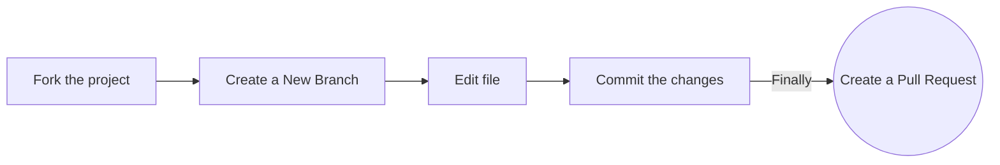

Thank you for considering contributing to recode hive! We welcome contributions from everyone. Whether you're a seasoned developer or just starting out, there are many ways to get involved and help improve recode hive. This document outlines the guidelines for contributing to this project.

## Getting Started

To get started with contributing to recode hive, please refer to our [Contributing Guidelines](/community/contributing-guidelines).

Follow these steps:



1. **Clone the repository:**

   ```bash
   git clone https://github.com/your-username/recodehive-website.git
   ```

2. **Navigate to the project directory:**

   ```bash
   cd recodehive-website
   ```

3. **Install dependencies:**

   ```bash
   npm install
   ```

4. **Running the Application:**

   Once you have installed the dependencies, you can run the application locally using:

   ```bash
   npm start
   ```

   This command will start a development server and open the application in your default web browser.

**If you'd like to contribute to recode hive, please follow these guidelines:**

- **Fork** the repository and clone it locally.
- Create a new branch for your feature or bug fix: `git checkout -b feature-name`
- Make your changes and test thoroughly.
- Commit your changes: `git commit -m "Brief description of your changes"`
- Push to the branch: `git push origin feature-name`
- Submit a pull request detailing your changes.

### Branding & Naming Conventions

- Use **`recode hive`** in lowercase for all mentions of the project name.
- Update any headers, titles, or utility constants accordingly.

### Formatting

- Follow the existing code style for spacing, indentation, and Markdown formatting.
- Use Prettier or ESLint to auto-format files before committing.

## Exceptions to Lowercase Branding

While we use lowercase **`recode hive`** throughout the project for consistency, there are some places where the exact repository name with capitalization must be used:

- Repository-specific badges (e.g., [contrib.rocks](https://contrib.rocks))
- GitHub repository URLs in tools or badges
- Any external services that require exact repo names

## License

This project is licensed under the [MIT License](/License).
