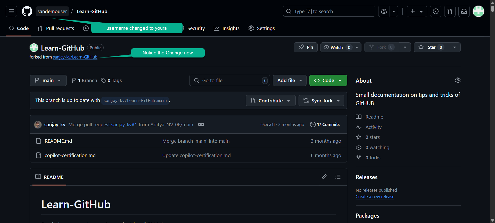

In this tutorial, you will learn how to fork a GitHub repository and create your own copy of a project that you can freely experiment with and contribute back to.

## What is Forking?

Forking a repository creates a personal copy of someone else's project in your GitHub account. This allows you to:
- Experiment with changes without affecting the original project
- Propose changes to the original project via pull requests
- Use someone else's project as a starting point for your own idea
- Contribute to open-source projects

## When Should You Fork?

You should fork a repository when you want to:
- Contribute to an open-source project
- Use an existing project as a template
- Experiment with code without affecting the original
- Create your own version of a project

## Steps to Fork a Repository

### Step 1: Navigate to the Repository

Go to the repository you want to fork.

Make sure you're logged into your GitHub account.

```text title="Repository URL"
https://github.com/sanjay-kv/Learn-GitHub
```

<BrowserWindow url="https://github.com/sanjay-kv/Open-source-Practice" bodyStyle={{padding: 0}}>    
  [](https://github.com/sanjay-kv/Open-source-Practice)
</BrowserWindow>

### Step 2: Click the Fork Button

In the top-right corner of the repository page, you'll see a "Fork" button. Click on it to start the forking process.

GitHub will show you a screen asking where you want to fork the repository (usually to your personal account).

<BrowserWindow url="https://github.com/sanjay-kv/Learn-GitHub/fork" bodyStyle={{padding: 0}}>    
  [](https://github.com/sanjay-kv/Learn-GitHub/fork)
</BrowserWindow>

### Step 3: Wait for the Fork to Complete

GitHub will create a copy of the repository under your account. This process usually takes a few seconds. Once complete, you'll be redirected to your forked repository.

<BrowserWindow url="https://github.com/sandemouser/Learn-GitHub" bodyStyle={{padding: 0}}>    
  [](https://github.com/sandemouser/Learn-GitHub)
</BrowserWindow>

### Step 4: Verify Your Fork

After forking, you should see:
- The repository name with your username: `yourusername/Learn-GitHub`
- A note indicating "forked from sanjay-kv/Learn-GitHub"
- All the files and branches from the original repository


:::tip Best Practices for Forking and Contributing

- **Always fork before contributing** to open-source projects
- **Keep your fork synced** with the original repository regularly
- **Create descriptive branch names** for different features or fixes
- **Write clear commit messages** explaining what and why
- **Follow the project's contribution guidelines** if they exist
- **Test your changes** before submitting a pull request
- **Be respectful and patient** when waiting for pull request reviews
- **Start with small contributions** to understand the project's workflow

:::

## Fork vs Clone

Understanding the difference is important:

| Aspect | Fork | Clone |
|--------|------|-------|
| **Location** | Creates a copy on GitHub | Creates a copy on your local machine |
| **Purpose** | Contributing to others' projects | Working on your own or cloned projects |
| **Connection** | Maintains link to original repo | No direct link to original repo |
| **Visibility** | Public on your GitHub profile | Only on your computer |


## Deleting a Fork

If you no longer need your fork:

1. Go to your forked repository
2. Click "Settings"
3. Scroll to the bottom
4. Click "Delete this repository"
5. Confirm by typing the repository name

:::warning
Deleting a fork is permanent and cannot be undone. Make sure you have backed up any important changes.
:::

## Conclusion

Forking is a powerful feature that enables collaboration and experimentation in the GitHub ecosystem. By forking repositories, you can contribute to open-source projects, learn from others' code, and create your own versions of existing projects without affecting the original.

