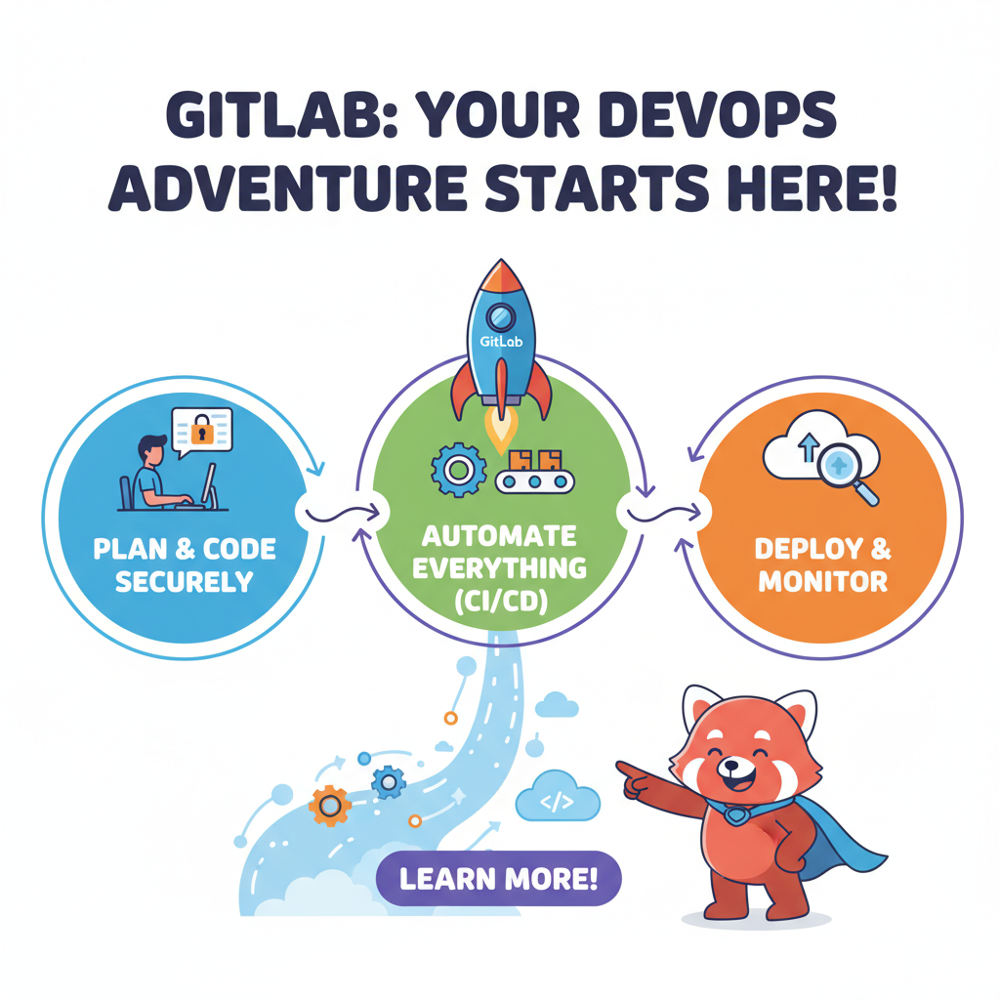
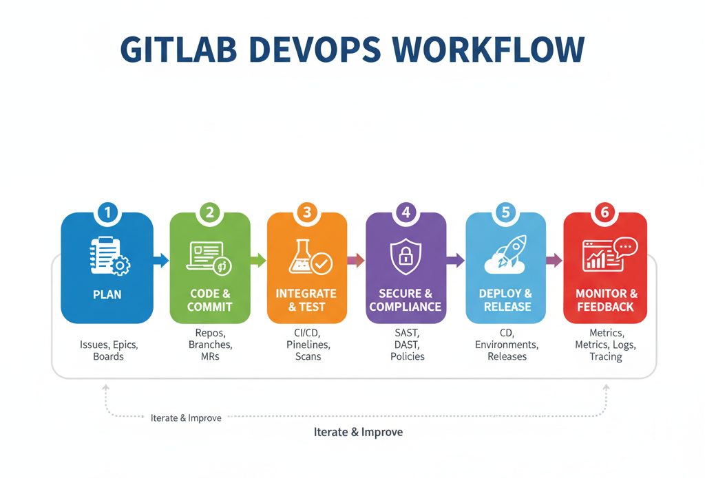

GitLab is a web-based DevOps lifecycle tool that provides a **Git repository manager**, issue tracking, continuous integration/continuous deployment (CI/CD) pipelines, and more. It is similar to GitHub but focuses heavily on providing an **all-in-one platform** for software development and DevOps.

:::note
Key Features of GitLab:
- GitLab is not only a Git-based repository management tool but also provides **built-in CI/CD pipelines**.  
- Unlike GitHub, GitLab can be **self-hosted** as well as used on the cloud (GitLab.com).  
- GitLab offers <a href="https://about.gitlab.com/pricing/">Premium Plans</a> with advanced CI/CD, security, compliance, and scalability features.
:::

---

## How to start with GitLab?

When developers create new projects or collaborate on existing ones, they need a place to host, version, and automate their workflows. GitLab provides this with the **additional advantage of integrated DevOps tools** such as issue boards, pipelines, and monitoring.

Other alternatives include GitHub, Bitbucket, and Azure Repos. GitLab is often preferred in organizations where **self-hosting** and **end-to-end DevOps** automation are critical.

:::info
In the picture below, you can see multiple developers working on the same project. For example, Developer 1 handles the backend APIs, Developer 2 builds the frontend interface, and Developer 3 manages CI/CD pipeline setup.

Each developer works on their local copy of the repository and pushes their changes to the **remote GitLab repository**. After a merge request (MR) review, the maintainer merges the changes into the main branch. GitLab can then automatically trigger a **pipeline** to build, test, and deploy the new version of the project.
:::

<BrowserWindow url="https://gitlab.com/" bodyStyle={{padding: 0}}>    
   
</BrowserWindow>

---

## Why Learn GitLab?

GitLab is more than just version control—it provides a complete DevOps platform.  
Here’s why you should learn it:

1. **Integrated DevOps** – GitLab includes planning, coding, testing, security, deployment, and monitoring in one place.  
2. **Self-hosting option** – Unlike GitHub, GitLab allows organizations to run GitLab on their own servers.  
3. **Automation with CI/CD** – GitLab’s pipelines make testing and deployment faster and less error-prone.  
4. **Collaboration** – Teams can manage issues, boards, milestones, and code reviews easily.  
5. **Industry demand** – Many companies prefer GitLab for its **security compliance** and DevOps workflows.  

---

## How to Learn GitLab?

To get started with GitLab, here are the recommended steps and prerequisites:

:::info
### 🔑 Prerequisites:
- **Basic Git Knowledge**: Understand commands like `git clone`, `git add`, `git commit`, `git push`.  
- **Programming Knowledge**: Any language is fine (Python, JavaScript, Java, etc.).  
- **Command Line Basics**: Comfortable using a terminal (Linux, macOS, or Windows PowerShell).  
- **Optional (for CI/CD)**: Docker basics, YAML syntax (for writing pipeline configs).

---

### 📝 Learning Path:
1. **Create an account** on [GitLab.com](https://gitlab.com/).  
2. **Install Git** on your system to interact with GitLab repositories.  
3. **Start a new project** or fork an existing repository.  
4. **Explore GitLab features**: issues, merge requests, labels, and boards.  
5. **Learn GitLab CI/CD** by creating `.gitlab-ci.yml` for automating builds/tests.  
6. **Advance**: Learn GitLab Runners, environment variables, and deployment.  

:::

---

### Watch the video Tutorial
<iframe width="880" height="480" src="https://www.youtube.com/embed/HSV-Kky9N5E" title="GitLab Beginner Tutorial | How to start with GitLab in 2024" frameborder="0" allow="accelerometer; autoplay; clipboard-write; encrypted-media; gyroscope; picture-in-picture; web-share" referrerpolicy="strict-origin-when-cross-origin" allowfullscreen></iframe>

---

## Conclusion

GitLab is not just a code hosting tool—it’s a **complete DevOps ecosystem**. By learning GitLab, you gain both Git skills and practical experience with **automation pipelines, deployments, and project management tools**.  

In the next tutorial, we will explore how to create your first GitLab project, push code to it, and set up a CI/CD pipeline.
