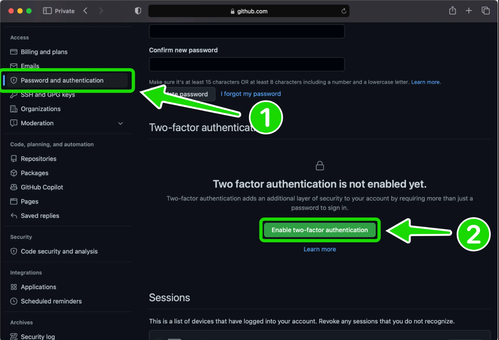

GitHub is a platform for version control of your software development using Git. GitHub was founded in 2008 and was recently acquired by Microsoft, who is now the parent organization. Setting up is a straightforward process: first, create a GitHub account online, then install Git on your system and connect it with GitHub. This way, any changes made will be pushed directly to GitHub.

### Step 1: Let’s create a GitHub Account

To create a GitHub account, go to the [GitHub Website](https://github.com/) and sign up using your email ID.

<BrowserWindow url="https://github.com/" bodyStyle={{padding: 0}}>
 
</BrowserWindow>

### Step 2: Finishing the account creation

Choose a readable username; this is important, just like your LinkedIn username. After completing the signup process, you may be prompted to solve a puzzle as part of the verification.

**Live Server:** GitHub signup screen  
   <BrowserWindow url="https://github.com/" bodyStyle={{padding: 0}}>
    
   </BrowserWindow>

**Features you receive:** On completing registration, you gain access to GitHub Copilot, unlimited repositories, built-in tools for code quality improvement, automated workflows with Actions, and support from the community.

   <BrowserWindow url="https://github.com/signin" bodyStyle={{padding: 0}}>
    
   </BrowserWindow>

After signing in, you may be asked to authorize Giscus (the comment feature by GitHub). Click on "Authorize".
Click the top right profile icon, then select "Your profile" to view your profile.

### Step 3: Understanding the Interface

As the next step, GitHub will ask you to verify your account. Check your email inbox for a verification mail, and confirm to proceed. After verification, you will be redirected to your GitHub page (example below), which will show your verified status.

<BrowserWindow url="https://github.com/sanjay-kv" bodyStyle={{padding: 0}}>
 
</BrowserWindow>

### Step 4: Personalize and Secure Your Account

After verifying your email and accessing your GitHub dashboard, take a moment to personalize and secure your account. Add a profile picture to make your account recognizable, fill out your bio with your background or interests, and link relevant social media or websites. Review your account security settings—enable two-factor authentication to strengthen your protection. Updating profile details and enabling security features ensures a professional, secure GitHub presence for future collaborations.

### Step 5: Final Step — Secure Your GitHub Account

Congratulations on setting up your GitHub account! Before exploring further, it’s critical to secure your account using multi-factor authentication (2FA).

**Why enable multi-factor authentication (2FA)?**  
2FA adds an extra layer of security by requiring both your password and a unique verification code from your mobile device whenever you sign in. This prevents unauthorized access, even if your password is compromised, keeping your code and personal information safe.

**How to enable 2FA on GitHub:**

1. Click your profile picture in the top right, then click **Settings**.
2. In the left sidebar under **Access**, select **Password and authentication**.
3. Find the **Two-factor authentication** section and click **Enable two-factor authentication**.
4. Choose your preferred method (an authenticator app is recommended), and scan the displayed QR code with the app on your phone.
5. Enter the code generated by your authenticator app, or use an SMS code if you chose that method.
6. Save your recovery codes in a safe place—these allow you to regain access if you lose your phone.
7. Confirm that you have saved your recovery codes and finish setup.

<BrowserWindow url="https://github.com/sanjay-kv" bodyStyle={{padding: 0}}>
 
</BrowserWindow>

Now, 2FA is enabled on your account. Every time you log in, you’ll need both your password and a unique code—making your account far more secure.

**Dashboard recap:**

1. **5** – Displays your unique username.
2. **6** – The section where you create and view all your projects and repositories.
3. **7** – GitHub AI features that provide coding assistance, similar to ChatGPT.
4. **8** – Advanced settings for changing your username, theme, and other preferences, including 2FA.
5. **9** – Your activity on GitHub is tracked here, shown as green check boxes (visit around Halloween for a seasonal surprise!).
6. **10** – Shows a summary of your monthly activity; you can set this visibility to private if desired.

## Conclusion

Thank you for reading “How to create a GitHub Account?”. In the next post, you'll learn how to use Git to create a repository and clone a project from GitHub.

Signing off, Sanjay Viswanathan.
