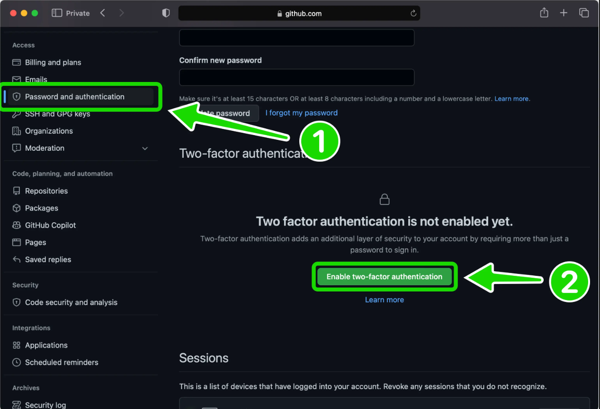

GitHub is a code hosting platform built on top of Git. It was founded in 2008 and acquired by Microsoft in 2018. If you are just getting started, the setup is simple, you create a free account on GitHub's website, install Git on your machine, and link the two together so your local changes can be pushed to the cloud.

### Step 1: Let's create a GitHub Account

To create a GitHub account, go to the [GitHub Website](https://github.com/) and sign up using your email ID.

<BrowserWindow url="https://github.com/" bodyStyle={{padding: 0}}>
 
</BrowserWindow>

### Step 2: Finishing the account creation

Pick a username that is easy to read and remember, think of it the same way you would choose a professional username on LinkedIn. Once you complete the signup form, GitHub will ask you to solve a quick puzzle to confirm you are human.

**Live Server:** GitHub signup screen  
   <BrowserWindow url="https://github.com/" bodyStyle={{padding: 0}}>
    
   </BrowserWindow>

**What you get with a free account:** Once registered, you can create unlimited public and private repositories, use GitHub Copilot for coding assistance, set up automated workflows with GitHub Actions, and access a large developer community for support and collaboration.

   <BrowserWindow url="https://github.com/signin" bodyStyle={{padding: 0}}>
    
   </BrowserWindow>

After signing in, you may be asked to authorize Giscus (the comment feature by GitHub). Click on "Authorize".
Click the top right profile icon, then select "Your profile" to view your profile.

### Step 3: Understanding the Interface

GitHub will send a verification email to the address you signed up with. Open that email and click the confirmation link. Once verified, you will be taken to your GitHub dashboard where your account status will show as confirmed.

<BrowserWindow url="https://github.com/sanjay-kv" bodyStyle={{padding: 0}}>
 
</BrowserWindow>

### Step 4: Personalize and Secure Your Account

With your account verified, spend a few minutes making it your own. Upload a profile photo so collaborators can recognize you, write a short bio describing what you work on, and add links to your website or other profiles. While you are in settings, head over to the security section and turn on two-factor authentication this is covered in detail in the next step.

### Step 5: Final Step: Secure Your GitHub Account

Congratulations on setting up your GitHub account! Before you start exploring, take a few minutes to turn on two-factor authentication (2FA). This is one of the most effective ways to protect your account.

**Why does 2FA matter?**  
When you log in with only a password, anyone who gets hold of that password can access your account. With 2FA turned on, logging in requires a second step a short code generated by an app on your phone. Even if someone steals your password, they still cannot get in without that code.

**How to turn on 2FA:**

1. Click your profile picture in the top right corner and open **Settings**.
2. In the left menu, look under **Access** and click **Password and authentication**.
3. Scroll to the **Two-factor authentication** section and click the button to enable it.
4. Select an authenticator app as your method, this is more reliable than SMS. Open the app on your phone and scan the QR code shown on screen.
5. Type in the six-digit code your app generates to confirm everything is connected.
6. GitHub will give you a set of recovery codes. Save these somewhere safe, a password manager or a printed copy stored securely. These are the only way back in if you ever lose access to your phone.
7. Complete the setup and you are done.

<BrowserWindow url="https://github.com/sanjay-kv" bodyStyle={{padding: 0}}>
 
</BrowserWindow>

From this point on, every login will ask for both your password and a fresh code from your authenticator app.

**Dashboard recap:**

1. **5** – Displays your unique username.
2. **6** – The section where you create and view all your projects and repositories.
3. **7** – GitHub AI features that provide coding assistance, similar to ChatGPT.
4. **8** – Advanced settings for changing your username, theme, and other preferences, including 2FA.
5. **9** – Your activity on GitHub is tracked here, shown as green check boxes (visit around Halloween for a seasonal surprise!).
6. **10** – Shows a summary of your monthly activity; you can set this visibility to private if desired.

## Conclusion

Thank you for reading "How to create a GitHub Account?". In the next post, you'll learn how to use Git to create a repository and clone a project from GitHub.

Signing off, Sanjay Viswanathan.
