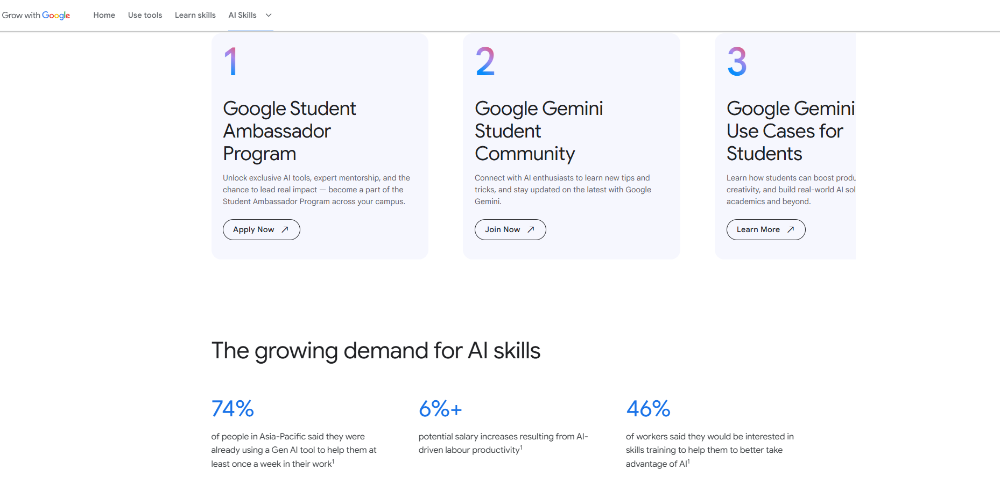

import Layout from "@theme/MDXComponents";

# How to be Google Student Ambassador 2025

Become a Google Campus Ambassador: Lead the AI Movement at Your College.
Are you passionate about **AI** and eager to make a difference in your college community?  This could be **your moment to shine**. ✨

Google has officially launched the **Google Student Ambassador Program**, a nationwide initiative to bring the power of **Gemini AI** to college campuses across India. As a **Gemini Student Ambassador**, you’ll not only represent Google at your university but also inspire, educate, and lead the AI revolution among your peers.

---

    <BrowserWindow url="https://grow.google/intl/en_in/ai-skills/" bodyStyle={{padding: 0}}>    
     
    </BrowserWindow>

## Why This Program Matters 🔥
AI is shaping the future—fast. This program is your chance to **become a recognized leader** in this transformative space, while gaining hands-on experience that can supercharge your career.
Applications close soon. Don’t miss your chance to represent Google Gemini AI on your campus and shape the future of tech from the front lines.

**This isn’t just a title**. It’s an opportunity to: 👇🏻
- **Build leadership skills** by organizing campus events and workshops.
- **Network with Google experts** and industry mentors.
- **Showcase your achievements** with an official certification and Ambassador badge.
- **Stand out to future employers** with a role that blends technology, community building, and leadership.

  <iframe
    width="858"
    height="410"
    src="https://www.youtube.com/embed/BnccvBpY8Dg"
    title="Google Student Ambassador 2025 – Your Big Break! 🎁"
    frameBorder="0"
    allow="accelerometer; autoplay; clipboard-write; encrypted-media; gyroscope; picture-in-picture; web-share"
    referrerPolicy="strict-origin-when-cross-origin"
    allowFullScreen
  />

## 🙋🏻‍♂️ Got Questions & What Happens Next?

We know you might have more questions—and that’s totally okay!  
But here’s what we say for now: **Don’t overthink it.**

    <BrowserWindow url="https://grow.google/intl/en_in/ai-skills/" bodyStyle={{padding: 0}}>    
     
    </BrowserWindow>

---

## 📥 How to Apply
Just apply for the program using the link below and take the first step towards becoming
 a **Google Student Ambassador**. Check out the other documentation in detail on step by step to apply for the program.

👉 **[Apply Now for the Google Student Ambassador Program](https://event.recodehive.com/gemini)**

---

## 👨‍🎓 About the Program (FAQ)

### Q1. What is the program all about?
As a **Google Student Ambassador**, you'll lead the **AI movement** on your campus.  
Host events, spark conversations, and help your peers explore **Google Gemini** all while gaining **leadership**, **tech**, and **community-building** experience.

---

### Q2. Who can apply?
You're eligible if you:

- ✔ **Are 18+** and enrolled in a college/university in India  
- ✔ Can commit **5–7 hours/week** from **July to December 2025**  
- ✔ Have **strong communication skills**  
- ✔ Are **passionate about technology** and **building communities**  
---

### Q3. How much time is required?
You’ll need to dedicate **around 5–6 hours per week**.  
The program runs from **July to December 2025**—so plan accordingly.

---

<GiscusComments/>

