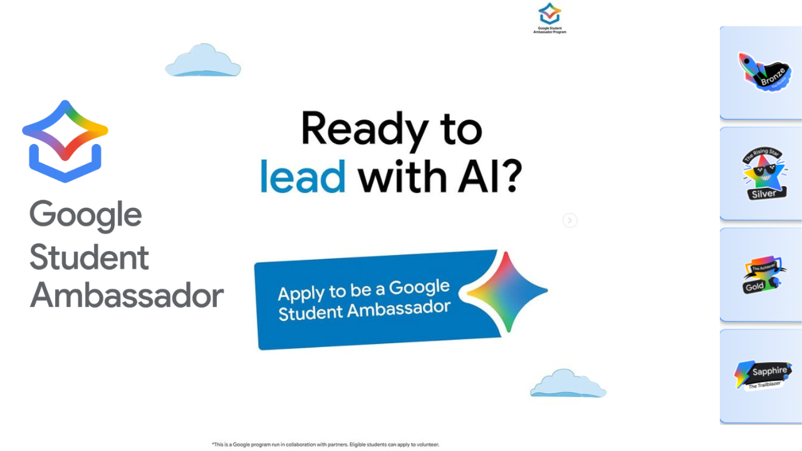
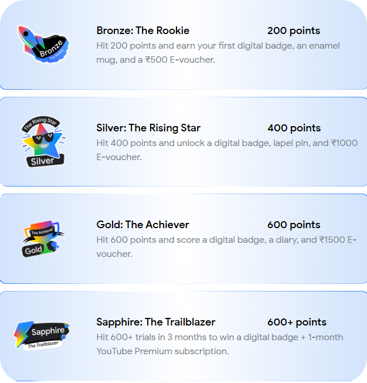
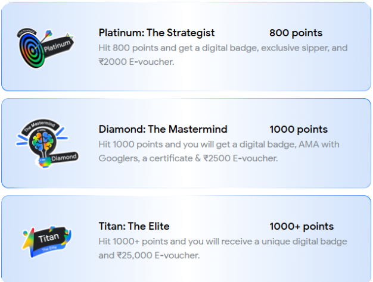

import Layout from "@theme/MDXComponents";

# Google Student Ambassador Swags and rewards

The Google Student Ambassador Program is selecting three ambassadors from each of over 1,500 colleges across India to represent Gemini AI on campus,
 run over 200 Gemini prompts each month, organize AI events, workshops, and challenges, share monthly insights and community reports, and build awareness to spark AI conversations.

---

    <BrowserWindow url="https://aiskillshouse.com/ambassador-program" bodyStyle={{padding: 0}}>    
     
    </BrowserWindow>

## Why This Program Matters 🔥
The Google Gemini Student Community in India, managed by Google LLC Google, 
aims to better understand the learning needs, interests, and ideas of undergraduate students like you. 
It also provides early access to products, tools, and resources currently in development. The feedback we 
collect will help Google enhance its products and services for students worldwide.

## 🎁 What’s in it for you?

- 🏅 **Ambassador Badge** – Flaunt it proudly on your resume.  
- 🎓 **Official Certification & Rewards** – From Google.  
- 🤝 **Mentorship & Interaction** – Learn directly from Google experts.  
- 🧢 **Exclusive Swag** – Gemini merch and goodies.  
- ✨ **Event Invitations** – Access to Google events & meetups.  
- 💡 **Gemini AI Champion Course** – Enroll and boost your AI expertise.  

👉 **[Apply Now](https://event.recodehive.com/gemini)**

  <iframe
    width="410"
    height="728"
    src="https://www.youtube.com/embed/Y0vxk5m1pSU"
    title="Google Student Ambassador 2025 – Your Big Break! 🎁"
    frameBorder="0"
    allow="accelerometer; autoplay; clipboard-write; encrypted-media; gyroscope; picture-in-picture; web-share"
    referrerPolicy="strict-origin-when-cross-origin"
    allowFullScreen
  />

## 🎖️Reward Structure
Here’s how the reward categories will be during the Student Ambassador Program:

We know you might have more questions—and that’s totally okay!  
But here’s what we say for now: **Don’t overthink it.** These are amazon vouchers will be distributed when you get enough points.

  
  

## 📥 How to Apply
Just apply for the program using the link below and take the first step towards becoming
 a **Google Student Ambassador**. Check out the other documentation in detail on step by step to apply for the program.

👉 **[Apply Now for the Google Student Ambassador Program](https://event.recodehive.com/gemini)**

---

# 🔗 Resources & Links

- 🌐 **Full Details:** [Google Student Ambassador](https://event.recodehive.com/gemini)
- 📝 **To Register:** [Google Gemini CA Registration](https://event.recodehive.com/gemini)
- ⚙️ **Official Site:** [AI Skills House](https://aiskillshouse.com)

  

  <GiscusComments/>