# Google Gemini AI Pro Plan - Free One-Year Offer for Indian Students

[Click here to activate it](https://one.google.com/explore-plan/ai-premium-student?utm_source=gemini&utm_medium=web&utm_campaign=gemini_students_in_others&_gl=1*qdkg7n*_gcl_au*ODI4OTY4MDUyLjE3NTUwNTUzODg.*_ga*NTIyNzM0NzU2LjE3NTUwNTUzODk.*_ga_WC57KJ50ZZ*czE3NTUwNTUzODgkbzEkZzEkdDE3NTUwNTU0MjUkajIzJGwwJGgw)

Google is offering an exclusive free one-year subscription to the **Gemini AI Pro Plan** for Indian students aged 18 and above. This advanced AI tool assists with academic tasks such as smart note-taking, writing enhancement, exam preparation, deep research, essay management, and homework efficiency. The plan also includes **2TB of cloud storage** integrated with Gmail Drive and Google Photos, ensuring ample space for academic and personal data.

## Highlights  
- 🎓 Free access to Gemini AI Pro Plan for Indian students (18+ years).  
- 📚 AI tools assist with homework, exams, notes, essays, and research.  
- ☁️ Includes 2TB cloud storage with Gmail Drive and Photos integration.  
- ✅ Eligibility: Enrolled in higher education, age 18+, and use of official student email.  
- 🔄 Verification via refundable ₹2 charge using student email.  
- 🚀 Access to Google Flow AI with 1000 free creative video credits.  
- ⏳ One-year free trial; ₹1950/year subscription after trial unless canceled.  

---

## How to get started

**Step 1**: Head into the official Google student ambassdor website. Then click on avail button, which will redirect you to the official gemini website.

**Step 2**: This is the Google Gemini page for student offer, note this offer is only for 1 year and you need to sign up before 15 Sept 2025.

    <BrowserWindow url="https://gemini.google/students/" bodyStyle={{padding: 0}}>    
     [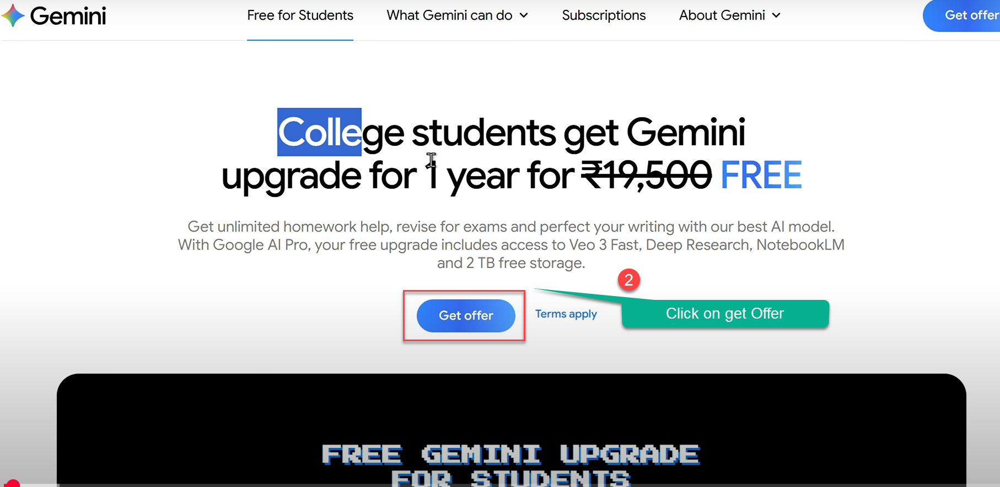](https://one.google.com/explore-plan/ai-premium-student?utm_source=gemini&utm_medium=web&utm_campaign=gemini_students_in_others&_gl=1*qdkg7n*_gcl_au*ODI4OTY4MDUyLjE3NTUwNTUzODg.*_ga*NTIyNzM0NzU2LjE3NTUwNTUzODk.*_ga_WC57KJ50ZZ*czE3NTUwNTUzODgkbzEkZzEkdDE3NTUwNTU0MjUkajIzJGwwJGgw)
    </BrowserWindow>

### 🛡️ Strict Eligibility and Verification  
Using official student emails and verification ensures genuine access and maintains program integrity.

**Step 3**: This is the page to verify your identity, you will be redirected to sheer ID a 3rd party app which verify your student details. 

    <BrowserWindow url="https://gemini.google/students/" bodyStyle={{padding: 0}}>    
     [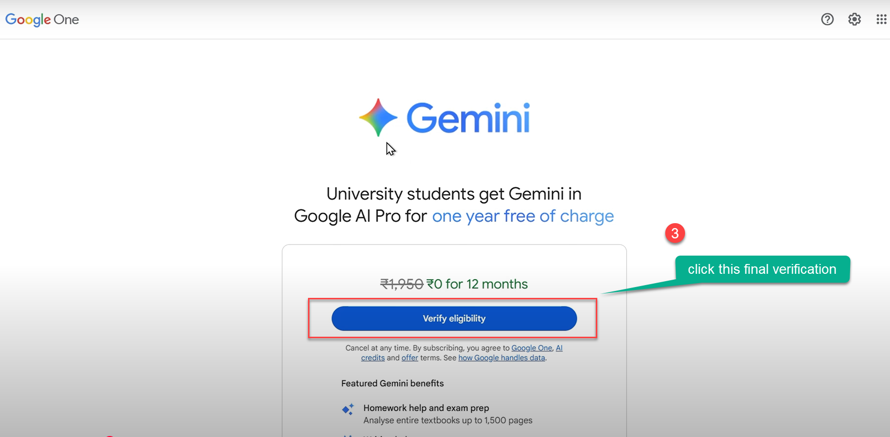](https://one.google.com/explore-plan/ai-premium-student?utm_source=gemini&utm_medium=web&utm_campaign=gemini_students_in_others&_gl=1*qdkg7n*_gcl_au*ODI4OTY4MDUyLjE3NTUwNTUzODg.*_ga*NTIyNzM0NzU2LjE3NTUwNTUzODk.*_ga_WC57KJ50ZZ*czE3NTUwNTUzODgkbzEkZzEkdDE3NTUwNTU0MjUkajIzJGwwJGgw)
    </BrowserWindow>

**Step 3**: This section will ask more details about your DOB, name, Insititution details, make sure you enter proper details. 

    <BrowserWindow url="https://gemini.google/students/" bodyStyle={{padding: 0}}>    
     [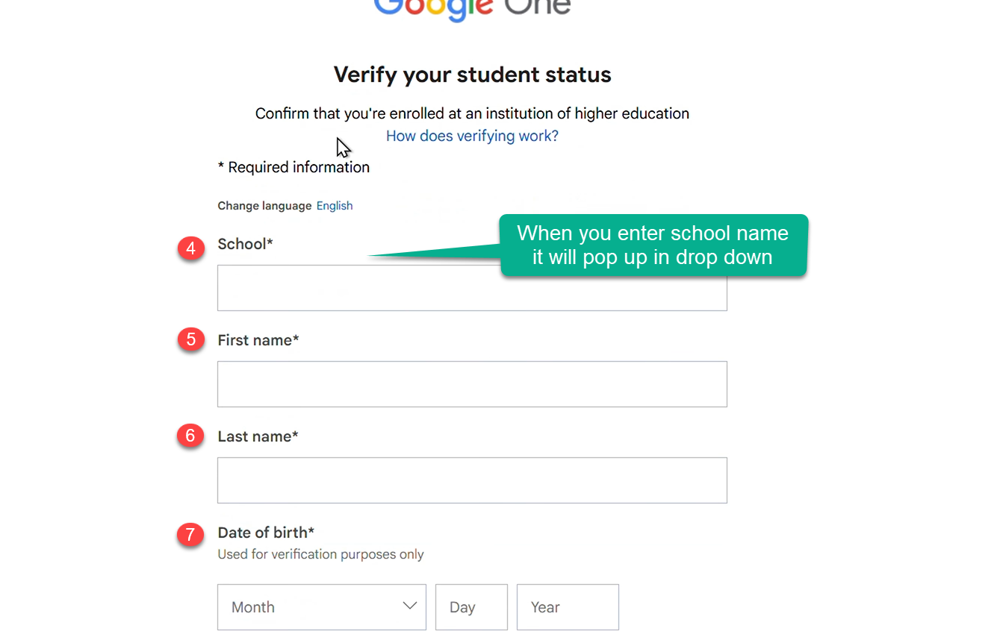](https://one.google.com/explore-plan/ai-premium-student?utm_source=gemini&utm_medium=web&utm_campaign=gemini_students_in_others&_gl=1*qdkg7n*_gcl_au*ODI4OTY4MDUyLjE3NTUwNTUzODg.*_ga*NTIyNzM0NzU2LjE3NTUwNTUzODk.*_ga_WC57KJ50ZZ*czE3NTUwNTUzODgkbzEkZzEkdDE3NTUwNTU0MjUkajIzJGwwJGgw)
    </BrowserWindow>

**Step 4**: This is next step which take you to your school portal or account, so you need to sign in with Student email and password.
    <BrowserWindow url="https://gemini.google/students/" bodyStyle={{padding: 0}}>    
     [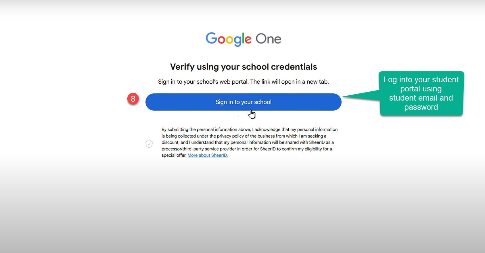](https://gemini.google/students/)
    </BrowserWindow>   

## Step 5: Sign in with Google
- In most cases, it will redirect you to log in with your **Gmail account**.
- **Important:** Use your **university-issued email address** (e.g., `@mgcub.ac.in`).

    <BrowserWindow url="https://gemini.google/students/" bodyStyle={{padding: 0}}>    
     [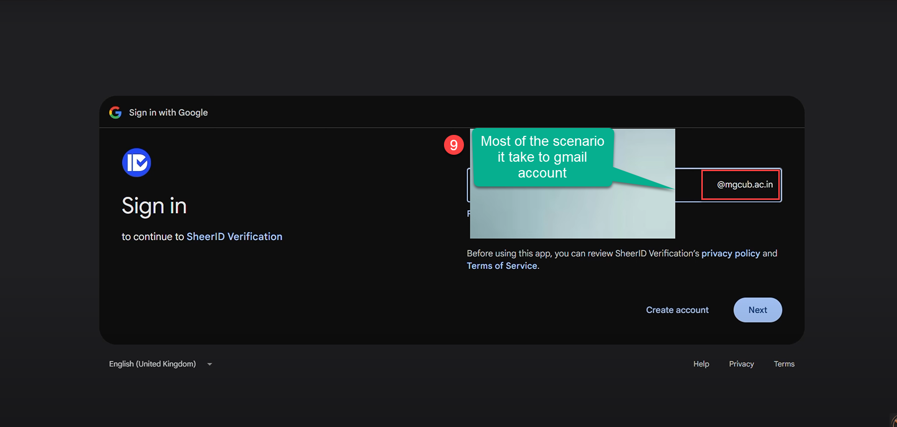](https://gemini.google/students/)
    </BrowserWindow>   
---

**Note**: For some of you, the school details wont be available in drop down so type **other
Check the down this Tutorial to see further steps. (If you school is not listed)

 ## Step 6: SheerID Verification
- The process will connect to **SheerID** to confirm your student status.
- Follow the on-screen instructions. Verification Pending Once submitted, you’ll see a **Verification Pending** screen. This is usually an **instant process**.
    <BrowserWindow url="https://gemini.google/students/" bodyStyle={{padding: 0}}>    
     [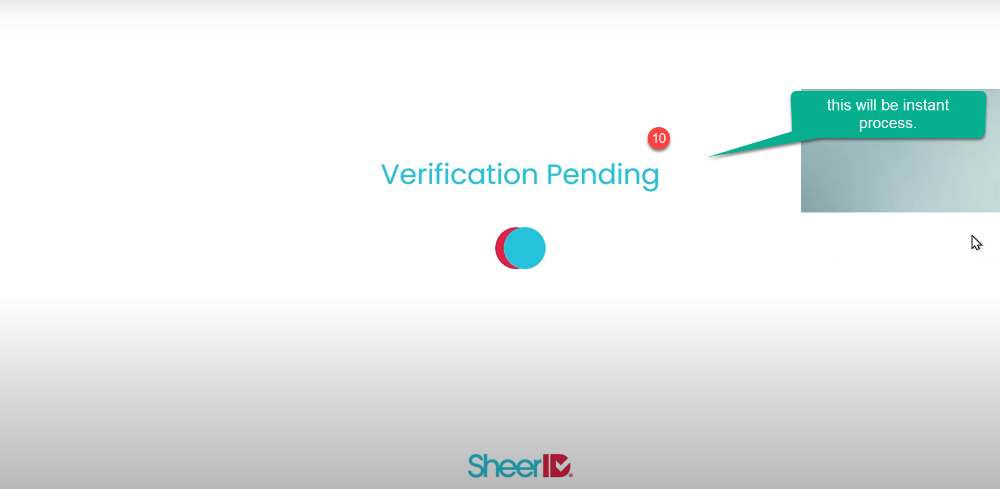](https://gemini.google/students/)
    </BrowserWindow>   

**Step 7**:  Activate Google AI Pro
- Once verified, you’ll see a confirmation screen.
- Click the **Get Google AI Pro** button to activate your 1-year subscription at no cost.
 
    <BrowserWindow url="https://gemini.google/students/" bodyStyle={{padding: 0}}>    
     [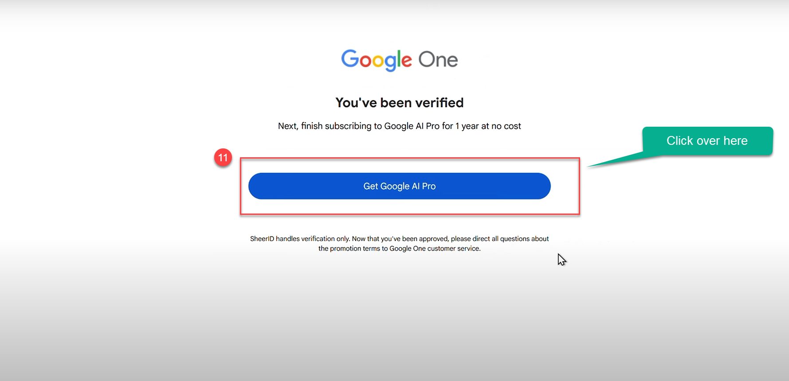](https://gemini.google/students/)
    </BrowserWindow>   

**Step 7**: This screen appear again to get the student offer, dont get confuse, this is the last stage of verification.
    <BrowserWindow url="https://gemini.google/students/" bodyStyle={{padding: 0}}>    
     [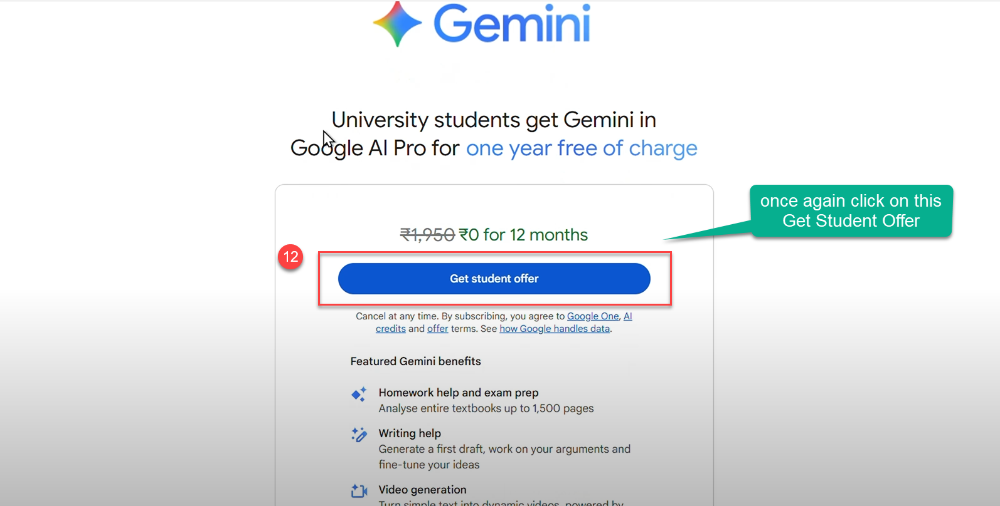](https://gemini.google/students/)
    </BrowserWindow>   

**Step 8**: Select your payment method
   Choose one of the available options
   
    (e.g., **Add card**, **Redeem code**, **Pay on your phone**, or **Pay with UPI** in supported regions).  
   I suggest to use UPI ID as many of you have the UPI account rather than a credit card.
    <BrowserWindow url="https://gemini.google/students/" bodyStyle={{padding: 0}}>    
     [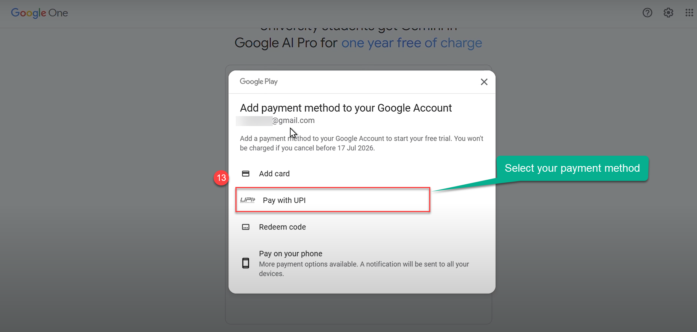](https://gemini.google/students/)
    </BrowserWindow>   

**Step 9**: Now verify all the details over there, like the pricing and payment method, in the next step you will be using this.
    <BrowserWindow url="https://gemini.google/students/" bodyStyle={{padding: 0}}>    
     [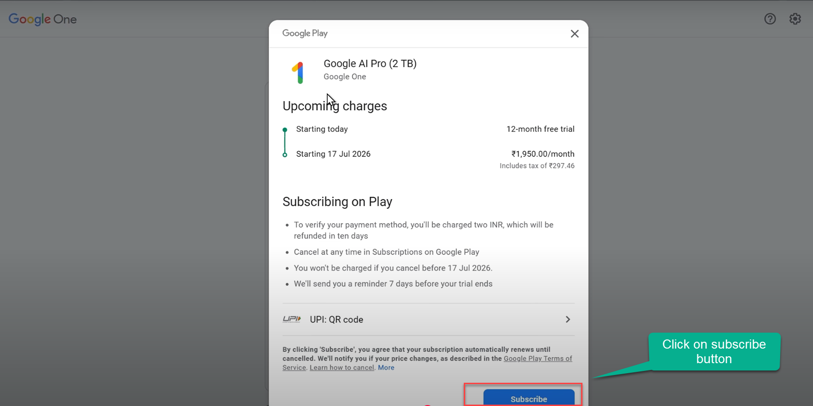](https://gemini.google/students/)
    </BrowserWindow>   

 ## Step 10: Adding Card or Payment Method
 
 This step shows how to finish the UPI verification for the Google One / Gemini student offer. You are only authorizing an AutoPay mandate here; no money is taken at this point.

## 1. On Your Computer
- You will see a panel titled **"Scan QR code to use UPI"**.
- The merchant will display as **Google One** with a short timer (usually ~5 minutes).
- **Do not close this panel.**
- If the timer expires, refresh or regenerate the QR code and try again.

## 2. On Your Phone
1. Open your preferred **UPI app** (e.g., Google Pay, PhonePe, Paytm, BHIM).
2. Tap the app’s **Scan** feature.
3. Point your phone’s camera at the QR code shown on your computer screen.
4. When recognized, your app will display a request to **set up/approve UPI AutoPay** for Google One.
5. Review the details:
   - **Merchant** should be **Google One**.
   - You are authorizing the mandate — *you won’t be charged now*.
6. Tap **Approve**, **Authorize**, or **Confirm** (wording varies by app).
7. Enter your **UPI PIN** if prompted.

    <BrowserWindow url="https://gemini.google/students/" bodyStyle={{padding: 0}}>    
     [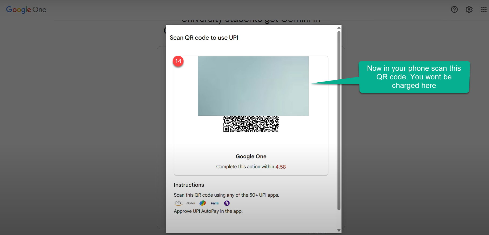](https://gemini.google/students/)
    </BrowserWindow>   

**Step 11**: Once the payment method is successful you will be able to see the screen of subscribed. 
    <BrowserWindow url="https://gemini.google/students/" bodyStyle={{padding: 0}}>    
     [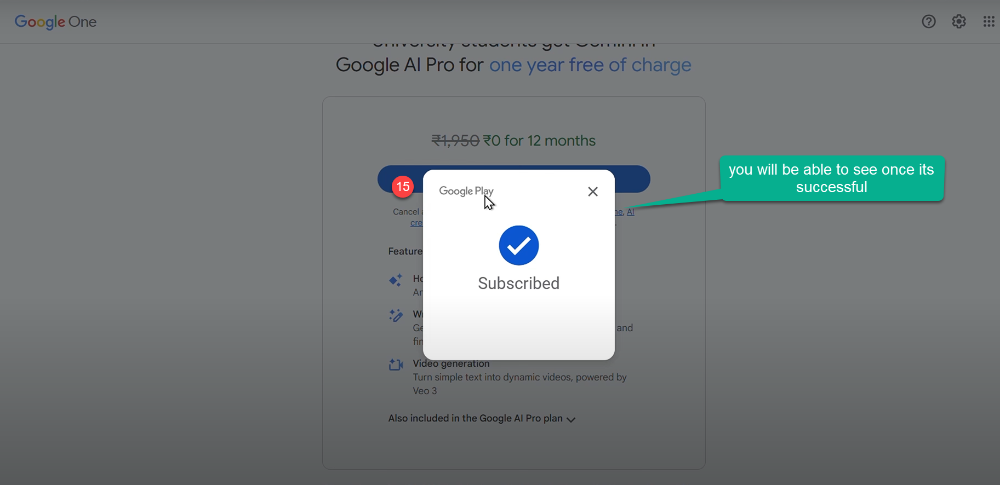](https://gemini.google/students/)
    </BrowserWindow>   

**Step 12**: Enjoy Gemini, NotebookLM, and more with Google AI Pro.

## Benefits

✅ Access to our most capable models and premium features  
✅ Create high-quality videos with **Veo** models  
✅ More access to **Gemini** features, including **Deep Research**  
✅ 5× more Audio Overviews and sources in **NotebookLM**  
✅ Gemini in Gmail, Docs, and more  
✅ 2 TB of total storage and additional premium benefits  

    <BrowserWindow url="https://gemini.google/students/" bodyStyle={{padding: 0}}>    
     [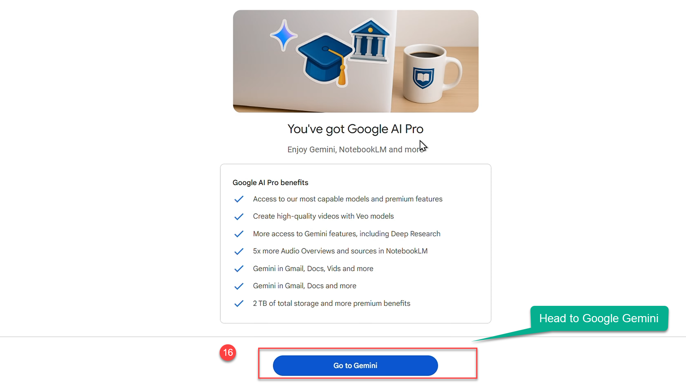](https://gemini.google/students/)
    </BrowserWindow>   

## What to do if your School is not available in the list 

---

**Step 13**: Make sure you type the others in School, if you confused where you got this screen refer to step 3

    <BrowserWindow url="https://gemini.google/students/" bodyStyle={{padding: 0}}>    
     [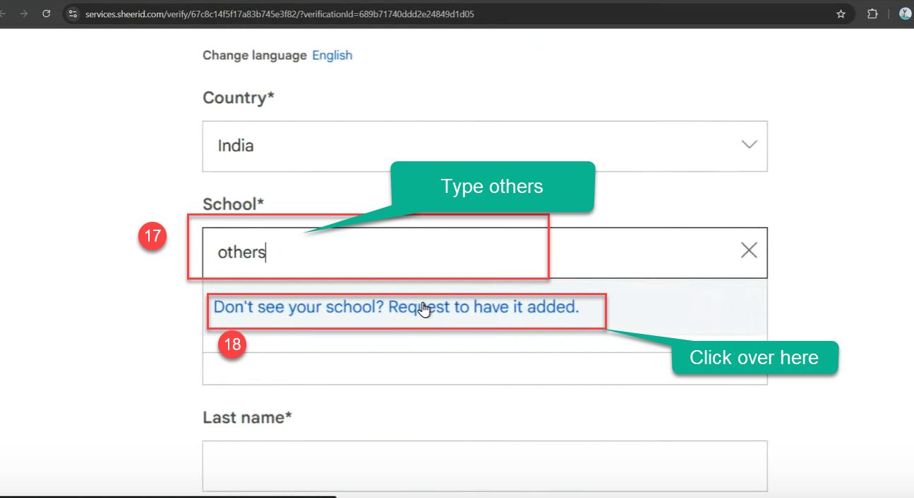](https://gemini.google/students/)
    </BrowserWindow>   

**Step 14**: You manually add your school details over here to verify.

    <BrowserWindow url="https://gemini.google/students/" bodyStyle={{padding: 0}}>    
     [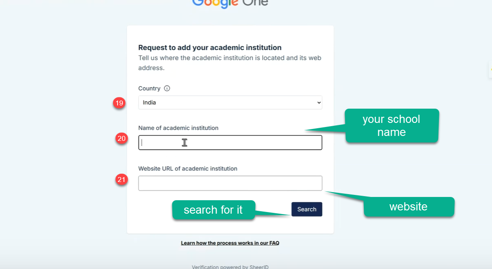](https://gemini.google/students/)
    </BrowserWindow>   

## Tips & Troubleshooting

- If the student verification fails, retry with your official university email and ensure your institution is supported.  
- If you don’t see **UPI**, pick any listed method available in your country/region.  
- You can change or remove your payment method later from **pay.google.com**.  
- Always review the offer’s **renewal date and pricing** shown during signup.
- Never try to log in or redeem multiple times, it will show the below screen.

    <BrowserWindow url="https://gemini.google/students/" bodyStyle={{padding: 0}}>    
     [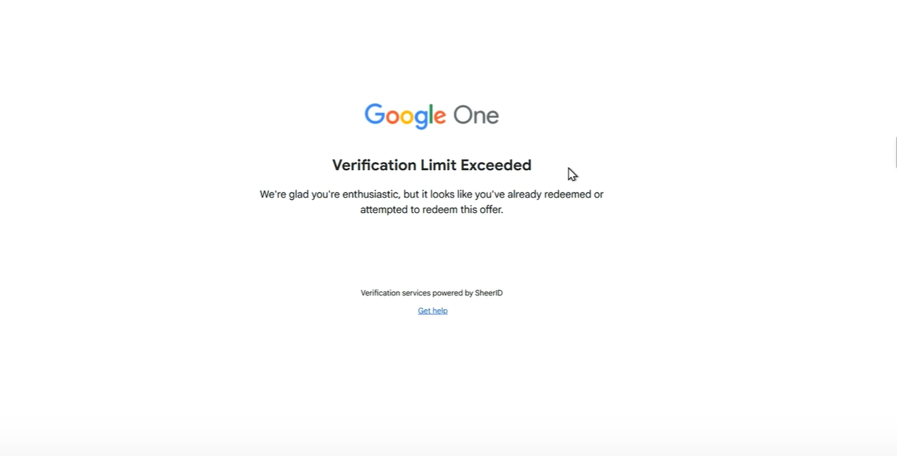](https://one.google.com/explore-plan/ai-premium-student?utm_source=gemini&utm_medium=web&utm_campaign=gemini_students_in_others&_gl=1*qdkg7n*_gcl_au*ODI4OTY4MDUyLjE3NTUwNTUzODg.*_ga*NTIyNzM0NzU2LjE3NTUwNTUzODk.*_ga_WC57KJ50ZZ*czE3NTUwNTUzODgkbzEkZzEkdDE3NTUwNTU0MjUkajIzJGwwJGgw)
    </BrowserWindow>   

## Support

If you need any support on any issue regarding signing up **comment in the comment box below**, will reply you asap.

## Conclusion  
The free one-year Google Gemini AI Pro Plan offer equips Indian students with next-gen AI-powered academic and creative tools alongside massive cloud storage. The program's fair eligibility, comprehensive features, and user-friendly onboarding position students for success both now and in a future driven by AI and digital skills.

---

*Feel free to share this offer with your peers to maximize its impact!*

# 🔗 Resources & Links

- 🌐 **Full Details:** [Google Student Ambassador](https://event.recodehive.com/gemini)
- 📝 **To Register:** [Google Gemini CA Registration](https://event.recodehive.com/gemini)
- ⚙️ **Official Site:** [AI Skills House](https://aiskillshouse.com)

  

  <GiscusComments/>