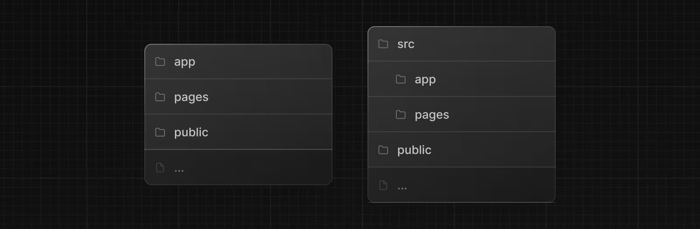
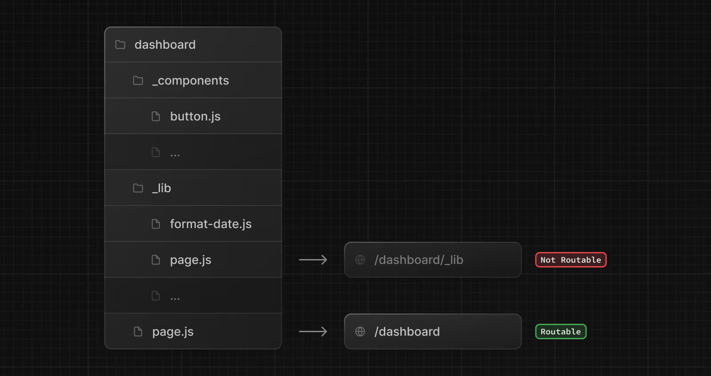
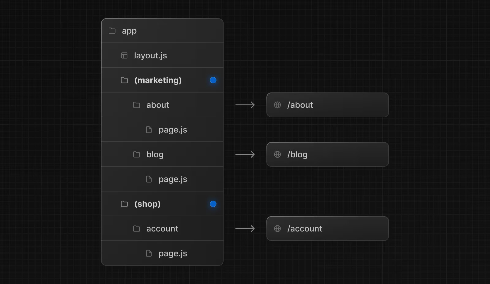

## Folder and File Conventions

### Top-level Folders

Top-level folders are used to organize your application's code and static assets.

<BrowserWindow url="https://nodejs.org/" bodyStyle={{padding: 0}}>    
  [](https://nextjs.org/)
</BrowserWindow>

| Folder | Description |
|--------|-------------|
| `app` | App Router |
| `pages` | Pages Router |
| `public` | Static assets to be served |
| `src` | Optional application source folder |

### Top-level Files

Top-level files are used to configure your application, manage dependencies, run middleware, integrate monitoring tools, and define environment variables.

| File | Description |
|------|-------------|
| `next.config.js` | Configuration file for Next.js |
| `package.json` | Project dependencies and scripts |
| `instrumentation.ts` | OpenTelemetry and Instrumentation file |
| `middleware.ts` | Next.js request middleware |
| `.env` | Environment variables |
| `.env.local` | Local environment variables |
| `.env.production` | Production environment variables |
| `.env.development` | Development environment variables |
| `.eslintrc.json` | Configuration file for ESLint |
| `.gitignore` | Git files and folders to ignore |
| `next-env.d.ts` | TypeScript declaration file for Next.js |
| `tsconfig.json` | Configuration file for TypeScript |
| `jsconfig.json` | Configuration file for JavaScript |

### App Router Files

| File | Extensions | Description |
|------|-----------|-------------|
| `layout` | `.js` `.jsx` `.tsx` | Shared UI for a segment and its children |
| `page` | `.js` `.jsx` `.tsx` | Unique UI of a route and make routes publicly accessible |
| `loading` | `.js` `.jsx` `.tsx` | Loading UI for a segment and its children |
| `not-found` | `.js` `.jsx` `.tsx` | Not found UI for a segment and its children |
| `error` | `.js` `.jsx` `.tsx` | Error UI for a segment and its children |
| `global-error` | `.js` `.jsx` `.tsx` | Global error UI |
| `route` | `.js` `.ts` | Server-side API endpoint |
| `template` | `.js` `.jsx` `.tsx` | Specialized re-rendered Layout UI |
| `default` | `.js` `.jsx` `.tsx` | Fallback UI for Parallel Routes |

### Routing Conventions

| Convention | Description |
|-----------|-------------|
| `folder` | Route segment |
| `folder/folder` | Nested route segment |
| `[folder]` | Dynamic route segment |
| `[...folder]` | Catch-all route segment |
| `[[...folder]]` | Optional catch-all route segment |
| `(folder)` | Route group (does not affect URL) |
| `_folder` | Private folder (excluded from routing) |
| `@folder` | Named slot for parallel routes |
| `(.)folder` | Intercept same level |
| `(..)folder` | Intercept one level above |
| `(..)(..)folder` | Intercept two levels above |
| `(...)folder` | Intercept from root |

### Metadata Files

| File | Extensions | Description |
|------|-----------|-------------|
| `favicon` | `.ico` | Favicon file |
| `icon` | `.ico` `.jpg` `.jpeg` `.png` `.svg` | App Icon file |
| `icon` | `.js` `.ts` `.tsx` | Generated App Icon |
| `apple-icon` | `.jpg` `.jpeg` `.png` | Apple App Icon file |
| `apple-icon` | `.js` `.ts` `.tsx` | Generated Apple App Icon |
| `opengraph-image` | `.jpg` `.jpeg` `.png` `.gif` | Open Graph image file |
| `opengraph-image` | `.js` `.ts` `.tsx` | Generated Open Graph image |
| `twitter-image` | `.jpg` `.jpeg` `.png` `.gif` | Twitter image file |
| `twitter-image` | `.js` `.ts` `.tsx` | Generated Twitter image |
| `sitemap` | `.xml` | Sitemap file |
| `sitemap` | `.js` `.ts` | Generated Sitemap |
| `robots` | `.txt` | Robots file |
| `robots` | `.js` `.ts` | Generated Robots file |

## Organizing Your Project

### Component Rendering Hierarchy

Components defined in special files are rendered in a specific hierarchy:

```
layout.js
  ├─ template.js
  ├─ error.js (React error boundary)
  ├─ loading.js (React suspense boundary)
  ├─ not-found.js (React error boundary)
  └─ page.js or nested layout.js
```

### Colocation

In the `app` directory, folders define the route structure. A route becomes publicly accessible only when you add a `page.js` or `route.js` file to that folder.

This allows you to safely place your project files (components, styles, tests) inside the `app` directory without making them accessible via URL.

### Private Folders

Create private folders by prefixing with underscore: `_folderName`

<BrowserWindow url="https://nodejs.org/" bodyStyle={{padding: 0}}>    
  [](https://nextjs.org/)
</BrowserWindow>


These folders are excluded from routing and useful for:

- Separating UI logic from routing logic
- Organizing internal files consistently
- Grouping files in code editors
- Avoiding naming conflicts with Next.js conventions

You can create URL segments starting with underscore using `%5FfolderName`.

### Route Groups

Create route groups by wrapping folder names in parentheses: `(folderName)`

These folders are for organization only and won't appear in the URL path.

Use route groups to:

- Organize routes by section (marketing, admin, shop)
- Apply different layouts to route groups
- Create multiple root layouts in your application

### Using `src` Directory

You can optionally store your application code inside a `src` folder. This separates application code from configuration files in the project root.

```
project-root/
├── src/
│   └── app/              # Your application code
├── public/               # Static assets
├── next.config.js        # Configuration
└── package.json          # Dependencies
```

## Project Organization Examples

### Option 1: Files Outside `app`

Keep the `app` directory for routing only, store components and utilities in the project root.

```
project-root/
├── app/                  # Routes only
├── components/           # Reusable components
├── lib/                  # Utility functions
└── public/               # Static assets
```

### Option 2: Files Inside `app`

Store all application code inside the `app` directory.

```
project-root/
└── app/
    ├── components/       # Reusable components
    ├── lib/              # Utility functions
    ├── page.tsx
    └── layout.tsx
```

### Option 3: Split by Feature

Store shared code globally, route-specific code within route folders.

```
project-root/
└── app/
    ├── components/       # Global components
    ├── lib/              # Global utilities
    ├── dashboard/
    │   ├── components/   # Dashboard components
    │   └── page.tsx
    └── page.tsx
```

## Advanced Routing Patterns

### Multiple Layouts with Route Groups

Organize routes and apply different layouts without affecting URLs:

```
app/
├── (marketing)/
│   ├── layout.tsx        # Marketing layout
│   ├── about/page.tsx    # URL: /about
│   └── blog/page.tsx     # URL: /blog
└── (shop)/
    ├── layout.tsx        # Shop layout
    ├── products/page.tsx # URL: /products
    └── cart/page.tsx     # URL: /cart
```

### Loading UI for Specific Routes

Apply loading states to specific routes using route groups:

```
app/
└── dashboard/
    ├── (overview)/
    │   ├── loading.tsx   # Loading UI for overview
    │   └── page.tsx      # URL: /dashboard
    └── settings/
        └── page.tsx      # URL: /dashboard/settings
```

### Multiple Root Layouts

Create completely different experiences for different sections:

<BrowserWindow url="https://nodejs.org/" bodyStyle={{padding: 0}}>    
  [](https://nextjs.org/)
</BrowserWindow>

```
app/
├── (marketing)/
│   ├── layout.tsx        # Root layout with <html> and <body>
│   └── page.tsx
└── (app)/
    ├── layout.tsx        # Different root layout
    └── page.tsx
```

Each root layout must include `<html>` and `<body>` tags.

## Conclusion
Congratulations! You've mastered Next.js project structure. You now understand how to organize folders and files, use routing conventions like dynamic routes and route groups, and structure your application professionally. You're ready to build well-organized Next.js projects with confidence!