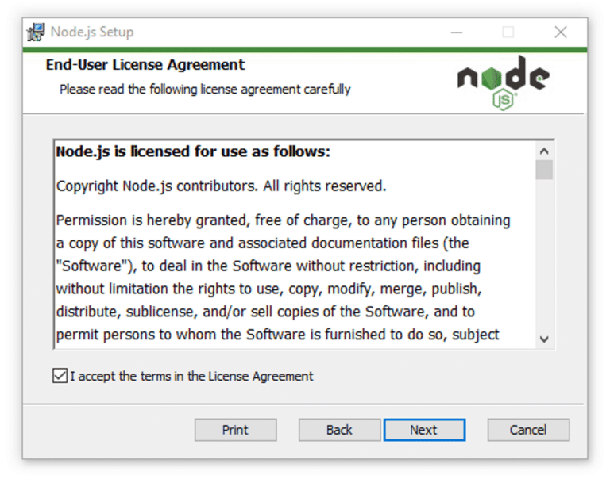

Setting up Next.js Development Environment


### Step 1: Install Node.js

Next.js requires Node.js to run. Let's download and install it first.

1. Go to the [Node.js Website](https://nodejs.org/) and download the LTS (Long Term Support) version.

    <BrowserWindow url="https://nodejs.org/" bodyStyle={{padding: 0}}>    
     [](https://nodejs.org/)
    </BrowserWindow>

2. Choose the appropriate installer for your operating system:
   - **Windows:** Download the Windows Installer (.msi)
   - **macOS:** Download the macOS Installer (.pkg)
   - **Linux:** Use your package manager or download the binary

### Step 2: Install Node.js on Your System

1. **Run the Installer:**
   
   Open the downloaded installer file and follow the installation wizard.

    <BrowserWindow url="https://nodejs.org/" bodyStyle={{padding: 0}}>    
     [](https://nodejs.org/)
    </BrowserWindow>

   - Accept the license agreement
   - Choose the installation directory (default is recommended)
   - Select "Add to PATH" option (should be checked by default)
   - Complete the installation

2. **Verify Installation:**

   Open your terminal/command prompt and run:

   ```bash title="Verify Node.js and npm installation"
   node --version
   npm --version
   ```


### Step 3: Install a Code Editor

For the best Next.js development experience, we recommend Visual Studio Code.

1. **Download VS Code:**
   
   Go to [Visual Studio Code](https://code.visualstudio.com/) and download the installer.

    <BrowserWindow url="https://code.visualstudio.com/" bodyStyle={{padding: 0}}>    
     [](https://code.visualstudio.com/)
    </BrowserWindow>

2. **Install Useful Extensions:**
   
   After installing VS Code, add these helpful extensions:
   - ES7+ React/Redux/React-Native snippets
   - Prettier - Code formatter
   - Auto Rename Tag
   - Bracket Pair Colorizer
   - GitLens

### Step 4: Create Your First Next.js Project

Now let's create a new Next.js application.

1. **Using Create Next App (Recommended):**

   Open your terminal and run:

   ```bash title="Create a new Next.js project"
   npx create-next-app@latest my-nextjs-app
   ```


2. **Configuration Options:**
   
   The installer will ask you several questions:
   - Would you like to use TypeScript? → Yes/No
   - Would you like to use ESLint? → Yes (recommended)
   - Would you like to use Tailwind CSS? → Yes/No
   - Would you like to use `src/` directory? → Yes/No
   - Would you like to use App Router? → Yes (recommended)
   - Would you like to customize the default import alias? → No

### Step 5: Navigate and Start Your Project

1. **Navigate to Project Directory:**

   ```bash title="Navigate to your project"
   cd my-nextjs-app
   ```

2. **Start the Development Server:**

   ```bash title="Start the development server"
   npm run dev
   ```

   <BrowserWindow url="http://localhost:3000" bodyStyle={{padding: 0}}>    
    [](http://localhost:3000)
   </BrowserWindow>

3. **Open in Browser:**
   
   Your Next.js application will be available at `http://localhost:3000`

### Step 6: Understanding the Project Structure

Let's explore the key files and folders in your Next.js project:

```
my-nextjs-app/
├── app/                 # App Router directory (Next.js 13+)
│   ├── globals.css     # Global styles
│   ├── layout.js       # Root layout component
│   └── page.js         # Home page component
├── public/             # Static assets
├── next.config.js      # Next.js configuration
├── package.json        # Project dependencies
└── README.md          # Project documentation
```

**Key Directories:**
- **app/**: Contains your application pages and layouts (App Router)
- **public/**: Static files like images, icons, etc.
- **components/**: Reusable React components (you'll create this)

### Step 7: Install Additional Dependencies

Depending on your project needs, you might want to install additional packages:

1. **For Styling:**
   ```bash title="Install styling libraries"
   npm install styled-components
   # or
   npm install @emotion/react @emotion/styled
   ```

2. **For State Management:**
   ```bash title="Install state management"
   npm install zustand
   # or
   npm install redux @reduxjs/toolkit react-redux
   ```

3. **For API Requests:**
   ```bash title="Install HTTP client"
   npm install axios
   # or use built-in fetch API
   ```

### Step 8: Version Control Setup

Initialize Git for your project:

```bash title="Initialize Git repository"
git init
git add .
git commit -m "Initial commit"
```

### Step 9: Development Best Practices

1. **Environment Variables:**
   
   Create a `.env.local` file for environment variables:
   ```env title=".env.local"
   NEXT_PUBLIC_API_URL=http://localhost:3001/api
   DATABASE_URL=your-database-url
   ```

2. **Code Formatting:**
   
   Create a `.prettierrc` file:
   ```json title=".prettierrc"
   {
     "semi": true,
     "trailingComma": "es5",
     "singleQuote": true,
     "tabWidth": 2,
     "useTabs": false
   }
   ```

3. **ESLint Configuration:**
   
   Your project comes with ESLint pre-configured. Run:
   ```bash title="Run ESLint"
   npm run lint
   ```

### Step 10: Building for Production

When you're ready to deploy:

1. **Build the Project:**
   ```bash title="Build for production"
   npm run build
   ```

2. **Start Production Server:**
   ```bash title="Start production server"
   npm run start
   ```


## Useful Commands Reference

Here are some essential commands you'll use frequently:

```bash title="Next.js development commands"
# Start development server
npm run dev

# Build for production
npm run build

# Start production server
npm run start

# Run linting
npm run lint

# Install new packages
npm install package-name

# Install development dependencies
npm install --save-dev package-name
```

## Troubleshooting Common Issues

1. **Port 3000 already in use:**
   ```bash
   npm run dev -- -p 3001
   ```

2. **Clear Next.js cache:**
   ```bash
   rm -rf .next
   npm run dev
   ```

3. **Update Next.js:**
   ```bash
   npm install next@latest react@latest react-dom@latest
   ```

## Conclusion

Congratulations! You've successfully set up your Next.js development environment. You now have:

- Node.js and npm installed
- A code editor with useful extensions
- A working Next.js application
- Understanding of the project structure
- Knowledge of essential commands

In the next tutorial, we'll explore creating your first pages and components in Next.js. Happy coding!

---

*This guide was created to help developers get started with Next.js quickly and efficiently.*
