This guide walks you through everything you need to write and publish a blog post on recode hive, heads-up for you there is a lot of steps, our idea is not about <b>quantity</b>, lets focus on quality on the article you write the best one will be eligible for [GitHub Sponsorship](http://localhost:3000/our-sponsors/).

---

:::info Prerequisites
- 📦 [Node.js](https://nodejs.org/) (v18 or later)
- 🔧 [Git](https://git-scm.com/)
- 💻 [VS Code](https://code.visualstudio.com/) or your preferred editor
- Refer the welcome page to install and setup the repository in your local system. [Check here](http://localhost:3000/docs/)
:::
---

## Step 1: Raise a New issue on GitHub

Head to the the GitHub issue on this [repository](https://github.com/recodehive/recode-website/issues), raise an new issue under documentation update. 
    :::info
    * Few things to remember, don't raise random generic topics.
    * Write from real experience, try to include real dashboard pictures, no copy paste articles.
    * You can generate AI pictures, but need to be edited any tools like Canva.
    * Your article must teach something offical documentation doesnot. Means no Intro to X or What is X.
    * Start working on Issue When its assigned to you by @sanjay-kv or any Maintainer. ref step 4.
<Tabs>
  <TabItem value="Step 1" label="Step 1">
    <BrowserWindow url="https://github.com/recodehive/recode-website/issues" bodyStyle={{padding: 0}}>    
     [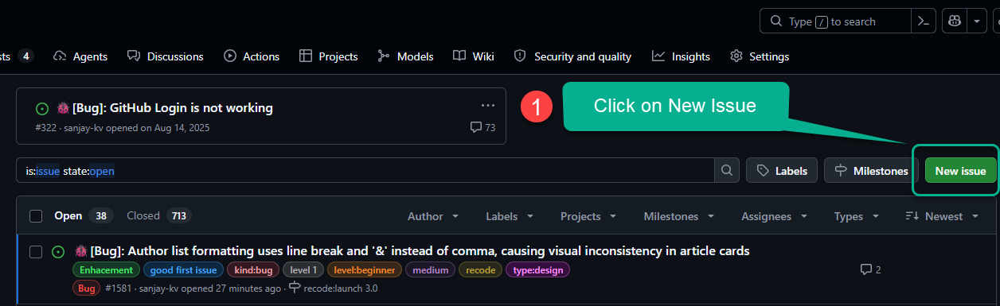](https://github.com/recodehive/recode-website/issues)
    </BrowserWindow>
  </TabItem>

<TabItem value="Step 2" label="Step 2">
     <BrowserWindow url="https://github.com/recodehive/recode-website/issues" bodyStyle={{padding: 0}}>    
     [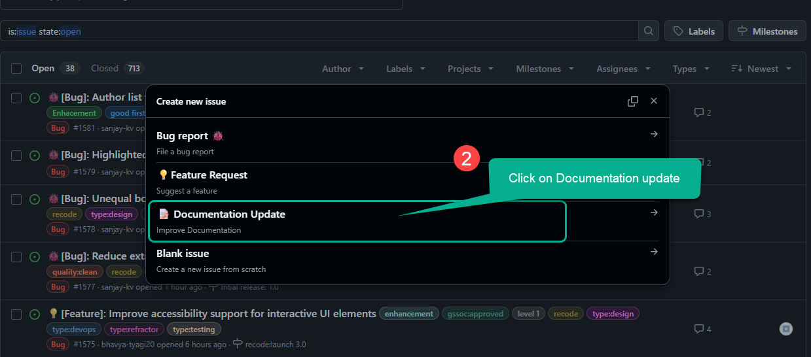](https://github.com/recodehive/recode-website/issues)
    </BrowserWindow>

  </TabItem>
    
  <TabItem value="Step 3" label="Step 3">
      <BrowserWindow url="https://github.com/recodehive/recode-website/issues/1586" bodyStyle={{padding: 0}}>    
     [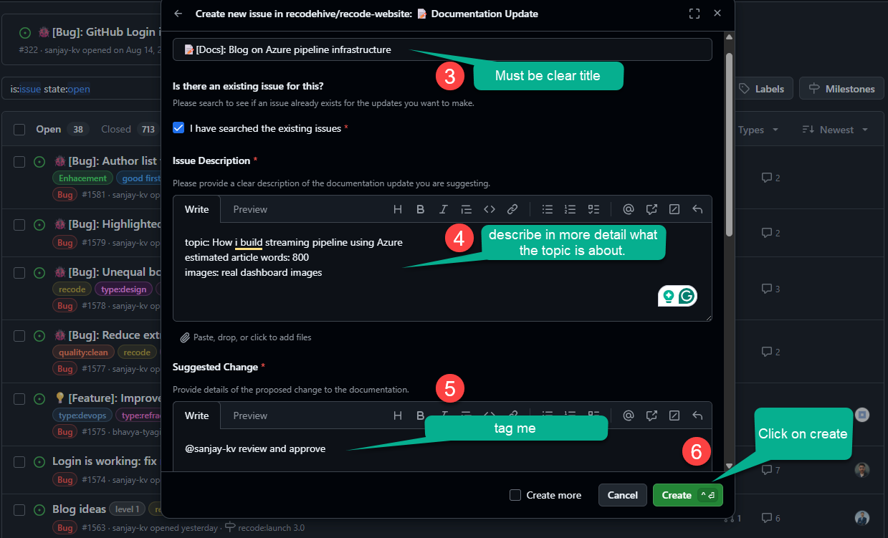](https://github.com/recodehive/recode-website/issues/1577)
    </BrowserWindow>
    </TabItem>

  <TabItem value="Step 4" label="Step 4">
      <BrowserWindow url="https://github.com/recodehive/recode-website/issues/1577" bodyStyle={{padding: 0}}>    
     [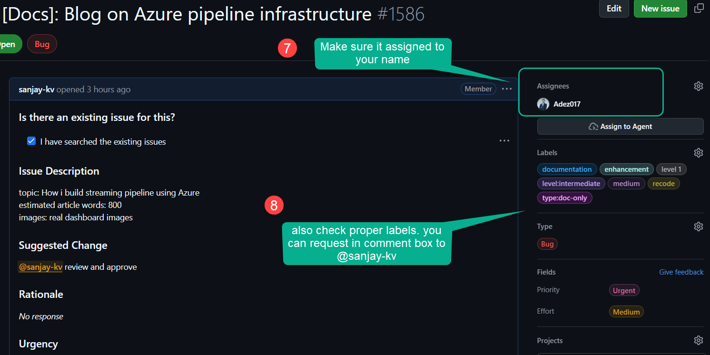](https://github.com/recodehive/recode-website/issues/1577)
    </BrowserWindow>
    </TabItem>
  
</Tabs>

:::

#### Just follow the steps on forking the repositories and installing the dependencies on your local repository, if you dont know refer the steps 2 to 6 on [welcome page](https://www.recodehive.com/docs/).
---

## Step 5: Create a New Branch

Open your code editor and head into terminal and check current branch
Never commit directly to `main`. Create a dedicated branch for your blog post:


```bash
git checkout -b blog/your-blog-title
```

<BrowserWindow url="https://github.com/recodehive/recode-website/issues" bodyStyle={{padding: 0}}>    
    [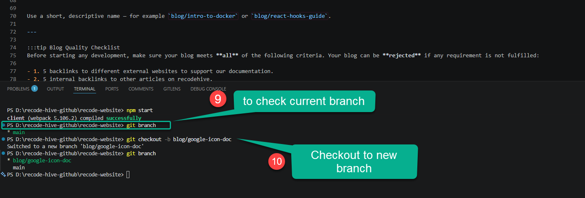](https://github.com/recodehive/recode-website/issues)
  </BrowserWindow>

    :::info
the best practice, Use a short, descriptive name  for example `blog/intro-to-docker` or `blog/react-hooks-guide`.
:::


---

## Step 6: Add your name to Author list : optional
:::info
If you are first time contributing to blog section, add yourself as author, this gives you good visibility on Google search and better career opportunities.
We use [docusaurus](https://docusaurus.io/docs) for documentation.
:::
Open your code editor and head into sidebar and expand the `blog` folder
and open the file `authors.yml`. Refer the below image and copy paste the code into the yml as shown.
Replace my name with your name and respective website links of yours.

```yaml
sanjay-kv:
  name: Sanjay Viswanthan
  title: Founder at recode hive
  url: www.sanjaykv.com
  image_url: https://avatars.githubusercontent.com/u/30715153?v=4
  email: sanjay@recodehive.com
  page: true # Turns the feature on
  description: >
    I'm a Software Engineer turned into a Data Engineer and Program Manager🚀, 🏆 Google ML Facilitator & Ex- GitHub CE who delivered 100+ talks on ML and open source and developer advocacy at various events and platforms.

  socials:
    x: https://x.com/sanjay_kv_
    linkedin: sanjay-k-v
    github: sanjay-kv
    stackoverflow: 8332327
    instagram: nomad_brains
    newsletter: https://recodehive.substack.com
    bluesky: sanjaykv.bsky.social
```

<BrowserWindow url="https://github.com/recodehive/recode-website/issues" bodyStyle={{padding: 0}}>    
    [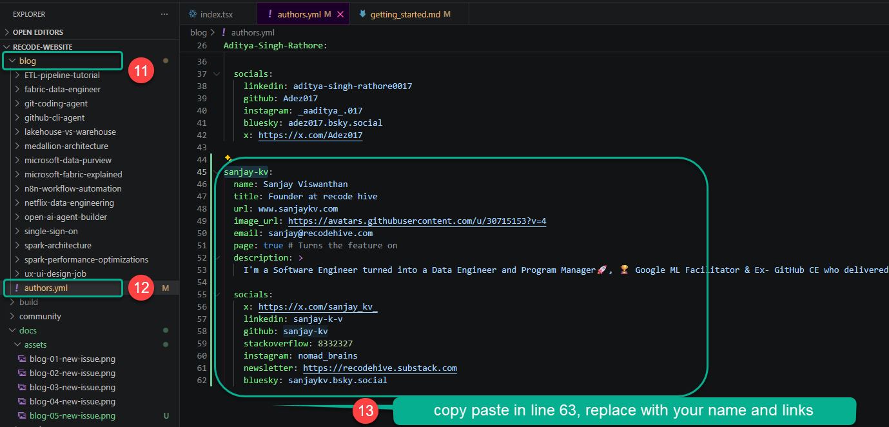](https://github.com/recodehive/recode-website/issues)
  </BrowserWindow>

The `your-author-id` value must exactly match what you put in the `authors` field of your frontmatter.

---

## Step 7: Create the Blog Folder and File

All blog posts live inside the `blog/` directory. Each post gets its own folder.

**Folder structure:**

```
blog/
└── your-blog-title/
    ├── index.md          ← your blog content
    └── assets/           ← screenshots and images (optional png or jpeg)
        ├── cover.png
        └── step-01.png
```

you can manually Create the folder and file or use below code:

```bash
mkdir -p blog/your-blog-title/assets
touch blog/your-blog-title/index.md
```
<Tabs>
  <TabItem value="Step 7" label="Step 7">
    <BrowserWindow url="https://github.com/recodehive/recode-website/issues" bodyStyle={{padding: 0}}>    
     [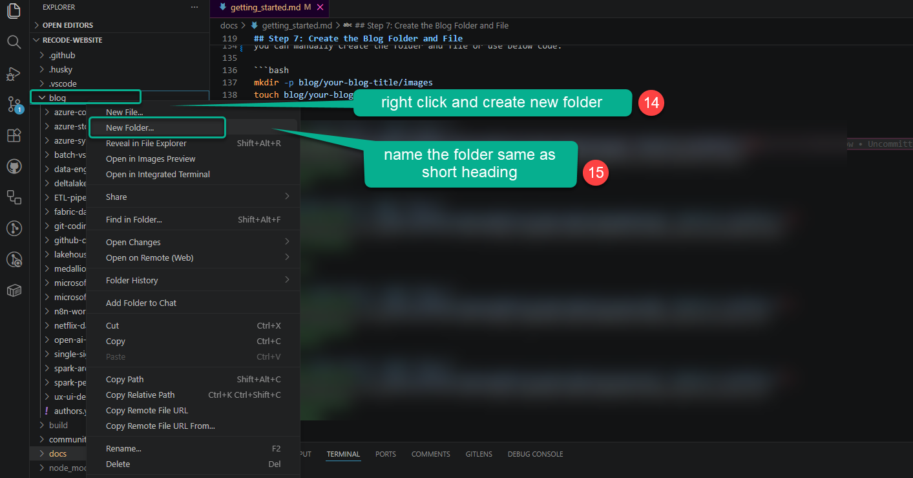](https://github.com/recodehive/recode-website/issues)
    </BrowserWindow>
  </TabItem>

<TabItem value="Step 8" label="Step 8">
     <BrowserWindow url="https://github.com/recodehive/recode-website/issues" bodyStyle={{padding: 0}}>    
     [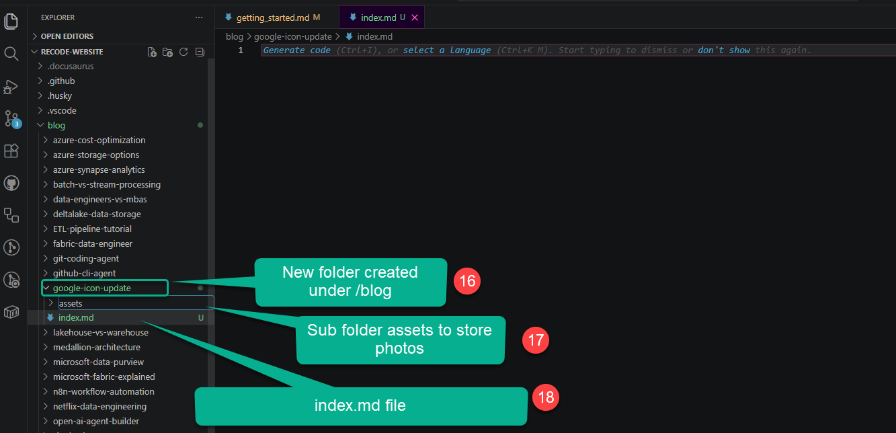](https://github.com/recodehive/recode-website/issues)
    </BrowserWindow>

  </TabItem>
    
</Tabs>
---

## Step 9: Write the Frontmatter

Open `blog/your-blog-title/index.md` and add the following frontmatter at the very top of the file:

:::tip Blog Quality Checklist
Copy paste the below code into your index.md file you created, then before writing we slowly change the title and details over here. first thing you need to match the author ID same as you created in authors.yaml file.
:::
<Tabs>
  <TabItem value="Step 9" label="Step 9">
  Don't change whatever in the highlighted red area, change the link same as folder name, so it will be easy to edit.
    <BrowserWindow url="https://github.com/recodehive/recode-website/issues" bodyStyle={{padding: 0}}>    
     [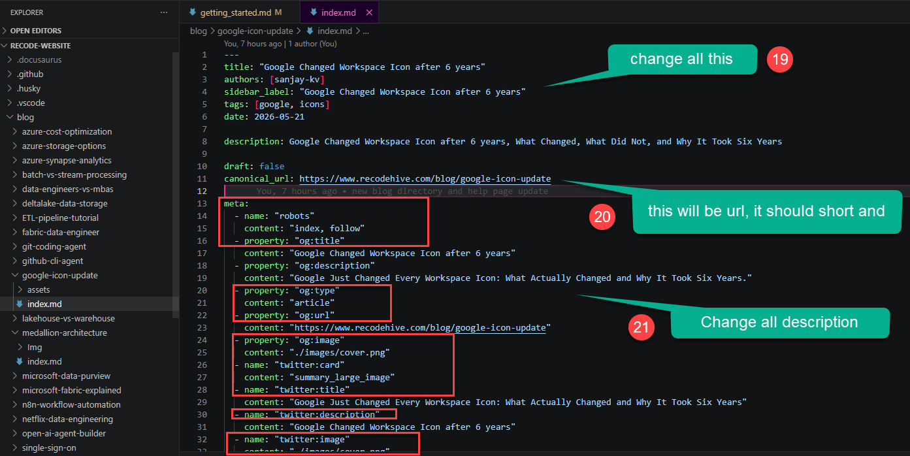](https://github.com/recodehive/recode-website/issues)
    </BrowserWindow>
  </TabItem>

<TabItem value="Step 10" label="Step 10">
     Do `npm run build` and complete the build to see everything works fine.
     <BrowserWindow url="https://github.com/recodehive/recode-website/issues" bodyStyle={{padding: 0}}>    
     [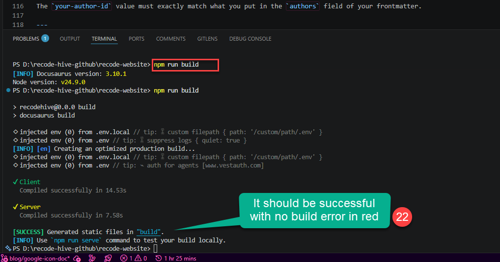](https://github.com/recodehive/recode-website/issues)
    </BrowserWindow>
  </TabItem>

  <TabItem value="Step 11" label="Step 11">
   Do `npm run serve` or `npm start` and open local host to see the local changes you made.
    <BrowserWindow url="https://github.com/recodehive/recode-website/issues" bodyStyle={{padding: 0}}>    
     [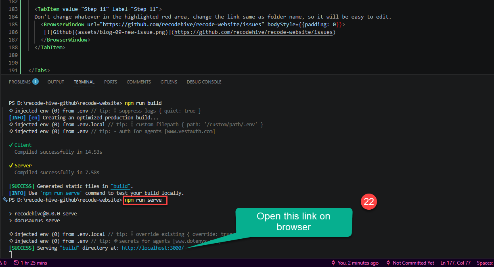](https://github.com/recodehive/recode-website/issues)
    </BrowserWindow>
  </TabItem>

  <TabItem value="Step 12" label="Step 12">
   Do search this in local host `http://localhost:3000/your-blog-canonical-url` 
    <BrowserWindow url="https://github.com/recodehive/recode-website/issues" bodyStyle={{padding: 0}}>    
     [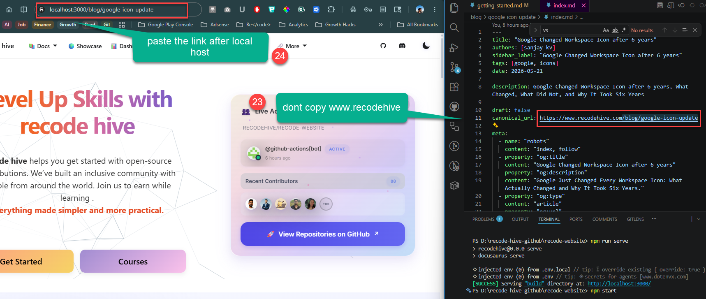](https://github.com/recodehive/recode-website/issues)
    </BrowserWindow>
  </TabItem>  

  <TabItem value="Step 13" label="Step 13">
   Do search this in local host `http://localhost:3000/your-blog-canonical-url` 
    <BrowserWindow url="https://github.com/recodehive/recode-website/issues" bodyStyle={{padding: 0}}>    
     [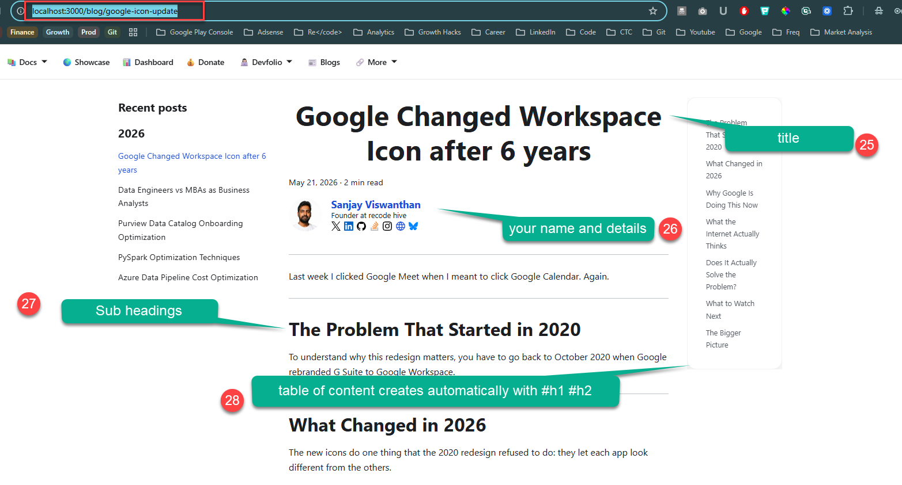](https://github.com/recodehive/recode-website/issues)
    </BrowserWindow>
  </TabItem>  
</Tabs>
```yaml
title: "Google Changed Workspace Icon after 6 years"
authors: [sanjay-kv]
sidebar_label: "Google Changed Workspace Icon after 6 years"
tags: [google, icons]
date: 2026-05-21

description: Google Changed Workspace Icon after 6 years, What Changed, What Did Not, and Why It Took Six Years

draft: false
canonical_url: https://www.recodehive.com/blog/google-icon-update

meta:
  - name: "robots"
    content: "index, follow"
  - property: "og:title"
    content: "Google Changed Workspace Icon after 6 years"
  - property: "og:description"
    content: "Google Just Changed Every Workspace Icon: What Actually Changed and Why It Took Six Years."
  - property: "og:type"
    content: "article"
  - property: "og:url"
    content: "https://www.recodehive.com/blog/google-icon-update"
  - property: "og:image"
    content: "./images/cover.png"
  - name: "twitter:card"
    content: "summary_large_image"
  - name: "twitter:title"
    content: "Google Just Changed Every Workspace Icon: What Actually Changed and Why It Took Six Years"
  - name: "twitter:description"
    content: "Google Changed Workspace Icon after 6 years"
  - name: "twitter:image"
    content: "./images/cover.png"

import Tabs from '@theme/Tabs';
import TabItem from '@theme/TabItem';

<!-- truncate -->
---
Last week I clicked Google Meet when I meant to click Google Calendar. Again.

**What you'll learn in this post:**
- How to set up X from scratch
- How to configure Y for production
- Common pitfalls and how to avoid them
---
## The Problem That Started in 2020
To understand why this redesign matters, you have to go back to October 2020 when Google rebranded G Suite to Google Workspace.
---
## What Changed in 2026
The new icons do one thing that the 2020 redesign refused to do: they let each app look different from the others.
---
## Why Google Is Doing This Now
Two reasons. One practical, one strategic.
---
## What the Internet Actually Thinks
Reactions are split, which is predictable and honestly fair.
---
## Does It Actually Solve the Problem?
Yes. Partially.
---
## What to Watch Next
The rollout is live but incomplete as of today. Google I/O 2026 this week is the most likely venue for a formal announcement with a full rollout timeline. If you are not seeing the new icons in your web launcher yet, they are coming within days based on current reports.
---
## The Bigger Picture
Google changing its icons is a small thing in isolation. But it is interesting as a signal.
---
**About the Author**
Sanjay is a Data Engineer focused on building modern data platforms and writing about technology at RecodeHive. He writes about data engineering, cloud architecture, and the tech decisions that actually affect people's daily work.
```

:::info

| Field | Description |
|---|---|
| `title` | The full title displayed at the top of the post and in search results, Make sure you do research and SEO analysis before proceeding with title|
| `authors` | Your author ID from `blog/authors.yml` (see Step 6) |
| `sidebar_label` | Short label shown in navigation sidebars |
| `tags` | Comma-separated list of relevant topic tags |
| `date` | Publication date in `YYYY-MM-DD` format |
| `description` | SEO meta description (keep under 160 characters) |
| `draft` | Set to `true` to hide the post; `false` to publish |
| `canonical_url` | Leave blank unless cross-posting from another site |

:::


---

## Step 10: Write Your Blog Content : Guidelines

:::tip Blog Quality Checklist
Now here comes the crutial part, it doesnt matter how it get start, but you gotta finish it as good quality work.
Open the below taps to find most common errors and guidelines for beautification

<Tabs>
  <TabItem value="Formatting Guidelines" label="Formatting Guidelines">
  
  You have already copied this code before, im just explaining what it is. So you know what you doing 🥑.

  After the closing `---` of your frontmatter, add the `<!-- truncate -->` comment. Everything **above** this comment becomes the preview shown on the blog listing page; everything below is the full post.

```md
---
...frontmatter...
---

<!-- truncate -->

Your introduction paragraph goes here. This will appear as the preview on the blog index page.

## Section Heading

Body content continues here...
```

### Formatting Guidelines

Use `##` and `###` headings to structure your content.

---

#### Bulleted Summary Section (Required)

Every techincal explanation blog must begin with a bulleted summary right after the intro paragraph. This helps readers quickly understand what they'll learn.

```md
**What you'll learn in this post:**
- How to set up X from scratch
- How to configure Y for production
- Common pitfalls and how to avoid them
```

    <BrowserWindow url="https://github.com/recodehive/recode-website/issues" bodyStyle={{padding: 0}}>    
     [](https://github.com/recodehive/recode-website/issues)
    </BrowserWindow>
  </TabItem>

<TabItem value="Add code blocks" label="Add code blocks">
     #### Named Code Blocks (Required)

Always label code blocks with a filename so readers know exactly what file they are editing:

````md
```java title="Sample.java"
public class Hello {
    public static void main(String[] args) {
        System.out.println("Hello, world!");
    }
}
```
````
  <BrowserWindow url="https://github.com/recodehive/recode-website/issues" bodyStyle={{padding: 0}}>    
     [](https://github.com/recodehive/recode-website/issues)
    </BrowserWindow>
  </TabItem>

  <TabItem value="Query + Output: Use Tabs" label="Query + Output: Use Tabs">
     #### Named Code Blocks (Required when writing technical articles)

When showing a database query alongside its output, use a Tabs block so both fit in a single window.

First, import the components at the top of your `index.md` (after frontmatter, before any content):

```md
import Tabs from '@theme/Tabs';
import TabItem from '@theme/TabItem';
```

Then structure your query + output like this:

````md
<Tabs>
  <TabItem value="Query">

  ```sql
  -- Create the table
  CREATE TABLE friends (
    id INT PRIMARY KEY,
    name VARCHAR(100),
    username VARCHAR(100)
  );

  -- Insert data
  INSERT INTO friends (id, name, username) VALUES
  (1, 'John Doe', 'johndoe'),
  (2, 'Jane Smith', 'janesmith'),
  (3, 'Bob Johnson', 'bobjohnson');
  ```

  </TabItem>
  <TabItem value="Output">

  | id | name        | username    |
  |----|-------------|-------------|
  | 1  | John Doe    | johndoe     |
  | 2  | Jane Smith  | janesmith   |
  | 3  | Bob Johnson | bobjohnson  |

  </TabItem>
</Tabs>
````
  <BrowserWindow url="https://github.com/recodehive/recode-website/issues" bodyStyle={{padding: 0}}>    
     [](https://github.com/recodehive/recode-website/issues)
    </BrowserWindow>
  </TabItem>

</Tabs>

:::


---


:::tip
You can add as many `<TabItem>` tabs as needed for example separate tabs per subquery type, or one tab per language variant. 
Just check the code base on `getting_started.md`
:::

---

:::info
Again a reminder, dont copy from the AI, the whole purpose of we writing this to give some step by step guidelines which AI can't do.
Especially from an experienced engineers, it will be easy for new genertion coders to start easy with reference ss of every step.
:::


## Step 11: Add Screenshots and Images

### Recommended Screenshot Dimensions

| Use Case | Recommended Size |
|---|---|
| Cover / hero image | **1200 × 630 px** (16:9 ratio, also ideal for social sharing)  refer the image blocks attached below for samples|
| Full-width step screenshots | **1280 × 720 px** or **1280 × 800 px** |
| UI close-ups / partial screenshots | **800 × 450 px** |
| Maximum file size | **500 KB** per image (compress with [Squoosh](https://squoosh.app) or [TinyPNG](https://tinypng.com)) |

Use **PNG** for UI screenshots (crisp text) and **JPEG/WebP** for photos.

### Naming Convention

Use lowercase, hyphen-separated, numbered filenames so they sort correctly and are SEO-friendly. **Never use random or auto-generated names.**
also never leave space on naming, it should be connected with hypen.
```
assets/
├── cover.png
├── 01-open-settings.png
├── 02-navigate-to-plugins.png
└── 03-final-result.png
```
<Tabs>

<TabItem value="Cover page Image" label="Index page Banner">
     Do `npm run build` and complete the build to see everything works fine.
     <BrowserWindow url="https://github.com/recodehive/recode-website/issues" bodyStyle={{padding: 0}}>    
     [](https://github.com/recodehive/recode-website/issues)
    </BrowserWindow>
  </TabItem>

  <TabItem value="Step 111" label="Step 111">
   Do `npm run serve` or `npm start` and open local host to see the local changes you made.
    <BrowserWindow url="https://github.com/recodehive/recode-website/issues" bodyStyle={{padding: 0}}>    
     [](https://github.com/recodehive/recode-website/issues)
    </BrowserWindow>
  </TabItem>

 
</Tabs>
### Embedding Images in Markdown

Reference images relative to `index.md`:

```md

```
<BrowserWindow url="https://github.com/recodehive/recode-website/issues" bodyStyle={{padding: 0}}>    
    [](https://github.com/recodehive/recode-website/issues)
  </BrowserWindow>

Always write descriptive alt text — it improves accessibility and SEO.

:::tip Screenshot Tool Recommendation
Tools like [Snagit](https://www.techsmith.com/screen-capture.html) make it easy to produce annotated, professional-quality screenshots. See [this article](https://www.recodehive.com/docs/GitHub/Maintainer-guide/milestone) as a reference for the image quality standard we aim for.
:::

---

## Step 12: Update the Database

All blog data is linked in the database folder (`\database\blogs\index.tsx`). Update it with the following details:

```json
{
  id: sequence_wise,
  title: "Title of the post",
  image: "relative path of the cover image for the blog post",
  description: "A short (2-3) lines of description of the post",
  slug: "The name of the blog folder (keep it exact)",
  authors: ["your-author-id"],
  category: "The category the blog belongs to",
  tags: ["tags or topics the blog is related to (tools or technologies)"],
}
```

:::note
All details are necessary for correctly rendering the blog card on the blogs page. Take a close look and make sure everything is filled in.
:::

---


#### Admonitions: Tips, Notes, Info, and Cautions

Use Docusaurus admonitions to highlight important information. Don't overuse them — only where they add real value.

**For tips and helpful extras:**

```md
:::tip Need Git Commands?
Check out our [comprehensive Git Commands Cheatsheet](../GitHub/setup-environment/git-commands.md)
with 50 essential Git commands and examples.
:::
```

**For extra context or caution:**

```md
:::info
In the picture below, Developer 1 handles the men's shopping section, Developer 2
deals with the women's section, and Developer 3 works on the login feature.
:::
```

**For key feature callouts:**

```md
:::note
Key Features of GitLab:
- GitLab provides **built-in CI/CD pipelines**.
- Unlike GitHub, GitLab can be **self-hosted** or used on the cloud (GitLab.com).
- GitLab offers [Premium Plans](https://about.gitlab.com/pricing/) with advanced CI/CD and security features.
:::
```

---

#### Tables: Center Alignment via `:::info`

Plain Markdown tables are left-aligned by default in Docusaurus. Wrap your table in an `:::info` block to center it:

```md
:::

| Command     | Description       |
|-------------|-------------------|
| `git init`  | Initialize a repo |
| `git clone` | Clone a repo      |

:::
```

### Rendered Output

:::info

| Command     | Description       |
|-------------|-------------------|
| `git init`  | Initialize a repo |
| `git clone` | Clone a repo      |

:::

---

#### FAQ Section (Required)

Every blog post must end with a FAQ section before the conclusion. Use questions your readers are likely to have:

```md
## Frequently Asked Questions

**Q: Do I need to know X before starting this guide?**
A: Basic familiarity with Y is helpful, but the guide covers everything step by step.

**Q: Will this work on Windows?**
A: Yes, the steps are cross-platform. Windows-specific commands are noted where they differ.
```

---

:::tip Blog Quality Checklist
Before starting any development, make sure your blog meets **all** of the following criteria. Your blog can be **rejected** if any requirement is not fulfilled:

- 1. 5 backlinks to different external websites to support our documentation.
- 2. 5 internal backlinks to other articles on recodehive.

- 3. **No generic content** — avoid surface-level topics like "what is Azure" or "difference between X and Y". Write pure, high-depth technical articles with images. See [this example](https://www.recodehive.com/docs/GitHub/Maintainer-guide/milestone) for the standard we aim for. (Tip: tools like [Snagit](https://www.techsmith.com/screen-capture.html) help produce great annotated screenshots.)

- 4. Image filenames must be descriptive and SEO-friendly — no random names like `screenshot123.png`.
- 5. **Content-to-code ratio**: text should be more than code. Adsense flags pages at 60% code / 40% text - keep it the opposite. If code is long, link to GitHub and reference it in comments instead.

- 6. Include a **bulleted summary section** at the top of the blog post.
- 7. Include a **FAQ section** at the bottom.
- 8. Use Docusaurus admonitions (`:::tip`, `:::info`, `:::note`) for callouts, tips, and cautions (see formatting guidelines below).
- 9. Tables must be **center-aligned** - wrap them in an `:::info` block to achieve this in Docusaurus.
- 10. Use **named code blocks** with a filename label when showing code (e.g., ` ```java title="Sample.java" `).
- 11. When showing a query and its output together, use a **Tabs** block with separate "Query" and "Output" tabs.
- 12. Screenshots must follow the naming convention and size guidelines below.
:::


## Step 10: Preview Your Post
Do lint check and then build before push
Make sure your dev server is still running (`npm start`), then navigate to [http://localhost:3000/blog](http://localhost:3000/blog) to see your post in the listing and click into it to read the full content. Verify:

- The frontmatter title, date, and author show correctly.
- The truncate preview looks right on the blog index.
- The bulleted summary section appears near the top.
- All images load and are properly sized.
- Code blocks are syntax-highlighted and have filename labels.
- Query/output pairs use Tabs.
- Tables are center-aligned inside `:::info` blocks.
- Tips and notes use the correct admonition type.
- The FAQ section is present at the bottom.

---

## Step 11: Commit and Push Your Changes

Once you are happy with the preview, stage and commit your files:

```bash
git add blog/your-blog-title/
git add blog/authors.yml          # only if you added yourself
git commit -m "blog: add post on your-blog-title"
```

Push the branch to your fork:

```bash
git push origin blog/your-blog-title
```

---

## Step 12: Open a Pull Request

- 1. Go to your fork on GitHub — you will see a **"Compare & pull request"** banner. Click it.
- 2. Set the **base repository** to `recodehive/recode-website` and **base branch** to `main`.
- 3. Write a clear PR title, e.g. `blog: Add post on Your Blog Title`.
- 4. In the description, briefly summarize what the post covers.
- 5. Click **Create pull request**.

A maintainer will review and merge your post. You may be asked to make small edits before it is approved.

---

## Keeping Your Fork Up to Date

Before starting a new post, pull the latest changes from upstream to avoid merge conflicts:

```bash
git checkout main
git fetch upstream
git merge upstream/main
git push origin main
```

---

## Quick Reference Checklist

Before submitting your PR, go through this checklist:

- 1. [ ] Blog folder created at `blog/your-blog-title/index.md`
- 2. [ ] Frontmatter is complete (title, authors, tags, date, description, draft: false)
- 3. [ ] Author entry exists in `blog/authors.yml`
- 4. [ ] `<!-- truncate -->` comment placed after the intro paragraph
- 5. [ ] **Bulleted summary section** included near the top of the post
- 6. [ ] **FAQ section** included at the bottom of the post
- 7. [ ] No generic content — article is high-depth and technical with images
- 8. [ ] 5 external backlinks to supporting websites
- 9. [ ] 5 internal backlinks to other recodehive articles
- 10. [ ] Text is more than code — long code blocks link to GitHub instead
- 11. [ ] Code blocks use filename labels — e.g., opening fence followed by `python title="app.py"`
- 12. [ ] Query + output pairs use Tabs blocks
- 14. [ ] Tables are wrapped in `:::info` for center alignment
- 15. [ ] Tips, notes, and cautions use the correct Docusaurus admonition
- 16. [ ] All images are in `blog/your-blog-title/images/` with SEO-friendly names
- 17. [ ] Cover image is 1200 × 630 px; step screenshots are no wider than 1280 px
- 18. [ ] Image file sizes are under 500 KB each
- 19. [ ] Post previews correctly at `localhost:3000/blog`
- 20. [ ] Database entry added in `\database\blogs\index.tsx`
- 21. [ ] Committed on a feature branch (not `main`)
- 22. [ ] Pull request targets `recodehive/recode-website` `main` branch