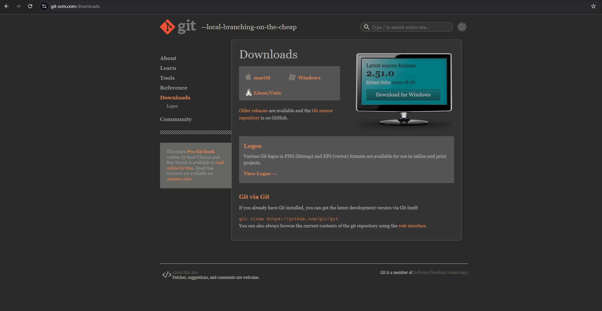
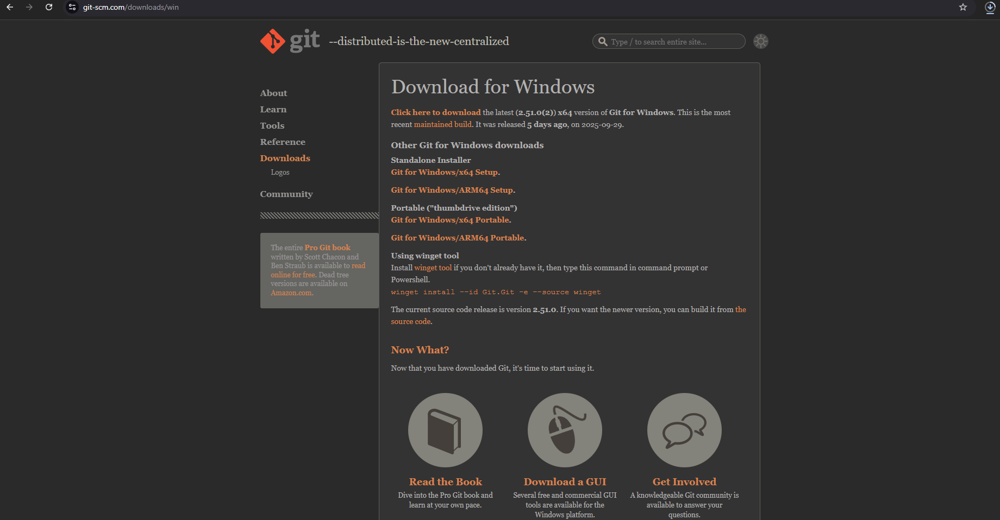
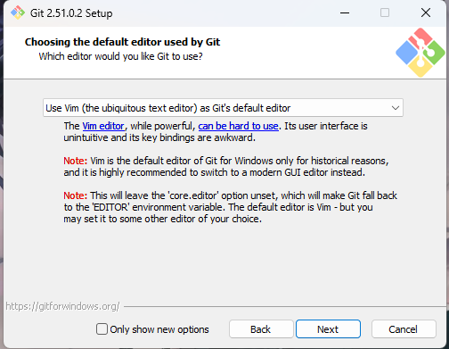
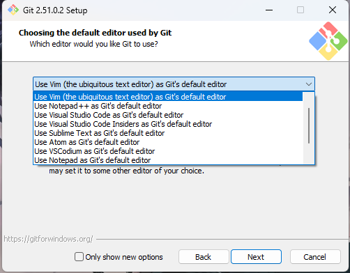
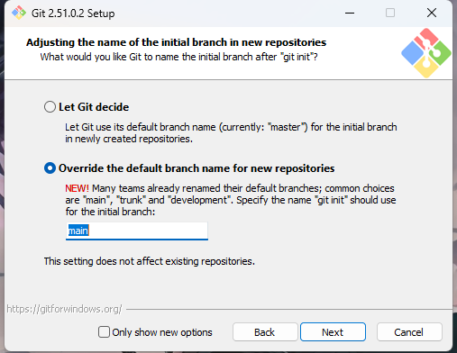
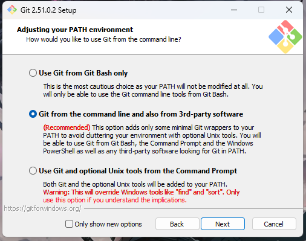
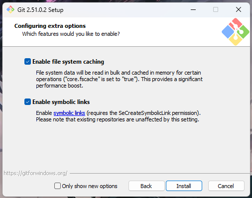

  
Install Python
  
  ### Step 1: Let’s Download the git.
  
  1. Go to the [Git Website](https://git-scm.com/) and click on download for windows button.
  
      <BrowserWindow url="https://git-scm.com/" bodyStyle={{padding: 0}}>    
       [](https://git-scm.com/)
      </BrowserWindow>
  
  
  ### Step 2: Select your Version you want to install.
  
  1. Get your Installer:
  
     Based on your current version of Windows, you can choose either the standalone installer or Windows installer to get started. Since my system is 64-bit, I'll choose the 64-bit option. You can check which system type you have by right clicking ``This PC`` icon, selecting ``Properties``, and looking under ``System type``. 
  
       - **Installer:** Get the Installer
      <BrowserWindow url="https://git-scm.com/downloads/win" bodyStyle={{padding: 0}}>    
       [](https://git-scm.com/downloads/win)
      </BrowserWindow>
          
  
       - **Start Installation:** Upon downloading, open the installer.
            
     
      <BrowserWindow url="https://git-scm.com/" bodyStyle={{padding: 0}}>    
       [](https://git-scm.com/)
      </BrowserWindow>
  
     - 1. On the next screen, click next on Public Licence.
     - 2. Choose the location as default and click on Next
  
  
  
  ### Step 3: Understanding the Interface.
  
  In the next step, Git will ask you to install couple of components. You can check on additional icons to add on Desktop and leave the rest as default and click on Next.
  
     - 1. On the next screen click next , make sure the start folder name is Git.
     - 2. Next option is to choose the default editor  you can use your editor, I'm using Visual Studio Code. Or keep Vim as the default editor.
  
       
      <BrowserWindow url="https://git-scm.com/" bodyStyle={{padding: 0}}>    
       [](https://git-scm.com/)
      </BrowserWindow>      
  
     
  ### Step 5:  Adjusting name of the repo setting in Git.
  
  At this stage it will ask you to choose an initial branch in a new repository, it would be ideal approach to choose the second option, as we move further it gives us flexibility to change the intial branch name , like main master, trunk. 
  
  
      <BrowserWindow url="https://git-scm.com/" bodyStyle={{padding: 0}}>    
       [](https://github.com/sanjay-kv)
      </BrowserWindow>
  
     
  ### Step 5:  Adjusting Your path enviornment.
  
  This is where we specify the path enviornment of git, just go with the recommended option which is 2.
  
       <BrowserWindow url="https://git-scm.com/" bodyStyle={{padding: 0}}>    
       [](https://github.com/sanjay-kv)
      </BrowserWindow>
  
  
  1. ``1`` In the next screen choose the SSH Executable, pick ``use bundled OpenSSH`` which is the default option.
  2. ``2`` In the next step, you'll be asked configuring the line ending conversions, you should keep it default which is option 1.
  3. ``3`` Next step will be configuring the terminal emulator to use the git bash. Keep the default which is option 1.
  4. ``4`` Next option is to choose the defualt option to use the git. use the default one which is the Fast-forward and merge option 1.
  5. ``5`` In the Credential helper section, choose ``Git Credential Manager``, then click Next.
  6. ``6`` Enable the extra option by selecting ``Enable the file system Caching`` then click Next again. 
  7.  ``7`` On the Next Screen, it will ask whether you want to enable expiremental support. Select both options and click Install. 
  
       <BrowserWindow url="https://git-scm.com/" bodyStyle={{padding: 0}}>    
       [](https://github.com/sanjay-kv)
      </BrowserWindow>
  
  Congratulations! The Git setup is now complete and you can launch GitHub.
  
  After installation, you'll find new application in your PC’s program list, such as ‘Git Bash’, ‘Git GUI’, ‘Git CMD’. We'll mainly use Git Bash for uploading our projects.
  
  Execute the below command to see your current version of git in Git CMD or windows command promt. Git Installation on Windows is completed.
  
    ```html title="create a new repository on the command line"
  git --version
      ```
  
  
  ## Conclusion
  
  I hope you enjoyed reading this article on “Setting up your Git Enviornment”. In the next post, we'll discuss how to create a Repository and clone a project from Github. 
  Signing off,
  Sanjay Viswanathan.
