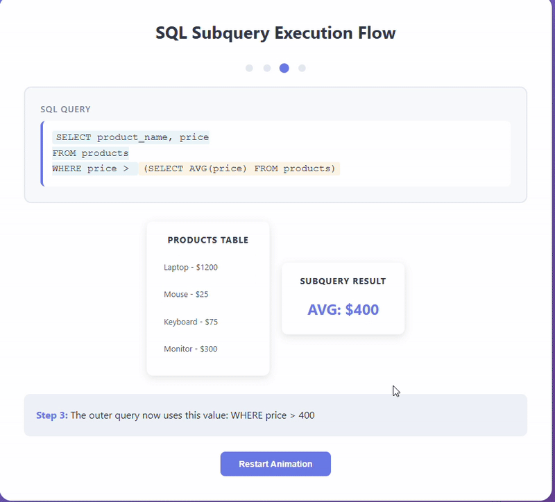

## What are Subqueries?

SQL **Subqueries** (also called nested queries or inner queries) are queries placed inside another query. Think of them as a question within a question - you ask one thing first, then use that answer to get your final result.

:::note
**Key Characteristics of Subqueries:**

- **Nested Structure**: A query inside another query, wrapped in parentheses.

- **Execution Order**: Inner query runs first, then outer query uses its results.

- **Versatile Placement**: Can appear in SELECT, FROM, WHERE, or HAVING clauses.

- **Return Types**: Can return a single value, a row, a column, or a full table.
:::

    <BrowserWindow url="https://github.com" bodyStyle={{padding: 0}}>    
     [](https://www.learnsqlonline.org/)
    </BrowserWindow>

:::success
**When to Use Subqueries:**

- **Complex Filtering**: Find customers who spent more than the average order value
- **Step-by-Step Logic**: Break down complicated queries into manageable pieces
- **Dynamic Comparisons**: Compare rows against calculated values
- **Data Validation**: Check if records exist in other tables
- **Aggregated Filtering**: Filter based on grouped calculations

**Real-World Example:**
You want to find all employees earning more than their department's average salary. Instead of calculating each department's average separately, you nest a query that figures out the average, then compare against it.
:::

:::info 

## Basic Subquery Syntax

```sql
-- Subquery in WHERE clause (most common)
SELECT column1, column2
FROM table1
WHERE column1 = (SELECT column FROM table2 WHERE condition);
```

| **Component** | **Purpose** | **Example** |
|---------------|-------------|-------------|
| Outer Query | Main query that uses subquery results | `SELECT name FROM employees` |
| Inner Query | Nested query that executes first | `(SELECT AVG(salary) FROM employees)` |
| Parentheses | Required to wrap subqueries | `WHERE salary > (subquery)` |
| Comparison | How outer query uses subquery result | `=, >, <, IN, EXISTS` |

## Subquery Placement Options

```sql
-- In WHERE clause
SELECT * FROM products
WHERE price > (SELECT AVG(price) FROM products);

```
```sql

-- In SELECT clause (scalar subquery)
SELECT 
    name,
    salary,
    (SELECT AVG(salary) FROM employees) AS avg_salary
FROM employees;
```
```sql
-- In FROM clause (derived table)
SELECT dept, avg_sal
FROM (
    SELECT department AS dept, AVG(salary) AS avg_sal
    FROM employees
    GROUP BY department
) AS dept_averages;
```
```sql
-- In HAVING clause
SELECT department, AVG(salary)
FROM employees
GROUP BY department
HAVING AVG(salary) > (SELECT AVG(salary) FROM employees);
```

:::

## Types of Subqueries

    <Tabs>
      <TabItem value="Scalar Subquery">
       ```sql
       -- Returns a single value
       -- Find products more expensive than average
       SELECT 
           product_name,
           price,
           (SELECT AVG(price) FROM products) AS avg_price,
           price - (SELECT AVG(price) FROM products) AS price_difference
       FROM products
       WHERE price > (SELECT AVG(price) FROM products)
       ORDER BY price DESC;
       
       -- Scalar subquery must return exactly one value
       ```
       </TabItem>
       <TabItem value="Column Subquery">
       ```sql
       -- Returns a single column (multiple rows)
       -- Find customers who placed orders in 2024
       SELECT 
           customer_id,
           customer_name,
           email
       FROM customers
       WHERE customer_id IN (
           SELECT DISTINCT customer_id 
           FROM orders 
           WHERE YEAR(order_date) = 2024
       )
       ORDER BY customer_name;
       
       -- Use IN, ANY, or ALL with column subqueries
       ```
       </TabItem>
       <TabItem value="Row Subquery">
       ```sql
       -- Returns a single row (multiple columns)
       -- Find employee with exact match of max salary and earliest hire date
       SELECT 
           employee_id,
           employee_name,
           salary,
           hire_date,
           department
       FROM employees
       WHERE (salary, hire_date) = (
           SELECT MAX(salary), MIN(hire_date)
           FROM employees
       );
       
       -- Compares multiple columns at once
       ```
       </TabItem>
      <TabItem value="Table Subquery">
       ```sql
       -- Returns a full table (multiple rows and columns)
       -- Calculate revenue by customer segment
       SELECT 
           segment,
           total_customers,
           total_revenue,
           ROUND(total_revenue / total_customers, 2) AS avg_revenue_per_customer
       FROM (
           SELECT 
               CASE 
                   WHEN total_spent > 5000 THEN 'VIP'
                   WHEN total_spent > 1000 THEN 'Regular'
                   ELSE 'Occasional'
               END AS segment,
               COUNT(*) AS total_customers,
               SUM(total_spent) AS total_revenue
           FROM (
               SELECT 
                   customer_id,
                   SUM(total_amount) AS total_spent
               FROM orders
               GROUP BY customer_id
           ) customer_totals
           GROUP BY segment
       ) segment_stats
       ORDER BY total_revenue DESC;
       
       -- Nested subqueries working together
       ```
       </TabItem>
      <TabItem value="Correlated Subquery">
       ```sql
       -- References outer query (runs for each row)
       -- Find employees earning more than their department average
       SELECT 
           e1.employee_name,
           e1.department,
           e1.salary,
           (
               SELECT AVG(e2.salary)
               FROM employees e2
               WHERE e2.department = e1.department
           ) AS dept_avg_salary,
           e1.salary - (
               SELECT AVG(e2.salary)
               FROM employees e2
               WHERE e2.department = e1.department
           ) AS difference
       FROM employees e1
       WHERE e1.salary > (
           SELECT AVG(e2.salary)
           FROM employees e2
           WHERE e2.department = e1.department
       )
       ORDER BY e1.department, e1.salary DESC;
       
       -- Inner query references outer query's current row
       ```
       </TabItem>
    </Tabs>

## Practical Examples

    <Tabs>
      <TabItem value="Above Average Analysis">
       ```sql
       -- Find products selling above their category average
       SELECT 
           p.product_id,
           p.product_name,
           p.category,
           p.price,
           (
               SELECT AVG(price)
               FROM products p2
               WHERE p2.category = p.category
           ) AS category_avg,
           ROUND(
               (p.price - (
                   SELECT AVG(price)
                   FROM products p2
                   WHERE p2.category = p.category
               )) / (
                   SELECT AVG(price)
                   FROM products p2
                   WHERE p2.category = p.category
               ) * 100,
               2
           ) AS percent_above_avg
       FROM products p
       WHERE p.price > (
           SELECT AVG(price)
           FROM products p2
           WHERE p2.category = p.category
       )
       ORDER BY p.category, percent_above_avg DESC;
       ```
       </TabItem>
       <TabItem value="Top Performers">
       ```sql
       -- Find top 3 products in each category by sales
       SELECT 
           category,
           product_name,
           total_sales,
           sales_rank
       FROM (
           SELECT 
               p.category,
               p.product_name,
               SUM(oi.quantity * oi.unit_price) AS total_sales,
               (
                   SELECT COUNT(*) + 1
                   FROM order_items oi2
                   JOIN products p2 ON oi2.product_id = p2.product_id
                   WHERE p2.category = p.category
                   GROUP BY oi2.product_id
                   HAVING SUM(oi2.quantity * oi2.unit_price) > 
                          SUM(oi.quantity * oi.unit_price)
               ) AS sales_rank
           FROM order_items oi
           JOIN products p ON oi.product_id = p.product_id
           GROUP BY p.product_id, p.category, p.product_name
       ) ranked_products
       WHERE sales_rank <= 3
       ORDER BY category, sales_rank;
       ```
       </TabItem>
       <TabItem value="Customer Segmentation">
       ```sql
       -- Segment customers based on spending compared to overall average
       SELECT 
           c.customer_id,
           c.customer_name,
           c.email,
           COALESCE(customer_stats.total_orders, 0) AS total_orders,
           COALESCE(customer_stats.total_spent, 0) AS total_spent,
           (SELECT AVG(total_amount) FROM orders) AS overall_avg_order,
           CASE 
               WHEN customer_stats.total_spent > (
                   SELECT AVG(total_spent)
                   FROM (
                       SELECT customer_id, SUM(total_amount) AS total_spent
                       FROM orders
                       GROUP BY customer_id
                   ) AS all_customers
               ) * 2 THEN 'Premium'
               WHEN customer_stats.total_spent > (
                   SELECT AVG(total_spent)
                   FROM (
                       SELECT customer_id, SUM(total_amount) AS total_spent
                       FROM orders
                       GROUP BY customer_id
                   ) AS all_customers
               ) THEN 'Regular'
               ELSE 'Basic'
           END AS customer_tier
       FROM customers c
       LEFT JOIN (
           SELECT 
               customer_id,
               COUNT(*) AS total_orders,
               SUM(total_amount) AS total_spent
           FROM orders
           GROUP BY customer_id
       ) customer_stats ON c.customer_id = customer_stats.customer_id
       ORDER BY total_spent DESC;
       ```
       </TabItem>
      <TabItem value="EXISTS Example">
       ```sql
       -- Find customers who have never placed an order
       SELECT 
           c.customer_id,
           c.customer_name,
           c.email,
           c.registration_date,
           DATEDIFF(CURRENT_DATE, c.registration_date) AS days_since_registration
       FROM customers c
       WHERE NOT EXISTS (
           SELECT 1
           FROM orders o
           WHERE o.customer_id = c.customer_id
       )
       AND c.registration_date < DATE_SUB(CURRENT_DATE, INTERVAL 30 DAY)
       ORDER BY c.registration_date;
       
       -- EXISTS is efficient - stops checking once it finds a match
       ```
       </TabItem>
      <TabItem value="ANY/ALL Operators">
       ```sql
       -- Find products more expensive than ANY product in Electronics
       SELECT product_name, price, category
       FROM products
       WHERE price > ANY (
           SELECT price
           FROM products
           WHERE category = 'Electronics'
       )
       AND category != 'Electronics';
       
       -- Find products more expensive than ALL products in Electronics
       SELECT product_name, price, category
       FROM products
       WHERE price > ALL (
           SELECT price
           FROM products
           WHERE category = 'Electronics'
       )
       ORDER BY price DESC;
       
       -- ANY means "at least one", ALL means "every single one"
       ```
       </TabItem>
       <TabItem value="Sample Output">
       ```plaintext
       -- Sample result for above-average products:
       
       product_id | product_name    | category    | price   | category_avg | percent_above_avg
       -----------|-----------------|-------------|---------|--------------|------------------
       15         | Laptop Pro      | Electronics | 1299.99 | 756.45       | 71.85
       23         | Gaming Monitor  | Electronics | 899.99  | 756.45       | 18.98
       42         | Premium Mouse   | Electronics | 149.99  | 756.45       | -80.17
       8          | Office Desk     | Furniture   | 449.99  | 312.50       | 44.00
       
       -- Shows products priced above their category's average
       -- Includes the average and percentage difference
       ```
       </TabItem>
    </Tabs>

## Subqueries vs JOINs

:::tip
**When to Choose What:**

**Use Subqueries When:**

- Logic is clearer with step-by-step thinking
- You need aggregated values for comparison
- Checking for existence/non-existence (EXISTS/NOT EXISTS)
- One-time calculations that don't need repeated access
- Building derived tables for complex analysis

**Use JOINs When:**
- Combining columns from multiple tables
- Need better performance with large datasets
- Retrieving data from multiple tables simultaneously
- Working with well-indexed foreign keys

**Example Comparison:**
```sql
-- Using Subquery
SELECT customer_name
FROM customers
WHERE customer_id IN (
    SELECT customer_id 
    FROM orders 
    WHERE order_date >= '2024-01-01'
);

-- Using JOIN (often faster)
SELECT DISTINCT c.customer_name
FROM customers c
INNER JOIN orders o ON c.customer_id = o.customer_id
WHERE o.order_date >= '2024-01-01';
```
:::

## Common Subquery Patterns

:::info
**Useful Patterns You'll Use Often:**

1. **Find Records NOT IN Another Table:**
   ```sql
   SELECT product_name
   FROM products
   WHERE product_id NOT IN (
       SELECT DISTINCT product_id
       FROM order_items
   );
   -- Finds products never ordered
   ```

2. **Compare Against Aggregates:**
   ```sql
   SELECT employee_name, salary
   FROM employees
   WHERE salary > (SELECT AVG(salary) FROM employees);
   -- Above-average salaries
   ```

3. **Ranked Results:**
   ```sql
   SELECT *
   FROM products
   WHERE price = (SELECT MAX(price) FROM products);
   -- Most expensive product
   ```

4. **Conditional Aggregation:**
   ```sql
   SELECT 
       category,
       COUNT(*) as product_count
   FROM products
   GROUP BY category
   HAVING COUNT(*) > (
       SELECT AVG(cat_count)
       FROM (
           SELECT COUNT(*) as cat_count
           FROM products
           GROUP BY category
       ) AS category_counts
   );
   -- Categories with above-average product counts
   ```
:::

## Common Mistakes to Avoid

:::warning
**Watch Out For These:**

1. **Forgetting Parentheses**: Subqueries must be wrapped
   ```sql
   -- Wrong
   WHERE customer_id IN SELECT customer_id FROM orders;
   
   -- Correct
   WHERE customer_id IN (SELECT customer_id FROM orders);
   ```

2. **Multiple Values When Expecting One**:
   ```sql
   -- Will error if subquery returns multiple rows
   WHERE price = (SELECT price FROM products);
   
   -- Use IN for multiple values
   WHERE price IN (SELECT price FROM products WHERE category = 'Electronics');
   ```

3. **NULL Handling with NOT IN**:
   ```sql
   -- NOT IN can behave unexpectedly with NULLs
   -- Use NOT EXISTS instead
   WHERE NOT EXISTS (
       SELECT 1 FROM orders WHERE customer_id = customers.id
   );
   ```

4. **Performance Blindness**:
   ```sql
   -- Don't nest too deep - hard to read and slow
   -- Keep it to 2-3 levels maximum
   ```
:::

## Best Practices

1. **Keep It Simple**: If it's hard to understand, consider breaking it down
2. **Name Derived Tables**: Always alias subqueries in FROM clause
3. **Comment Complex Logic**: Future you will thank present you
4. **Test Step by Step**: Run inner queries separately first
5. **Consider Alternatives**: Sometimes a `JOIN` or `CTE` is clearer
6. **Use Appropriate Operators**: EXISTS for existence, IN for lists, = for single values


## Conclusion

Subqueries are your tool for asking layered questions - calculate something first, then use that answer to get what you really want. They make complex logic readable by breaking problems into steps. Start with simple subqueries in `WHERE` clauses, then gradually work up to more complex patterns. 

**Remember :** if your subquery gets too complicated, there's probably a simpler way to write it. Keep it clear, keep it tested, and your queries will be both powerful and maintainable.

<GiscusComments/>