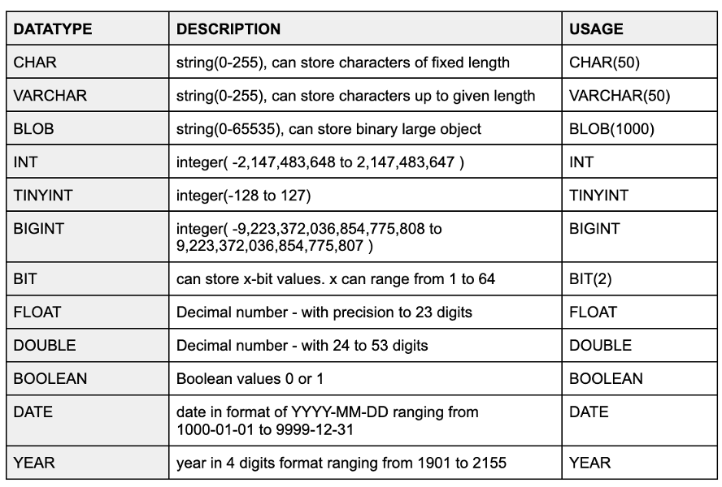

## 📙 Welcome to SQL Data Types!

Hey there! If you're new to SQL or just getting started, this module is perfect for you. Data types are like labels that tell your database what kind of information (like numbers, text, or dates) can go into each column of a table. Think of them as rules to keep your data neat and safe! Let’s explore them step by step with easy examples.

### 📘 What Are Data Types?

Data types are super important because they:
- Decide what kind of data you can store (e.g., numbers or words).
- Help save space in your database.
- Prevent mistakes, like putting letters in a number column.

Imagine you’re making a table for a school called `students` with columns like `id`, `name`, and `age`. Data types ensure `id` is a number and `name` is text. Let’s see how!

Here’s a handy table to get you started (check the image below for more details):



> **Pro Tip**: Always pick the right data type to avoid confusion. For example, don’t use a text type for numbers!

### 📘 Numeric Data Types (Numbers Made Simple)

Numeric types are for numbers—whole numbers or decimals. Let’s break them down:

- **TINYINT**: Small numbers, from -128 to 127 (or 0 to 255 if unsigned).
- **INT**: Bigger numbers, from -2,147,483,648 to 2,147,483,647.
- **FLOAT**: Decimals with up to 23 digits (e.g., 3.14).
- **DOUBLE**: Decimals with up to 53 digits (for super precise numbers).
- **BIGINT**: Huge numbers, from -9,223,372,036,854,775,808 to 9,223,372,036,854,775,807.

**Example**:
    :::info
<Tabs>
  <TabItem value="SQL Code" label="SQL Code">
```sql title="Creating a Table with Numeric Types"
CREATE TABLE students (
    id TINYINT,
    age INT,
    gpa FLOAT
);
INSERT INTO students (id, age, gpa) VALUES (1, 20, 3.75);
```
  </TabItem>

  <TabItem value="Output" label="Output">
| id  | age | gpa  |
|-----|-----|------|
| 1   | 20  | 3.75 |
  </TabItem>
</Tabs>
:::

> **What NOT to Do**: Don’t use FLOAT for money (e.g., $5.99) because it can have tiny rounding errors. Use DECIMAL instead for exact values like `DECIMAL(5,2)` (5 digits total, 2 after the decimal).

### 🔄 String Data Types (Text and More)

String types are for text or characters. Here’s what you need:

- **CHAR(length)**: Fixed length (e.g., CHAR(50) always uses 50 spaces, even if text is shorter).
- **VARCHAR(length)**: Variable length up to a limit (e.g., VARCHAR(50) uses only what’s needed, up to 50 characters).
- **BLOB**: For binary data like images or files (up to 65,535 bytes).

**Example**:
    :::info
<Tabs>
  <TabItem value="SQL Code" label="SQL Code">
```sql title="Creating a Table with String Types"
CREATE TABLE students (
    id TINYINT,
    name VARCHAR(50)
);
INSERT INTO students (id, name) VALUES (2, 'Alice');
```
  </TabItem>

  <TabItem value="Output" label="Output">
| id  | name  |
|-----|-------|
| 2   | Alice |
  </TabItem>
</Tabs>
:::

> **What NOT to Do**: Avoid using CHAR for names if lengths vary a lot—it wastes space. Use VARCHAR instead!

### 📘 Date and Time Data Types (Tracking Time)

These types help with dates and times:

- **DATE**: Stores dates like '2025-08-14' (from 1000-01-01 to 9999-12-31).
- **YEAR**: Just the year, from 1901 to 2155 (e.g., 2025).

**Example**:
    :::info
<Tabs>
  <TabItem value="SQL Code" label="SQL Code">
```sql title="Creating a Table with Date Types"
CREATE TABLE students (
    id TINYINT,
    enrollment_date DATE
);
INSERT INTO students (id, enrollment_date) VALUES (3, '2025-08-14');
```
  </TabItem>

  <TabItem value="Output" label="Output">
| id  | enrollment_date |
|-----|-----------------|
| 3   | 2025-08-14      |
  </TabItem>
</Tabs>
:::

> **What NOT to Do**: Don’t store dates as VARCHAR (e.g., '08-14-2025')—use DATE to enable date functions like comparisons!

### 🔄 Other Data Types (Special Cases)

- **BOOLEAN**: True (1) or False (0) values.
- **BIT(x)**: Stores x bits (e.g., BIT(2) for 0 to 3).

**Example**:
    :::info
<Tabs>
  <TabItem value="SQL Code" label="SQL Code">
```sql title="Creating a Table with BOOLEAN"
CREATE TABLE users (
    id TINYINT,
    is_active BOOLEAN
);
INSERT INTO users (id, is_active) VALUES (1, TRUE);
```
  </TabItem>

  <TabItem value="Output" label="Output">
| id  | is_active |
|-----|-----------|
| 1   | 1         |
  </TabItem>
</Tabs>
:::

> **What NOT to Do**: Don’t use INT for true/false—BOOLEAN is clearer and safer.

### 🧹 Signed vs. Unsigned (Positive or Negative?)

For numeric types like TINYINT:
- **Signed**: Allows negative numbers (e.g., -128 to 127).
- **Unsigned**: Only positive numbers (e.g., 0 to 255).

**Example**:
    :::info
<Tabs>
  <TabItem value="SQL Code" label="SQL Code">
```sql title="Unsigned Example"
CREATE TABLE products (
    stock TINYINT UNSIGNED
);
INSERT INTO products (stock) VALUES (200);
```
  </TabItem>

  <TabItem value="Output" label="Output">
| stock |
|-------|
| 200   |
  </TabItem>
</Tabs>
:::

> **What NOT to Do**: Don’t use signed TINYINT for quantities (e.g., stock) that can’t be negative—use UNSIGNED to maximize the range.

## ✅ What You’ve Learned

Great job! You’ve explored:
- **Numeric Types**: TINYINT, INT, FLOAT, DOUBLE, BIGINT.
- **String Types**: CHAR, VARCHAR, BLOB.
- **Date/Time Types**: DATE, YEAR.
- **Other Types**: BOOLEAN, BIT.
- **Signed vs. Unsigned**: Choosing based on needs.

Try creating a table with these types and inserting data to practice. Avoid the "What NOT to Do" mistakes to keep your database happy!

---