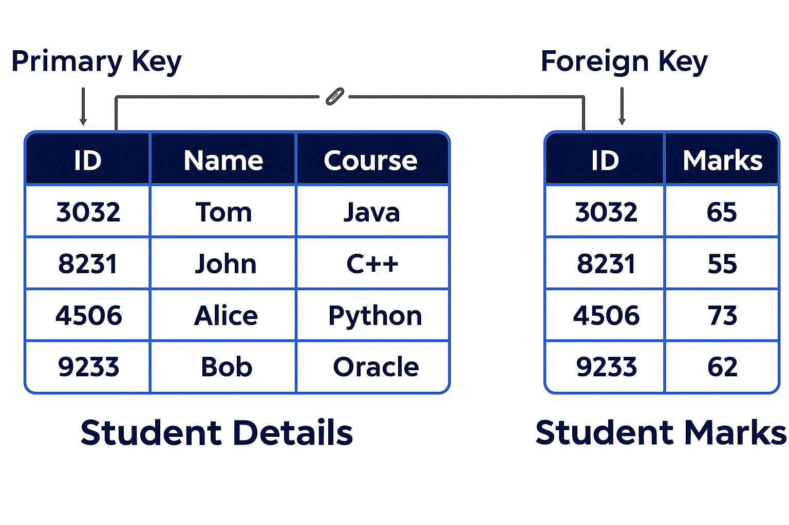

## 📙 Welcome to SQL Keys!

Hi, new SQL adventurer! Keys are like superpowers for your database—they help you identify and connect data easily. A **primary key** is like a unique badge for each row, while a **foreign key** is like a bridge linking tables together. We’ll use a `Student Details` table and a `Student Marks` table to explore these with fun examples.

### 📘 What Are Keys?

Keys are special columns that make your database work smoothly:
- **Primary Key (PK)**: A unique ID for every row in a table (e.g., a student’s roll number).
- **Foreign Key (FK)**: A column that links to a primary key in another table (e.g., connecting a student to their marks).

Together, they help you find data fast and keep everything connected!

> **Pro Tip**: Always use keys to give your tables structure — think of them as the backbone of your database!

---

## 📘 Primary Key: Your Unique ID!

### What Is a Primary Key?

A primary key is like a special label that makes every row in your table stand out. It’s a column (or a group of columns) that:
- Gives each row a unique identity.
- Can’t be empty (NULL).
- Has no duplicates.
- Helps you quickly find or link rows.

It’s perfect for things like student IDs or product codes.

### Creating a Primary Key (Single Column)

You set a primary key when you create a table, often on an `id` column.

**How It Works**: Every time you add a row, the PK must be unique, and you can’t skip it.

**Example**:
    :::info
<Tabs>
  <TabItem value="SQL Code" label="SQL Code">
```sql title="Creating Table with Primary Key"
CREATE TABLE Student_Details (
    ID INT PRIMARY KEY, -- Unique ID for each student
    Name VARCHAR(50),
    Course VARCHAR(50)
);
INSERT INTO Student_Details (ID, Name, Course) VALUES (3032, 'Tom', 'Java'); -- Works!
-- This will fail: INSERT INTO Student_Details (ID, Name, Course) VALUES (3032, 'Tom', 'Java'); -- Duplicate ID!
```
  </TabItem>

  <TabItem value="Output" label="Output">
| ID   | Name | Course |
|------|------|--------|
| 3032 | Tom  | Java   |
  </TabItem>
</Tabs>
:::

### Creating a Composite Primary Key (Multiple Columns)

If one column isn’t unique enough, combine columns to make a composite PK, like a student ID and course ID.

**How It Works**: The combination of columns must be unique—e.g., a student can’t take the same course twice.

**Example**:
    :::info
<Tabs>
  <TabItem value="SQL Code" label="SQL Code">
```sql title="Creating Table with Composite Primary Key"
CREATE TABLE Student_Marks (
    ID INT,
    Marks INT,
    PRIMARY KEY (ID, Marks) -- Unique combo
);
INSERT INTO Student_Marks (ID, Marks) VALUES (3032, 65); -- Works!
-- This will fail: INSERT INTO Student_Marks (ID, Marks) VALUES (3032, 65); -- Same combo!
```
  </TabItem>

  <TabItem value="Output" label="Output">
| ID   | Marks |
|------|-------|
| 3032 | 65    |
  </TabItem>
</Tabs>
:::

### Auto-Incrementing Primary Keys (Hands-Free IDs)

Let SQL generate IDs automatically with AUTO_INCREMENT—great for saving time!

**How It Works**: Each new row gets the next number (e.g., 1, 2, 3…).

**Example**:
    :::info
<Tabs>
  <TabItem value="SQL Code" label="SQL Code">
```sql title="Creating Table with Auto-Increment"
CREATE TABLE Student_Details (
    ID INT PRIMARY KEY AUTO_INCREMENT,
    Name VARCHAR(50),
    Course VARCHAR(50)
);
INSERT INTO Student_Details (Name, Course) VALUES ('Tom', 'Java'); -- id becomes 1
INSERT INTO Student_Details (Name, Course) VALUES ('John', 'C++'); -- id becomes 2
```
  </TabItem>

  <TabItem value="Output" label="Output">
| ID | Name | Course |
|----|------|--------|
| 1  | Tom  | Java   |
| 2  | John | C++    |
  </TabItem>
</Tabs>
:::

> **What NOT to Do**: 
- Don’t use changeable data like names as PKs—they might repeat or change over time.
- Avoid manually setting IDs with AUTO_INCREMENT—it can cause conflicts!

### 📙 Conclusion for Primary Key

You’ve learned how a primary key gives every row its own special ID! The image below shows this in action. It displays a `Student Details` table with `ID` as the primary key, containing `ID: 3032, Name: Tom, Course: Java`, `ID: 8231, Name: John, Course: C++`, `ID: 4506, Name: Alice, Course: Python`, and `ID: 9233, Name: Bob, Course: Oracle`. This ensures every student has a unique identifier, just like a roll number in a class!


---

## 📘 Foreign Key: Connecting the Dots!

### What Is a Foreign Key?

A foreign key is like a friendship bracelet that links two tables. It’s a column in one table that points to a primary key in another table. It:
- Creates relationships (e.g., a student to their marks).
- Can have duplicates or be empty (NULL) unless you set rules.
- Stops you from adding invalid links (e.g., a student ID that doesn’t exist).

### Creating a Foreign Key

You add a foreign key when creating a table, and it must match a primary key in another table.

**How It Works**: The FK (e.g., `ID` in `Student Marks`) must match a value in the PK (e.g., `ID` in `Student Details`). If not, SQL says, “No way!”

**Example**:
    :::info
<Tabs>
  <TabItem value="SQL Code" label="SQL Code">
```sql title="Creating Tables with Foreign Key"
CREATE TABLE Student_Details (
    ID INT PRIMARY KEY, -- Primary key
    Name VARCHAR(50),
    Course VARCHAR(50)
);
CREATE TABLE Student_Marks (
    ID INT,
    Marks INT,
    FOREIGN KEY (ID) REFERENCES Student_Details(ID) -- Links to Student_Details.ID
);
INSERT INTO Student_Details (ID, Name, Course) VALUES (3032, 'Tom', 'Java'); -- Add student
INSERT INTO Student_Marks (ID, Marks) VALUES (3032, 65); -- Link to Tom
-- This will fail: INSERT INTO Student_Marks (ID, Marks) VALUES (999, 50); -- No student 999!
```
  </TabItem>

  <TabItem value="Output" label="Output">
Student Details Table:
| ID   | Name | Course |
|------|------|--------|
| 3032 | Tom  | Java   |

Student Marks Table:
| ID   | Marks |
|------|-------|
| 3032 | 65    |
  </TabItem>
</Tabs>
:::

### Cascading Actions with Foreign Keys (Smart Changes!)

You can tell SQL what to do when the primary key data changes:
- **ON DELETE CASCADE**: If you delete a student, their marks vanish too.
- **ON UPDATE CASCADE**: If a student’s ID changes, their marks update automatically.

**How It Works**: This keeps related data in sync without extra work.

**Example**:
    :::info
<Tabs>
  <TabItem value="SQL Code" label="SQL Code">
```sql title="Foreign Key with CASCADE"
CREATE TABLE Student_Marks (
    ID INT,
    Marks INT,
    FOREIGN KEY (ID) REFERENCES Student_Details(ID) ON DELETE CASCADE
);
INSERT INTO Student_Details (ID, Name, Course) VALUES (3032, 'Tom', 'Java');
INSERT INTO Student_Marks (ID, Marks) VALUES (3032, 65);
DELETE FROM Student_Details WHERE ID = 3032; -- Deletes Tom and his marks!
```
  </TabItem>

  <TabItem value="Output" label="Output">
Before Delete:
Student Details Table:
| ID   | Name | Course |
|------|------|--------|
| 3032 | Tom  | Java   |

Student Marks Table:
| ID   | Marks |
|------|-------|
| 3032 | 65    |

After Delete: (Both tables empty)
  </TabItem>
</Tabs>
:::

> **What NOT to Do**: 
- Don’t create the FK table before the PK table—SQL needs the PK first!
- Avoid CASCADE if you want to keep related data after deletions!

### 📙 Conclusion for Foreign Key

Awesome job! You’ve learned how a foreign key connects tables like magic. The image below shows this in action. It displays the `Student Details` table with `ID` as the primary key (`ID: 3032, Name: Tom, Course: Java`, etc.) and the `Student Marks` table with `ID` as the foreign key (`ID: 3032, Marks: 65`, etc.), linking students to their marks. This keeps everything connected perfectly!



---

## 🧩 Comparison: Primary Key vs. Foreign Key

Let’s compare these two keys side by side to see how they’re different and work together!

| **Feature**            | **Primary Key (PK)**                       | **Foreign Key (FK)**                       |
|-------------------------|--------------------------------------------|--------------------------------------------|
| **Purpose**            | Uniquely identifies each row in one table. | Links to a PK in another table.            |
| **Uniqueness**         | Must be unique and not NULL.              | Can have duplicates or NULL (unless restricted). |
| **Location**           | One per table, in that table.             | In a different table, pointing to a PK.    |
| **Example**            | `ID` in `Student_Details` table.          | `ID` in `Student_Marks` table.             |
| **Changes**            | Can’t change easily—used as a base.       | Can update or delete with CASCADE rules.   |
| **Use Case**           | Identifying a student (e.g., roll number).| Connecting a student to their marks.       |

**Simple Explanation**:
- A PK is like your personal ID number—it’s yours alone in your table.
- An FK is like a reference to someone else’s ID—it connects your table to theirs.
- Together, they build a network where every piece of data fits perfectly!

**Example of Both Together**:
    :::info
<Tabs>
  <TabItem value="SQL Code" label="SQL Code">
```sql title="Using PK and FK Together"
CREATE TABLE Student_Details (
    ID INT PRIMARY KEY,
    Name VARCHAR(50),
    Course VARCHAR(50)
);
CREATE TABLE Student_Marks (
    ID INT,
    Marks INT,
    FOREIGN KEY (ID) REFERENCES Student_Details(ID)
);
INSERT INTO Student_Details (ID, Name, Course) VALUES (3032, 'Tom', 'Java');
INSERT INTO Student_Marks (ID, Marks) VALUES (3032, 65);
```
  </TabItem>

  <TabItem value="Output" label="Output">
Student Details Table:
| ID   | Name | Course |
|------|------|--------|
| 3032 | Tom  | Java   |

Student Marks Table:
| ID   | Marks |
|------|-------|
| 3032 | 65    |
  </TabItem>
</Tabs>
:::

> **What NOT to Do**: Don’t mix up PK and FK roles—use PK for unique IDs and FK for linking only!

## ✅ What You’ve Learned

You’re a SQL star! You’ve mastered:
- **Primary Key**: Your table’s unique identifier.
- **Foreign Key**: The link between tables.
- **Comparison**: How they differ and work together.
- **Cascading**: Smart updates and deletes.

Try creating tables with both PK and FK, and test CASCADE. Avoid the "What NOT to Do" tips to keep your database strong and connected!