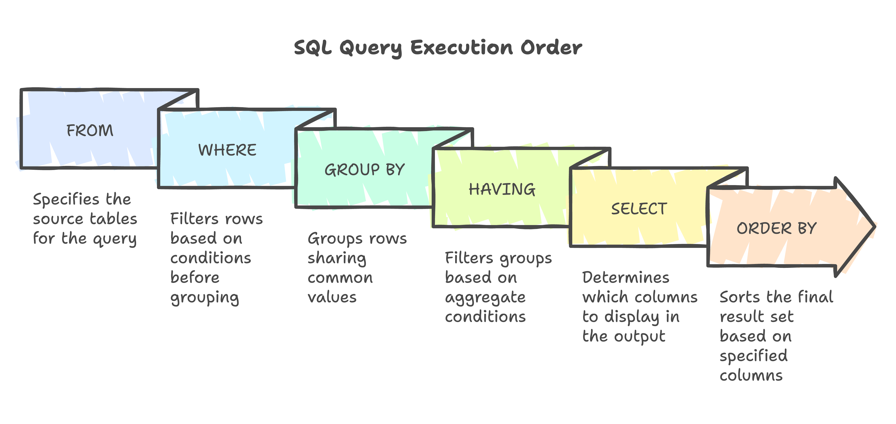

## 📙 Welcome to SQL Clauses!

Hey there, SQL beginner! Clauses are the essential parts of an SQL query that tell the database what data to retrieve and how to process it. Think of them as the steps in a recipe—each clause has a specific job, and they must be written in a strict order to work correctly. We’ll use a simple `students` table (with columns like `id`, `name`, `age`, `marks`, and `city`) to explain everything with clear examples. Let’s dive in step by step, following the correct order of clauses in a SELECT query!



### 📘 What Are Clauses?

Clauses are components of SQL statements that perform tasks like selecting columns, filtering rows, or sorting results. In a SELECT query, they must appear in this order: **SELECT → FROM → JOIN → WHERE → GROUP BY → HAVING → ORDER BY → LIMIT**. However, the database *executes* them differently: **FROM → JOIN → WHERE → GROUP BY → HAVING → SELECT → ORDER BY → LIMIT**. Understanding both orders helps you write correct and efficient queries.

> **Pro Tip**: Always write clauses in the syntactic order (SELECT first, LIMIT last), but think about execution order when optimizing performance!

### 📘 SELECT Clause (Choosing What to Show!)

The SELECT clause is where you pick what data to display—columns, calculations, or even subqueries. Use `*` for all columns, list specific ones, or add aliases with AS. You can also use functions like COUNT or DISTINCT to shape your results.

**Examples**:
    :::info
<Tabs>
  <TabItem value="Basic SELECT" label="Basic SELECT">
```sql title="Basic SELECT with Alias"
SELECT name AS student_name, age
FROM students;
```
  </TabItem>

  <TabItem value="Basic Output" label="Basic Output">
| student_name | age |
|--------------|-----|
| Alice        | 20  |
| Bob          | 22  |
| Carol        | 19  |
  </TabItem>

  <TabItem value="DISTINCT" label="DISTINCT">
```sql title="Using DISTINCT to Avoid Duplicates"
SELECT DISTINCT city
FROM students;
```
  </TabItem>

  <TabItem value="DISTINCT Output" label="DISTINCT Output">
| city   |
|--------|
| Mumbai |
| Delhi  |
  </TabItem>

  <TabItem value="Aggregate" label="Aggregate">
```sql title="Using Aggregate Function"
SELECT COUNT(id) AS total_students, AVG(marks) AS avg_marks
FROM students;
```
  </TabItem>

  <TabItem value="Aggregate Output" label="Aggregate Output">
| total_students | avg_marks |
|----------------|-----------|
| 3              | 84.0      |
  </TabItem>

  <TabItem value="Subquery" label="Subquery">
```sql title="Using Subquery in SELECT"
SELECT name, marks,
       (SELECT AVG(marks) FROM students) AS avg_all_marks
FROM students;
```
  </TabItem>

  <TabItem value="Subquery Output" label="Subquery Output">
| name  | marks | avg_all_marks |
|-------|-------|---------------|
| Alice | 85    | 84.0          |
| Bob   | 92    | 84.0          |
| Carol | 75    | 84.0          |
  </TabItem>
</Tabs>
:::

> **What NOT to Do**: 
> - Don’t use SELECT without FROM—it’ll error in most databases!
> - Avoid SELECT * in production—it’s inefficient; list only needed columns.
> - Don’t use column aliases in WHERE or GROUP BY—aliases are for output only.

### 🔄 FROM Clause (Where the Data Lives!)

The FROM clause names the table(s) or view(s) your data comes from. It’s the starting point of your query and sets the stage for everything else.

**Example**:
    :::info
<Tabs>
  <TabItem value="SQL Code" label="SQL Code">
```sql title="Using FROM Clause"
SELECT id, name
FROM students;
```
  </TabItem>

  <TabItem value="Output" label="Output">
| id | name  |
|----|-------|
| 1  | Alice |
| 2  | Bob   |
| 3  | Carol |
  </TabItem>
</Tabs>
:::

> **What NOT to Do**: Don’t misspell table names (e.g., FROM studnets)—it’ll cause a “table not found” error!

### 🔄 JOIN Clause (Combining Tables!)

JOIN, used within FROM, combines data from multiple tables based on a condition (e.g., INNER JOIN, LEFT JOIN). It’s crucial for linking related data.

**Example**:
    :::info
<Tabs>
  <TabItem value="SQL Code" label="SQL Code">
```sql title="Using JOIN Clause"
SELECT s.id, s.name, c.course_name
FROM students s
INNER JOIN courses c ON s.id = c.student_id; -- Assume courses table
```
  </TabItem>

  <TabItem value="Output" label="Output">
| id | name  | course_name |
|----|-------|-------------|
| 1  | Alice | Math        |
| 2  | Bob   | Science     |
  </TabItem>
</Tabs>
:::

> **What NOT to Do**: Don’t forget the ON condition—it can create a massive Cartesian product, slowing your query!

### 📘 WHERE Clause (Filtering the Rows!)

The WHERE clause filters rows based on conditions using operators like =, >, or LIKE. It narrows down your result set before grouping or sorting.

**Example**:
    :::info
<Tabs>
  <TabItem value="SQL Code" label="SQL Code">
```sql title="Using WHERE Clause"
SELECT id, name, marks
FROM students
WHERE marks > 80;
```
  </TabItem>

  <TabItem value="Output" label="Output">
| id | name  | marks |
|----|-------|-------|
| 1  | Alice | 85    |
| 2  | Bob   | 92    |
  </TabItem>
</Tabs>
:::

> **What NOT to Do**: Don’t use aggregate functions (e.g., AVG(marks)) in WHERE—use HAVING for that!

### 🔄 GROUP BY Clause (Organizing Data into Groups!)

GROUP BY groups rows with the same values into summary rows, typically used with aggregates like COUNT, SUM, or AVG.

**Example**:
    :::info
<Tabs>
  <TabItem value="SQL Code" label="SQL Code">
```sql title="Using GROUP BY Clause"
SELECT city, COUNT(id) AS num_students
FROM students
GROUP BY city;
```
  </TabItem>

  <TabItem value="Output" label="Output">
| city   | num_students |
|--------|--------------|
| Mumbai | 2            |
| Delhi  | 1            |
  </TabItem>
</Tabs>
:::

> **What NOT to Do**: Don’t include non-aggregated columns in SELECT without grouping them—it can cause errors or inconsistent results!

### 📘 HAVING Clause (Filtering Groups!)

HAVING filters grouped data after GROUP BY, using aggregates like AVG or COUNT. It’s like WHERE but for groups.

**Example**:
    :::info
<Tabs>
  <TabItem value="SQL Code" label="SQL Code">
```sql title="Using HAVING Clause"
SELECT city, AVG(marks) AS avg_marks
FROM students
GROUP BY city
HAVING AVG(marks) > 80;
```
  </TabItem>

  <TabItem value="Output" label="Output">
| city   | avg_marks |
|--------|-----------|
| Mumbai | 88.5      |
  </TabItem>
</Tabs>
:::

> **What NOT to Do**: Don’t use HAVING for row-level conditions—use WHERE for those to keep your query clear!

### 🔄 ORDER BY Clause (Sorting the Results!)

ORDER BY sorts the result set by one or more columns, using ASC (ascending, default) or DESC (descending).

**Example**:
    :::info
<Tabs>
  <TabItem value="SQL Code" label="SQL Code">
```sql title="Using ORDER BY Clause"
SELECT id, name, marks
FROM students
ORDER BY marks DESC;
```
  </TabItem>

  <TabItem value="Output" label="Output">
| id | name  | marks |
|----|-------|-------|
| 2  | Bob   | 92    |
| 1  | Alice | 85    |
| 3  | Carol | 75    |
  </TabItem>
</Tabs>
:::

> **What NOT to Do**: Don’t use aliases in ORDER BY in some databases (e.g., ORDER BY student_name)—use the original column name!

### 📘 LIMIT Clause (Controlling Output Size!)

LIMIT restricts the number of rows returned, often paired with OFFSET for pagination. (Note: Some databases use TOP or ROWNUM.)

**Example**:
    :::info
<Tabs>
  <TabItem value="SQL Code" label="SQL Code">
```sql title="Using LIMIT Clause"
SELECT id, name
FROM students
LIMIT 2;
```
  </TabItem>

  <TabItem value="Output" label="Output">
| id | name  |
|----|-------|
| 1  | Alice |
| 2  | Bob   |
  </TabItem>
</Tabs>
:::

> **What NOT to Do**: Don’t use LIMIT without ORDER BY if you need consistent results—it may return random rows!

## ✅ What You’ve Learned

You’re now a master of SQL clauses in their correct order! You’ve explored:
- **SELECT**: Picking columns, with aliases, DISTINCT, aggregates, or subqueries.
- **FROM**: Specifying data sources.
- **JOIN**: Combining tables.
- **WHERE**: Filtering individual rows.
- **GROUP BY**: Grouping rows for aggregation.
- **HAVING**: Filtering grouped data.
- **ORDER BY**: Sorting results.
- **LIMIT**: Controlling output size.

Practice combining these clauses in order using the `students` table. Follow the “What NOT to Do” tips to write clean, efficient queries!