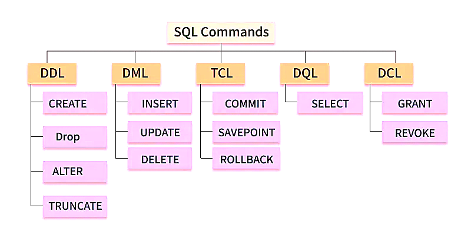

## 📙 Welcome to SQL Commands!

Hey there, SQL beginner! SQL commands are the instructions you give to a database to perform tasks like creating tables, adding data, or controlling access. Think of them as different toolkits for managing your database. They’re grouped into five main types: DDL, DML, DCL, TCL, and DQL. We’ll use a simple `students` table (with columns like `id`, `name`, `age`, `marks`, and `city`) to explain everything with clear examples. Let’s dive in step by step to explore five key commands for each type!

### 📘 What Are SQL Commands?

SQL commands are categorized based on their purpose in interacting with a database:
- **DDL (Data Definition Language)**: Defines and modifies database structures (e.g., tables, schemas).
- **DML (Data Manipulation Language)**: Manages data within tables (e.g., insert, update, delete).
- **DCL (Data Control Language)**: Controls access and permissions.
- **TCL (Transaction Control Language)**: Manages transactions to ensure data integrity.
- **DQL (Data Query Language)**: Queries data from the database (focused on SELECT).





> **Pro Tip**: Knowing which command belongs to which category helps you choose the right tool for the job—DDL for structure, DML for data, and so on!

### 📘 DDL: Data Definition Language (Building the Database!)

DDL commands define or modify the structure of database objects like tables, schemas, or indexes. They’re like the blueprints for your database.

**Five Key Commands**:
- **CREATE**: Creates new tables, databases, or other objects.
- **ALTER**: Modifies existing objects (e.g., adds columns).
- **DROP**: Deletes objects entirely.
- **TRUNCATE**: Removes all data from a table but keeps its structure.
- **RENAME**: Changes the name of a database object.

**Examples**:
    :::info
<Tabs>
  <TabItem value="CREATE" label="CREATE">
```sql title="Using CREATE (DDL)"
CREATE TABLE students (
    id INT PRIMARY KEY,
    name VARCHAR(50),
    age INT,
    marks INT,
    city VARCHAR(50)
);
```
  </TabItem>

  <TabItem value="CREATE Output" label="CREATE Output">
Table `students` created successfully.
  </TabItem>

  <TabItem value="ALTER" label="ALTER">
```sql title="Using ALTER (DDL)"
ALTER TABLE students ADD email VARCHAR(100);
```
  </TabItem>

  <TabItem value="ALTER Output" label="ALTER Output">
Column `email` added to `students` table.
  </TabItem>

  <TabItem value="DROP" label="DROP">
```sql title="Using DROP (DDL)"
DROP TABLE students;
```
  </TabItem>

  <TabItem value="DROP Output" label="DROP Output">
Table `students` dropped successfully.
  </TabItem>

  <TabItem value="TRUNCATE" label="TRUNCATE">
```sql title="Using TRUNCATE (DDL)"
TRUNCATE TABLE students;
```
  </TabItem>

  <TabItem value="TRUNCATE Output" label="TRUNCATE Output">
All data in `students` table removed; structure remains.
  </TabItem>

  <TabItem value="RENAME" label="RENAME">
```sql title="Using RENAME (DDL)"
RENAME TABLE students TO pupils;
```
  </TabItem>

  <TabItem value="RENAME Output" label="RENAME Output">
Table `students` renamed to `pupils`.
  </TabItem>
</Tabs>
:::

> **What NOT to Do**: 
> - Don’t DROP or TRUNCATE without backups—data loss is permanent!
> - Don’t ALTER a table without checking dependencies (e.g., foreign keys).

### 🔄 DML: Data Manipulation Language (Working with Data!)

DML commands let you manipulate data within tables—adding, updating, or deleting rows.

**Five Key Commands**:
- **INSERT**: Adds new rows to a table.
- **UPDATE**: Modifies existing rows.
- **DELETE**: Removes rows.
- **MERGE** (or UPSERT): Combines INSERT and UPDATE based on conditions.
- **CALL**: Executes stored procedures that manipulate data (specific to some DBMS).

**Examples**:
    :::info
<Tabs>
  <TabItem value="INSERT" label="INSERT">
```sql title="Using INSERT (DML)"
INSERT INTO students (id, name, age, marks, city)
VALUES (1, 'Alice', 20, 85, 'Mumbai');
```
  </TabItem>

  <TabItem value="INSERT Output" label="INSERT Output">
1 row inserted into `students`.
  </TabItem>

  <TabItem value="UPDATE" label="UPDATE">
```sql title="Using UPDATE (DML)"
UPDATE students
SET marks = 90
WHERE id = 1;
```
  </TabItem>

  <TabItem value="UPDATE Output" label="UPDATE Output">
1 row updated in `students`.
  </TabItem>

  <TabItem value="DELETE" label="DELETE">
```sql title="Using DELETE (DML)"
DELETE FROM students
WHERE marks < 50;
```
  </TabItem>

  <TabItem value="DELETE Output" label="DELETE Output">
Rows with marks < 50 deleted from `students`.
  </TabItem>

  <TabItem value="MERGE" label="MERGE">
```sql title="Using MERGE (DML)"
MERGE INTO students AS target
USING (SELECT 1 AS id, 'Alice', 95 AS marks) AS source
ON target.id = source.id
WHEN MATCHED THEN UPDATE SET marks = source.marks
WHEN NOT MATCHED THEN INSERT (id, name, marks) VALUES (source.id, source.name, source.marks);
```
  </TabItem>

  <TabItem value="MERGE Output" label="MERGE Output">
1 row updated or inserted in `students`.
  </TabItem>

  <TabItem value="CALL" label="CALL">
```sql title="Using CALL (DML)"
CALL insert_student(2, 'Bob', 22, 92, 'Delhi'); -- Assume stored procedure
```
  </TabItem>

  <TabItem value="CALL Output" label="CALL Output">
1 row inserted via stored procedure.
  </TabItem>
</Tabs>
:::

> **What NOT to Do**: 
> - Don’t use UPDATE or DELETE without a WHERE clause unless you mean to affect all rows!
> - Don’t assume MERGE syntax is the same across all databases—check your DBMS!

### 📘 DCL: Data Control Language (Controlling Access!)

DCL commands manage database security by defining access permissions and user roles.

**Five Key Commands**:
- **GRANT**: Grants permissions (e.g., SELECT, INSERT).
- **REVOKE**: Removes permissions.
- **DENY**: Explicitly denies permissions (specific to some DBMS like SQL Server).
- **CREATE USER**: Creates a new user account.
- **DROP USER**: Removes a user account.

**Examples**:
    :::info
<Tabs>
  <TabItem value="GRANT" label="GRANT">
```sql title="Using GRANT (DCL)"
GRANT SELECT, INSERT ON students TO 'user1';
```
  </TabItem>

  <TabItem value="GRANT Output" label="GRANT Output">
Permissions granted to user1 for `students`.
  </TabItem>

  <TabItem value="REVOKE" label="REVOKE">
```sql title="Using REVOKE (DCL)"
REVOKE INSERT ON students FROM 'user1';
```
  </TabItem>

  <TabItem value="REVOKE Output" label="REVOKE Output">
INSERT permission revoked from user1.
  </TabItem>

  <TabItem value="DENY" label="DENY">
```sql title="Using DENY (DCL)"
DENY DELETE ON students TO 'user1'; -- SQL Server specific
```
  </TabItem>

  <TabItem value="DENY Output" label="DENY Output">
DELETE permission denied for user1.
  </TabItem>

  <TabItem value="CREATE USER" label="CREATE USER">
```sql title="Using CREATE USER (DCL)"
CREATE USER 'user2' IDENTIFIED BY 'password123';
```
  </TabItem>

  <TabItem value="CREATE USER Output" label="CREATE USER Output">
User user2 created successfully.
  </TabItem>

  <TabItem value="DROP USER" label="DROP USER">
```sql title="Using DROP USER (DCL)"
DROP USER 'user2';
```
  </TabItem>

  <TabItem value="DROP USER Output" label="DROP USER Output">
User user2 dropped successfully.
  </TabItem>
</Tabs>
:::

> **What NOT to Do**: 
> - Don’t GRANT excessive permissions (e.g., ALL PRIVILEGES) to avoid security risks!
> - Don’t DROP USER without checking their dependencies or roles.

### 🔄 TCL: Transaction Control Language (Managing Transactions!)

TCL commands control transactions to ensure data integrity, especially for multiple DML operations.

**Five Key Commands**:
- **COMMIT**: Saves all changes in a transaction.
- **ROLLBACK**: Undoes changes since the last COMMIT.
- **SAVEPOINT**: Sets a point to roll back to.
- **SET TRANSACTION**: Defines transaction properties (e.g., read-only).
- **START TRANSACTION**: Begins a new transaction.

**Examples**:
    :::info
<Tabs>
  <TabItem value="START TRANSACTION" label="START TRANSACTION">
```sql title="Using START TRANSACTION (TCL)"
START TRANSACTION;
INSERT INTO students (id, name, age, marks, city) VALUES (3, 'Carol', 19, 75, 'Delhi');
```
  </TabItem>

  <TabItem value="START TRANSACTION Output" label="START TRANSACTION Output">
Transaction started; 1 row inserted.
  </TabItem>

  <TabItem value="COMMIT" label="COMMIT">
```sql title="Using COMMIT (TCL)"
COMMIT;
```
  </TabItem>

  <TabItem value="COMMIT Output" label="COMMIT Output">
Transaction committed; changes saved.
  </TabItem>

  <TabItem value="ROLLBACK" label="ROLLBACK">
```sql title="Using ROLLBACK (TCL)"
START TRANSACTION;
INSERT INTO students (id, name, age, marks, city) VALUES (4, 'Dave', 18, 80, 'Mumbai');
ROLLBACK;
```
  </TabItem>

  <TabItem value="ROLLBACK Output" label="ROLLBACK Output">
Transaction rolled back; no changes saved.
  </TabItem>

  <TabItem value="SAVEPOINT" label="SAVEPOINT">
```sql title="Using SAVEPOINT (TCL)"
START TRANSACTION;
INSERT INTO students (id, name, age, marks, city) VALUES (5, 'Eve', 21, 88, 'Delhi');
SAVEPOINT save1;
UPDATE students SET marks = 90 WHERE id = 5;
ROLLBACK TO save1;
```
  </TabItem>

  <TabItem value="SAVEPOINT Output" label="SAVEPOINT Output">
Rolled back to save1; INSERT kept, UPDATE undone.
  </TabItem>

  <TabItem value="SET TRANSACTION" label="SET TRANSACTION">
```sql title="Using SET TRANSACTION (TCL)"
SET TRANSACTION READ ONLY;
SELECT * FROM students;
```
  </TabItem>

  <TabItem value="SET TRANSACTION Output" label="SET TRANSACTION Output">
Read-only transaction set; data retrieved.
  </TabItem>
</Tabs>
:::

> **What NOT to Do**: 
> - Don’t forget to COMMIT or ROLLBACK—uncommitted transactions can lock tables!
> - Don’t overuse SAVEPOINTs; they can complicate transaction management.

### 📘 DQL: Data Query Language (Fetching Data!)

DQL commands retrieve data from the database, primarily through the SELECT command. While SELECT is the main focus, we’ll include variations for completeness.

**Five Key Commands/Variations**:
- **SELECT**: Retrieves data from tables.
- **SELECT DISTINCT**: Retrieves unique rows.
- **SELECT with JOIN**: Queries multiple tables.
- **SELECT with AGGREGATE**: Uses functions like COUNT, AVG.
- **SELECT with SUBQUERY**: Embeds queries within SELECT.

**Examples**:
    :::info
<Tabs>
  <TabItem value="SELECT" label="SELECT">
```sql title="Using SELECT (DQL)"
SELECT id, name, marks
FROM students;
```
  </TabItem>

  <TabItem value="SELECT Output" label="SELECT Output">
| id | name  | marks |
|----|-------|-------|
| 1  | Alice | 85    |
| 2  | Bob   | 92    |
| 3  | Carol | 75    |
  </TabItem>

  <TabItem value="SELECT DISTINCT" label="SELECT DISTINCT">
```sql title="Using SELECT DISTINCT (DQL)"
SELECT DISTINCT city
FROM students;
```
  </TabItem>

  <TabItem value="SELECT DISTINCT Output" label="SELECT DISTINCT Output">
| city   |
|--------|
| Mumbai |
| Delhi  |
  </TabItem>

  <TabItem value="SELECT with JOIN" label="SELECT with JOIN">
```sql title="Using SELECT with JOIN (DQL)"
SELECT s.id, s.name, c.course_name
FROM students s
INNER JOIN courses c ON s.id = c.student_id;
```
  </TabItem>

  <TabItem value="SELECT with JOIN Output" label="SELECT with JOIN Output">
| id | name  | course_name |
|----|-------|-------------|
| 1  | Alice | Math        |
| 2  | Bob   | Science     |
  </TabItem>

  <TabItem value="SELECT with AGGREGATE" label="SELECT with AGGREGATE">
```sql title="Using SELECT with AGGREGATE (DQL)"
SELECT city, AVG(marks) AS avg_marks
FROM students
GROUP BY city;
```
  </TabItem>

  <TabItem value="SELECT with AGGREGATE Output" label="SELECT with AGGREGATE Output">
| city   | avg_marks |
|--------|-----------|
| Mumbai | 88.5      |
| Delhi  | 75.0      |
  </TabItem>

  <TabItem value="SELECT with SUBQUERY" label="SELECT with SUBQUERY">
```sql title="Using SELECT with SUBQUERY (DQL)"
SELECT name, marks,
       (SELECT AVG(marks) FROM students) AS avg_all_marks
FROM students;
```
  </TabItem>

  <TabItem value="SELECT with SUBQUERY Output" label="SELECT with SUBQUERY Output">
| name  | marks | avg_all_marks |
|-------|-------|---------------|
| Alice | 85    | 84.0          |
| Bob   | 92    | 84.0          |
| Carol | 75    | 84.0          |
  </TabItem>
</Tabs>
:::

> **What NOT to Do**: 
> - Don’t use SELECT * in production—specify columns for efficiency!
> - Don’t nest subqueries too deeply; they can slow down performance.

## ✅ What You’ve Learned

You’re now a pro at the types of SQL commands! You’ve mastered:
- **DDL**: CREATE, ALTER, DROP, TRUNCATE, RENAME for structuring databases.
- **DML**: INSERT, UPDATE, DELETE, MERGE, CALL for manipulating data.
- **DCL**: GRANT, REVOKE, DENY, CREATE USER, DROP USER for access control.
- **TCL**: COMMIT, ROLLBACK, SAVEPOINT, SET TRANSACTION, START TRANSACTION for transaction management.
- **DQL**: SELECT, DISTINCT, JOIN, AGGREGATE, SUBQUERY for querying data.

Practice these commands with the `students` table, and follow the “What NOT to Do” tips to keep your database operations safe and efficient!