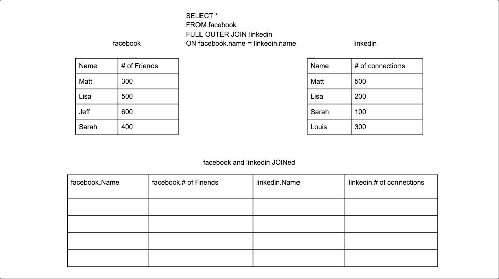

SQL **FULL OUTER JOIN** (also known as FULL JOIN) returns all records from both tables, regardless of whether there are matches in the other table. It combines the results of both LEFT JOIN and RIGHT JOIN, showing all records from both tables with NULL values where no matches exist.

:::note
**Key Characteristics of FULL OUTER JOIN:**

- **Complete Dataset**: Returns every record from both tables, creating a comprehensive view.

- **Union of Results**: Combines LEFT JOIN + RIGHT JOIN behavior in a single operation.

- **NULL Handling**: Shows NULL values for missing matches on either side.

- **Data Completeness**: Ensures no data is lost from either table in the join operation.
:::

    <BrowserWindow url="https://github.com" bodyStyle={{padding: 0}}>    
     [](https://www.learnsqlonline.org/)
    </BrowserWindow>

:::success
**When to Use FULL OUTER JOIN:**

- **Data Synchronization**: Comparing data between two systems to find discrepancies
- **Complete Auditing**: Ensuring all records from both sources are accounted for
- **Data Migration**: Validating data transfer between old and new systems
- **Comprehensive Reporting**: Creating reports that need all entities from both tables

**Real-World Example:**
Comparing customer data between two different systems (CRM and ERP) to identify customers who exist in one system but not the other, ensuring complete data synchronization.
:::

:::info 

## Basic FULL OUTER JOIN Syntax

```sql
SELECT column1, column2, ...
FROM table1
FULL OUTER JOIN table2
ON table1.column_name = table2.column_name;
```

| **Component** | **Purpose** | **Example** |
|---------------|-------------|-------------|
| SELECT | Choose columns to display | `SELECT c.name, o.order_id` |
| FROM | First table | `FROM customers c` |
| FULL OUTER JOIN | Second table | `FULL OUTER JOIN orders o` |
| ON | Join condition | `ON c.customer_id = o.customer_id` |

## Alternative Syntax

```sql
-- FULL JOIN (shorthand, same result)
SELECT c.customer_name, o.order_id
FROM customers c
FULL JOIN orders o ON c.customer_id = o.customer_id;

-- Simulating FULL OUTER JOIN with UNION (for databases that don't support it)
SELECT c.customer_name, o.order_id
FROM customers c
LEFT JOIN orders o ON c.customer_id = o.customer_id
UNION
SELECT c.customer_name, o.order_id
FROM customers c
RIGHT JOIN orders o ON c.customer_id = o.customer_id;
```

:::

## Practical Examples

    <Tabs>
      <TabItem value="Basic Example">
       ```sql
       -- Get all customers and all orders, showing complete relationship picture
       SELECT 
           c.customer_id,
           c.customer_name,
           c.email,
           c.registration_date,
           o.order_id,
           o.order_date,
           o.total_amount,
           CASE 
               WHEN c.customer_id IS NULL THEN 'Orphaned Order'
               WHEN o.order_id IS NULL THEN 'Customer Without Orders'
               ELSE 'Active Relationship'
           END AS relationship_status
       FROM customers c
       FULL OUTER JOIN orders o ON c.customer_id = o.customer_id
       ORDER BY c.customer_name, o.order_date;
       
       -- Result: All customers AND all orders, with NULLs for non-matches
       ```
       </TabItem>
       <TabItem value="Data Synchronization">
       ```sql
       -- Compare customer data between two systems
       SELECT 
           COALESCE(crm.customer_id, erp.customer_id) AS customer_id,
           crm.customer_name AS crm_name,
           erp.customer_name AS erp_name,
           crm.email AS crm_email,
           erp.email AS erp_email,
           CASE 
               WHEN crm.customer_id IS NULL THEN 'Missing in CRM'
               WHEN erp.customer_id IS NULL THEN 'Missing in ERP'
               WHEN crm.email != erp.email THEN 'Email Mismatch'
               WHEN crm.customer_name != erp.customer_name THEN 'Name Mismatch'
               ELSE 'Synchronized'
           END AS sync_status
       FROM crm_customers crm
       FULL OUTER JOIN erp_customers erp ON crm.customer_id = erp.customer_id
       WHERE crm.customer_id IS NULL 
          OR erp.customer_id IS NULL
          OR crm.email != erp.email
          OR crm.customer_name != erp.customer_name
       ORDER BY sync_status, customer_id;
       ```
       </TabItem>
       <TabItem value="Complete Inventory Analysis">
       ```sql
       -- Compare current inventory with sales data
       SELECT 
           COALESCE(inv.product_id, sales.product_id) AS product_id,
           inv.product_name,
           inv.current_stock,
           inv.reorder_level,
           COALESCE(sales.units_sold, 0) AS units_sold_ytd,
           COALESCE(sales.revenue, 0) AS revenue_ytd,
           CASE 
               WHEN inv.product_id IS NULL THEN 'Discontinued Product Still Selling'
               WHEN sales.product_id IS NULL THEN 'No Sales Activity'
               WHEN inv.current_stock < inv.reorder_level THEN 'Reorder Needed'
               WHEN sales.units_sold = 0 THEN 'Slow Moving'
               ELSE 'Active Product'
           END AS inventory_status
       FROM current_inventory inv
       FULL OUTER JOIN (
           SELECT 
               oi.product_id,
               SUM(oi.quantity) AS units_sold,
               SUM(oi.quantity * oi.unit_price) AS revenue
           FROM order_items oi
           JOIN orders o ON oi.order_id = o.order_id
           WHERE YEAR(o.order_date) = 2024
           GROUP BY oi.product_id
       ) sales ON inv.product_id = sales.product_id
       ORDER BY inventory_status, revenue_ytd DESC;
       ```
       </TabItem>
      <TabItem value="Financial Reconciliation">
       ```sql
       -- Reconcile transactions between accounting systems
       SELECT 
           COALESCE(sys1.transaction_id, sys2.transaction_id) AS transaction_id,
           COALESCE(sys1.transaction_date, sys2.transaction_date) AS transaction_date,
           sys1.amount AS system1_amount,
           sys2.amount AS system2_amount,
           ABS(COALESCE(sys1.amount, 0) - COALESCE(sys2.amount, 0)) AS difference,
           CASE 
               WHEN sys1.transaction_id IS NULL THEN 'Missing in System 1'
               WHEN sys2.transaction_id IS NULL THEN 'Missing in System 2'
               WHEN sys1.amount != sys2.amount THEN 'Amount Discrepancy'
               ELSE 'Reconciled'
           END AS reconciliation_status
       FROM accounting_system1 sys1
       FULL OUTER JOIN accounting_system2 sys2 
           ON sys1.transaction_id = sys2.transaction_id
       WHERE sys1.transaction_id IS NULL 
          OR sys2.transaction_id IS NULL
          OR sys1.amount != sys2.amount
       ORDER BY reconciliation_status, transaction_date DESC;
       ```
       </TabItem>
      <TabItem value="Employee Department Analysis">
       ```sql
       -- Complete view of employees and departments
       SELECT 
           COALESCE(e.employee_id, 'N/A') AS employee_id,
           e.employee_name,
           e.position,
           e.salary,
           d.department_name,
           d.location,
           d.budget,
           CASE 
               WHEN e.employee_id IS NULL THEN 'Empty Department'
               WHEN d.department_id IS NULL THEN 'Employee Without Department'
               ELSE 'Properly Assigned'
           END AS assignment_status,
           COUNT(*) OVER (PARTITION BY d.department_id) AS dept_employee_count
       FROM employees e
       FULL OUTER JOIN departments d ON e.department_id = d.department_id
       ORDER BY d.department_name, e.employee_name;
       ```
       </TabItem>
       <TabItem value="Sample Output">
       ```plaintext
       -- Sample result showing complete customer-order relationship:
       
       customer_id | customer_name | email              | order_id | order_date | relationship_status
       ------------|---------------|-------------------|----------|------------|--------------------
       1           | John Smith    | john@email.com    | 101      | 2024-01-15 | Active Relationship
       1           | John Smith    | john@email.com    | 105      | 2024-02-20 | Active Relationship
       2           | Jane Doe      | jane@email.com    | 102      | 2024-01-18 | Active Relationship
       3           | Bob Wilson    | bob@email.com     | NULL     | NULL       | Customer Without Orders
       4           | Alice Brown   | alice@email.com   | 104      | 2024-02-01 | Active Relationship
       NULL        | NULL          | NULL              | 999      | 2024-01-10 | Orphaned Order
       
       -- Note: Shows ALL customers (including Bob with no orders)
       -- AND all orders (including orphaned order 999 with no customer)
       ```
       </TabItem>
    </Tabs>

## Database Support & Alternatives

:::warning
**Database Compatibility:**

Not all databases support FULL OUTER JOIN natively:

- **Supported:** PostgreSQL, SQL Server, Oracle, DB2
- **Not Supported:** MySQL, SQLite (older versions)

**Alternative for MySQL/SQLite:**
```sql
-- Simulate FULL OUTER JOIN using UNION
SELECT c.customer_id, c.customer_name, o.order_id, o.total_amount
FROM customers c
LEFT JOIN orders o ON c.customer_id = o.customer_id
UNION
SELECT c.customer_id, c.customer_name, o.order_id, o.total_amount
FROM customers c
RIGHT JOIN orders o ON c.customer_id = o.customer_id
WHERE c.customer_id IS NULL;
```
:::


## Performance Considerations

:::important
**FULL OUTER JOIN Performance:**

1. **Resource Intensive**: Requires processing all records from both tables
2. **Memory Usage**: Can consume significant memory for large datasets
3. **Index Strategy**: Ensure join columns are properly indexed
4. **Result Set Size**: Can produce very large result sets

**Optimization Tips:**
```sql
-- Use WHERE clauses to limit unnecessary records
SELECT c.customer_name, o.order_total
FROM customers c
FULL OUTER JOIN orders o ON c.customer_id = o.customer_id
WHERE c.status = 'Active' OR o.order_date >= '2024-01-01';

-- Consider using EXISTS for existence checks instead
SELECT c.customer_name,
       CASE WHEN EXISTS (SELECT 1 FROM orders WHERE customer_id = c.customer_id) 
            THEN 'Has Orders' ELSE 'No Orders' END
FROM customers c;
```
:::

## Best Practices
:::tip
1. **Use Sparingly**: Only when you truly need all records from both tables
2. **Handle NULLs Properly**: Use COALESCE, ISNULL, or CASE statements
3. **Consider Alternatives**: Sometimes UNION ALL might be more efficient
4. **Test Performance**: Monitor query performance with large datasets
5. **Document Intent**: Clearly comment why FULL OUTER JOIN is necessary
:::

## Conclusion

FULL OUTER JOIN is a powerful tool for comprehensive data analysis and ensuring no records are lost when combining datasets. While resource-intensive, it's invaluable for data synchronization, migration validation, and complete reporting scenarios. Use it judiciously and always consider performance implications with large datasets.

<GiscusComments/>