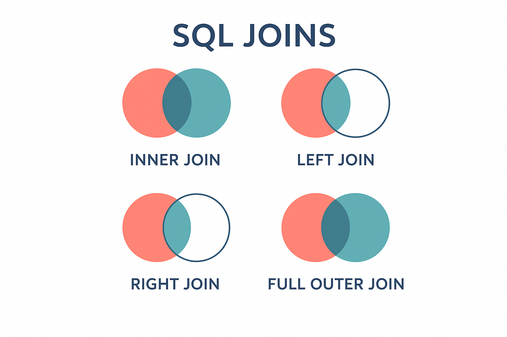

## What are SQL Joins?

SQL **Joins** are operations used to combine rows from two or more tables based on a related column between them. Joins are fundamental to relational databases as they allow you to retrieve data that is spread across multiple tables, following the principles of database normalization.

:::note
Key Concepts of SQL Joins:

- **Relational Data**: Data is often normalized across multiple tables to reduce redundancy and improve data integrity.

- **Foreign Keys**: Columns that create relationships between tables by referencing primary keys in other tables.

- **Join Conditions**: Criteria that specify how tables should be connected, typically using equality conditions on related columns.

- **Result Sets**: The combined data from multiple tables based on the join operation and conditions specified.
:::

    <BrowserWindow url="https://github.com" bodyStyle={{padding: 0}}>    
     [](https://www.learnsqlonline.org/)
    </BrowserWindow>

:::success
**Understanding Table Relationships**

In relational databases, data is organized into separate tables to eliminate redundancy. For example:
- A **Customers** table stores customer information
- An **Orders** table stores order details
- A **Products** table stores product information

Without joins, you'd have to store all customer information in every order record, leading to data duplication and inconsistency. Joins allow you to maintain data integrity while still being able to retrieve comprehensive information across related tables.

> **Normalization** is the process of organizing data to minimize redundancy. This is why we need joins - to bring normalized data back together for meaningful analysis.
:::

:::info 

| **#** | **Join Type**                                    | **Description**                                                                 |
|-------|--------------------------------------------------|---------------------------------------------------------------------------------|
| 1     | `INNER JOIN`                                     | Returns only rows that have matching values in both tables.                    |
| 2     | `LEFT JOIN (LEFT OUTER JOIN)`                    | Returns all rows from the left table and matched rows from the right table.    |
| 3     | `RIGHT JOIN (RIGHT OUTER JOIN)`                  | Returns all rows from the right table and matched rows from the left table.    |
| 4     | `FULL OUTER JOIN`                                | Returns all rows when there's a match in either left or right table.          |
| 5     | `CROSS JOIN`                                     | Returns the Cartesian product of both tables (all possible combinations).      |
| 6     | `SELF JOIN`                                      | A table joined with itself to compare rows within the same table.              |
| 7     | `NATURAL JOIN`                                   | Automatically joins tables based on columns with the same name and data type.  |
| 8     | `Join Conditions`                                | Specify how tables relate using ON or USING clauses.                          |
| 9     | `Multiple Table Joins`                           | Joining more than two tables in a single query.                               |
| 10    | `Join Performance`                               | Understanding indexes and query optimization for efficient joins.              |

**Basic Join Syntax Structure:**

| **Component** | **Purpose**     | **Example**        |
|---------------|----------------|--------------------|
| SELECT        | Choose columns | SELECT c.name, o.date |
| FROM          | Primary table  | FROM customers c      |
| JOIN          | Secondary table| JOIN orders o        |
| ON            | Join condition | ON c.id = o.customer_id |

:::

    **Here are basic examples of different join types:**

    <Tabs>
      <TabItem value="INNER JOIN">
       ```sql
       -- INNER JOIN: Get customers and their orders
       SELECT 
           c.customer_name,
           c.email,
           o.order_id,
           o.order_date,
           o.total_amount
       FROM customers c
       INNER JOIN orders o ON c.customer_id = o.customer_id;
       
       -- Only returns customers who have placed orders
       ```
       </TabItem>
       <TabItem value="LEFT JOIN">
       ```sql
       -- LEFT JOIN: Get all customers and their orders (if any)
       SELECT 
           c.customer_name,
           c.email,
           o.order_id,
           o.order_date,
           o.total_amount
       FROM customers c
       LEFT JOIN orders o ON c.customer_id = o.customer_id;
       
       -- Returns all customers, even those without orders (NULL values for order columns)
       ```
       </TabItem>
       <TabItem value="RIGHT JOIN">
       ```sql
       -- RIGHT JOIN: Get all orders and their customers
       SELECT 
           c.customer_name,
           c.email,
           o.order_id,
           o.order_date,
           o.total_amount
       FROM customers c
       RIGHT JOIN orders o ON c.customer_id = o.customer_id;
       
       -- Returns all orders, even if customer data is missing
       ```
       </TabItem>
      <TabItem value="FULL OUTER JOIN">
       ```sql
       -- FULL OUTER JOIN: Get all customers and all orders
       SELECT 
           c.customer_name,
           c.email,
           o.order_id,
           o.order_date,
           o.total_amount
       FROM customers c
       FULL OUTER JOIN orders o ON c.customer_id = o.customer_id;
       
       -- Returns all records from both tables, with NULLs where no match exists
       ```
       </TabItem>
      <TabItem value="CROSS JOIN">
       ```sql
       -- CROSS JOIN: Cartesian product of two tables
       SELECT 
           p.product_name,
           c.category_name
       FROM products p
       CROSS JOIN categories c;
       
       -- Returns every product paired with every category
       -- Use carefully as it can return very large result sets!
       ```
       </TabItem>
      <TabItem value="SELF JOIN">
       ```sql
       -- SELF JOIN: Find employees and their managers
       SELECT 
           e1.employee_name AS employee,
           e1.position,
           e2.employee_name AS manager
       FROM employees e1
       LEFT JOIN employees e2 ON e1.manager_id = e2.employee_id;
       
       -- Joins the employees table with itself
       ```
       </TabItem>
    </Tabs>

**Join Best Practices:**

1. **Always use table aliases** for readability when joining multiple tables
2. **Specify join conditions explicitly** using the ON clause
3. **Use appropriate indexes** on columns used in join conditions for better performance
4. **Consider the data volume** and choose the most efficient join type
5. **Test with sample data** to ensure joins return expected results

:::

## 🔗 Why Learn SQL Joins?

**SQL Joins** are essential for working with **normalized relational databases** where data is logically separated across multiple tables. Understanding joins allows you to:

### 📊 Essential Skills for Data Professionals

**1. ✅ Data Retrieval Across Tables**  
Combine related information from multiple tables to create comprehensive reports and analyses.

**2. ✅ Maintain Data Integrity**  
Work with properly normalized databases that eliminate data redundancy while still accessing complete information.

**3. ✅ Advanced Analytics**  
Perform complex queries that analyze relationships between different entities in your database.

**4. ✅ Report Generation**  
Create meaningful business reports that require data from multiple sources.

---

### Conclusion

Mastering SQL joins is crucial for anyone working with relational databases. They enable you to leverage the full power of normalized database design while still being able to retrieve comprehensive, meaningful data for analysis and reporting. Understanding when and how to use each type of join will significantly enhance your ability to work with real-world database systems.

<GiscusComments/>