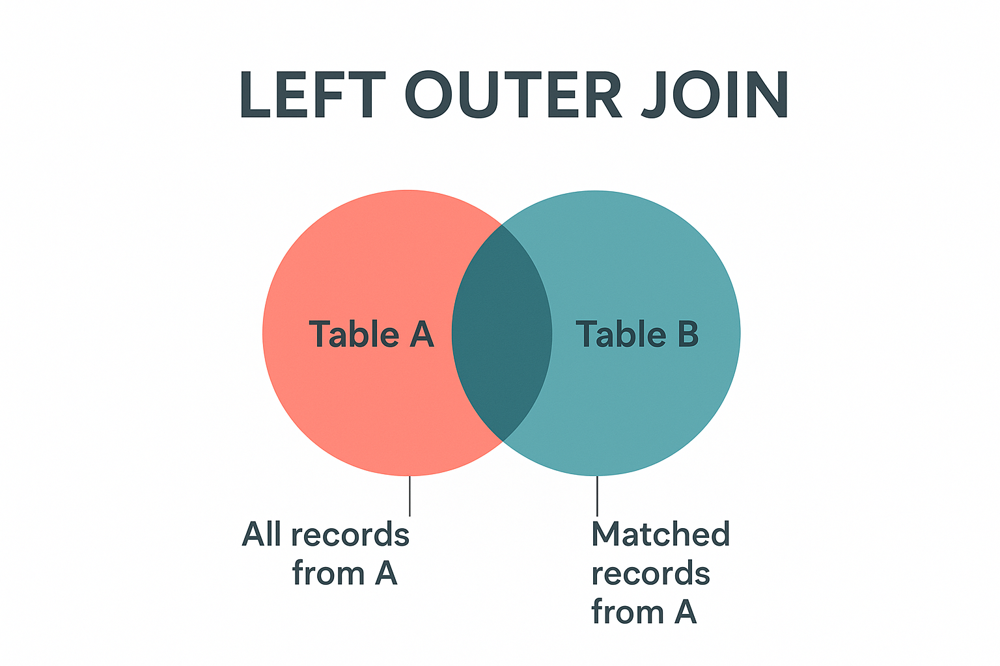

SQL **LEFT JOIN** (also known as LEFT OUTER JOIN) returns all records from the left (first) table and the matched records from the right (second) table. If there are no matches in the right table, the result will contain NULL values for all columns from the right table.

:::note
**Key Characteristics of LEFT JOIN:**

- **All Left Records**: Returns every record from the left table, regardless of matches.

- **Matching Right Records**: Includes matched records from the right table when available.

- **NULL for Unmatched**: Shows NULL values for right table columns when no match exists.

- **Preservation**: Preserves the completeness of the primary (left) table data.
:::

    <BrowserWindow url="https://github.com" bodyStyle={{padding: 0}}>    
     [](https://github.com/sanjay-kv)
    </BrowserWindow>

:::success
**When to Use LEFT JOIN:**

✅ **Finding Missing Relationships**: Customers without orders, students without grades
✅ **Complete Data Analysis**: When you need all records from the primary table
✅ **Optional Information**: Including supplementary data that may not exist for all records
✅ **Data Auditing**: Identifying gaps in related data

**Real-World Example:**
In an e-commerce system, you want to see all customers and their orders (if any). LEFT JOIN ensures you see customers who haven't placed orders yet, with NULL values in the order columns.
:::

:::info 

## Basic LEFT JOIN Syntax

```sql
SELECT column1, column2, ...
FROM table1
LEFT JOIN table2
ON table1.column_name = table2.column_name;
```

| **Component** | **Purpose** | **Example** |
|---------------|-------------|-------------|
| SELECT | Choose columns to display | `SELECT c.name, o.total` |
| FROM | Primary (left) table | `FROM customers c` |
| LEFT JOIN | Secondary (right) table | `LEFT JOIN orders o` |
| ON | Join condition | `ON c.customer_id = o.customer_id` |

## Alternative Syntax

```sql
-- LEFT OUTER JOIN (same as LEFT JOIN)
SELECT c.name, o.total
FROM customers c
LEFT OUTER JOIN orders o ON c.customer_id = o.customer_id;

-- With table aliases (recommended)
SELECT c.name, COALESCE(o.total, 0) as order_total
FROM customers c
LEFT JOIN orders o ON c.customer_id = o.customer_id;
```

:::

## Practical Examples

    <Tabs>
      <TabItem value="Basic Example">
       ```sql
       -- Get all customers and their orders (including customers with no orders)
       SELECT 
           c.customer_id,
           c.customer_name,
           c.email,
           c.registration_date,
           o.order_id,
           o.order_date,
           o.total_amount
       FROM customers c
       LEFT JOIN orders o ON c.customer_id = o.customer_id
       ORDER BY c.customer_name, o.order_date;
       
       -- Result: All customers, with NULL values for customers without orders
       ```
       </TabItem>
       <TabItem value="Finding Missing Data">
       ```sql
       -- Find customers who haven't placed any orders
       SELECT 
           c.customer_id,
           c.customer_name,
           c.email,
           c.registration_date,
           'No orders placed' AS status
       FROM customers c
       LEFT JOIN orders o ON c.customer_id = o.customer_id
       WHERE o.order_id IS NULL
       ORDER BY c.registration_date DESC;
       
       -- Useful for marketing campaigns targeting inactive customers
       ```
       </TabItem>
       <TabItem value="With Aggregation">
       ```sql
       -- Get customer statistics including those with zero orders
       SELECT 
           c.customer_id,
           c.customer_name,
           c.registration_date,
           COUNT(o.order_id) AS total_orders,
           COALESCE(SUM(o.total_amount), 0) AS total_spent,
           CASE 
               WHEN COUNT(o.order_id) = 0 THEN 'Inactive'
               WHEN COUNT(o.order_id) < 3 THEN 'Low Activity'
               ELSE 'Active'
           END AS customer_segment
       FROM customers c
       LEFT JOIN orders o ON c.customer_id = o.customer_id
       GROUP BY c.customer_id, c.customer_name, c.registration_date
       ORDER BY total_spent DESC;
       ```
       </TabItem>
      <TabItem value="Multiple LEFT JOINs">
       ```sql
       -- Get complete customer profile with optional data
       SELECT 
           c.customer_name,
           c.email,
           a.street_address,
           a.city,
           a.country,
           p.phone_number,
           COUNT(o.order_id) AS order_count,
           MAX(o.order_date) AS last_order_date
       FROM customers c
       LEFT JOIN addresses a ON c.customer_id = a.customer_id
       LEFT JOIN phone_numbers p ON c.customer_id = p.customer_id
       LEFT JOIN orders o ON c.customer_id = o.customer_id
       GROUP BY c.customer_id, c.customer_name, c.email, 
                a.street_address, a.city, a.country, p.phone_number
       ORDER BY c.customer_name;
       ```
       </TabItem>
      <TabItem value="Date Range Analysis">
       ```sql
       -- Analyze customer activity over specific periods
       SELECT 
           c.customer_name,
           c.registration_date,
           COUNT(o.order_id) AS orders_this_year,
           COALESCE(SUM(o.total_amount), 0) AS revenue_this_year,
           CASE 
               WHEN MAX(o.order_date) >= DATE_SUB(CURRENT_DATE, INTERVAL 30 DAY) 
               THEN 'Recently Active'
               WHEN MAX(o.order_date) IS NOT NULL 
               THEN 'Previously Active'
               ELSE 'Never Purchased'
           END AS activity_status
       FROM customers c
       LEFT JOIN orders o ON c.customer_id = o.customer_id 
                          AND o.order_date >= '2024-01-01'
       WHERE c.registration_date >= '2023-01-01'
       GROUP BY c.customer_id, c.customer_name, c.registration_date
       ORDER BY revenue_this_year DESC;
       ```
       </TabItem>
       <TabItem value="Sample Output">
       ```plaintext
       -- Sample result showing all customers including those without orders:
       
       customer_id | customer_name | email              | order_id | order_date | total_amount
       ------------|---------------|-------------------|----------|------------|-------------
       1           | John Smith    | john@email.com    | 101      | 2024-01-15 | 299.99
       1           | John Smith    | john@email.com    | 105      | 2024-02-20 | 149.50
       2           | Jane Doe      | jane@email.com    | 102      | 2024-01-18 | 89.99
       3           | Bob Wilson    | bob@email.com     | NULL     | NULL       | NULL
       4           | Alice Brown   | alice@email.com   | 104      | 2024-02-01 | 199.00
       5           | Mike Davis    | mike@email.com    | NULL     | NULL       | NULL
       
       -- Note: Bob Wilson and Mike Davis have no orders (NULL values)
       -- But they still appear in the result set
       ```
       </TabItem>
    </Tabs>

## Handling NULL Values

:::tip
**Working with NULLs in LEFT JOIN:**

1. **Use CASE Statements for Complex Logic**:
   ```sql
   SELECT 
       c.customer_name,
       CASE 
           WHEN o.order_id IS NULL THEN 'No orders'
           WHEN o.total_amount > 1000 THEN 'High value customer'
           ELSE 'Regular customer'
       END AS customer_type
   FROM customers c
   LEFT JOIN orders o ON c.customer_id = o.customer_id;
   ```
2. **Filter for NULL or NOT NULL**:
   ```sql
   -- Customers without orders
   SELECT c.* FROM customers c
   LEFT JOIN orders o ON c.customer_id = o.customer_id
   WHERE o.order_id IS NULL;
   
   -- Customers with orders
   SELECT c.* FROM customers c
   LEFT JOIN orders o ON c.customer_id = o.customer_id
   WHERE o.order_id IS NOT NULL;
   ```
:::

## Common Use Cases & Business Applications

**📊 Customer Analysis**
```sql
-- Customer segmentation based on purchase behavior
SELECT 
    CASE 
        WHEN COUNT(o.order_id) = 0 THEN 'New/Inactive'
        WHEN SUM(o.total_amount) > 5000 THEN 'VIP'
        WHEN COUNT(o.order_id) > 10 THEN 'Frequent'
        ELSE 'Regular'
    END AS segment,
    COUNT(*) AS customer_count
FROM customers c
LEFT JOIN orders o ON c.customer_id = o.customer_id
GROUP BY segment;
```

**📈 Performance Reporting**
```sql
-- Monthly sales report including all months
SELECT 
    m.month_name,
    COALESCE(SUM(s.sales_amount), 0) AS total_sales,
    COUNT(s.sale_id) AS transaction_count
FROM months_reference m
LEFT JOIN sales s ON m.month_number = MONTH(s.sale_date)
                 AND YEAR(s.sale_date) = 2024
GROUP BY m.month_number, m.month_name
ORDER BY m.month_number;
```

**🎯 Marketing Insights**
```sql
-- Email campaign effectiveness
SELECT 
    c.customer_segment,
    COUNT(c.customer_id) AS total_customers,
    COUNT(r.response_id) AS responses,
    ROUND(COUNT(r.response_id) * 100.0 / COUNT(c.customer_id), 2) AS response_rate
FROM customers c
LEFT JOIN campaign_responses r ON c.customer_id = r.customer_id
                                AND r.campaign_id = 'SPRING2024'
GROUP BY c.customer_segment;
```

## Performance Considerations

:::tip
**LEFT JOIN Performance Tips:**

1. **Index Join Columns**: Ensure both tables have indexes on join columns
2. **Limit Result Sets**: Use WHERE clauses to filter the left table when possible
3. **Consider EXISTS**: For existence checks, sometimes EXISTS is more efficient than LEFT JOIN
4. **Avoid SELECT \***: Only select columns you need to reduce memory usage
5. **Filter NULLs Early**: If you don't need unmatched records, consider using INNER JOIN instead

```sql
-- More efficient: Filter left table first
SELECT c.name, o.total
FROM customers c
LEFT JOIN orders o ON c.customer_id = o.customer_id
WHERE c.status = 'Active'  -- Filter before joining
  AND c.registration_date >= '2023-01-01';
```
:::

## Conclusion

LEFT JOIN is essential for comprehensive data analysis where you need to preserve all records from your primary table while including related information when available. It's particularly valuable for identifying gaps in data, customer analysis, and creating complete reports that account for all entities, not just those with relationships.

<GiscusComments/>