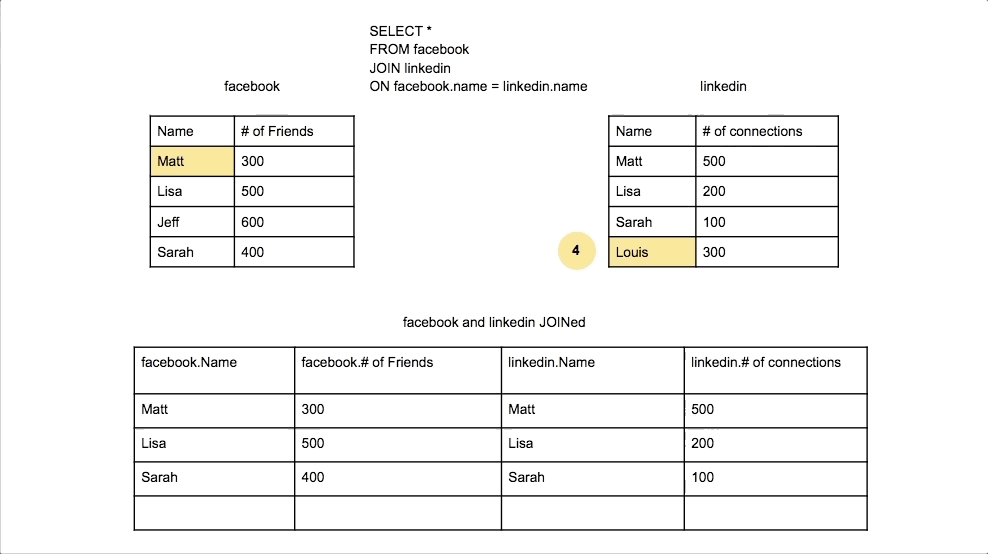

SQL **RIGHT JOIN** (also known as RIGHT OUTER JOIN) returns all records from the right (second) table and the matched records from the left (first) table. If there are no matches in the left table, the result will contain NULL values for all columns from the left table.

:::note
**Key Characteristics of RIGHT JOIN:**

- **All Right Records**: Returns every record from the right table, regardless of matches.

- **Matching Left Records**: Includes matched records from the left table when available.

- **NULL for Unmatched**: Shows NULL values for left table columns when no match exists.

- **Less Common**: Used less frequently than LEFT JOIN but serves specific use cases.
:::

    <BrowserWindow url="https://github.com" bodyStyle={{padding: 0}}>    
     [](https://www.learnsqlonline.org/)
    </BrowserWindow>

:::success
**When to Use RIGHT JOIN:**

-  **Reference Data Completeness**: Ensuring all lookup/reference table entries are represented
-  **Inventory Analysis**: All products shown, even those without sales
-  **Data Validation**: Finding orphaned records in child tables
-  **Complete Catalogs**: All categories/departments shown regardless of content

**Real-World Example:**
In a retail system, you want to see all products in your catalog and their sales data (if any). RIGHT JOIN on products ensures every product appears, even those with zero sales.
:::

:::info 

## Basic RIGHT JOIN Syntax

```sql
SELECT column1, column2, ...
FROM table1
RIGHT JOIN table2
ON table1.column_name = table2.column_name;
```

| **Component** | **Purpose** | **Example** |
|---------------|-------------|-------------|
| SELECT | Choose columns to display | `SELECT o.order_id, c.name` |
| FROM | Primary (left) table | `FROM orders o` |
| RIGHT JOIN | Secondary (right) table | `RIGHT JOIN customers c` |
| ON | Join condition | `ON o.customer_id = c.customer_id` |

## Alternative Syntax

```sql
-- RIGHT OUTER JOIN (same as RIGHT JOIN)
SELECT o.order_id, c.customer_name
FROM orders o
RIGHT OUTER JOIN customers c ON o.customer_id = c.customer_id;

-- Equivalent LEFT JOIN (often preferred for readability)
SELECT o.order_id, c.customer_name
FROM customers c
LEFT JOIN orders o ON c.customer_id = o.customer_id;
```

:::

## Practical Examples

    <Tabs>
      <TabItem value="Basic Example">
       ```sql
       -- Get all products and their order details (including products never ordered)
       SELECT 
           p.product_id,
           p.product_name,
           p.price,
           p.category,
           oi.order_item_id,
           oi.quantity,
           oi.unit_price,
           o.order_date
       FROM order_items oi
       INNER JOIN orders o ON oi.order_id = o.order_id
       RIGHT JOIN products p ON oi.product_id = p.product_id
       ORDER BY p.product_name;
       
       -- Result: All products, with NULL values for products never ordered
       ```
       </TabItem>
       <TabItem value="Finding Unused Records">
       ```sql
       -- Find products that have never been sold
       SELECT 
           p.product_id,
           p.product_name,
           p.price,
           p.stock_quantity,
           'Never sold' AS sales_status
       FROM order_items oi
       RIGHT JOIN products p ON oi.product_id = p.product_id
       WHERE oi.product_id IS NULL
       ORDER BY p.price DESC;
       
       -- Useful for inventory management and discontinuation decisions
       ```
       </TabItem>
       <TabItem value="Complete Catalog Analysis">
       ```sql
       -- Analyze all product categories and their performance
       SELECT 
           c.category_id,
           c.category_name,
           c.description,
           COUNT(p.product_id) AS total_products,
           COUNT(oi.order_item_id) AS items_sold,
           COALESCE(SUM(oi.quantity * oi.unit_price), 0) AS total_revenue,
           CASE 
               WHEN COUNT(oi.order_item_id) = 0 THEN 'No Sales'
               WHEN SUM(oi.quantity * oi.unit_price) > 10000 THEN 'High Performance'
               ELSE 'Moderate Performance'
           END AS performance_level
       FROM products p
       LEFT JOIN order_items oi ON p.product_id = oi.product_id
       RIGHT JOIN categories c ON p.category_id = c.category_id
       GROUP BY c.category_id, c.category_name, c.description
       ORDER BY total_revenue DESC;
       ```
       </TabItem>
      <TabItem value="Department Analysis">
       ```sql
       -- Show all departments and their employee counts
       SELECT 
           d.department_id,
           d.department_name,
           d.location,
           d.budget,
           COUNT(e.employee_id) AS employee_count,
           COALESCE(AVG(e.salary), 0) AS avg_salary,
           CASE 
               WHEN COUNT(e.employee_id) = 0 THEN 'Vacant Department'
               WHEN COUNT(e.employee_id) < 5 THEN 'Small Team'
               ELSE 'Large Team'
           END AS team_size
       FROM employees e
       RIGHT JOIN departments d ON e.department_id = d.department_id
       GROUP BY d.department_id, d.department_name, d.location, d.budget
       ORDER BY employee_count DESC;
       ```
       </TabItem>
      <TabItem value="Time Series Analysis">
       ```sql
       -- Complete monthly sales report (all months shown)
       SELECT 
           m.month_number,
           m.month_name,
           m.quarter,
           COUNT(o.order_id) AS total_orders,
           COALESCE(SUM(o.total_amount), 0) AS monthly_revenue,
           COUNT(DISTINCT o.customer_id) AS unique_customers
       FROM orders o
       RIGHT JOIN (
           SELECT 1 as month_number, 'January' as month_name, 'Q1' as quarter
           UNION SELECT 2, 'February', 'Q1'
           UNION SELECT 3, 'March', 'Q1'
           UNION SELECT 4, 'April', 'Q2'
           UNION SELECT 5, 'May', 'Q2'
           UNION SELECT 6, 'June', 'Q2'
           UNION SELECT 7, 'July', 'Q3'
           UNION SELECT 8, 'August', 'Q3'
           UNION SELECT 9, 'September', 'Q3'
           UNION SELECT 10, 'October', 'Q4'
           UNION SELECT 11, 'November', 'Q4'
           UNION SELECT 12, 'December', 'Q4'
       ) m ON MONTH(o.order_date) = m.month_number 
          AND YEAR(o.order_date) = 2024
       GROUP BY m.month_number, m.month_name, m.quarter
       ORDER BY m.month_number;
       ```
       </TabItem>
       <TabItem value="Sample Output">
       ```plaintext
       -- Sample result showing all products including those never ordered:
       
       product_id | product_name    | price  | order_item_id | quantity | unit_price | order_date
       -----------|-----------------|--------|---------------|----------|------------|------------
       1          | Laptop Pro      | 1299.99| 1             | 2        | 1299.99    | 2024-01-15
       1          | Laptop Pro      | 1299.99| 5             | 1        | 1299.99    | 2024-02-20
       2          | Wireless Mouse  | 29.99  | 2             | 3        | 29.99      | 2024-01-18
       3          | USB Cable       | 9.99   | NULL          | NULL     | NULL       | NULL
       4          | Monitor 4K      | 399.99 | 3             | 1        | 399.99     | 2024-01-22
       5          | Keyboard Mech   | 149.99 | NULL          | NULL     | NULL       | NULL
       
       -- Note: USB Cable and Keyboard Mech were never ordered (NULL values)
       -- But they still appear because we used RIGHT JOIN on products
       ```
       </TabItem>
    </Tabs>

## RIGHT JOIN vs LEFT JOIN

:::tip
**Understanding the Difference:**

**RIGHT JOIN** and **LEFT JOIN** are mirror operations. The choice between them is often a matter of preference and query readability:

```sql
-- These queries produce identical results:

-- RIGHT JOIN approach
SELECT p.product_name, o.order_date
FROM orders o
RIGHT JOIN products p ON o.product_id = p.product_id;

-- LEFT JOIN approach (more commonly used)
SELECT p.product_name, o.order_date
FROM products p
LEFT JOIN orders o ON p.product_id = o.product_id;
```

:::

:::important
**RIGHT JOIN Performance Notes:**

1. **Index Strategy**: Ensure the right table (which will be fully scanned) has appropriate indexes
2. **Query Planning**: Database optimizers may convert RIGHT JOIN to LEFT JOIN internally
3. **Readability**: Consider using LEFT JOIN for better code maintainability
4. **Table Size**: Be mindful when the right table is significantly larger

```sql
-- Performance tip: Use WHERE clause to limit right table when possible
SELECT p.product_name, o.order_date
FROM orders o
RIGHT JOIN products p ON o.product_id = p.product_id
WHERE p.status = 'Active'  -- Filter right table to improve performance
  AND p.created_date >= '2023-01-01';
```
:::

## When NOT to Use RIGHT JOIN

**Avoid RIGHT JOIN when:**
- LEFT JOIN would be more readable
- You're joining more than 2-3 tables
- The query logic becomes confusing
- Team conventions prefer LEFT JOIN

**Use RIGHT JOIN when:**
- You specifically need all records from the second table
- It makes the business logic clearer
- Working with reference/lookup tables as the primary focus

## Best Practices

1. **Document Intent**: Comment why RIGHT JOIN is chosen over LEFT JOIN
2. **Consistent Style**: Stick to team conventions (most prefer LEFT JOIN)
3. **Test Thoroughly**: Ensure NULL handling works as expected
4. **Consider Alternatives**: Sometimes UNION or EXISTS might be clearer

```sql
-- Good: Clear intent and proper NULL handling
SELECT 
    p.product_name,
    COALESCE(sales_summary.revenue, 0) as total_revenue,
    CASE 
        WHEN sales_summary.revenue IS NULL THEN 'No Sales'
        ELSE 'Has Sales'
    END as sales_status
FROM sales_summary
RIGHT JOIN products p ON sales_summary.product_id = p.product_id
WHERE p.status = 'Active';
```

## Conclusion

RIGHT JOIN is a powerful tool for ensuring completeness from the perspective of the second table in your query. While less commonly used than LEFT JOIN, it serves specific use cases well, particularly in inventory management, performance reporting, and reference data analysis. Understanding when and how to use RIGHT JOIN effectively will make you a more versatile SQL developer.

<GiscusComments/>