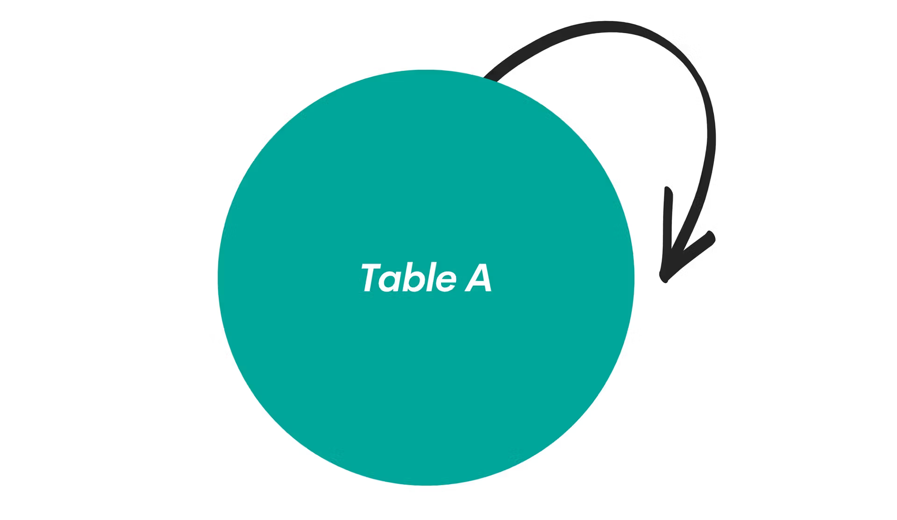

## What is SELF JOIN?

SQL **SELF JOIN** is a technique where a table is joined with itself to compare rows within the same table or to work with hierarchical data structures. This is accomplished by treating the same table as if it were two separate tables using different table aliases.

:::note
Key Characteristics of SELF JOIN:
**Same Table**: Joins a table with itself using different aliases.

**Hierarchical Data**: Perfect for parent-child relationships within a single table.

**Row Comparison**: Enables comparison between different rows in the same table.

**Flexible Join Types**: Can be INNER, LEFT, RIGHT, or FULL OUTER self joins.
:::

    <BrowserWindow url="https://github.com" bodyStyle={{padding: 0}}>    
     [](https://github.com/sanjay-kv)
    </BrowserWindow>

:::success
**When to Use SELF JOIN:**

✅ **Hierarchical Structures**: Employee-manager relationships, organizational charts
✅ **Comparing Rows**: Finding duplicates, comparing values within the same table
✅ **Sequential Data**: Analyzing consecutive records or time-series data
✅ **Graph Relationships**: Social networks, recommendation systems
✅ **Parent-Child Data**: Category trees, menu structures, geographical hierarchies

**Real-World Example:**
An employee table where each employee has a manager_id pointing to another employee in the same table. SELF JOIN helps you retrieve employee names along with their manager names.
:::

:::info 

## Basic SELF JOIN Syntax

```sql
SELECT columns
FROM table_name alias1
JOIN table_name alias2
ON alias1.column = alias2.column;
```

| **Component** | **Purpose** | **Example** |
|---------------|-------------|-------------|
| SELECT | Choose columns from both aliases | `SELECT e1.name, e2.name AS manager` |
| FROM | First reference to table | `FROM employees e1` |
| JOIN | Second reference to same table | `JOIN employees e2` |
| ON | Join condition | `ON e1.manager_id = e2.employee_id` |

## Table Alias Requirements

```sql
-- Wrong: No aliases (causes ambiguity)
SELECT name, name
FROM employees
JOIN employees ON manager_id = employee_id;

-- Correct: Using aliases to distinguish references
SELECT e1.name AS employee, e2.name AS manager
FROM employees e1
JOIN employees e2 ON e1.manager_id = e2.employee_id;
```

:::

## Practical Examples

    <Tabs>
      <TabItem value="Employee Manager Hierarchy">
       ```sql
       -- Get employees and their managers
       SELECT 
           e1.employee_id,
           e1.employee_name AS employee,
           e1.position AS employee_position,
           e1.salary AS employee_salary,
           e2.employee_id AS manager_id,
           e2.employee_name AS manager,
           e2.position AS manager_position,
           e1.hire_date,
           DATEDIFF(CURRENT_DATE, e1.hire_date) AS days_employed
       FROM employees e1
       LEFT JOIN employees e2 ON e1.manager_id = e2.employee_id
       WHERE e1.status = 'Active'
       ORDER BY e2.employee_name, e1.employee_name;
       
       -- LEFT JOIN ensures we see employees without managers (CEO, etc.)
       ```
       </TabItem>
       <TabItem value="Find Duplicates">
       ```sql
       -- Find duplicate customer records based on email
       SELECT 
           c1.customer_id AS customer1_id,
           c1.customer_name AS customer1_name,
           c1.email,
           c1.registration_date AS reg_date1,
           c2.customer_id AS customer2_id,
           c2.customer_name AS customer2_name,
           c2.registration_date AS reg_date2,
           ABS(DATEDIFF(c1.registration_date, c2.registration_date)) AS days_apart
       FROM customers c1
       INNER JOIN customers c2 
           ON c1.email = c2.email
           AND c1.customer_id < c2.customer_id  -- Avoid duplicate pairs
       WHERE c1.email IS NOT NULL 
         AND c1.email != ''
       ORDER BY c1.email, c1.registration_date;
       ```
       </TabItem>
       <TabItem value="Sequential Data Analysis">
       ```sql
       -- Compare consecutive sales records to find trends
       SELECT 
           s1.sale_date AS current_date,
           s1.daily_sales AS current_sales,
           s2.sale_date AS previous_date,
           s2.daily_sales AS previous_sales,
           (s1.daily_sales - s2.daily_sales) AS sales_change,
           ROUND(((s1.daily_sales - s2.daily_sales) / s2.daily_sales) * 100, 2) AS percent_change,
           CASE 
               WHEN s1.daily_sales > s2.daily_sales THEN 'Increase'
               WHEN s1.daily_sales < s2.daily_sales THEN 'Decrease'
               ELSE 'No Change'
           END AS trend
       FROM daily_sales s1
       INNER JOIN daily_sales s2 
           ON s1.sale_date = DATE_ADD(s2.sale_date, INTERVAL 1 DAY)
       WHERE s1.sale_date >= '2024-01-02'  -- Skip first date (no previous)
       ORDER BY s1.sale_date;
       ```
       </TabItem>
      <TabItem value="Product Recommendations">
       ```sql
       -- Find products frequently bought together
       SELECT 
           p1.product_name AS product1,
           p2.product_name AS product2,
           COUNT(*) AS times_bought_together,
           AVG(oi1.unit_price) AS avg_price_product1,
           AVG(oi2.unit_price) AS avg_price_product2,
           COUNT(DISTINCT oi1.order_id) AS total_orders
       FROM order_items oi1
       INNER JOIN order_items oi2 
           ON oi1.order_id = oi2.order_id 
           AND oi1.product_id < oi2.product_id  -- Avoid duplicate pairs
       INNER JOIN products p1 ON oi1.product_id = p1.product_id
       INNER JOIN products p2 ON oi2.product_id = p2.product_id
       WHERE oi1.product_id != oi2.product_id
       GROUP BY oi1.product_id, oi2.product_id, p1.product_name, p2.product_name
       HAVING COUNT(*) >= 5  -- At least 5 co-purchases
       ORDER BY times_bought_together DESC, p1.product_name;
       ```
       </TabItem>
      <TabItem value="Geographic Hierarchy">
       ```sql
       -- Create location hierarchy (Country -> State -> City)
       SELECT 
           city.location_name AS city,
           city.population AS city_population,
           state.location_name AS state,
           country.location_name AS country,
           country.population AS country_population,
           CONCAT(city.location_name, ', ', state.location_name, ', ', country.location_name) AS full_address
       FROM locations city
       LEFT JOIN locations state ON city.parent_location_id = state.location_id
       LEFT JOIN locations country ON state.parent_location_id = country.location_id
       WHERE city.location_type = 'City'
         AND city.active = 1
       ORDER BY country.location_name, state.location_name, city.location_name;
       ```
       </TabItem>
       <TabItem value="Sample Output">
       ```plaintext
       -- Sample result for employee-manager relationship:
       
       employee_id | employee      | employee_position | manager_id | manager       | manager_position
       ------------|---------------|-------------------|------------|---------------|------------------
       101         | Alice Johnson | Software Engineer | 201        | Bob Smith     | Engineering Manager
       102         | Carol Davis   | Software Engineer | 201        | Bob Smith     | Engineering Manager
       103         | David Wilson  | QA Tester        | 202        | Eve Brown     | QA Manager
       201         | Bob Smith     | Engineering Mgr   | 301        | Frank Taylor  | VP Engineering
       202         | Eve Brown     | QA Manager       | 301        | Frank Taylor  | VP Engineering
       301         | Frank Taylor  | VP Engineering   | NULL       | NULL          | NULL
       
       -- Note: Frank Taylor has NULL manager (top of hierarchy)
       -- Multiple employees can report to the same manager
       ```
       </TabItem>
    </Tabs>


## Performance Considerations

:::tip
**SELF JOIN Performance Tips:**

1. **Proper Indexing**: Ensure columns used in join conditions are indexed
   ```sql
   -- Essential indexes for employee hierarchy
   CREATE INDEX idx_employees_manager_id ON employees(manager_id);
   CREATE INDEX idx_employees_employee_id ON employees(employee_id);
   ```

2. **Limit Recursive Depth**: Prevent infinite loops in hierarchical queries
   ```sql
   -- Add level limit to recursive queries
   WHERE level <= 5  -- Maximum 5 levels deep
   ```

3. **Filter Early**: Use WHERE clauses to reduce dataset size
   ```sql
   -- Filter before joining for better performance
   FROM employees e1
   JOIN employees e2 ON e1.manager_id = e2.employee_id
   WHERE e1.status = 'Active' AND e2.status = 'Active';
   ```

4. **Use EXISTS for Existence Checks**:
   ```sql
   -- More efficient for checking if employee has subordinates
   SELECT employee_name,
          EXISTS(SELECT 1 FROM employees e2 WHERE e2.manager_id = e1.employee_id) AS is_manager
   FROM employees e1;
   ```

5. **Avoid Cartesian Products**:
   ```sql
   -- Bad: Missing join condition creates Cartesian product
   SELECT e1.name, e2.name FROM employees e1, employees e2;
   
   -- Good: Proper join condition
   SELECT e1.name, e2.name 
   FROM employees e1 
   JOIN employees e2 ON e1.manager_id = e2.employee_id;
   ```
:::


## Best Practices Summary

:::info
**SELF JOIN Best Practices:**

**✅ Essential Guidelines:**

1. **Always Use Table Aliases**: Required to distinguish table references
2. **Proper Join Conditions**: Ensure meaningful relationships between rows
3. **Handle NULLs Appropriately**: Use LEFT JOIN for optional relationships
4. **Index Join Columns**: Critical for performance with large tables
5. **Limit Result Sets**: Use WHERE clauses and LIMIT when testing
6. **Document Complex Logic**: Comment hierarchical and recursive queries
7. **Test Edge Cases**: Verify behavior with NULL values and missing relationships

**🔧 Performance Optimization:**
```sql
-- Example of well-optimized SELF JOIN
SELECT 
    emp.employee_name AS employee,
    mgr.employee_name AS manager,
    emp.department
FROM employees emp
LEFT JOIN employees mgr ON emp.manager_id = mgr.employee_id
WHERE emp.status = 'Active'  -- Filter early
  AND emp.hire_date >= '2020-01-01'  -- Limit scope
  AND (mgr.status = 'Active' OR mgr.status IS NULL)  -- Handle NULLs
ORDER BY emp.department, mgr.employee_name, emp.employee_name
LIMIT 1000;  -- Reasonable limit for testing
```

**📝 Documentation Example:**
```sql
/*
Purpose: Generate employee hierarchy report showing direct reporting relationships
Business Logic: 
- Shows all active employees and their direct managers
- Includes employees without managers (CEO level)
- Orders by department then hierarchy
Performance: Uses indexes on employee_id and manager_id columns
*/
```
:::


## Conclusion

SELF JOIN is a powerful technique for analyzing relationships within a single table. Whether you're working with hierarchical organizational data, comparing sequential records, finding duplicates, or analyzing peer relationships, mastering SELF JOIN will significantly enhance your ability to extract meaningful insights from your data. Remember to always use proper aliases, handle NULL values appropriately, and optimize for performance with appropriate indexing and filtering.

<GiscusComments/>