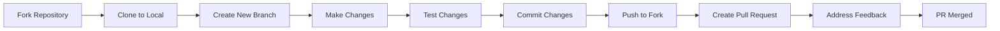

# Contributing to recode hive 

Thank you for your interest in contributing to **recode hive**! We're excited to have you join our community of learners, developers, and open-source enthusiasts. This guide will help you get started with contributing to our project.

---

## 📋 Table of Contents

- [Code of Conduct](#code-of-conduct)
- [How Can I Contribute?](#how-can-i-contribute)
- [Getting Started](#getting-started)
- [Development Setup](#development-setup)
- [Making Changes](#making-changes)
- [Submitting Changes](#submitting-changes)
- [Community](#community)

---

## 🤝 Code of Conduct

By participating in this project, you agree to abide by our [Code of Conduct](CODE_OF_CONDUCT.md). We are committed to providing a welcoming and inclusive environment for all contributors, regardless of experience level, background, or identity.

**Key principles:**
- Be respectful and constructive in all interactions
- Welcome newcomers and help them feel included
- Give and receive feedback gracefully
- Focus on what's best for the community
- Show empathy towards other community members

---

## 💡 How Can I Contribute?

There are many ways to contribute to recode hive:

### 🐛 Reporting Bugs

### ✨ Suggesting Enhancements

### 📝 Improving Documentation

### 💻 Contributing Code

### 🎨 Design Contributions

---

## 🚀 Getting Started

### Prerequisites

Before you begin, ensure you have the following installed:

- **Node.js** ≥ 18 ([Download](https://nodejs.org/))
- **Git** ([Download](https://git-scm.com/))
- **Docker** (optional, but recommended) ([Download](https://docs.docker.com/engine/install/))
- A code editor (we recommend [VS Code](https://code.visualstudio.com/))

### Fork and Clone

1. **Fork the repository** by clicking the "Fork" button at the top right of the [GitHub page](https://github.com/recodehive/recode-website)

2. **Clone your fork** to your local machine:

```bash
git clone https://github.com/YOUR-USERNAME/recode-website.git
cd recode-website
```

3. **Add the upstream remote** to stay synced with the main repository:

```bash
git remote add upstream https://github.com/recodehive/recode-website.git
```

---

## 🛠️ Development Setup

Choose your preferred setup method:

### Option 1: Docker (Recommended)

**Build and run with Docker:**

```bash
# Build the image
docker build -t recodehive-app .

# Run the container
docker run -p 3000:3000 recodehive-app
```

**Or use Docker Compose for hot-reload:**

```bash
docker-compose up
```

### Option 2: Traditional Setup

**Install dependencies:**

```bash
npm install
```

**Start the development server:**

```bash
npm run start
```

**Your application will be available at** http://localhost:3000

### Verify Your Setup

Once running, you should see the recode hive homepage. Try navigating through the tutorials and documentation to ensure everything works correctly.

---

## 🔧 Making Changes

### Create a Branch

Always create a new branch for your changes:

```bash
git checkout -b feature/your-feature-name
```

**Branch naming conventions:**
- `feature/` - for new features (e.g., `feature/add-python-tutorial`)
- `fix/` - for bug fixes (e.g., `fix/navigation-bug`)
- `docs/` - for documentation (e.g., `docs/improve-contributing-guide`)
- `style/` - for styling changes (e.g., `style/update-button-colors`)
- `refactor/` - for code refactoring (e.g., `refactor/simplify-api-calls`)

### Write Quality Code

Follow these guidelines while coding:

- **Keep it simple** - Write clear, readable code
- **Comment when necessary** - Explain complex logic
- **Test your changes** - Ensure everything works as expected
- **Follow existing patterns** - Maintain consistency with the codebase
- **Make atomic commits** - Each commit should represent a single logical change

### Commit Your Changes

Write clear, descriptive commit messages:

```bash
git add .
git commit -m "Add: brief description of your changes"
```

**Commit message format:**
- `Add:` - for new features
- `Fix:` - for bug fixes
- `Update:` - for updates to existing features
- `Remove:` - for removing features or files
- `Refactor:` - for code refactoring
- `Docs:` - for documentation changes
- `Style:` - for formatting changes

**Example:**
```bash
git commit -m "Add: Python tutorial for data structures"
git commit -m "Fix: Navigation menu not displaying on mobile"
git commit -m "Docs: Update installation instructions"
```

---

## 📤 Submitting Changes

### Sync with Upstream

Before submitting, ensure your branch is up to date:

```bash
# Fetch upstream changes
git fetch upstream

# Merge upstream changes into your branch
git merge upstream/main
```

### Push Your Changes

```bash
git push origin feature/your-feature-name
```

### Create a Pull Request

1. **Navigate to your fork** on GitHub
2. **Click "Compare & pull request"**
3. **Fill out the PR template** with:
   - A clear, descriptive title
   - Detailed description of your changes
   - Reference any related issues (e.g., "Closes #123")
   - Screenshots (if applicable)
   - Testing steps

4. **Submit the pull request**

### PR Review Process

- A maintainer will review your PR
- You may be asked to make changes
- Be responsive to feedback and questions
- Once approved, your PR will be merged!

---


## 💬 Community

### Get Help

Need assistance? We're here to help!

- **Discord:** Join our [Discord server](https://discord.gg/Yxv9RA3r)
- **GitHub Discussions:** Ask questions in [Discussions](https://github.com/recodehive/recode-website/discussions)
- **Issues:** Check existing [issues](https://github.com/recodehive/recode-website/issues) or create a new one

### Stay Connected

- **Website:** [recodehive.com](https://recodehive.com/)
- **LinkedIn:** [Sanjay K V](https://www.linkedin.com/in/sanjay-k-v/)
- **Twitter:** [@sanjay_kv_](https://x.com/sanjay_kv_)
- **YouTube:** [@RecodeHive](https://www.youtube.com/@RecodeHive)
- **Newsletter:** [Subscribe](https://recodehive.substack.com/)

### Video Tutorial

New to contributing? Watch this helpful video:

<div>
    <a href="https://www.loom.com/share/c8d8d5f0c2534a1f86fc510dcef52ee0">
      <p>How to Contribute to this Repo | How to Setup - Watch Video</p>
    </a>
</div>

---

## 🎯 Contribution Workflow



---

## 🏆 Recognition

All contributors are recognized in our [README](README.md#-contributors)! Your contributions, big or small, help make recode hive better for everyone.

---

## ❓ Questions?

If you have any questions that aren't covered in this guide, feel free to:

- Open an issue with the "question" label
- Ask in our Discord community
- Reach out to the maintainers

---

## 📄 License

By contributing to recode hive, you agree that your contributions will be licensed under the [MIT License](LICENSE).

---

<div align="center">

**Thank you for contributing to recode hive! 🎉**

Together, we're building a platform that empowers developers worldwide. Every contribution matters, and we're grateful for yours.

<p align="center">
  
</p>

**Happy Contributing! 💻✨**

Made with ❤️ by the recode hive community

</div>
